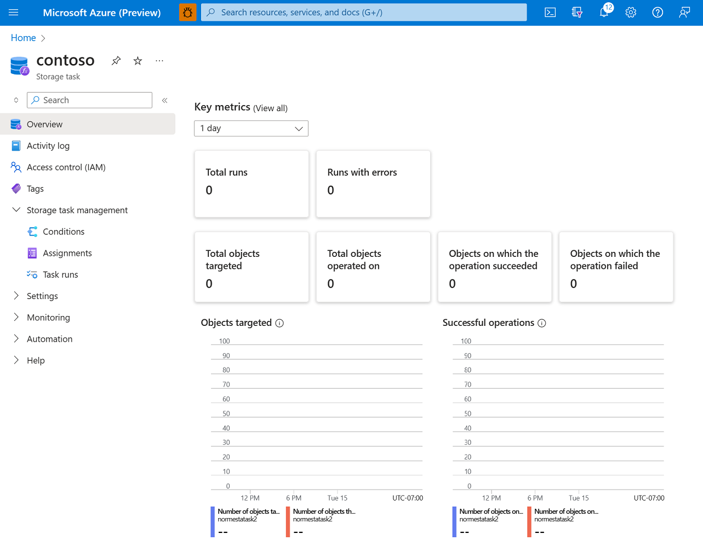

# Monitor Azure Storage Tasks

When you have critical applications and business processes relying on Azure resources, you want to monitor those resources for their availability, performance, and operation. This article describes the monitoring data generated by Azure Storage Tasks. Azure Storage Tasks uses [Azure Monitor](/azure/azure-monitor/overview). If you are unfamiliar with the features of Azure Monitor common to all Azure services that use it, read [Monitoring Azure resources with Azure Monitor](/azure/azure-monitor/essentials/monitor-azure-resource).

## Monitoring overview page in Azure portal

The following metrics appear in the **Overview** page of each storage task.

- Total number of runs
- Total number of runs that resulted in an error
- Total number of objects targeted by task runs
- Total number of objects operated on
- Total number of objects where an operation succeeded
- Total number of objects where an operations failed

The following image shows how these metrics appear in the **Overview** page.

> [!div class="mx-imgBorder"]
> 

These metrics include runs from multiple storage task assignments, but only assignments that target storage accounts to which you have read permission. These metrics appear as tiles that you can select to view a list of the task runs which comprise the metric. Each listed task provides a link to a detailed execution report. For more information about how to drill into metrics and reports for each task run, see [Analyze Azure Storage Task runs](storage-task-runs.md).

## Monitoring data

Azure Storage Tasks collects the same kinds of monitoring data as other Azure resources that are described in [Monitoring data from Azure resources](/azure/azure-monitor/essentials/monitor-azure-resource#monitoring-data-from-Azure-resources). For information about the metrics and logs that are created by Azure Storage tasks, see [Monitoring Azure Storage Tasks data reference](storage-tasks-monitor-data-reference.md).

## Collection and routing

Platform metrics and the activity log are collected and stored automatically, but can be routed to other locations by using a diagnostic setting. To learn how to create a diagnostic setting, see [Create diagnostic setting to collect platform logs and metrics in Azure](/azure/azure-monitor/platform/diagnostic-settings).

## Analyzing metrics

You can analyze metrics for Azure Storage Tasks with metrics from other Azure services using metrics explorer by opening **Metrics** from the **Azure Monitor** menu. See [Getting started with Azure Metrics Explorer](/azure/azure-monitor/essentials/metrics-getting-started) for details on using this tool.

For a list of the platform metrics collected for Azure Storage Tasks, see [Monitoring Azure Storage Tasks metrics](storage-tasks-monitor-data-reference.md#metrics). You can also see a list [all resource metrics supported in Azure Monitor](/azure/azure-monitor/essentials/metrics-supported).

## Analyzing logs

Azure Storage Tasks don't support resource logs. Azure Storage Tasks support the [activity log](/azure/azure-monitor/essentials/activity-log) log only. The [activity log](/azure/azure-monitor/essentials/activity-log) is a type of platform log in Azure that provides insight into subscription-level events. You can view it independently or route it to Azure Monitor Logs, where you can do much more complex queries using Log Analytics.  

## Alerts

Azure Monitor alerts proactively notify you when important conditions are found in your monitoring data. They allow you to identify and address issues in your system before your customers notice them. You can set alerts on [metrics](/azure/azure-monitor/alerts/alerts-metric-overview) and the [activity log](/azure/azure-monitor/alerts/activity-log-alerts).

## Next steps

- See [Monitoring Azure Storage Tasks data reference](storage-tasks-monitor-data-reference.md) for a reference of the metrics, logs, and other important values created by Azure Storage Tasks.

- See [Monitoring Azure resources with Azure Monitor](/azure/azure-monitor/essentials/monitor-azure-resource) for details on monitoring Azure resources.