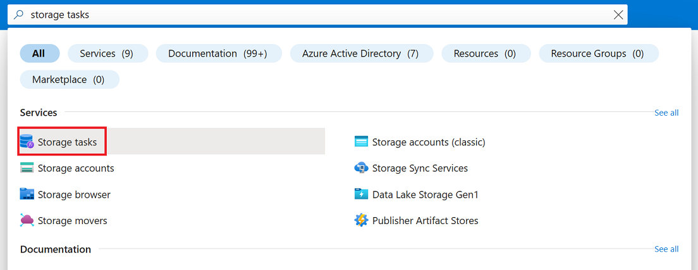
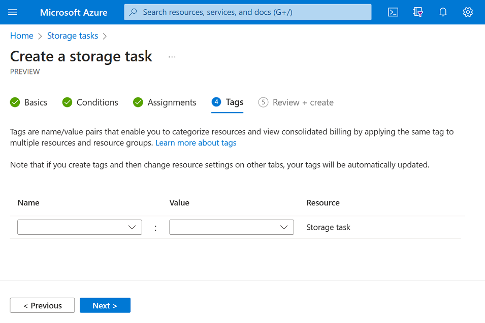

# Create a storage task

A storage task can perform operations on blobs in an Azure Storage account. As you create a task, you can define the conditions that must be met by each object (container or blob), and the operations to perform on the object. You can also identify one or more Azure Storage account targets. See [What are Azure Storage Tasks?](overview.md).

In this how-to article, you'll learn how to create a storage task.

> [!IMPORTANT]
> Azure Storage Tasks is currently in PREVIEW and is available these [regions](overview.md#supported-regions).
> See the [Supplemental Terms of Use for Microsoft Azure Previews](https://azure.microsoft.com/support/legal/preview-supplemental-terms/) for legal terms that apply to Azure features that are in beta, preview, or otherwise not yet released into general availability.

## Create a task

In the Azure portal, search for _Storage Tasks_. Then, under **Services**, select **Storage Tasks**.

> [!div class="mx-imgBorder"]
> 

On the **Storage tasks** page, select **Create**.

> [!div class="mx-imgBorder"]
> 

## Basics tab

On the **Basics** tab, provide the essential information for your storage task. The following table describes the fields on the **Basics** tab.

| Section | Field | Required or optional | Description |
|--|--|--|--|
| Project details | Subscription | Required | Select the subscription for the new storage task. |
| Project details | Resource group | Required | Create a new resource group for this storage task, or select an existing one. For more information, see [Resource groups](../azure-resource-manager/management/overview.md#resource-groups). |
| Instance details | Storage task name | Required | Choose a unique name for your storage task. storage task names must be between 3 and 18 characters in length and may contain only lowercase letters and numbers. |
| Instance details | Region | Required | Select the appropriate region for your storage task. For more information, see [Regions and Availability Zones in Azure](../availability-zones/az-overview.md). |

The following image shows an example of the **Basics** tab.

> [!div class="mx-imgBorder"]
> 

## Conditions tab

On the **Conditions** tab, define the conditions that must be met by each object (container or blob), and the operations to perform on the object.

You must define at least one condition and one operation. To add a clause to a condition, select  **Add new clause**. To add operations, select **Add new operation**.

The following table describes the fields on the **Conditions** tab.

| Section | Field | Required or optional | Description |
|--|--|--|--|
| If | And/Or | Required | An operator which combines two or more predicates to form a logical-AND or logical-OR expression. |
| If | Blob property | Required | The blob or container property that you like to use in the clause. See [Supported blob properties](storage-task-properties-operators-operations.md#supported-properties-in-a-clause)|
| If | Operator | Required | The operator that defines how each property in the clause must relate to the corresponding value. See [Supported operators](storage-task-properties-operators-operations.md#supported-operators-in-a-clause)|
| If| Property value | Required | The value that relates to the corresponding property.  |
| Then | Operations | Required | The action to perform when objects meet the conditions defined in this task. See [Supported operations](storage-task-properties-operators-operations.md#supported-operations)|
| Then | Parameter | Required | A value used by the operation. |

The following image shows an example of the **Conditions** tab.

> [!div class="mx-imgBorder"]
> 

To learn more about supported properties and operators in conditions, see [Storage task conditions and operations](storage-task-properties-operators-operations.md).

## Assignments tab

An _assignment_ identifies a storage account and a subset of objects in that account that the task will target. An assignment also defines when the task runs and where execution reports are stored.

To add an assignment, select **Add assignment**. This step is optional. You don't have to add an assignment to create the task.

The following table describes the fields that appear in the **Add assignment** pane.

| Section | Field | Required or optional | Description |
|--|--|--|--|
| Select scope | Subscription | Required | The subscription of the storage account that you want to add to this assignment. |
| Select scope | Select a storage account | Required | The storage account that you want to add to this assignment. |
| Select scope | Assignment name | Required | The name of the assignment. Assignment names must be between 2 and 62 characters in length and may contain only letters and numbers. |
| Filter objects | Filter by | Required | Option to either filter objects by using a prefix or to run the task against the entire storage account. |
| Filter objects | Blob prefixes | Optional | The string prefix that is used to narrow the scope of blobs that are evaluated by the task. This field is required only if you choose to filter by using a blob prefix. |
| Trigger details | Run frequency | Required | Option to either run the task one time or multiple times. |
| Trigger details | Start from | Required | The date and time to begin running the task. |
| Trigger details | End by | Required | The date and time to stop running the task. |
| Trigger details | Repeat very (in days) | Required | The interval in days between each run. |
| Trigger details | Report export container | Required | The container where task execution reports are stored. |

The following image shows an example of the **Add assignment** pane.

> [!div class="mx-imgBorder"]
> 

## Tags tab

On the **Tags** tab, you can specify Resource Manager tags to help organize your Azure resources. For more information, see [Tag resources, resource groups, and subscriptions for logical organization](../azure-resource-manager/management/tag-resources.md).

The following image shows a standard configuration of the index tag properties for a new storage account.

> [!div class="mx-imgBorder"]
> 

## Review + create tab

When you navigate to the **Review + create** tab, Azure runs validation on the storage task settings that you have chosen. If validation passes, you can proceed to create the storage task.

If validation fails, then the portal indicates which settings need to be modified.

The following image shows the **Review** tab data prior to the creation of a new storage task.

> [!div class="mx-imgBorder"]
> 

## See also

- [Azure Storage Tasks Overview](overview.md)
- [Create, assign, and run a storage task](storage-task-quickstart-portal.md)
- [Define conditions and operations](storage-task-conditions-operations-edit.md)
