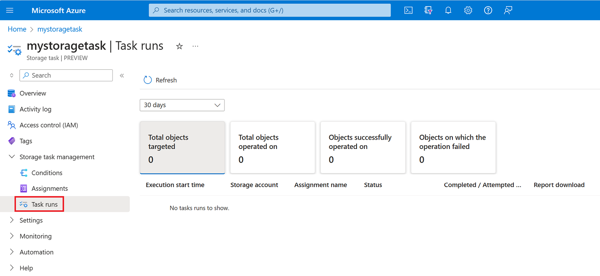
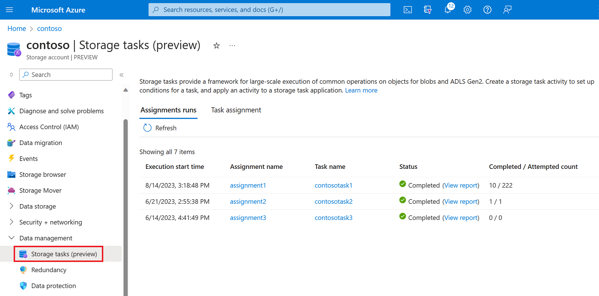
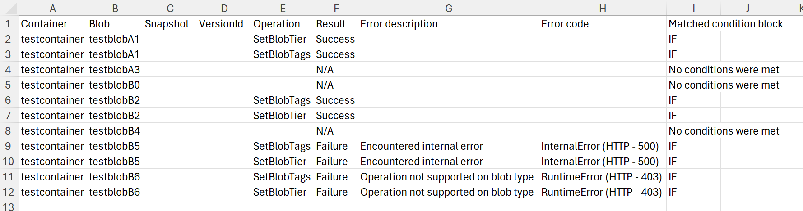

# Analyze Azure Storage Task runs

You can view a list of task runs. For each completed run, you can open a report that lists each object that met the conditions of the task and the outcome of the operation against that object.

> [!IMPORTANT]
> Azure Storage Tasks is currently in PREVIEW and is available these [regions](overview.md#supported-regions).
> See the [Supplemental Terms of Use for Microsoft Azure Previews](https://azure.microsoft.com/support/legal/preview-supplemental-terms/) for legal terms that apply to Azure features that are in beta, preview, or otherwise not yet released into general availability.

## View a list of task runs

After a task run completes, it appears in a list that you can open and review.

### Storage task view

You can see all of the runs attempted by a storage task by opening a list of runs from the storage task menu. You'll see only those runs against accounts to which you have read permission.

Navigate to the storage task in the Azure portal and then under **Storage task management**, select **Task runs**.

> [!div class="mx-imgBorder"]
> 

Metrics appear as tiles that you can select to view a list of the task runs which comprise the metric. For example, to view list of task runs where at least one operation failed, select the **Objects on which the operation failed** tile. Then, a filtered list of task runs will appear. You can filter this list by time frame. The following table describes each field that appears in this list.

| Column  | Description |
|--|--|
| Execution start time | The date and time when the task run started. |
| Storage account name | The name of the storage account that was targeted by the task assignment. |
| Assignment name | The name of the assignment. This name is specified by the creator of the assignment at configuration time. |
| Status | Specifies whether the task completed or is pending execution. |
| Completed / attempted count | The number of objects which met the conditions of the storage task and the total number of objects targeted by the storage task. |
| Report download | A link to an execution report. This report appears only when the status is `Completed`.|

### Storage account view

You can see all runs against a specific storage account by opening a list of runs from the storage account menu.

Navigate to the storage account in the Azure portal and then under **Data management**, select **Storage tasks**.

> [!div class="mx-imgBorder"]
> 

A list of task runs appears. You can filter this list by time frame. The following table describes each field that appears in this list.

| Column  | Description |
|--|--|
| Execution start time | The date and time when the task run started. |
| Assignment name | The name of the assignment. This name is specified by the creator of the assignment at configuration time. |
| Task name | The name of the storage task. This name is specified by the creator of the assignment at configuration time. |
| Status | Specifies whether the task completed or is pending execution. When the status is `Completed`, a link to an execution report appears. |
| Completed / attempted count | The number of objects which met the conditions of the storage task and the total number of objects targeted by the storage task. |

## View execution reports

Each task run generates an execution report. That report is stored in a container that is located in the targeted storage account. The name of that container is specified when the assignment is created.  A link to that report appears next to each run in the task run list. Use that link to open a report which contains status information about each object that was targeted by the run.

To open the report, select the **View report** link for any listed task run. Then, the report will begin downloading. The report is packaged as a compressed file so you'll have to extract the contents of that file to a directory on your client.

The report is formatted as a CSV file. Each row of the report contains the details about the execution of the operation on each object that is targeted by the task. The following table describes the columns of information that appear in the execution report:

| Name | Description |
|--|--|
| Container | Definition |
| Blob | The fully qualified name of the blob. |
| Snapshot | The ID of the snapshot for this task. This field is empty if the object is a base blob.  |
| VersionId | The ID of the version of this task. This field is empty if the object is a base blob. |
| Operation | The operation attempted. |
| Result | This field contains a value of `Success` or `Failed`. This field is set to `N/A` if the application of the defined conditions on the object evaluates to false. |
| Error description | This field is empty if the operation succeeds or the application of the defined conditions on the object evaluates to false. |
| Error code | This field is empty if the operation succeeds or the application of the defined conditions on the object evaluates to false. |
| Matched condition block | The condition block associated with the row. |

The following example shows an execution report:

> [!div class="mx-imgBorder"]
> 

## See also

- [Monitor Azure Storage Tasks](monitor-storage-tasks.md)
- [Storage Tasks Overview](overview.md)
