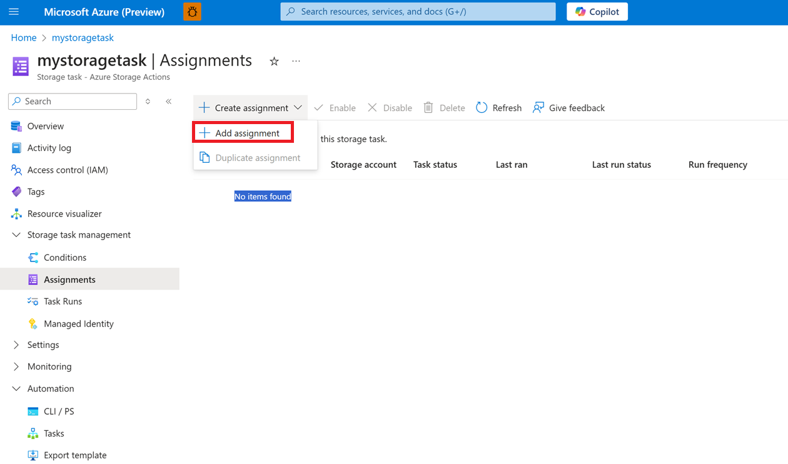
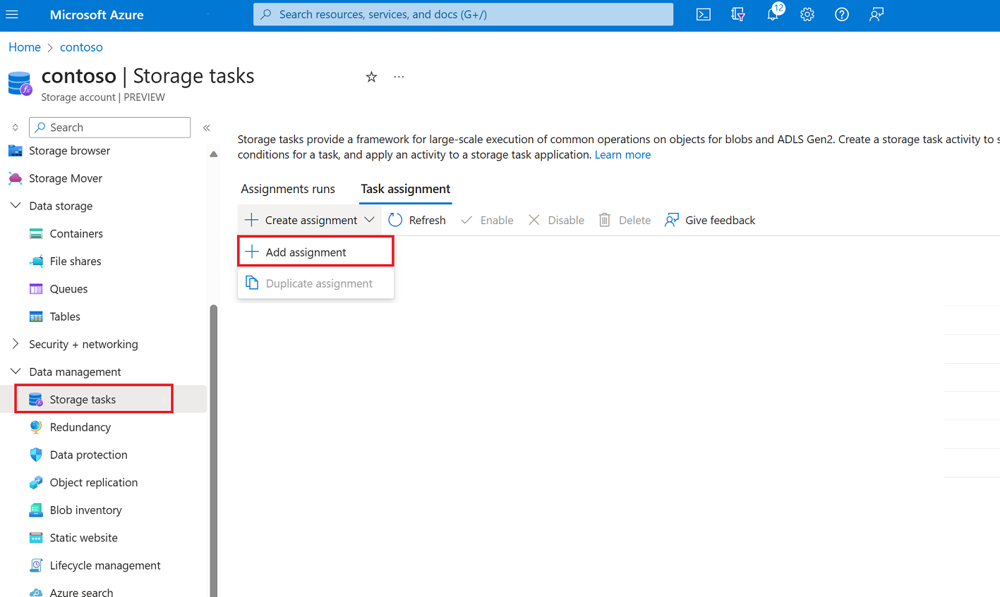
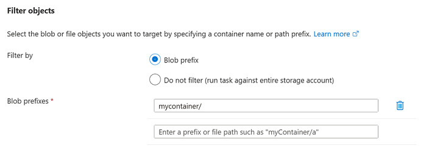
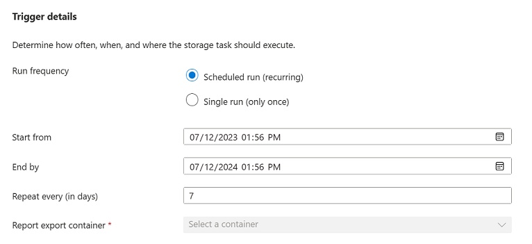
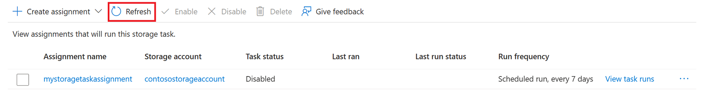
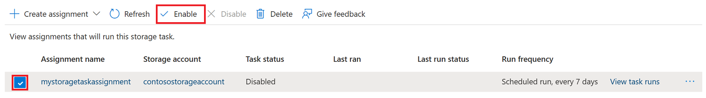

# Create and manage a storage task assignment

An _assignment_ identifies a storage account and a subset of objects in that account that the task will target. An assignment also defines when the task runs and where execution reports are stored.

This article helps you create an assignment, and then enable that assignment to run.

> [!IMPORTANT]
> Azure Storage Actions is currently in PREVIEW and is available these [regions](../overview.md#supported-regions).
> See the [Supplemental Terms of Use for Microsoft Azure Previews](https://azure.microsoft.com/support/legal/preview-supplemental-terms/) for legal terms that apply to Azure features that are in beta, preview, or otherwise not yet released into general availability.

## Create an assignment

Create an assignment for each storage account you want to target. A storage task can contain up to 50 assignments.

> [!NOTE] 
> During the public preview, you can target only storage accounts that are in the same region as the storage tasks.

### Create an assignment from the storage task menu

You can create an assignment in the context of a storage task. This option can be convenient if you're the task author and you want to target multiple storage accounts. For each assignment you'll identify the storage account that you want to target.

Navigate to the storage task in the Azure portal and then under **Storage task management**, select **Assignments**, and then select **Configure assignments**.

> [!div class="mx-imgBorder"]
> 

In the **Assignments** page, select **+ Add assignment** and the **Add assignment** pane will appear.

### Create an assignment from the storage account menu

You can also create an assignment in the context of a storage account. This option can be convenient if you want to use an existing task to process objects in your storage account. For each assignment you'll identify the storage task that you want to assign to your account.

Navigate to the storage account in the Azure portal and then under **Data management**, select **Storage tasks**.

In the **Storage tasks** page, select the **Task assignment** tab, select **+ Create assignment**, and then select **+ Add assignment**.

> [!div class="mx-imgBorder"]
> 

The **Add assignment** pane appears.

## Select a scope

In the **Select scope** section, select a subscription and name the assignment. Then, select the storage account that you want to target.

If you opened the **Add assignment** pane in the context of the storage account, you'll select a storage task instead of the storage account.

The following table describes each field in the **Select Scope** section:

| Section | Field | Required or optional | Description |
|--|--|--|--|
| Select scope | Subscription | Required | The subscription of the storage account that you want to add to this assignment. |
| Select scope | Select a storage account | Required | The storage account that you want to add to this assignment. You must be an owner of the storage account. This field appears only if you create the assignment in the context of a storage task.|
| Select scope | Select a storage task | Required | The storage task to which you would like to assign your storage account. This field appears only if you create the assignment in the context of a storage account.|  
| Select scope | Assignment name | Required | The name of the assignment. Assignment names must be between 2 and 62 characters in length and may contain only letters and numbers. |

## Add a role assignment

In the **Role assignment** section, in the **Role** drop-down list, select the role that you want to assign to the system-assigned managed identity of the storage task. To ensure a successful task assignment, use roles that have the Blob Data Owner permissions. To learn more, see [Azure roles for storage tasks](storage-task-authorization-roles.md)

> [!div class="mx-imgBorder"]
> 

## Add a filter

In the **Filter objects** section, choose whether you want to target a subset of blobs based on a filter. Filters help you narrow the scope of execution. If you want the task to evaluate all of the containers and blobs in an account, then you can select the **Do not filter** option. The following example uses a filter to target only blobs that exist in a container that is named `mycontainer`.

> [!div class="mx-imgBorder"]
> 

The following table describes each field:

| Section | Field | Required or optional | Description |
|--|--|--|--|
| Filter objects | Filter by | Required | Option to either filter objects by using a prefix or to run the task against the entire storage account. |
| Filter objects | Blob prefixes | Optional | The string prefix that is used to narrow the scope of blobs that are evaluated by the task. This field is required only if you choose to filter by using a blob prefix. |

## Define the trigger

In the **Trigger details** section, select how often you'd like this task to run. You can choose to run this task only once, or run the task recurring. If you decide to run this task on a recurring basis, choose a start and end time and specify the number of days in between each run. You can also specify where you'd like to store the execution reports.

> [!div class="mx-imgBorder"]
> 

The following table describes each field:

| Section | Field | Required or optional | Description |
|--|--|--|--|
| Trigger details | Run frequency | Required | Option to either run the task one time or multiple times. | 
| Trigger details | Start from | Required | The date and time to begin running the task. |
| Trigger details | End by | Required | The date and time stop running the task. |
| Trigger details | Repeat very (in days) | Required | The interval in days between each run. |
| Trigger details | Report export container | Required | The container where task execution reports are stored. |

## Save the assignment

Select the **Add** button to create the assignment.

The **Add assignment pane** closes. When deployment is complete, the assignment appears in the **Assignments** page.  If you don't see the assignment in that page, then select the **Refresh** button.

> [!div class="mx-imgBorder"]
> 

## Enable an assignment

The assignment is disabled by default. To enable the assignment so that it will be scheduled to run, select the checkbox that appears beside the assignment, and then select **Enable**.

> [!div class="mx-imgBorder"]
> 

After the task runs, an execution report is generated and then stored in the container that you specified when you created the assignment. For more information about that report as well as how to view metrics that capture the number of objects targeted, the number of operations attempted, and the number of operations that succeeded, see [Analyze storage task runs](storage-task-runs.md).

## Edit an assignment

An assignment becomes a sub resource of the targeted storage account. Therefore, after you create the assignment, you can edit only it's run frequency. The other fields of an assignment become read only. The **Single run (only once)** option becomes read only as well.

- To edit the run frequency of an assignment in the context of a storage task, navigate to the storage task in the Azure portal and then under **Storage task management**, select **Assignments**.

- To edit the run frequency of an assignment in the context of a storage account, navigate to the storage account in the Azure portal and then under **Data management**, select **Storage tasks**.

## See also

- [Azure Storage Actions overview](../overview.md)
- [Analyze storage task runs](storage-task-runs.md)
