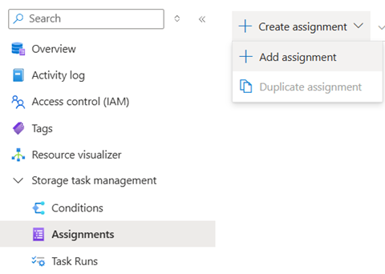
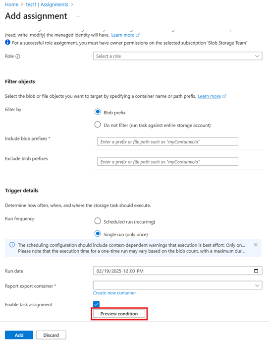
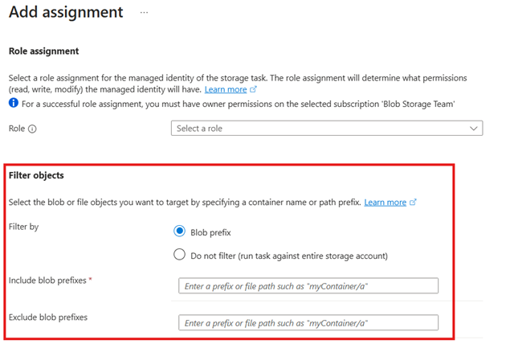

# Best practices for using storage tasks

This article provides you with best practice guidelines for using storage tasks.

## Composition

Design conditions that can apply to multiple storage accounts. Consider enabling blob soft delete before using delete operations in your conditions, and carefully review the impact of condition groupings. This section describes each of these recommendations. 

### Define a single storage task condition that can be applied to multiple storage accounts simultaneously

By making conditions reusable, you'll eliminate the need to create individual storage task conditions for each storage account and simplifies the management of a large number of storage accounts. 

To utilize this feature, create one storage task condition to scan blobs across your storage accounts and assign it to each account. This can be accomplished by adding multiple storage task assignments for a single storage task in the Azure portal using the **Assignments** menu option of a storage task.

> [!div class="mx-imgBorder"]
> 

After all these task assignments are enabled, the storage task execution will operate on the blobs in their respective accounts concurrently, thus enabling horizontal scaling.

### Consider enabling blob soft delete in a storage account before using the delete operation

For enhanced data protection, Microsoft recommends enabling blob soft delete on your storage account. Blob soft delete provides an extra layer of retention and peace of mind by allowing you to recover blobs that are accidentally deleted. By enabling blob soft delete, you can undelete blobs within the retention period, minimizing the risk of data loss due to inadvertent deletions. If blobs are accidentally deleted on a soft-deleted storage account, an undelete operation in a storage task can be used to recover the blob.

### Understand the impact of storage task condition groupings

Verify that the way you group conditions leads to the desired result. Incorrect grouping might result in unexpected operations. Test the grouped conditions thoroughly using the preview capability. Ensure that the conditions match the blobs as anticipated.

## Validation

Validate conditions as you compose them, and once again before you enable a storage task assignment. This section describes each of these recommendations. 

### Validate conditions as you compose them

You should validate each condition that you compose by using the condition preview feature. This feature provides an interactive experience that shows which of the selected blobs meet the condition predicate that you configured. The condition preview experience doesn't make any changes to the data. You can validate the condition against various sets of blobs by specifying different storage accounts or blob path prefixes. Incorrectly composed conditions can adversely affect your data, making this step crucial to ensure the condition is composed correctly.

See [Preview the effect of conditions](storage-task-conditions-operations-edit.md#preview-the-effect-of-conditions)

### Validate conditions before you commit a storage task assignment

The condition preview feature also appears in the **Add Assignment** pane. Before committing an assignment, use this feature to verify that the storage task operates on the correct set of blobs in the storage account. If the storage task is used in other storage account assignments, no unintended blobs are impacted.

> [!div class="mx-imgBorder"]
> 

## Scale and performance

Enable storage tasks one at a time. Apply techniques to optimize conditions and task assignment scheduling. 

### Enable a single storage task assignment at a time

Storage Actions currently supports the execution of one storage task assignment at a time on a storage account. If two storage tasks are assigned to an account and enabled simultaneously, the first task is executed while the second task is queued until the first task completes. This applies to both single-run and recurrent scheduled task assignments.

For scheduled task assignments, if the previous task iteration is still in progress, new iterations are skipped. The next scheduled task will only run at its designated trigger time after the previous task completes. When scheduling recurrent tasks, consider the scale implications where task assignments applied to large storage accounts might take longer to complete. Therefore, it's advisable to schedule them such that each task run can finish before the next iteration to prevent skipping subsequent iterations.

For single-run task assignments, if a parallel task is already in progress, the new task execution is deferred for 60 minutes plus extra random minutes before attempting again. In general, to avoid confusion regarding which task assignment is being executed, Microsoft recommends enabling only one task assignment at a time.

### Workarounds on scale limits

Storage Actions have defined scale limits. See [Scale limits](storage-task-known-issues.md#scale-limits)

To optimize the management of scale limits, consider implementing the following workarounds:

1. **Task segmentation by prefix**: Instead of assigning a single task to process all blobs in a storage account, create multiple tasks, each responsible for a specific filtered subset of blobs based on their prefixes. This segmentation approach distributes the workload more evenly and helps stay within scale limits. You can add filters during task assignment as shown:

   > [!div class="mx-imgBorder"]
   > 

2. **Staggered scheduling**: Schedule tasks to run at different times, especially for large-scale operations. By staggering the execution times, you avoid concurrent tasks that could breach concurrency limits and cause task execution contention.

3. **Incremental processing**: Break down large tasks into smaller, incremental steps. This method ensures that each task segment can complete within the given limits, reducing the risk of incomplete operations.

4. **Monitoring and adjust**: Regularly monitor task performance and progress. Adjust the task conditions / prefixes and schedules as necessary to ensure efficient processing withing scale limits.

By employing these strategies, you can effectively manage and work around the imposed scale limits, ensuring smooth and efficient task executions.

## Reliability

Storage Actions perform more reliably in accounts with [geo-redundant storage](../../storage/common/storage-redundancy.md#geo-redundant-storage) (GRS), or [geo-zone-redundant storage](../../storage/common/storage-redundancy.md#geo-zone-redundant-storage) (GZRS) configurations.

### Use geo redundancy for business continuity 

Storage accounts with GRS and GZRS replicate data to a secondary region in the event of storage account failovers. The business continuity of storage actions significantly depends on the redundancy configuration of the target storage account. Storage accounts that are configured with geo-redundancy benefit from an automated failover process. This automatic management ensures that future task assignment run iterations, whether single or recurrent, executes in the secondary region without issues. However, storage tasks that were in progress at the time of failover might encounter failures. New storage tasks and storage task assignments continue to function as expected.

Consistent monitoring of the storage account is crucial. With a failover, you should thoroughly review task reporting and monitoring to verify the successful completion of all blob operations and to identify any discrepancies that need attention.

## Monitoring

Periodically monitor storage task executions and avoid deleting the report container where task execution reports are stored.

### Monitor tasks periodically

You should periodically monitor the storage task execution to ensure that tasks are running as expected. Review task reports, metrics, monitoring dashboards. Check for any errors, and verify that the tasks are completing within the expected timeframes.

### Ensure the result report container isn't deleted 

Storage Actions generate detailed reports in CSV format which are written into the result reporting container configured during task assignment. These reports provide insights into the task execution operations where each row line in the CSV file includes information about the operations performed, the status of each operation, and any errors encountered. It's important to make sure that the result reporting container that is configured during task assignment isn't deleted from the storage account during the task execution. If the result reporting container is deleted during the task run, the task execution can fail. 

Storage Actions generate detailed reports in CSV format, which are written into the result reporting container that is configured during task assignment. These reports provide insights into task execution operations, with each row in the CSV file including information about the operations performed, the status of each operation, and any errors encountered. It's important to ensure that the result reporting container isn't deleted from the storage account during task execution. If the result reporting container is deleted during the task run, the task execution can fail.

## Storage Actions lifecycle

### Managing tasks using a central library subscription

To efficiently manage your tasks and task assignments, Consider using a central subscription to contain a library of storage tasks. This approach allows you to assign these tasks to numerous storage accounts across different subscriptions and regions simultaneously, without having to configure them individually for each region or subscription. By centralizing your task management, you can streamline the process, reduce administrative overhead, and ensure consistency in task execution across your entire Azure environment.

## See also

- [Azure Storage Actions overview](../overview.md)
- [Azure RBAC best practices](../../role-based-access-control/best-practices.md) 
- [AKS best practices](/azure/aks/best-practices) 

