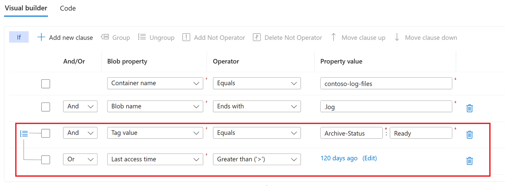

# Define storage task conditions and operations

You can use a visual editor to define the conditions and operations of a storage task.

An _operation_ is an action taken on each object that meets the conditions defined in the task. A _condition_ contains one or more conditional _clauses_. Each clause defines the relationship between a property and a value. To execute an operation defined in the storage task, the terms of that relationship must be met by each object.

## Define conditions

Define a condition by adding clauses. A clause defines the relationship between a property and a value. To execute an operation defined in the storage task, the terms of that relationship must be met by each object.

## [Portal](#tab/azure-portal)

Navigate to the storage task in the Azure portal and then under **Storage task management**, select **Conditions**.

> [!div class="mx-imgBorder"]
> 

The **Visual builder** tab of the **Conditions** pane appears.

### Add and remove clauses

To add a clause, select **Add new clause**, and to remove a clause, select the delete icon(:::image type="icon" source="../media/storage-tasks/storage-task-conditions-operations-edit/conditions-delete-icon.png":::) that appears next to it.

> [!div class="mx-imgBorder"]
> 

### Specify the terms of a clause

To define a clause, choose a property, specify a value for that property, and then choose an operator that relates them together.

#### Choose a property

In the **Blob property** drop-down list, choose a property. See [Supported blob properties](storage-task-conditions.md#supported-properties).

The following example selects the **Blob name** property.

> [!div class="mx-imgBorder"]
> 

#### Choose a value and operator

In the **Property value** box, enter a value and in the **Operator** drop-down list, choose an operator. See [Supported Operators](storage-task-conditions.md#supported-operators).

The following example specifies a value of `.log` along with the **Ends with** operator. This condition allows the operation defined in this storage task to execute only on blobs that have a `.log` file extension.

> [!div class="mx-imgBorder"]
> 

## [PowerShell](#tab/azure-powershell)

Define a _condition_ by using JSON. A condition a collection of one or more clauses. Each clause contains a property, a value, and an operator. In the following JSON, the property is `Name`, the value is `.docx`, and the operator is `endsWith`. This clause allows operations only on Microsoft Word documents. 

```powershell
$conditions = "[[endsWith(Name, '.docx')]]"
```
To learn more about the structure of conditions and a complete list of properties and operators, see [Storage task conditions](storage-task-conditions.md).

## [Azure CLI](#tab/azure-cli)

Define a _condition_ by using JSON. A condition a collection of one or more clauses. Each clause contains a property, a value, and an operator. In the following JSON, the property is `Name`, the value is `.docx`, and the operator is endsWith. This clause allows operations only on Microsoft Word documents.  To learn more about the structure of conditions and a complete list of properties and operators, see [Storage task conditions](storage-task-conditions.md). 

```azurecli
conditionclause="[[endsWith(Name,'/.docx'/)]]"
```
> [!TIP]
> Azure CLI uses shorthand syntax. Shorthand syntax is a simplified representation of a JSON string. To learn more, see [How to use shorthand syntax with Azure CLI](/cli/azure/use-azure-cli-successfully-shorthand).

---

#### Use a wildcard in string values

You can use the `*` and `?` wildcard characters in the value of a string property. The `*` character represents zero or more characters while a `?` character represents exactly one character.

For example, if you want your clause to evaluate to true only for blobs that are Word documents, you would use the string `*.docx`. However, if you want only documents are named with a single character such as `1.docx` or `2.docx`, then you would use the string `?.docx`.  

You can use the `*` or `?` anywhere in a string. You can escape these characters by adding a `\` just before the character.

#### Reference a value from object metadata

Clauses that include a date and time property can reference a value from the metadata of a container or an index tag of a blob. These values are obtained dynamically at runtime when the task executes.

In your storage account, you can add a key to the metadata of a container or to the index tags of a blob. The value of that key must be a [ISO 8601](https://en.wikipedia.org/wiki/ISO_8601#Durations)-formatted time interval. For example, you might add a key named `retainfor` along with a string value of `PT5M` which represents an interval of five minutes.

#### [Portal](#tab/azure-portal)

To reference a key, select the **Edit** link that appears in the **Property value** column. Then, in the **Select a value** dialog box, select **Container metadata** or **Blob Index tags**.

The following example adds the **Creation time** property, the **Earlier than** operator, and references a key named `retainFor` in the index tags of each blob that is evaluated.

> [!div class="mx-imgBorder"]
> 

#### [PowerShell](#tab/azure-powershell)

```powershell
$conditions = "[[and(endsWith(Name, '.docx'), equals(utcNow, dateTimeAdd(Creation-Time, Tags.Value[retainFor])))]]"
```

#### [Azure CLI](#tab/azure-cli)

This condition clause uses shorthand syntax. Azure CLI expresses JSON-formatted strings by using shorthand syntax. To learn more, see [How to use shorthand syntax with Azure CLI](/cli/azure/use-azure-cli-successfully-shorthand).

```azurecli
conditionclause="[[and(endsWith(Name, '/.docx'/),equals(utcNow,dateTimeAdd(Creation-Time,Tags.Value[retainFor])))]]"
```
---

This condition tests whether a blob was created earlier than a certain time duration relative to now (the current date and time). For example, if the value retrieved from the `retainFor` tag is five minutes, then this condition checks if the blob was created more than 5 minutes ago.

If the key isn't present for an evaluated object, then the condition evaluates to false. If the key value is a string that doesn't conform to the [ISO 8601](https://en.wikipedia.org/wiki/ISO_8601#Durations) standard, then an error is reported in the execution report.

#### Apply And / Or to a clause

You add **And** or **Or** to a clause. Specify **And** if you want to target objects that meet the criteria in both the current clause and the previous clause of the condition. Specify **Or** to target objects that meet the criterion in either the current clause or the previous clause.

#### [Portal](#tab/azure-portal)

The following example shows clauses that use **And**. In this example, the storage task targets objects that have a `.log` extension and which have a tag named `Archive-Status` set to `Ready`.

> [!div class="mx-imgBorder"]
> 

#### [PowerShell](#tab/azure-powershell)

```powershell
$conditions = "[[and(endsWith(Name, '.log'), equals(Tags.Value[Archive-Status], 'Ready'))]]"
```

For more information, see [Multiple clauses in a condition](storage-task-conditions.md#multiple-clauses-in-a-condition).

#### [Azure CLI](#tab/azure-cli)

This condition clause uses shorthand syntax. Azure CLI expresses JSON-formatted strings by using shorthand syntax. To learn more, see [How to use shorthand syntax with Azure CLI](/cli/azure/use-azure-cli-successfully-shorthand).

```azurecli
conditionclause="[[and(endsWith(Name,'/.log'/),equals(Tags.Value[Archive-Status],'/Ready'/))]]"
```

For more information, see [Multiple clauses in a condition](storage-task-conditions.md#multiple-clauses-in-a-condition).

---

### Change the order of clauses

You can arrange clauses in an order that you believe will improve the performance of a task run. For example, instead of first testing all blobs in an account against a name filter, you might elevate a clause that targets a specific container. That small adjustment can prevent the task from performing unnecessary evaluations.

The following example reverses the order of the clauses shown in the previous example. This condition evaluates the index tag clause first and then the blob name clause.

### [Portal](#tab/azure-portal)

First, select the clause. Then, select **Move clause up** or **Move clause down** to change its position in the list.

> [!div class="mx-imgBorder"]
> 

### [PowerShell](#tab/azure-powershell)

```powershell
$conditions = "[[and(equals(Tags.Value[Archive-Status], 'Ready'), endsWith(Name, '.log'))]]"
```

### [Azure CLI](#tab/azure-cli)

This condition clause uses shorthand syntax. Azure CLI expresses JSON-formatted strings by using shorthand syntax. To learn more, see [How to use shorthand syntax with Azure CLI](/cli/azure/use-azure-cli-successfully-shorthand).

```azurecli
conditionclause="[[and(equals(Tags.Value[Archive-Status],'/Ready'/),endsWith(Name,'/.log'/))]]"
```

---

### Group and ungroup clauses

Grouped clauses operate as a single unit separate from the rest of the clauses. Grouping clauses is similar to putting parentheses around a mathematical equation or logic expression. The **And** or **Or** operator for the first clause in the group applies to the whole group.

The following example shows two conditions grouped together. In this example, the operation executes if a blob has the `.log` extension and either a tag named `Archive-Status` is set to the value of `Ready` or the file hasn't been accessed in 120 days.

### [Portal](#tab/azure-portal)

Select the checkbox that appears next to each clause you want to group together. Then, select **Group**.

> [!div class="mx-imgBorder"]
> 

To ungroup clauses, select the ungroup icon (:::image type="icon" source="../media/storage-tasks/storage-task-conditions-operations-edit/ungroup-icon.png":::) or select each clause in the group, and select **Ungroup**.

### [PowerShell](#tab/azure-powershell)

```powershell
$conditions = "[[and(endsWith(Name,'/.log'/),or(equals(Tags.Value[Archive-Status],'/Ready'/),less(utcNow,dateTimeAdd(LastAccessTime,'/P120D'/))))]]"
```

For more information, see [Groups of conditions](storage-task-conditions.md#groups-of-conditions).

### [Azure CLI](#tab/azure-cli)

This condition clause uses shorthand syntax. Azure CLI expresses JSON-formatted strings by using shorthand syntax. To learn more, see [How to use shorthand syntax with Azure CLI](/cli/azure/use-azure-cli-successfully-shorthand).

```azurecli
conditionclause="[[and(endsWith(Name,'/.log'/),or(equals(Tags.Value[Archive-Status],'/Ready'/),less(utcNow,dateTimeAdd(LastAccessTime,'/P120D'/))))]]"
```

For more information, see [Groups of conditions](storage-task-conditions.md#groups-of-conditions).

---

## Preview the effect of conditions

You can view a list of blobs that would be impacted by the conditions that you've defined. 

In the conditions editor, select **Preview conditions**.

In the **Preview Conditions**, you can specify a target subscription, storage account, and container. Because a can only show up to 5,000 blobs, you can also specify a prefix to narrow the list.

> [!div class="mx-imgBorder"]
> 

## Define operations

An operation is an action taken on each object that meets the conditions defined in the task.  

## [Portal](#tab/azure-portal)

### Add and remove operations

To add an operation, select **Add new operation**, and to remove an operation, select the delete icon(:::image type="icon" source="../media/storage-tasks/storage-task-conditions-operations-edit/conditions-delete-icon.png":::) that appears next to it.

> [!div class="mx-imgBorder"]
> 

#### Choose an operation

In the **Operation** drop-down list, choose an operation. See [Supported operations](storage-task-operations.md#supported-operations).

The following example selects the **Set blob tags** property.

> [!div class="mx-imgBorder"]
> 

#### Choose a parameter

Enter or select the parameters that are appropriate for the operation.

The following example sets the `Archive-Status` tag to the value `Archived`.  

> [!div class="mx-imgBorder"]
> 

## [PowerShell](#tab/azure-powershell)

1. Define each operation by using the `New-AzStorageActionTaskOperationObject` command. 

   The following operation creates an operation that sets an immutability policy.

   ```powershell
   $policyoperation = New-AzStorageActionTaskOperationObject `
   -Name SetBlobImmutabilityPolicy `
   -Parameter @{"untilDate" = (Get-Date).AddDays(1); "mode" = "locked"} `
   -OnFailure break `
   -OnSuccess continue

   ```
   
   The following operation sets a blob index tag in the metadata of a Word document.

    ```powershell
    $tagoperation = New-AzStorageActionTaskOperationObject -Name SetBlobTags `
    -Parameter @{"tagsetImmutabilityUpdatedBy"="StorageTaskQuickstart"} `
    -OnFailure break `
    -OnSuccess continue
   ```

3. Combine operations together by using a comma separator

   ```powershell
   $operation = $policyoperation,$tagoperation
   ```

## [Azure CLI](#tab/azure-cli)

These operations are expressed in shorthand syntax. Shorthand syntax is a simplified representation of a JSON string. To learn more, see [How to use shorthand syntax with Azure CLI](/cli/azure/use-azure-cli-successfully-shorthand).

1. Define each operation. The following example defines an operation that sets an immutability policy, and an operation that sets a blob index tag in the metadata of a Word document.

   ```azurecli
   policyoperation="{name:'SetBlobImmutabilityPolicy',parameters:{untilDate:'2024-10-20T22:30:40',mode:'locked'},onSuccess:'continue',onFailure:'break'}"
   tagoperation="{name:'SetBlobTags',parameters:{'tagsetImmutabilityUpdatedBy':'StorageTaskQuickstart'},onSuccess:'continue',onFailure:'break'}"
   ```
2. Combine operations together by using a comma separator.

   ```azurecli
   action="{if:{condition:'"${conditionclause}"',operations:["${policyoperation}","${tagoperation}"]}}"
   ```
---

To learn more about the structure of operations and to find a complete list of operations, see [Storage task operations](storage-task-operations.md).

### Change the order of operations

You can arrange operations in any order.

In this example, the existing order makes sense. Blobs are first archived and the tags are set. It wouldn't make sense to set the tag before changing the tier just in case the attempt to change the tier of a blob didn't succeed. If the set blob tag operation appeared first in the list, you might consider moving that operation beneath the set blob tier operation.

### [Portal](#tab/azure-portal)

To move an operation, select the checkbox that appears beside it. Then, select **Move operation up** or **Move operation down** to change its position in the list.

### [PowerShell](#tab/azure-powershell)

To move an operation, just change the order in which operations appear in the JSON-formatted string. 

   ```powershell
   $operation = $tagoperation,$policyoperation,
   ```

### [Azure CLI](#tab/azure-cli)

To move an operation, just change the order in which operations appear in the string. 

   ```azurecli
   operations="'${tagoperation}','${policyoperation}'"
   ```

---

## See also

- [Azure Storage Actions Overview](../overview.md)
