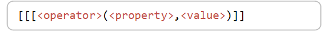
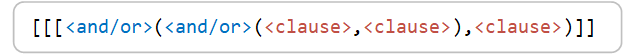
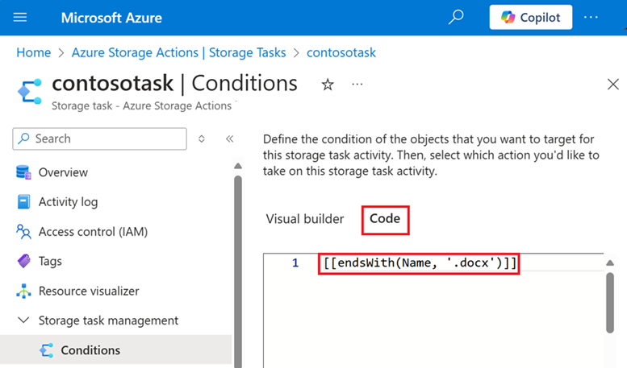

# Storage task conditions

A storage task contains a set of conditions and operations. This article describes the JSON format of a condition.  Understanding that format is important if you plan to create a storage task by using a tool other than the Azure portal (For example: Azure PowerShell, or Azure CLI). This article also lists the properties and operators that you can use to compose the clauses of a condition. 

This article focuses on **conditions**. To learn more about **operations**, see [Storage task operations](storage-task-operations.md). 

## Condition format

A condition a collection of one or more _clauses_. Each clause contains a _property_, a _value_, and an _operator_. When the storage task runs, it uses the operator to compare a property with a value to determine whether a clause is met by the target object. In a clause, the **operator** always appears first followed by the **property**, and then the **value**. The following image shows how each element is positioned in the expression.

> [!div class="mx-imgBorder"]
> 

The following clause allows operations only on Microsoft Word documents. This clause targets all documents that end with the file extension `.docx`. Therefore, the operator is `endsWith`, the property is `Name`, and the value is `.docx`. 

```json
{
   "condition": "[[[endsWith(Name, '.docx')]]"
}
```

You can also apply a _not_ operator before the operator in a condition clause. The _not_ operator is a special operator that you can position before any operator to give the opposite result of a clause. The following clause allows operations on any blob that **is not** a Microsoft Word document.   

```json
{
   "condition": "[[not(endsWith(Name, '*.docx'))]]"
}
```

For a complete list of operator and property names, see the [Supported operators](#supported-operators) and [Supported properties](#supported-properties) section of this article.

### Multiple clauses in a condition

A condition can contain multiple clauses separated by a comma along with either the string `and` or `or`. The string `and` targets objects that meet the criteria in all clauses in the condition while `or` targets objects that meet the criterion in any of the clauses in the condition. The following image shows the position of the `and` and `or` string along with two clauses.

> [!div class="mx-imgBorder"]
> 

The following JSON shows a condition that contains two clauses. Because the `and` string is used in this expression, both clauses must evaluate to `true` before an operation is performed on the object. 

```json
{
"condition": "[[and(endsWith(Name, '.docx'), equals(Tags.Value[readyForLegalHold], 'Yes'))]]"
}
```

### Groups of conditions

Grouped clauses operate as a single unit separate from the rest of the clauses. Grouping clauses is similar to putting parentheses around a mathematical equation or logic expression. The `and` or `or` string for the first clause in the group applies to the whole group.

 The following image shows two clauses grouped together.

> [!div class="mx-imgBorder"]
> 

The following condition allows operations only on Microsoft Word documents where the `readyForLegalHold` tag of the document is set to a value of `Yes`. Operations are also performed on objects that are greater than 100 bytes even if the other two conditions aren't true.

```json
{
"condition": "[[or(and(endsWith(Name, '*.docx'), equals(Tags.Value[readyForLegalHold], 'Yes')), greater(Content-Length, '100'))]]"
}
```

You can apply a _not_ operator to a group to test for the opposite result of a group of clauses. The following condition allows operations only on blobs that **are not** Microsoft Word documents where the `readyForLegalHold` tag of the blob is set to a value of `Yes`. Operations are also performed on objects that are greater than 100 bytes even if the other two conditions aren't true.

```json
{
"condition": "[[or(not(and(endsWith(Name, '*.docx'), equals(Tags.Value[readyForLegalHold], 'Yes'))), greater(Content-Length, '100'))]]"
}
```

## Code view in the Azure portal

The visual editor available in the Azure portal, can generate the JSON of a condition for you. You can define your conditions by using the editor, and then obtain the JSON expression by opening **Code** tab. This approach can be useful when creating complicated sets of conditions as JSON expressions can become large, unwieldy, and difficult to create by hand. The following image shows the **Code** tab in the visual editor.

> [!div class="mx-imgBorder"]
> 

To learn more about the visual editor, see [Define storage task conditions and operations](storage-task-conditions-operations-edit.md).

## Condition preview

You can view a list of blobs that would be impacted by the conditions that you've defined. That way, you can find issues and optimize conditions before applying them to production data. A preview doesn't make changes to the objects in a target storage account so it's safe to apply to test against production data.

While condition preview is available in PowerShell, Azure CLI, and SDK environments, the easiest way to preview the effect of conditions is by using the **Preview Conditions** window in the Azure portal. You can open this window was you define conditions and as you assign storage tasks. 

To preview the effect of conditions, you must specify a target subscription, storage account, and container. Because a can only show up to 5,000 blobs, you can also specify a prefix to narrow the list. 

> [!NOTE]
> You can't use wildcard characters in the blob prefix.

The following image shows an example of a preview result in the Azure portal.

> [!div class="mx-imgBorder"]
> 

The preview result appears in a table that shows objects which meet the condition along with objects that didn't meet the condition. You can sort by field that appears in the table.

If conditions refer to properties that don't exist in the target storage account, an error appears. For example, blob index tags aren't available for accounts that have a hierarchical namespace. If a clause in a condition refers to blob index tags, a validation error appears. 


## Supported properties

The following table shows the properties that you can use to compose each clause of a condition. A clause can contain string, boolean, numeric, and date and time properties.

| String                         | Date and time<sup>3</sup> | Numeric        | Boolean          |
|--------------------------------|---------------------------|----------------|------------------|
| AccessTier<sup>1</sup>         | AccessTierChangeTime      | Content-Length | Deleted          |
| Metadata.Value                 | Creation-Time             | TagCount       | IsCurrentVersion |
| Name                           | DeletedTime               |                |                  |
| BlobType<sup>2</sup>           | LastAccessTime            |                |                  |
| Container.Metadata.Value[Name] | Last-Modified             |                |                  |
| Container.Name                 |                           |                |                  |
| Container.Metadata.Value[Name] |                           |                |                  |
| Container.Name                 |                           |                |                  |
| Tags.Value[Name]               |                           |                |                  |
| VersionId                      |                           |                |                  |

<sup>1</sup>    Allowed values are `Hot`, `Cool`, or `Archive`.

<sup>2</sup>    Allowed values are `BlockBlob`, `PageBlob`, or `AppendBlob`

<sup>3</sup>    Can be set to a specific time or to a metadata value dynamically obtained from objects. See [Reference a value from object metadata](storage-task-conditions-operations-edit.md#reference-a-value-from-object-metadata).

## Supported operators

The following table shows the operators that you can use in a clause to evaluate the value of each type of property.

| String | Date and time | Numeric | Boolean |
|---|---|---|---|
| contains | equals |equals | equals |
| empty | greater | greater |  |
| equals | greaterOrEquals |greaterOrEquals ||
| endsWith | less | less ||
| length | lessOrEquals | lessOrEquals ||
| startsWith | addToTime | ||
| Matches |  | || 

The **not** operator is a special operator that you can position before any of the operators that appear in this table to give the opposite result of conditional clause, also called the negative result.

## See also

- [Storage task operations](storage-task-operations.md)
- [Define conditions and operations](storage-task-conditions-operations-edit.md)
