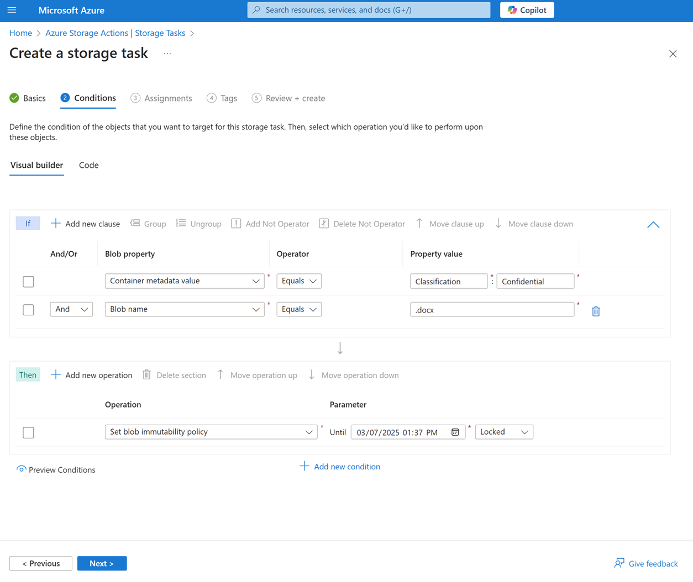
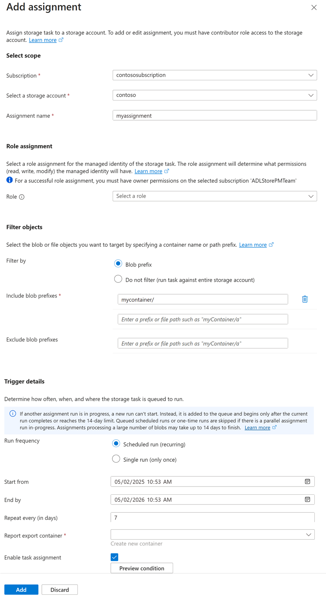

# Create a storage task

A storage task can perform operations on blobs in an Azure Storage account. As you create a task, you can define the conditions that must be met by each object (container or blob), and the operations to perform on the object. You can also identify one or more Azure Storage account targets. See [What are Azure Storage Actions?](../overview.md).

In this how-to article, you'll learn how to create a storage task.

## Create a storage task

## [Portal](#tab/azure-portal)

In the Azure portal, search for _Storage Tasks_. Then, under **Services**, select **Storage tasks - Azure Storage Actions**.

> [!div class="mx-imgBorder"]
> 

On the **Azure Storage Actions | Storage Tasks** page, select **Create**.

> [!div class="mx-imgBorder"]
> 

### Basics tab

On the **Basics** tab, provide the essential information for your storage task. The following table describes the fields on the **Basics** tab.

| Section | Field | Required or optional | Description |
|--|--|--|--|
| Project details | Subscription | Required | Select the subscription for the new storage task. |
| Project details | Resource group | Required | Create a new resource group for this storage task, or select an existing one. For more information, see [Resource groups](../../azure-resource-manager/management/overview.md#resource-groups). |
| Instance details | Storage task name | Required | Choose a unique name for your storage task. Storage task names must be between 3 and 18 characters in length and might contain only lowercase letters and numbers. |
| Instance details | Region | Required | Select the appropriate region for your storage task. For more information, see [Regions and Availability Zones in Azure](../../reliability/availability-zones-overview.md). |
| Instance details | User-assigned identity | optional | optionally associate a user-assigned managed identity with this storage task. A user-assigned managed identity is a managed identity is represented as a standalone Azure resource that is managed separately from the resources that use it. You can't associate one later. Therefore, if you want to use a user-assigned managed identity, you must select one as you create the storage task. By default, a system-assigned managed identity is created when the storage task is provisioned. To learn more, see [Storage task assignment](storage-task-assignment.md)<br> To select a user-assigned managed identity, choose **Select an identity**. On the **Select user assigned managed identity** page, filter for and then select the managed identity. Then, select **Add**. You can add select a user-assigned managed identity only as you create a storage task.  |

The following image shows an example of the **Basics** tab.

> [!div class="mx-imgBorder"]
> 

### Conditions tab

On the **Conditions** tab, define the conditions that must be met by each object (container or blob), and the operations to perform on the object.

You must define at least one condition and one operation. To add a clause to a condition, select  **Add new clause**. To add operations, select **Add new operation**.

The following table describes the fields on the **Conditions** tab.

| Section | Field | Required or optional | Description |
|--|--|--|--|
| If | And/Or | Required | An operator that combines two or more predicates to form a logical-AND or logical-OR expression. |
| If | Blob property | Required | The blob or container property that you like to use in the clause. See [Supported blob properties](storage-task-conditions.md#supported-properties)|
| If | Operator | Required | The operator that defines how each property in the clause must relate to the corresponding value. See [Supported operators](storage-task-conditions.md#supported-operators)|
| If| Property value | Required | The value that relates to the corresponding property.  |
| Then | Operations | Required | The action to perform when objects meet the conditions defined in this task. See [Supported operations](storage-task-operations.md#supported-operations)|
| Then | Parameter | Required | A value used by the operation. |

The following image shows an example of the **Conditions** tab.

> [!div class="mx-imgBorder"]
> 

You can select **Preview Conditions** to view a list of blobs that would be impacted by the conditions that you've defined. To learn more, see [Preview the effect of conditions](storage-task-conditions-operations-edit.md#preview-the-effect-of-conditions).

### Assignments tab

An _assignment_ identifies a storage account and a subset of objects in that account that the task will target. An assignment also defines when the task runs and where execution reports are stored.

To add an assignment, select **Add assignment**. This step is optional. You don't have to add an assignment to create the task.

The following table describes the fields that appear in the **Add assignment** pane.

select the role that you want to assign to the system-assigned managed identity of the storage task. To ensure a successful task assignment, use roles that have the Blob Data Owner permissions. To learn more, see [Azure roles for storage tasks](storage-task-authorization-roles.md)

| Section | Field | Required or optional | Description |
|--|--|--|--|
| Select scope | Subscription | Required | The subscription of the storage account that you want to add to this assignment. |
| Select scope | Select a storage account | Required | The storage account that you want to add to this assignment. |
| Select scope | Assignment name | Required | The name of the assignment. Assignment names must be between 2 and 62 characters in length and might contain only letters and numbers. |
| Role assignment | Assignment name | Required | The role that you want to assign to the managed identity of the storage task. To learn more about which role to choose, see [Permission for a task to perform operations](storage-task-authorization-roles-assign.md?#permission-for-a-task-to-perform-operations). |
| Filter objects | Filter by | Required | Option to either filter objects by using a prefix or to run the task against the entire storage account. |
| Filter objects | Blob prefixes | Optional | The string prefix that is used to narrow the scope of blobs that are evaluated by the task. This field is required only if you choose to filter by using a blob prefix. |
| Trigger details | Run frequency | Required | Option to either run the task one time or multiple times. |
| Trigger details | Start from | Required | The date and time to begin running the task. |
| Trigger details | End by | Required | The date and time to stop running the task. |
| Trigger details | Repeat very (in days) | Required | The interval in days between each run. |
| Trigger details | Report export container | Required | The container where task execution reports are stored. |

The following image shows an example of the **Add assignment** pane.

> [!div class="mx-imgBorder"]
> 

### Tags tab

On the **Tags** tab, you can specify Resource Manager tags to help organize your Azure resources. For more information, see [Tag resources, resource groups, and subscriptions for logical organization](../../azure-resource-manager/management/tag-resources.md).

The following image shows a standard configuration of the index tag properties for a new storage account.

> [!div class="mx-imgBorder"]
> 

### Review + create tab

When you navigate to the **Review + create** tab, Azure runs validation on the storage task settings that you have chosen. If validation passes, you can proceed to create the storage task.

If validation fails, then the portal indicates which settings need to be modified.

The following image shows the **Review** tab data prior to the creation of a new storage task.

> [!div class="mx-imgBorder"]
> 

## [PowerShell](#tab/azure-powershell)

1. First, install the necessary PowerShell modules. See [Install the PowerShell module](storage-task-quickstart-powershell.md#install-the-powershell-module)

2. Define a _condition_ by using JSON. A condition a collection of one or more clauses. Each clause contains a property, a value, and an operator. To learn more, see [Storage task conditions](storage-task-conditions.md).

   ```powershell
   $condition = "<condition-json>"
   ```
3. Define each operation by using the [New-AzStorageActionTaskOperationObject](/powershell/module/az.storageaction/new-azstorageactiontaskoperationobject) command. To learn more, see [Storage task operations](storage-task-operations.md)

   ```powershell
    $operation = New-AzStorageActionTaskOperationObject `
    -Name "<operation-name>" `
    -Parameter @{"<parameter-name>"= "<parameter-value"} `
    -OnFailure break `
    -OnSuccess continue

   ```

4. Create a storage task by using the [New-AzStorageActionTask](/powershell/module/az.storageaction/new-azstorageactiontask) command, and pass in any conditions and operations that you define. The following command creates a storage task and enables the system-managed identity of the task. Storage task assignments use permissions applied to that system-managed identity to authorize access.

   ```powershell
   $task = New-AzStorageActionTask `
   -Name "<storage-task-name>" `
   -ResourceGroupName "<resource-group>" `
   -Location "<location>" `
   -Enabled `
   -Description "<description>" `
   -IfCondition $condition `
   -IfOperation $operation `
   -EnableSystemAssignedIdentity:$true
   ```
   
   If you want assignments to authorize by using a user-assigned managed identity, you must provide that identity as a parameter to the [New-AzStorageActionTask](/powershell/module/az.storageaction/new-azstorageactiontask) command. The following command creates a storage task and specifies a user assigned managed identity. Storage task assignments use permissions applied to the user-assigned managed identity to authorize access.

   ```powershell
   $managedIdentity = Get-AzUserAssignedIdentity -ResourceGroupName <resource-group> -Name <user-assigned-managed-identity-name>

   $task = New-AzStorageActionTask `
   -Name "<storage-task-name>" `
   -ResourceGroupName "<resource-group>" `
   -Location "<location>" `
   -Enabled `
   -Description "<description>" `
   -IfCondition $condition `
   -IfOperation $operation `
   -UserAssignedIdentity $managedIdentity.Id
   ```
   
   To learn how to create an assignment by using PowerShell, see [Create and manage a storage task assignment](storage-task-assignment-create.md?tabs=azure-powershell).

## [Azure CLI](#tab/azure-cli)

1. Define a _condition_ by using JSON. A condition a collection of one or more clauses. Each clause contains a property, a value, and an operator. To learn more, see [Storage task conditions](storage-task-conditions.md).

   ```azurecli
   conditionclause="<condition-json>"
   ```
   > [!TIP]
   > Azure CLI uses shorthand syntax. Shorthand syntax is a simplified representation of a JSON string. To learn more, see [How to use shorthand syntax with Azure CLI](/cli/azure/use-azure-cli-successfully-shorthand).

2. Create a storage task by using the [az storage-actions task create](/cli/azure/storage-actions/task#az-storage-actions-task-create) command, and pass in a JSON-formatted expression of the conditions and operations. This example finds blobs in the cool tier and moves them to the hot tier. All other blobs are deleted. The following command creates a storage task and specifies a system assigned managed identity. Storage task assignments use permissions applied to the system-assigned managed identity to authorize access.

   ```azurecli
   az storage-actions task create -g myresourcegroup -n mystoragetask \ 
   --identity "{type:SystemAssigned}" \
   --action "{if:{condition:'[[equals(AccessTier,'/Cool'/)]]',operations:[{name:'SetBlobTier',parameters:{tier:'Hot'},onSuccess:'continue',onFailure:'break'}]},else:{operations:[{name:'DeleteBlob',onSuccess:'continue',onFailure:'break'}]}}" --description myStorageTask --enabled true
   ```

   If you want assignments to authorize by using a user-assigned managed identity, you must provide that identity as a parameter to the [az storage-actions task create](/cli/azure/storage-actions/task#az-storage-actions-task-create) command. The following command creates a storage task and specifies a user assigned managed identity. Storage task assignments use permissions applied to the user-assigned managed identity to authorize access.

   ```azurecli
   $identityId=az identity show --name <user-assigned-managed-identity-name> \
   --resource-group <resource-group> --query "id"

   az storage-actions task create -g myresourcegroup -n mystoragetask \ 
   --identity $identityId \
   --action "{if:{condition:'[[equals(AccessTier,'/Cool'/)]]',operations:[{name:'SetBlobTier',parameters:{tier:'Hot'},onSuccess:'continue',onFailure:'break'}]},else:{operations:[{name:'DeleteBlob',onSuccess:'continue',onFailure:'break'}]}}" --description myStorageTask --enabled true
   ```

   To learn more about operations, see [Storage task operations](storage-task-operations.md).

   To learn how to create an assignment by using Azure CLI, see [Create and manage a storage task assignment](storage-task-assignment-create.md?tabs=azure-cli).

## [Bicep](#tab/bicep)

Include a snippet similar to the following in your Bicep template. This example sets an immutability policy on word documents.

For a complete example, see [Quickstart: Create a storage task with Bicep](storage-task-quickstart-bicep.md).

```Bicep
resource storageTask 'Microsoft.StorageActions/storageTasks@2023-01-01' = {
  name: storageTaskName
  location: 'westus'
  identity: {
    type: 'SystemAssigned'
  }
  properties: {
    action: {
      if: {
        condition: '[[endsWith(Name, \'.docx\')]]'
        operations: [
         {
            name: 'SetBlobImmutabilityPolicy'
            onSuccess: 'continue'
            onFailure: 'break'
            parameters: {
              untilDate: '2025-06-20T20:34:00'
              mode: 'locked'
            }
         }
        ]
      }

    }
    description: 'My storage task'
    enabled: true
  }
}
```

## [Template](#tab/template)

Include a JSON snippet similar to the following in your Azure Resource Manager template. This example sets an immutability policy on word documents.

For a complete example, see [Quickstart: Create a storage task with an ARM template](storage-task-quickstart-arm.md).

```JSON
 "resources": [
    {
      "type": "Microsoft.StorageActions/storageTasks",
      "apiVersion": "2023-01-01",
      "name": "mystoragetask",
      "location": "westus",
      "identity": {
        "type": "SystemAssigned"
      },
      "properties": {
        "action": {
          "if": {
            "condition": "[[[endsWith(Name, '.docx')]]",
            "operations": [
              {
                "name": "SetBlobImmutabilityPolicy",
                "onSuccess": "continue",
                "onFailure": "break",
                "parameters": {
                  "untilDate": "2025-06-20T20:34:00",
                  "mode": "locked"
                }
              },
            ]
          }
        },
        "description": "my storage task",
        "enabled": true
      }
    }
  ]
```
---

## See also

- [Azure Storage Actions overview](../overview.md)
- [Create, assign, and run a storage task](storage-task-quickstart-portal.md)
- [Define conditions and operations](storage-task-conditions-operations-edit.md)
