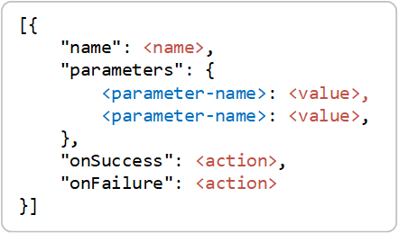
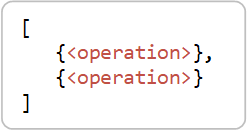

# Storage task operations

A storage task contains a set of conditions and operations. An operation is an action that a storage task performs on each object that meets the requirements of each condition. This article describes the JSON format of a storage task operation. Understanding that format is important if you plan to create a storage task by using a tool other than the Azure portal (For example: Azure PowerShell, or Azure CLI). This article also lists the operations, operation parameters, and the allowable values of each parameter. 

This article focuses on **operations**. To learn more about **conditions**, see [Storage task conditions](storage-task-conditions.md). 

> [!IMPORTANT]
> Azure Storage Actions is currently in PREVIEW and is available these [regions](../overview.md#supported-regions).
> See the [Supplemental Terms of Use for Microsoft Azure Previews](https://azure.microsoft.com/support/legal/preview-supplemental-terms/) for legal terms that apply to Azure features that are in beta, preview, or otherwise not yet released into general availability.

## Operation format 

An operation has a name along with zero, one, or multiple parameters. The following image shows how these elements appear for an operation in the JSON template of a storage task.

> [!div class="mx-imgBorder"]
> 

The following table describes each element.

| Element | Description |
|---|--|
| `name` | The name of the operation.<sup>1</sup> |
| `parameters` | A collection of one or more parameters. Each parameter has parameter name and a parameter value.<sup>1</sup> |
| `onSuccess` | The action to take when the operation is successful for an object. `continue` is the only allowable value during the preview. |
| `onFailure` | The action to take when the operation fails for an object. `break` is the only allowable value during the preview. |

<sup>1</sup>    For a complete list of operation names, operation parameters, and parameter values, see the [Supported operations](#supported-operations) section of this article.
 
The following operation applies a time-based immutability policy to the object. 

```json
{
    "operations": [
        {
            "name": "SetBlobImmutabilityPolicy",
            "parameters": {
                "untilDate": "2024-11-15T21:54:22",
                "mode": "locked"
            },
            "onSuccess": "continue",
            "onFailure": "break"
        }
    ]
}
```

### Multiple operations

Separate multiple operations by using a comma. The following image shows the position of two operations in list of operations.

> [!div class="mx-imgBorder"]
> 

The following JSON shows two operations separate by a comma. 

```json
"operations": [
    {
        "name": "SetBlobImmutabilityPolicy",
        "parameters": {
            "untilDate": "2024-11-15T21:54:22",
            "mode": "locked"
        },
        "onSuccess": "continue",
        "onFailure": "break"
    },
    {
        "name": "SetBlobTags",
        "parameters": {
            "ImmutabilityUpdatedBy": "contosoStorageTask"
        },
        "onSuccess": "continue",
        "onFailure": "break"
    }
]
```

## Supported operations

The following table shows the supported operations, parameters, and parameter values:

| Operation                    | Parameters           | Values                                         |
|------------------------------|----------------------|------------------------------------------------|
| SetBlobTier                | tier                 | Hot \| Cool \| Archive |
| SetBlobExpiry              | expiryTime, expiryOption                 |(expiryTime): Number of milliseconds<br>(expiryOption): Absolute \| NeverExpire \| RelativeToCreation \| RelativeToNow |
| DeleteBlob                  | None                 | None                                           |
| UndeleteBlob                | None                 | None                                           |
| SetBlobTags                | Tag name<sup>1</sup>               | Tag value |
| SetBlobImmutabilityPolicy | untilDate, mode | (untilDate): DateTime of when policy ends<br><br>(mode): locked \| unlocked                                |
| SetBlobLegalHold          | legalHold | true \| false                           |

<sup>1</sup>    The name of this parameter is the name of the tag. 

## See also

- [Storage task conditions](storage-task-conditions.md)
- [Define conditions and operations](storage-task-conditions-operations-edit.md)
