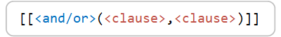

# Storage task operations

An operation is an action that a storage task performs on each object that meets the defined set of conditions. This article describes the format of a storage task operation and the list of operations, operation parameters, and allowable values. To learn more about conditions, see [Storage task conditions](storage-task-conditions.md).

> [!IMPORTANT]
> Azure Storage Actions is currently in PREVIEW and is available these [regions](../overview.md#supported-regions).
> See the [Supplemental Terms of Use for Microsoft Azure Previews](https://azure.microsoft.com/support/legal/preview-supplemental-terms/) for legal terms that apply to Azure features that are in beta, preview, or otherwise not yet released into general availability.

## Operation format

A storage task contains a set of conditions and operations in a JSON document. The following snippet shows how conditions and operations appear in that document. 

```json
"action": {
    "if": {
        "condition": "<clause>",
        "operations": [
            {
                "name": "<operation name>",
                "parameters": {....},
                "onSuccess": "continue",
                "onFailure": "break"
            }
        ]
    }
}
```

Each clause contains a _property_, a _value_, and an _operator_. When the storage task runs, it uses the operator to compare a property with a value to determine whether a clause is met by the target object. In a clause, the **operator** always appears first followed by the **property**, and then the **value**. The following image shows how each element is positioned in the expression.

> [!div class="mx-imgBorder"]
> 

The following clause allows operations only on Microsoft Word documents. This clause targets all documents that end with the file extension `.docx`. Therefore, the operator is `endsWith`, the property is `Name`, the value is `.docx`. 

```json
{
   "condition": "[[[endsWith(Name, '.docx')]]"
}
```
If you define conditions by using the Azure portal, you can see this JSON structure by opening the **Code** tab of the visual designer.

> [!div class="mx-imgBorder"]
> 

### Multiple clauses in a condition

A condition can contain multiple clauses separated by a comma along with either the string `and` or `or`. The string `and` targets objects that meet the criteria in all clauses in the condition while `or` targets objects that meet the criterion in any of the clauses in the condition. The following image shows the position of the `and` and `or` string along with two clauses.

> [!div class="mx-imgBorder"]
> 

The following JSON shows a condition that contains two clauses. Because the `and` string is used in this expression, both clauses must evaluate to `true` before an operation is performed on the object. 

```json
{
"condition": "[[and(endsWith(Name, '.docx'), equals(Tags.Value[readyForLegalHold], 'Yes'))]]"
}
```

### Groups of conditions

Grouped clauses operate as a single unit separate from the rest of the clauses. Grouping clauses is similar to putting parentheses around a mathematical equation or logic expression. The `and` or `or` string for the first clause in the group applies to the whole group.

 The following image shows two clauses grouped together.

> [!div class="mx-imgBorder"]
> 

The following condition allows operations only on Microsoft Word documents where the `readyForLegalHold` tag of the document is set to a value of `Yes`. Operations are also performed on objects that are greater than 100 bytes even if the other two conditions are not true.

```json
{
"condition": "[[[or(and(endsWith(Name, '.docx'), equals(Tags.Value[readyForLegalHold], 'Yes')), greater(Content-Length, '100'))]]"
}
```

## Supported operations

The following table shows the supported operations, parameters, and parameter values:

| Operation                    | Parameters           | Values                                         |
|------------------------------|----------------------|------------------------------------------------|
| Set blob tier                | Tier                 | Hot \| Cold \| Archive |
| Set blob expiry              | None                 | Absolute \| Never expire \| Relative to creation time \| Relative to current time |
| Delete blob                  | None                 | None                                           |
| Undelete blob                | None                 | None                                           |
| Set blob tags                | TagSet               | A fixed collection of up to 10 key-value pairs |
| Set blob immutability policy | DateTime, string | DateTime of when policy ends, Locked \| Unlocked                                |
| Set blob legal hold          | Bool | True \| False                           |

## Example 1

Example here.

```json
{
Put Json here
}
```

## Example 3

Example here.

```json
{
Put Json here
}
```

## See also

- [Define conditions and operations](storage-task-conditions-operations-edit.md)
