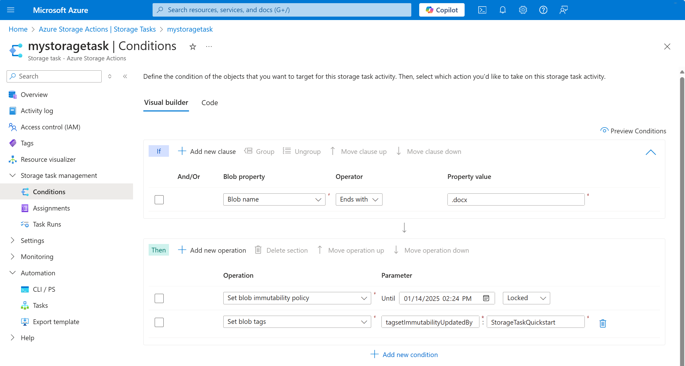

# Create a storage task by using Azure Resource Manager template (ARM template)

This quickstart describes how to create a storage task by using an Azure Resource Manager template (ARM template).

[!INCLUDE [About Azure Resource Manager](~/reusable-content/ce-skilling/azure/includes/resource-manager-quickstart-introduction.md)]

If your environment meets the prerequisites and you're familiar with using ARM templates, select the
**Deploy to Azure** button. The template will open in the Azure portal.

:::image type="content" source="~/reusable-content/ce-skilling/azure/media/template-deployments/deploy-to-azure-button.svg" alt-text="Button to deploy the Resource Manager template to Azure." border="false" link="https://portal.azure.com/#create/Microsoft.Template/uri/https%3A%2F%2Fraw.githubusercontent.com%2FAzure%2Fazure-quickstart-templates%2Fmaster%2Fquickstarts%2Fmicrosoft.storage.actions%2Fstorage-task%2Fazuredeploy.json":::

## Prerequisites

If you don't have an Azure subscription, create a [free account](https://azure.microsoft.com/free/?WT.mc_id=A261C142F) before you begin.

## Review the template

The template used in this quickstart is from [Azure Quickstart Templates](https://azure.microsoft.com/resources/templates/storage-task/).

:::code language="json" source="~/quickstart-templates/quickstarts/microsoft.storage.actions/storage-task/azuredeploy.json":::

## Deploy the template

1. Select the following link to sign in to Azure and open a template. The template creates a key vault and a secret.

    :::image type="content" source="~/reusable-content/ce-skilling/azure/media/template-deployments/deploy-to-azure-button.svg" alt-text="Button to deploy the Resource Manager template to Azure." border="false" link="https://portal.azure.com/#create/Microsoft.Template/uri/https%3A%2F%2Fraw.githubusercontent.com%2FAzure%2Fazure-quickstart-templates%2Fmaster%2Fquickstarts%2Fmicrosoft.storage.actions%2Fstorage-task%2Fazuredeploy.json":::

2. Specify the subscription, resource group, and the storage task name. Then, select **Review + create** to deploy the template.

  You can also use the Azure PowerShell, Azure CLI, and REST API. To learn other deployment methods, see [Deploy templates](../../azure-resource-manager/templates/deploy-powershell.md).

## Review deployed resources

1. In the Azure portal, search for _Storage Tasks_. Then, under **Services**, select **Storage tasks - Azure Storage Actions**.

2. In the list of storage tasks, search for the name of the storage task that you deployed.

   > [!div class="mx-imgBorder"]
   > 


## Clean up resources

When no longer needed, delete the resource group. The resource group and all the resources in the
resource group are deleted. Use the following command to delete the resource group and all its contained resources.

### [Azure CLI](#tab/azure-cli)

```azurecli-interactive
az group delete --name <resource-group-name>
```

### [Azure PowerShell](#tab/azure-powershell)

```azurepowershell-interactive
Remove-AzResourceGroup -Name <resource-group-name>
```

---

Replace `<resource-group-name>` with the name of your resource group.

## Next steps

Assign a storage task to a storage account.

> [!div class="nextstepaction"]
> [Create and manage a storage task assignment](storage-task-assignment-create.md)