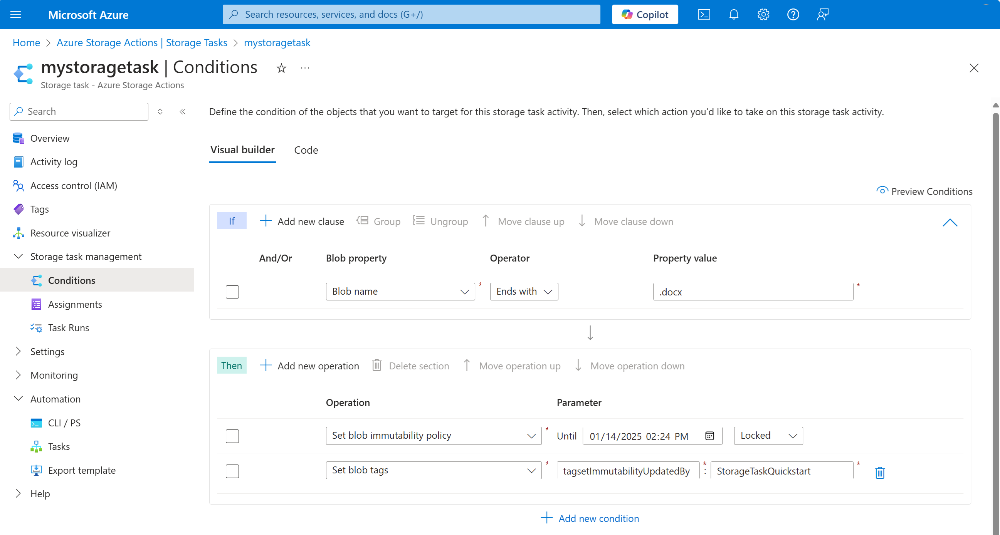

# Quickstart: Create a storage task with Bicep

This quickstart describes how to create a storage task by using Bicep.

[!INCLUDE [About Bicep](~/reusable-content/ce-skilling/azure/includes/resource-manager-quickstart-bicep-introduction.md)]

## Prerequisites

If you don't have an Azure subscription, create a [free account](https://azure.microsoft.com/free/?WT.mc_id=A261C142F) before you begin.

## Review the Bicep file

The Bicep file used in this quickstart is from
[Azure Quickstart Templates](https://azure.microsoft.com/resources/templates/storage-task/).

:::code language="bicep" source="~/quickstart-templates/quickstarts/microsoft.storage.actions/storage-task/main.bicep":::

The [Microsoft.StorageActions/storageTasks](/azure/templates/microsoft.storageactions/2023-01-01/storagetasks) Azure resource is defined in the Bicep file. 

## Deploy the Bicep file

1. Save the Bicep file as **main.bicep** to your local computer.

2. Deploy the Bicep file using either Azure CLI or Azure PowerShell.

### [Azure CLI](#tab/azure-cli)

```azurecli
az group create --name exampleRG --location <region>

az deployment group create --resource-group exampleRG --template-file main.bicep --parameters storageTaskName="<storage-task-name>" description="<description>" 
```

### [Azure PowerShell](#tab/azure-powershell)

```azurepowershell
New-AzResourceGroup -Name exampleRG -Location <region>

New-AzResourceGroupDeployment -ResourceGroupName exampleRG -TemplateFile ./main.bicep -storageTaskName "<storage-task-name>" -description "<description>"
```

---

## Review deployed resources

1. In the Azure portal, search for _Storage Tasks_. Then, under **Services**, select **Storage tasks - Azure Storage Actions**.

2. In the list of storage tasks, search for the name of the storage task that you deployed.

   > [!div class="mx-imgBorder"]
   > 


## Clean up resources

When no longer needed, delete the resource group. The resource group and all the resources in the
resource group are deleted. Use the following command to delete the resource group and all its contained resources.

### [Azure CLI](#tab/azure-cli)

```azurecli-interactive
az group delete --name <resource-group-name>
```

### [Azure PowerShell](#tab/azure-powershell)

```azurepowershell-interactive
Remove-AzResourceGroup -Name <resource-group-name>
```

---

Replace `<resource-group-name>` with the name of your resource group.

## Next steps

Assign a storage task to a storage account.

> [!div class="nextstepaction"]
> [Create and manage a storage task assignment](storage-task-assignment-create.md)