# Quickstart: Create, assign, and run a storage task

In this quickstart, you learn how to use the [Azure portal](https://portal.azure.com/) to create a storage task and assign it to an Azure Storage account. Then, you'll review the results of the run. The storage task applies a time-based immutability policy any Microsoft Word documents that exist in the storage account.

> [!IMPORTANT]
> Azure Storage Actions is currently in PREVIEW and is available these [regions](../overview.md#supported-regions).
> See the [Supplemental Terms of Use for Microsoft Azure Previews](https://azure.microsoft.com/support/legal/preview-supplemental-terms/) for legal terms that apply to Azure features that are in beta, preview, or otherwise not yet released into general availability.

## Prerequisites

- An Azure subscription. See [create an account for free](https://azure.microsoft.com/free/?WT.mc_id=A261C142F).

- An Azure storage account. See [create a storage account](../../storage/common/storage-account-create.md). As you create the account, make sure to enable version-level immutability support and that you don't enable the hierarchical namespace feature.
  
   During the public preview, you can target only storage accounts that are in the same region as the storage tasks.

- The [Storage Blob Data Owner](../../role-based-access-control/built-in-roles.md#storage-blob-data-owner) role is assigned to your user identity in the context of the storage account or resource group.

- A custom role assigned to your user identity in the context of the resource group which contains the RBAC actions necessary to assign a task to a storage account. See [Permissions required to assign a task](storage-task-authorization-roles.md#permission-for-a-task-to-perform-operations).

- A blob container with one or more Microsoft Word documents stored in that container.

## Create a task

1. In the Azure portal, search for _Storage tasks_.

2. Under **Services**, select **Storage tasks - Azure Storage Actions**.

   > [!div class="mx-imgBorder"]
   > 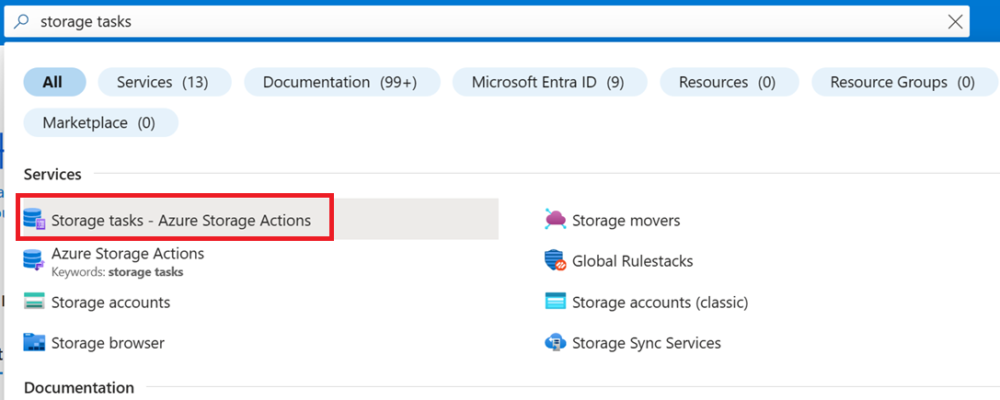

3. On the **Azure Storage Actions | Storage Tasks** page, select **Create**.

   > [!div class="mx-imgBorder"]
   > 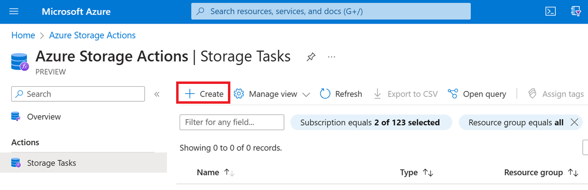

4. In the **Basics** page, under **Project details**, make sure that the correct subscription is selected. Then, select the same resource group that contains your new storage account.

   > [!div class="mx-imgBorder"]
   > 

5. Under **Instance details**, enter *mystoragetask* for the **Storage task name**, and select any region that is supported by the preview of this service.

   > [!div class="mx-imgBorder"]
   > 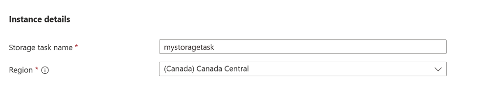

6. Select **Next** to open the **Conditions** page.

## Add clauses to a condition

You can specify the conditions of a storage task by making selections in **If** section of the **Visual Builder** tab. Every storage task has at least one condition with one clause in that condition.

1. In the **Select a property** drop-down list of the **If** section, select **Blob name**.

2. For the **Operator** of that condition, select **Ends with**, and in the **Enter a string** box, enter _.docx_.

   > [!div class="mx-imgBorder"]
   > 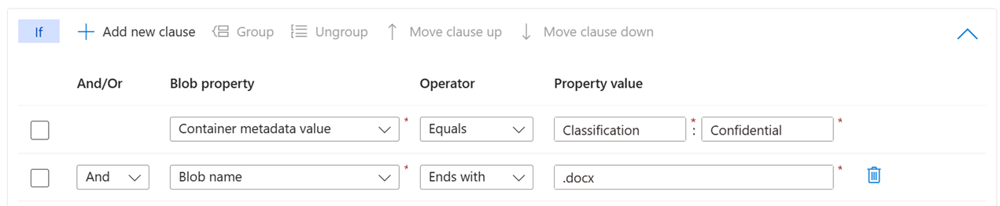

   This condition allows operations only on Word documents.

## Add operations

You can specify the operations that a storage task performs by making selections in **Then** section of the **Visual Builder** tab. Every storage task has at least one operation to perform when a blob or container meets the specified condition.

1. In the **Select an operation** drop-down list of the **Then** section, select **Set blob immutability policy**.

   > [!div class="mx-imgBorder"]
   > 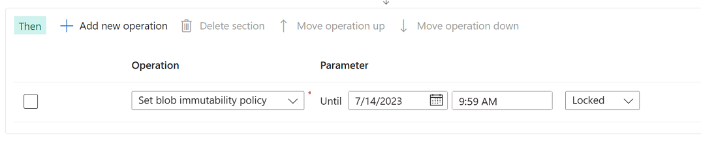

   This operation applies a time-based immutability policy to Microsoft Word documents.

2. Select **Add new operation**, and then in the **Select a operation** drop-down list, select **Set blob tags**.

3. In the **Enter a tag name** box, Enter _ImmutabilityUpdatedBy_, and in the **Enter a tag value** box, enter _StorageTaskQuickstart_. 

   > [!div class="mx-imgBorder"]
   > 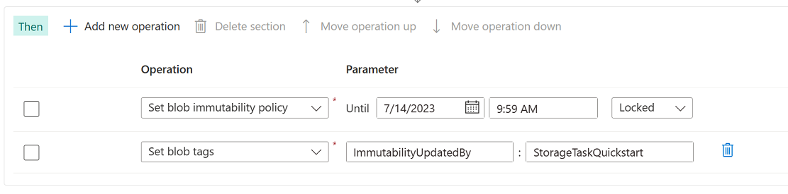

   This operation adds a blob index tag to each Word document in that container.

4. Select **Next** to open the **Assignments** page.

## Add an assignment

A storage task _assignment_ specifies a storage account. After you enable the storage task, the conditions and operations of your task will be applied to that storage account. The assignment also contains configuration properties which help you target specific blobs, or specify when and how often the task runs. You can add an assignment for each account you want to target.

1. Select **Add assignment**.

   The **Add assignment** pane appears.

2. In the **Select scope** section, select your subscription and storage account and name the assignment _mystoragetaskassignment_.

   > [!div class="mx-imgBorder"]
   > 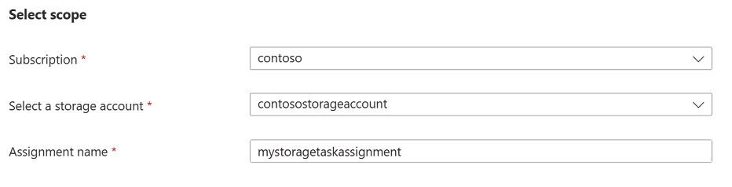

3. In the **Role assignment** section, in the **Role** drop-down list, select the **Storage Blob Data Owner** to assign that role to the system-assigned managed identity of the storage task.

   > [!div class="mx-imgBorder"]
   > 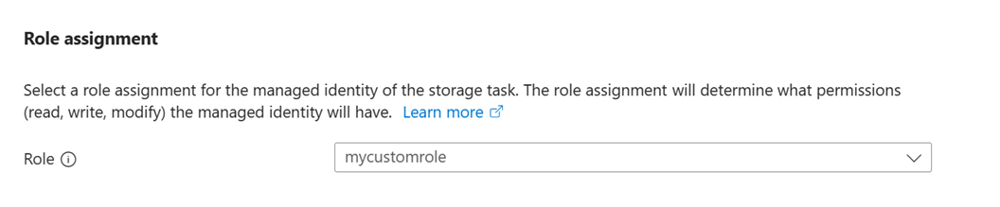

4. In the **Filter objects** section, make sure that the **Blob prefix** option is selected. Then, in the **Blob prefixes** box, enter the prefix of the container that you are using to complete this quickstart followed by the `/` character. For example, if your test container is named `mycontainer`, then enter `mycontainer/`.

   > [!div class="mx-imgBorder"]
   > 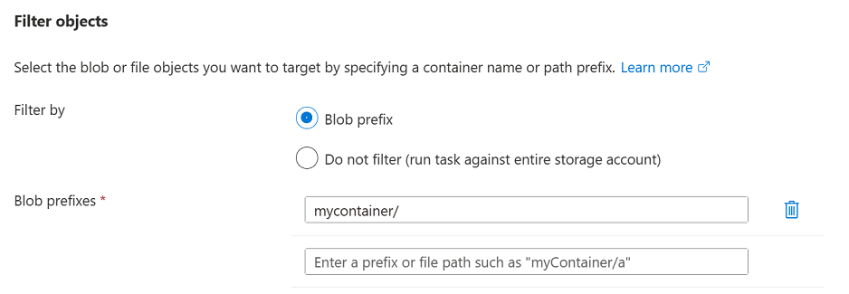

   Filters help you narrow the scope of execution. If you want the task to evaluate all of the containers and blobs in an account, then you can select the **Do not filter** option instead.

5. In the **Trigger details** section, select **Single run (only once)** and then select the container where you'd like to store the execution reports.

   > [!div class="mx-imgBorder"]
   > 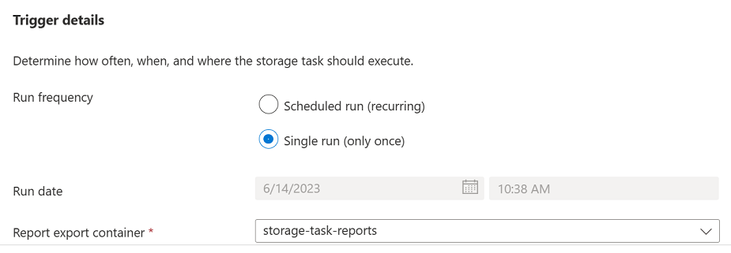

6. Select **Add**.

7. In the **Tags** tab, select **Next**.

8. In the **Review + Create** tab, select **Review + create**.

   When the task is deployed, the **Your deployment is complete** page appears.

9. Select **Go to resource** to open the **Overview** page of the storage task.

## Enable the task assignment

Storage task assignments are disabled by default. Enable assignments from the **Assignments** page.

1. Select **Assignments**, select the **mystoragetaskassignment** assignment, and then select **Enable**.

   > [!div class="mx-imgBorder"]
   > 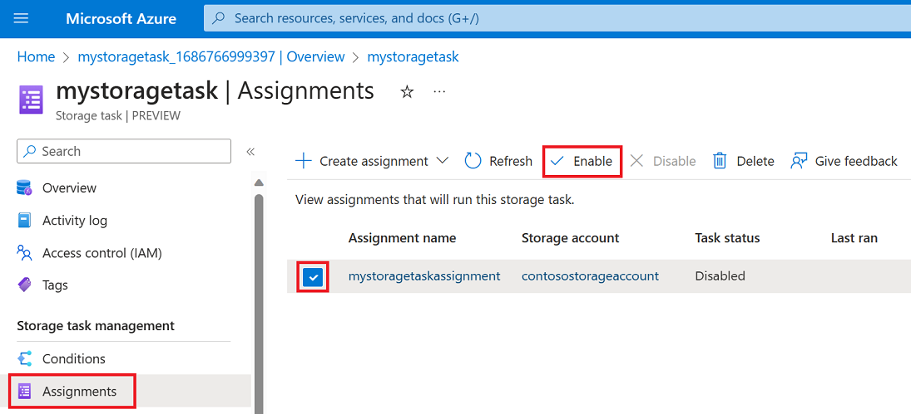

   The task assignment is queued to run.

2. Periodically select **Refresh** to view an updated status.

   Until the task runs and then completes, the string **In progress** appears beneath the **Last run status** column. When the task completes, the string **Completed** appears in that column.

   > [!div class="mx-imgBorder"]
   > 

## View results of the task run

After the task completes running, you can view the results of the run.

1. With the **Assignments** page still open, select **View task runs**.

   The **Execution tasks** pane appears, and in that pane, a line item which describes the report appears.

2. Select the **View report** link to download a report.

   > [!div class="mx-imgBorder"]
   > 

   The report appears as a comma-separated list of the container, the blob, and the operation performed along with a status.  You can also view these comma-separated reports in the container that you specified when you configured the assignment.

## Next steps

[Create a storage task](storage-task-create.md)
