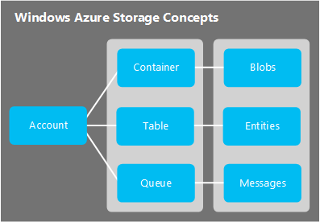

<properties urlDisplayName="Introduction to Azure Storage" pageTitle="Introduction to Storage | Microsoft Azure" metaKeywords="Get started  Azure storage introduction  Azure storage overview  Azure blob   Azure unstructured data   Azure unstructured storage   Azure blob   Azure blob storage  Azure queue   Azure asynchronous processing   Azure queue   Azure queue storage Azure table   Azure nosql   Azure large structured data store   Azure table   Azure table storage  Azure file storage  Azure file  Azure file share  Azure " description="An overview of Microsoft Azure Storage." metaCanonical="" disqusComments="1" umbracoNaviHide="1" services="storage" documentationCenter="" title="Introduction to Microsoft Azure Storage" authors="tamram" manager="adinah" editor="cgronlun" />

<tags ms.service="storage" ms.workload="storage" ms.tgt_pltfrm="na" ms.devlang="na" ms.topic="article" ms.date="01/01/1900" ms.author="tamram" />

# Introduction to Microsoft Azure Storage

This article provides an introduction to Microsoft Azure Storage for developers, IT Pros, and business decision makers. By reading it, you'll learn about:

- What Azure Storage is, and how you can take advantage of it in your cloud, mobile, server, and desktop applications
- What kinds of data you can store with the Azure Storage services: Blob, Table, Queue, and File storage
- How access to your data in Azure Storage is managed
- How your Azure Storage data is protected via redundancy and replication 
- Where to go next to build your first Azure Storage application

## What is Azure Storage? ##

Cloud computing enables new scenarios for applications requiring scalable, durable, and highly available storage for their data – which is exactly why Microsoft developed Azure Storage. In addition to making it possible for developers to build large-scale applications to support new scenarios, Azure Storage also provides the storage foundation for Azure Virtual Machines, a further testament to its robustness. 

Azure Storage is massively scalable, so you can store and process hundreds of terabytes of data to support the big data scenarios required by scientific, financial analysis, and media applications. Or you can store the small amounts of data required for a small business website. Wherever your needs fall, you pay only for the data you’re storing. Azure Storage currently stores tens of trillions of unique customer objects, and handles millions of requests per second on average. 

Azure Storage is elastic, so you can design applications for a large global audience, and scale those applications as needed - both in terms of the amount of data stored and the number of requests made against it. You pay only for what you use, and only when you use it.

Azure Storage uses an auto-partitioning system that automatically load-balances your data based on traffic. This means that as the demands on your application grow, Azure Storage automatically allocates the appropriate resources to meet them. 

Azure Storage is accessible from anywhere in the world, from any type of application, whether it’s running in the cloud, on the desktop, on an on-premises server, or on a mobile or tablet device. You can use Azure Storage in mobile scenarios where the application stores a subset of data on the device and synchronizes it with a full set of data stored in the cloud.

Azure Storage supports clients using a diverse set of operating systems (including Windows and Linux) and a variety of programming languages (including .NET, Java, and C++) for convenient development. Azure Storage also exposes data resources via simple REST APIs, which are available to any client capable of sending and receiving data via HTTP/HTTPS. 

## Introducing the Azure Storage Services ##

The Azure Storage services are Blob storage, Table storage, Queue storage, and File storage:

- **Blob storage** stores file data. A blob can be any type of text or binary data, such as a document, media file, or application installer. 
- **Table storage** stores structured datasets. Table storage is a NoSQL key-attribute data store, which allows for rapid development and fast access to large quantities of data.
- **Queue storage** provides reliable messaging for workflow processing and for communication between components of cloud services.
- **File storage** offers shared storage for legacy applications using the standard SMB 2.1 protocol. Azure virtual machines and cloud services can share file data across application components via mounted shares, and on-premise applications can access file data in a share via the File service REST API.

Blob, Table, and Queue storage are included in every storage account, while File storage is available by request via the [Azure Preview page](/en-us/services/preview/).

The storage account is a unique namespace that gives you access to Azure Storage. Each storage account can contain up to 500 TB of combined blob, queue, table, and file data. See the [Azure Storage Scalability and Performance Targets](http://msdn.microsoft.com/library/windowsazure/dn249410.aspx) for details about Azure storage account capacity.

The image below shows the relationships between the Azure storage resources:

Before you can create a storage account, you must have an Azure subscription, which is a plan that gives you access to a variety of Azure services. You can create up to 100 uniquely named storage accounts with a single subscription. See [Storage Pricing Details](http://www.windowsazure.com/en-us/pricing/details/storage/) for information on volume pricing.

You can get started with Azure with a [free trial](/en-us/pricing/free-trial/). Once you decide to purchase a plan, you can choose from a variety of [purchase options](/en-us/pricing/purchase-options/). If you’re an [MSDN subscriber](/en-us/pricing/member-offers/msdn-benefits-details/), you get free monthly credits that you can use with Azure services, including Azure Storage.

## Blob Storage ##

For users with large amounts of unstructured data to store in the cloud, Blob storage offers a cost-effective and scalable solution. You can use Blob storage to store content such as:

- Documents 
- Social data such as photos, videos, music, and blogs
- Backups of files, computers, databases, and devices
- Images and text for web applications
- Configuration data for cloud applications
- Big data, such as logs and other large datasets

Every blob is organized into a container. Containers also provide a useful way to assign security policies to groups of objects. A storage account can contain any number of containers, and a container can contain any number of blobs, up to the 500 TB capacity limit of the storage account.  

Blob storage offers two types of blobs, block blobs and page blobs (disks). Block blobs are optimized for streaming and storing cloud objects, and are a good choice for storing documents, media files, backups etc. A block blob can be up to 200 GB in size. Page blobs are optimized for representing IaaS disks and supporting random writes, and may be up to 1 TB in size. An Azure virtual machine network attached IaaS disk is a VHD stored as a page blob.

For very large datasets where network constraints make uploading or downloading data to Blob storage over the wire unrealistic, you can ship a hard drive to Microsoft to import or export data directly from the data center using the [Azure Import/Export Service](http://azure.microsoft.com/en-us/documentation/articles/storage-import-export-service/). You can also copy blob data within your storage account or across storage accounts. 

## Table Storage ##

Modern applications often demand data stores with greater scalability and flexibility than previous generations of software required. Table storage offers highly available, massively scalable storage, so that your application can automatically scale to meet user demand. Table storage is Microsoft’s NoSQL key/attribute store – it has a schemaless design, making it different from traditional relational databases. With a schemaless data store, it's easy to adapt your data as the needs of your application evolve. Table storage is easy to use, so developers can create applications quickly. Access to data is fast and cost-effective for all kinds of applications.  Table storage is typically significantly lower in cost than traditional SQL for similar volumes of data.

Table storage is a key-attribute store, meaning that every value in a table is stored with a typed property name. The property name can be used for filtering and specifying selection criteria. A collection of properties and their values comprise an entity. Since Table storage is schemaless, two entities in the same table can contain different collections of properties, and those properties can be of different types. 

You can use Table storage to store flexible datasets, such as user data for web applications, address books, device information, and any other type of metadata that your service requires.  You can store any number of entities in a table, and a storage account may contain any number of tables, up to the capacity limit of the storage account.

Like Blobs and Queues, developers can manage and access Table Storage using standard REST protocols, however Table Storage also supports a subset of the OData protocol, simplifying advanced querying capabilities and enabling both JSON and AtomPub (XML based) formats.

For today's Internet-based applications, NoSQL databases like Table storage offer a popular alternative to traditional relational databases. 

## Queue Storage ##

In designing applications for scale, application components are often decoupled, so that they can scale independently. Queue storage provides a reliable messaging solution for asynchronous communication between application components, whether they are running in the cloud, on the desktop, on an on-premises server, or on a mobile device. Queue storage also supports managing asynchronous tasks and building process workflows. 

A storage account can contain any number of queues. A queue can contain any number of messages, up to the capacity limit of the storage account. Individual messages may be up to 64 KB in size.

## File Storage ##

Many legacy applications rely on file shares, a dependency that has complicated moving these applications to the cloud. File storage offers cloud-based file shares, so that you can migrate legacy applications to Azure quickly and without costly rewrites. 

Applications running in Azure virtual machines or cloud services can mount a File storage share to access file data, just as a desktop application would mount a typical SMB share. Any number of application components can mount and access the File storage share simultaneously.

Since a File storage share is a standard SMB 2.1 file share, applications running in Azure can access data in the share via file sytem I/O APIs. Developers can therefore leverage their existing code and skills to migrate existing applications. IT Pros can use PowerShell cmdlets to create, mount, and manage File storage shares as part of the administration of Azure applications.

Like the other Azure storage services, File storage exposes a REST API for accessing data in a share. On-premise applications can call the File storage REST API to access data in a file share. This way, an enterprise can choose to migrate some legacy applications to Azure and continue running others from within their own organization. Note that mounting a file share is only possible for applications running in Azure; an on-premise application may only access the file share via the REST API.

Distributed applications can also use File storage to store and share useful application data and development and testing tools. For example, an application may store configuration files and diagnostic data such as logs, metrics, and crash dumps in a File storage share so that they are available to multiple virtual machines or roles. Developers and administrators can store utilities that they need to build or manage an application in a File storage share that is available to all components, rather than installing them on every virtual machine or role instance.

## Access to Blob, Table, Queue, and File Resources ##

By default, only the storage account owner can access resources in the storage account. For the security of your data, every request made against resources in your account must be authenticated. Authentication relies on a Shared Key model. Blobs can also be configured to support anonymous authentication. 

Your storage account is assigned two private access keys on creation that are used for authentication. Having two keys ensures that your application remains available when you regularly regenerate the keys as a common security key management practice.

If you do need to allow users controlled access to your storage resources, then you can create a [shared access signature](../storage-dotnet-shared-access-signature-part-1/). A shared access signature is a token that can be appended to a URL that enables delegated access to a container, blob, table, or queue. Anyone who possesses the token can access the resource it points to with the permissions it specifies, for the period of time that it is valid. Note that Azure File storage does not currently support shared access signatures.

Finally, you can specify that a container and its blobs, or a specific blob, are available for public access. When you indicate that a container or blob is public, anyone can read it anonymously; no authentication is required.  Public containers and blobs are useful for exposing resources such as media and documents that are hosted on websites.  To decrease network latency for a global audience, you can cache blob data used by websites with the Azure CDN.

## Replication for Durability and High Availability ##

[WACOM.INCLUDE [storage-replication-options](../includes/storage-replication-options.md)]

## Pricing ##

Customers are charged for Azure Storage based on four factors: the storage capacity used, the replication option selected, the number of requests made against the service, and data egress. 

Storage capacity refers to how much of your storage account allotment you are using to store data. The cost of simply storing your data is determined by how much data you are storing, and how it is replicated. Every read and write operation against Azure Storage also makes a request against the service. Data egress refers to data transferred out of a Windows Azure region. When the data in your storage account is accessed by an application that is not running in the same region, whether that application is a cloud service or some other type of application, then you are charged for data egress. (For Windows Azure services, you can take steps to group your data and services in the same data centers to reduce or eliminate process and data egress charges.) 

The [Storage Pricing Details](/en-us/pricing/details/storage/) page provides detailed pricing information for storage capacity, replication, and transactions. The [Data Transfers Pricing Details](/en-us/pricing/details/data-transfers/) provides detailed pricing information for data egress. You can use the [Azure Storage Pricing Calculator](/en-us/pricing/calculator/?scenario=data-management) to help estimate your costs.

## Developing Against Storage ##

Azure Storage exposes storage resources via a [REST API](http://msdn.microsoft.com/library/windowsazure/dd179355.aspx) that can be called by any language that can make HTTP/HTTPS requests. Additionally, Azure Storage offers programming libraries for several popular languages. These libraries simplify many aspects of working with Azure Storage by handling details such as synchronous and asynchronous invocation, batching of operations, exception management, automatic retries, operational behavior and so forth. Libraries are currently available for the following languages and platforms, with others in the pipeline:

- [.NET](http://go.microsoft.com/fwlink/?LinkID=390731)
- [Native code](http://msdn.microsoft.com/library/dn495438.aspx)
- [Java/Android](/en-us/develop/java/)
- [Node.js](/en-us/develop/nodejs/)
- [PHP](/en-us/develop/php/)
- [Ruby](/en-us/develop/ruby/)
- [Python](/en-us/develop/python/)
- [PowerShell](http://msdn.microsoft.com/library/dn495240.aspx)

## Next Steps ##

To get started with Azure Storage, explore these resources:

- [Azure Storage Documentation](/en-us/documentation/services/storage/)
- [Azure Storage Scalability and Performance Targets](http://msdn.microsoft.com/library/windowsazure/dn249410.aspx)

<h3>For .NET Developers</h3>

- [How to use Blob Storage from .NET](../storage-dotnet-how-to-use-blobs/)
- [How to use Table Storage from .NET](../storage-dotnet-how-to-use-tables/)
- [How to use Queue Storage from .NET](../storage-dotnet-how-to-use-queues/)

<h3>For Java/Android Developers</h3>

- [How to use Blob Storage from Java/Android](../storage-java-how-to-use-blob-storage/)
- [How to use Table Storage from Java/Android](../storage-java-how-to-use-table-storage/)
- [How to use Queue Storage from Java/Android](../storage-java-how-to-use-queue-storage/)

<h3>For Node.js Developers</h3>

- [How to use Blob Storage from Node.js](../storage-nodejs-how-to-use-blob-storage/)
- [How to use Table Storage from Node.js](../storage-nodejs-how-to-use-table-storage/)
- [How to use Queue Storage from Node.js](../storage-nodejs-how-to-use-queues/)

<h3>For PHP Developers</h3>

- [How to use Blob Storage from PHP](../storage-php-how-to-use-blobs/)
- [How to use Table Storage from PHP](../storage-php-how-to-use-table-storage/)
- [How to use Queue Storage from PHP](../storage-php-how-to-use-queues/)

<h3>For Ruby Developers</h3>

- [How to use Blob Storage from Ruby](../storage-ruby-how-to-use-blob-storage/)
- [How to use Table Storage from Ruby](../storage-ruby-how-to-use-table-storage/)
- [How to use Queue Storage from Ruby](../storage-ruby-how-to-use-queue-storage/)

<h3>For Python Developers</h3>

- [How to use Blob Storage from Python](../storage-python-how-to-use-blob-storage/)
- [How to use Table Storage from Python](../storage-python-how-to-use-table-storage/)
- [How to use Queue Storage from Python](../storage-python-how-to-use-queue-storage/)
