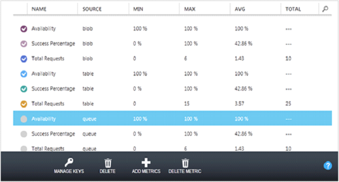

<properties urlDisplayName="How to monitor" pageTitle="How to monitor a storage account | Microsoft Azure" metaKeywords="Azure monitor storage accounts, storage account management portal, storage account dashboard, storage metrics table, storage metrics chart" description="Learn how to monitor a storage account in Azure by using the Management Portal." metaCanonical="" services="storage" documentationCenter="" title="How To Monitor a Storage Account" authors="tamram" solutions="" manager="adinah" editor="cgronlun" />

<tags ms.service="storage" ms.workload="storage" ms.tgt_pltfrm="na" ms.devlang="na" ms.topic="article" ms.date="01/01/1900" ms.author="tamram" />

<h1>How To Monitor a Storage Account</h1>

You can monitor your storage accounts in the Azure Preview Management Portal. For each storage service associated with the storage account (Blob, Queue, and Table), you can choose the level of monitoring - minimal or verbose - and specify the appropriate data retention policy. 

Until you configure monitoring for a storage account, no monitoring data is collected, and the metrics charts on the dashboard and **Monitor** page are empty.

 
<b>Note</b> 

Additional costs are associated with examining monitoring data in the Management Portal. For more information, see <a href="http://msdn.microsoft.com/en-us/library/windowsazure/hh360997.aspx">Storage Analytics and Billing</a>.
 

##Table of Contents##

* [How to: Configure monitoring for a storage account](#configurestoragemonitoring)
* [How to: Customize the dashboard for monitoring](#customizestoragemonitoring)
* [How to: Customize the Monitor page](#customizemonitorpage)
* [How to: Add metrics to the metrics table](#addmonitoringmetrics)
* [How to: Customize the metrics chart on the Monitor page](#customizemetricschart)
* [How to: Configure logging](#configurelogging)

<h2>How to: Configure monitoring for a storage account</h2>

1. In the [Management Portal](https://manage.windowsazure.com/), click **Storage**, and then click the storage account name to open the dashboard.

2. Click **Configure**, and scroll down to the **monitoring** settings for the Blob, Table, and Queue services, shown below.

	

3. In **monitoring**, set the level of monitoring and the data retention policy for each service:

-  To set the monitoring level, select one of the following:

      **Minimal** - Collects metrics such as ingress/egress, availability, latency, and success percentages, which are aggregated for the Blob, Table, and Queue services.

      **Verbose** - In addition to the minimal metrics, collects the same set of metrics for each storage operation in the Azure Storage Service API. Verbose metrics enable closer analysis of issues that occur during application operations. 

      **Off** - Turns off monitoring. Existing monitoring data is persisted through the end of the retention period.

- To set the data retention policy, in **Retention (in days)**, type the number of days of data to retain from 1-365 days. If you do not want to set a retention policy, enter zero. If there is no retention policy, it is up to you to delete the monitoring data. We recommend setting a retention policy based on how long you want to retain storage analytics data for your account so that old and unused analytics data can be deleted by system at no cost.

4. When you finish the monitoring configuration, click **Save**.

You should start seeing monitoring data on the dashboard and the **Monitor** page after about an hour.

Metrics are stored in the storage account in four tables named $MetricsTransactionsBlob, $MetricsTransactionsTable, $MetricsTransactionsQueue, and $MetricsCapacityBlob. For more information, see [About Storage Analytics Metrics](http://msdn.microsoft.com/en-us/library/windowsazure/hh343258.aspx).

After you set the monitoring levels and retention policies, you can choose which of the available metrics to monitor in the Management Portal, and which metrics to plot on metrics charts. A default set of metrics are displayed at each monitoring level. You can use **Add Metrics** to add or remove metrics from the metrics list.

<h2>How to: Customize the dashboard for monitoring</h2>

On the dashboard, you can choose up to six metrics to plot on the metrics chart from nine available metrics. For each service (Blob, Table, and Queue), the Availability, Success Percentage, and Total Requests metrics are available. The metrics available on the dashboard are the same for minimal or verbose monitoring.

1. In the [Management Portal](https://manage.windowsazure.com/), click **Storage**, and then click the name of the storage account to open the dashboard.

2. To change the metrics that are plotted on the chart, take one of the following actions:

- To add a new metric to the chart, click the check box by the metric header. In a narrow display, click ***n* more** to access headers that can't be displayed in the header area.

- To hide a metric that is plotted on the chart, clear the check box by the metric header.

	
  
3. By default, the chart shows trends, displaying only the current value of each metric (the **Relative** option at the top of the chart). To display a Y axis so you can see absolute values, select **Absolute**.

4. To change the time range the metrics chart displays, select 6 hours, 24 hours, or 7 days at the top of the chart.
     

<h2>How to: Customize the Monitor page</h2>

On the **Monitor** page, you can view the full set of metrics for your storage account. 

- If your storage account has minimal monitoring configured, metrics such as ingress/egress, availability, latency, and success percentages are aggregated from the Blob, Table, and Queue services.

- If your storage account has verbose monitoring configured, the metrics are available at a finer resolution of individual storage operations in addition to the service-level aggregates.

Use the following procedures to choose which storage metrics to view in the metrics charts and table that are displayed on the **Monitor** page. These settings do not affect the collection, aggregation, and storage of monitoring data in the storage account.

<h2>How to: Add metrics to the metrics table</h2>

1. In the [Management Portal](https://manage.windowsazure.com/), click **Storage**, and then click the name of the storage account to open the dashboard.

2. Click **Monitor**.

	The **Monitor** page opens. By default, the metrics table displays a subset of the metrics that are available for monitoring. The illustration shows the default Monitor display for a storage account with verbose monitoring configured for all three services. Use **Add Metrics** to select the metrics you want to monitor from all available metrics.

	

	
 
	<b>Note</b> 
	
Consider costs when you select the metrics. There are transaction and egress costs associated with refreshing monitoring displays. For more information, see <a href="http://msdn.microsoft.com/en-us/library/windowsazure/hh360997.aspx">Storage Analytics and Billing</a>.
 

3. Click **Add Metrics**. 

	The aggregate metrics that are available in minimal monitoring are at the top of the list. If the check box is selected, the metric is displayed in the metrics list. 

	
 
4. Hover over the right side of the dialog box to display a scrollbar that you can drag to scroll additional metrics into view.

	

5. Click the down arrow by a metric to expand a list of operations the metric is scoped to include. Select each operation that you want to view in the metrics table in the Management Portal.

	In the following illustration, the AUTHORIZATION ERROR PERCENTAGE metric has been expanded.

	

6. After you select metrics for all services, click OK (checkmark) to update the monitoring configuration. The selected metrics are added to the metrics table.

7. To delete a metric from the table, click the metric to select it, and then click **Delete Metric**, as shown below.

	

<h2>How to: Customize the metrics chart on the Monitor page</h2>

1. On the **Monitor** page for the storage account, in the metrics table, select up to 6 metrics to plot on the metrics chart. To select a metric, click the check box on its left side. To remove a metric from the chart, clear the check box.

2. To switch the chart between relative values (final value only displayed) and absolute values (Y axis displayed), select **Relative** or **Absolute** at the top of the chart.

3.	To change the time range the metrics chart displays, select **6 hours**, **24 hours**, or **7 days** at the top of the chart.

<h2>How to: Configure logging</h2>

For each of the storage services available with your storage account (Blob, Table, and Queue), you can save diagnostics logs for Read Requests, Write Requests, and/or Delete Requests, and can set the data retention policy for each of the services.

1. In the [Management Portal](https://manage.windowsazure.com/), click **Storage**, and then click the name of the storage account to open the dashboard.

2. Click **Configure**, and use the Down arrow on the keyboard to scroll down to **logging** (shown below).

	

 
3. For each service (Blob, Table, and Queue), configure the following:

	- The types of request to log: Read Requests, Write Requests, and Delete Requests

	- The number of days to retain the logged data. Enter zero is if you do not want to set a retention policy. If you do not set a retention policy, it is up to you to delete the logs.

4. Click **Save**.

The diagnostics logs are saved in a blob container named $logs in your storage account. For information about accessing the $logs container, see [About Storage Analytics Logging](http://msdn.microsoft.com/en-us/library/windowsazure/hh343262.aspx).
