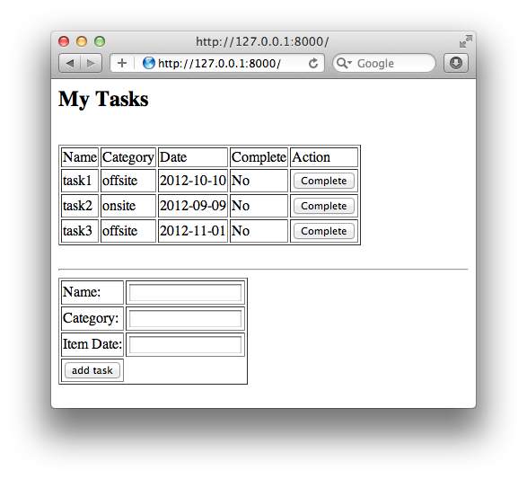

<properties urlDisplayName="Web App with Blob Storage" pageTitle="Python web app with table storage | Microsoft Azure" metaKeywords="Azure table storage Python, Azure Python application, Azure Python tutorial, Azure Python example" description="A tutorial that teaches you how to create a Python web application using the Azure Client Libraries. Django is used as the web framework." metaCanonical="" services="storage" documentationCenter="Python" title="Python Web Application using Table Storage" authors="huvalo" solutions="" videoId="" scriptId="" manager="wpickett" editor="mollybos" />

<tags ms.service="storage" ms.workload="storage" ms.tgt_pltfrm="na" ms.devlang="python" ms.topic="article" ms.date="01/01/1900" ms.author="huvalo" />

# Python Web Application using Table Storage

In this tutorial, you will learn how to create an application that uses Table Storage with the Azure Client Libraries for Python. If this is your first Python Azure app, you may wish to take a look at [Django Hello World Web Application][] first.

For this guide, you will create a web-based task-list application that you can deploy to Azure. The task list allows a user to retrieve tasks, add new tasks, and mark tasks as completed.  We'll be using Django as the web framework.

The task items are stored in Azure Storage. Azure Storage provides unstructured data storage that is fault-tolerant and highly available. Azure Storage includes several data structures where you can store and access data, and you can leverage the storage services from the APIs included in the Azure SDK for Python or
via REST APIs. For more information, see [Storing and Accessing Data in Azure].

You will learn:

-   How to work with Azure Table Storage service

A screenshot of the completed application will be similar to the one below (the added tasks items will be different):

[WACOM.INCLUDE [create-account-note](../includes/create-account-note.md)]

## Setting Up the Development Environment

**Note:** If you need to install Python or the Client Libraries, please see the [Python Installation Guide](http://windowsazure.com/en-us/documentation/articles/python-how-to-install).

*Note for Windows*: if you used the Windows WebPI installer, you already have Django and the Client Libs installed.

## Create A Storage Account In Azure

[WACOM.INCLUDE [create-storage-account](../includes/create-storage-account.md)]

## Create A Django Project

Here are the steps for creating the app:

-   Create a default Django Project named 'TableserviceSample' 
- 	From the command line, cd into a directory where you would like to store your code, then run the following command: 

		django-admin.py startproject TableserviceSample

-   Add a new Python file **views.py** to the project
-   Add the following code to **views.py** to import the required Django support:
           
        from django.http import HttpResponse
        from django.template.loader import render_to_string
        from django.template import Context

-   Create a new folder named **templates** under the **TableserviceSample/TableserviceSample** folder.
-   Edit the application settings so your templates can be located. Open **settings.py** and add the following entry to INSTALLED_APPS:

        'TableserviceSample',

-   Add a new Django template file **mytasks.html** to the **templates** folder and add following code to it:
 
<pre>
	&lt;html&gt;
	&lt;head&gt;&lt;title&gt;&lt;/title&gt;&lt;/head&gt;
	&lt;body&gt;
	&lt;h2&gt;My Tasks&lt;/h2&gt; &lt;br&gt;
	&lt;table border="1"&gt; 
	&lt;tr&gt;
	&lt;td&gt;Name&lt;/td&gt;&lt;td&gt;Category&lt;/td&gt;&lt;td&gt;Date&lt;/td&gt;&lt;td&gt;Complete&lt;/td&gt;&lt;td&gt;Action&lt;/td&gt;&lt;/tr&gt;
	
	&lt;form action=&quot;update_task&quot; method=&quot;GET&quot;&gt;
	&lt;tr&gt;&lt;td&gt;{{entity.name}} &lt;input type=&quot;hidden&quot; name='name' value=&quot;{{entity.name}}&quot;&gt;&lt;/td&gt;
	&lt;td&gt;{{entity.category}} &lt;input type=&quot;hidden&quot; name='category' value=&quot;{{entity.category}}&quot;&gt;&lt;/td&gt;
	&lt;td&gt;{{entity.date}} &lt;input type=&quot;hidden&quot; name='date' value=&quot;{{entity.date}}&quot;&gt;&lt;/td&gt;
	&lt;td&gt;{{entity.complete}} &lt;input type=&quot;hidden&quot; name='complete' value=&quot;{{entity.complete}}&quot;&gt;&lt;/td&gt;

	&lt;td&gt;&lt;input type=&quot;submit&quot; value=&quot;Complete&quot;&gt;&lt;/td&gt;
	&lt;/tr&gt;
	&lt;/form&gt;
	
	&lt;/table&gt;
	&lt;br&gt;
	&lt;hr&gt;
	&lt;table border=&quot;1&quot;&gt;
	&lt;form action=&quot;add_task&quot; method=&quot;GET&quot;&gt;
	&lt;tr&gt;&lt;td&gt;Name:&lt;/td&gt;&lt;td&gt;&lt;input type=&quot;text&quot; name=&quot;name&quot;&gt;&lt;/input&gt;&lt;/td&gt;&lt;/tr&gt;
	&lt;tr&gt;&lt;td&gt;Category:&lt;/td&gt;&lt;td&gt;&lt;input type=&quot;text&quot; name=&quot;category&quot;&gt;&lt;/input&gt;&lt;/td&gt;&lt;/tr&gt;
	&lt;tr&gt;&lt;td&gt;Item Date:&lt;/td&gt;&lt;td&gt;&lt;input type=&quot;text&quot; name=&quot;date&quot;&gt;&lt;/input&gt;&lt;/td&gt;&lt;/tr&gt;
	&lt;tr&gt;&lt;td&gt;&lt;input type=&quot;submit&quot; value=&quot;add task&quot;&gt;&lt;/input&gt;&lt;/td&gt;&lt;/tr&gt;
	&lt;/form&gt;
	&lt;/table&gt;
	&lt;/body&gt;
	&lt;/html&gt;    

</pre> 

    
## Import windowsazure storage module
Add following code on the top of **views.py** just after Django imports

	from azure.storage import TableService

## Get storage account name and account key
Add the following code to **views.py** just after the windowsazure import, and replace  'youraccount' and 'yourkey' with your real account name and key. You can get an account name and key from azure management portal. 

	account_name = 'youraccount'
	account_key = 'yourkey'

## Create TableService
Add the following code after **account_name**:

	table_service = TableService(account_name=account_name, account_key=account_key)
	table_service.create_table('mytasks')

## List tasks 
Add function list_tasks to **views.py**:

	def list_tasks(request): 
		entities = table_service.query_entities('mytasks', '', 'name,category,date,complete')    
		html = render_to_string('mytasks.html', Context({'entities':entities}))
		return HttpResponse(html)

##  Add task
Add the function add_task to **views.py**:

	def add_task(request):
		name = request.GET['name']
		category = request.GET['category']
		date = request.GET['date']
		table_service.insert_entity('mytasks', {'PartitionKey':name+category, 'RowKey':date, 'name':name, 'category':category, 'date':date, 'complete':'No'}) 
		entities = table_service.query_entities('mytasks', '', 'name,category,date,complete')
		html = render_to_string('mytasks.html', Context({'entities':entities}))
		return HttpResponse(html)

## Update task status
Add the function update_task to **views.py**:

	def update_task(request):
		name = request.GET['name']
		category = request.GET['category']
		date = request.GET['date']
		partition_key = name + category
		row_key = date
		table_service.update_entity('mytasks', partition_key, row_key, {'PartitionKey':partition_key, 'RowKey':row_key, 'name': name, 'category':category, 'date':date, 'complete':'Yes'})
		entities = table_service.query_entities('mytasks', '', 'name,category,date,complete')    
		html = render_to_string('mytasks.html', Context({'entities':entities}))
		return HttpResponse(html)

## Mapping urls
Now you need to map the URLs in the Django app. Open **urls.py** and add following mappings to urlpatterns:

	url(r'^$', 'TableserviceSample.views.list_tasks'),
	url(r'^list_tasks$', 'TableserviceSample.views.list_tasks'),
	url(r'^add_task$', 'TableserviceSample.views.add_task'),
	url(r'^update_task$', 'TableserviceSample.views.update_task'),

## Run the application

-  Switch to the **TableserviceSample** directory if you haven't already, and run the command:

	python manage.py runserver

-   Point your browser to: `http://127.0.0.1:8000/`. Replace 8000 with the real port number.

You can now click **Add Task** to create a task, and then click the **Complete** button to update the task and set its status to Yes.

## Running the Application in the Compute Emulator, Publishing and Stopping/Deleting your Application

Now that you've successfully run your app on the built-in Django server, you can test it out further by deploying it to the Azure emulator (Windows only) and then publishing to Azure.  For general instructions on how to do this, please refer to the article [Django Hello World Web Application] which discusses these steps in detail.

<h2>Next Steps</h2>

Now that you have learned the basics of the Azure Table storage service, follow these links to learn how to do more complex storage tasks.

- See the MSDN Reference: [Storing and Accessing Data in Azure] []
- Visit the Azure Storage Team Blog: <http://blogs.msdn.com/b/windowsazurestorage/>

[Storing and Accessing Data in Azure]: http://msdn.microsoft.com/en-us/library/windowsazure/gg433040.aspx

[Installation Guide]: ../python-how-to-install 

[Django Hello World Web Application]: http://windowsazure.com/en-us/documentation/articles/virtual-machines-python-django-web-app-windows-server
