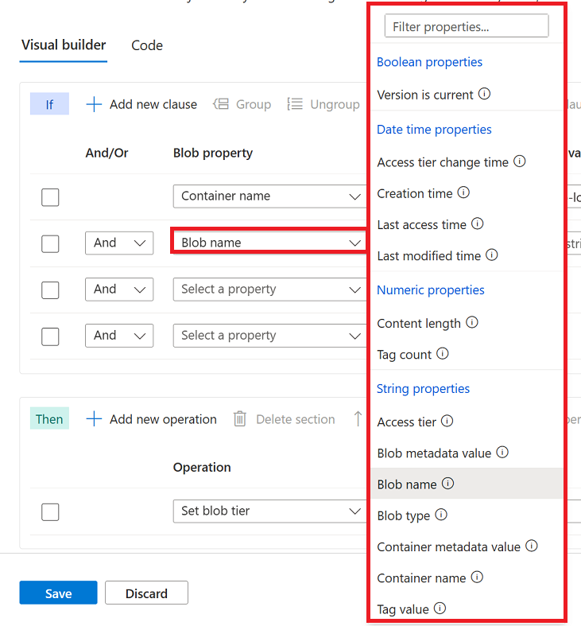

# Define storage task conditions and operations

You can use a visual editor to define the conditions and operations of a storage task.

An _operation_ is an that is action taken on each object that meets the conditions defined in the task. A _condition_ defines the relationship between a property and a value. To execute an operation defined in the storage task, the terms of that relationship must be met by each object. 

To learn more, see [Storage task conditions and operations](storage-task-conditions-operations.md).

## Open the conditions editor

Navigate to the storage task in the Azure portal and then under **Storage task management**, select **Conditions**.

> [!div class="mx-imgBorder"]
> 

The **Visual builder** tab of the **Conditions** pane appears. You can add and remove conditions and operations by using controls that appear in this tab.

## Define conditions

A condition defines the relationship between a property and a value. To execute an operation defined in the storage task, the terms of that relationship must be met by each object.

### Add and remove conditions

To add a condition, select **Add new clause**, and to remove a condition, select the delete icon(:::image type="icon" source="./media/storage-task-conditions-operations-edit/conditions-delete-icon.png":::) that appears next to it.

> [!div class="mx-imgBorder"]
> 

### Specify the terms of a condition

To define a condition, choose a property, specify a value for that property, and then choose an operator that relates them together.

#### Choose a property

In the **Blob property** drop-down list, choose a property. See [Supported blob properties](storage-task-conditions-operations.md#blob-properties).

The following example selects the **Blob name** property.

> [!div class="mx-imgBorder"]
> 

#### Choose a value and operator

In the **Property value** box, enter a value and in the **Operator** drop-down list, choose an operator. See [Supported Operators](storage-task-conditions-operations.md#operators).

The following example specifies a value of `.log` along with the **Ends with** operator. This condition allows the operation defined in this storage task to execute only on blobs that have a `.log` file extension.

> [!div class="mx-imgBorder"]
> 

#### Apply And / Or to a condition

You add **And** or **Or** to a condition. Specify **And** if you want to target objects that meet the criteria in both the current condition and the previous condition. Specify **Or** to target objects that meet the criterion in either the current condition or the previous condition.

The following example shows conditions that use **And**. In this example, the storage task targets objects that have a `.log` extension and which have a tag named `Archive-Status` set to `Ready`.

> [!div class="mx-imgBorder"]
> 

### Change the order of conditions

You can arrange conditions in an order that you believe will improve the performance of a task run. For example, instead of first testing all blobs in an account against a name filter, you might elevate a condition that targets a specific container. That small adjustment can prevent the task from performing unnecessary evaluations.

First, select the condition. Then, select **Move clause up** or **Move clause down** to change its position in the list.

The following example shows the result of selecting a condition and then selecting **Move clause up**.

> [!div class="mx-imgBorder"]
> 

### Group and ungroup conditions

Grouped conditions operate as a single unit separate from the rest of the conditions. Grouping conditions is similar to putting parentheses around a mathematical equation or logic expression. The **And** or **Or** operator for the first condition in the group applies to the whole group.

Select the checkbox that appears next to each condition you want to group together. Then, select **Group**.

The following example shows two conditions grouped together. In this example, the operation executes if a blob has the `.log` extension and either a tag named `Archive-Status` is set to the value of `Ready` or the file has not been accessed in 120 days.

> [!div class="mx-imgBorder"]
> 

To ungroup conditions, select the ungroup icon (:::image type="icon" source="./media/storage-task-conditions-operations-edit/ungroup-icon.png":::) or select each condition in the group, and select **Ungroup**.

### Set a condition to a parameter

Something here that shows how to set a property value to a parameter that is dynamically obtained. This capability has not landed yet in the UI.

## Define operations

An operation is an that is action taken on each object that meets the conditions defined in the task.  

### Add and remove operations

To add a operation, select **Add new operation**, and to remove an operation, select the delete icon(:::image type="icon" source="./media/storage-task-conditions-operations-edit/conditions-delete-icon.png":::) that appears next to it.

> [!div class="mx-imgBorder"]
> 

#### Choose an operation

In the **Operation** drop-down list, choose an operation. See [Supported operations](storage-task-conditions-operations.md#operations).

The following example selects the **Set blob tags** property.

> [!div class="mx-imgBorder"]
> 

#### Choose a parameter

Enter or select the parameters that are appropriate for the operation.

The following example sets the `Archive-Status` tag to the value `Archived`.  

> [!div class="mx-imgBorder"]
> 

### Change the order of operations

You can arrange operations in any order.

In this example, the existing order makes sense. Blobs are first archived and the tags are set. It wouldn't make sense to set the tag before changing the tier just in case the attempt to change the tier of a blob didn't succeed. If the set blob tag operation appeared first in the list, you might consider moving that operation beneath the set blob tier operation.

To move an operation, select the checkbox that appears beside it. Then, select **Move operation up** or **Move operation down** to change its position in the list.

## Use the Code view

What to put here?

## Preview results

You can see how the task will impact an account by previewing that result. Then, you can make tweaks and changes before deploying the task. Previewing results does not incur charges.

Open preview by using the Azure portal.
Column sorting and various other preview settings.
Receiving and then addressing validation errors.

## Fix validation errors

- What sorts of errors and validation issues can appear and how to address them.

## See also

- [Storage Tasks Overview](overview.md)
