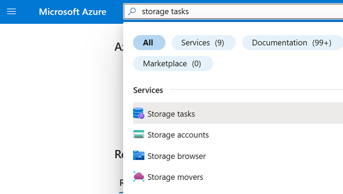
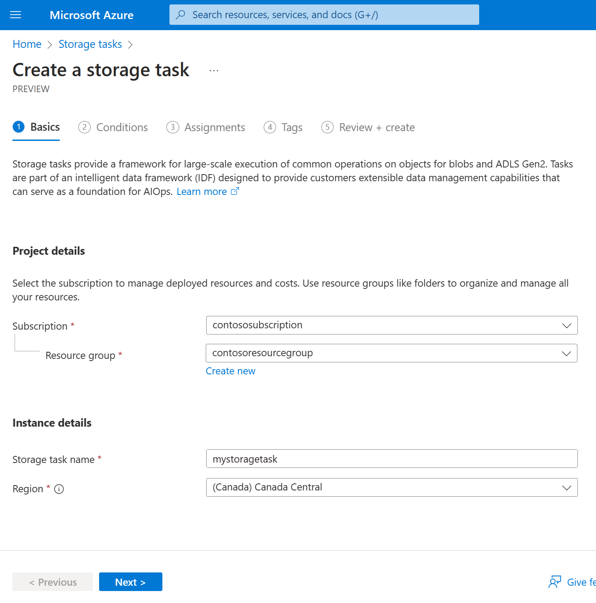
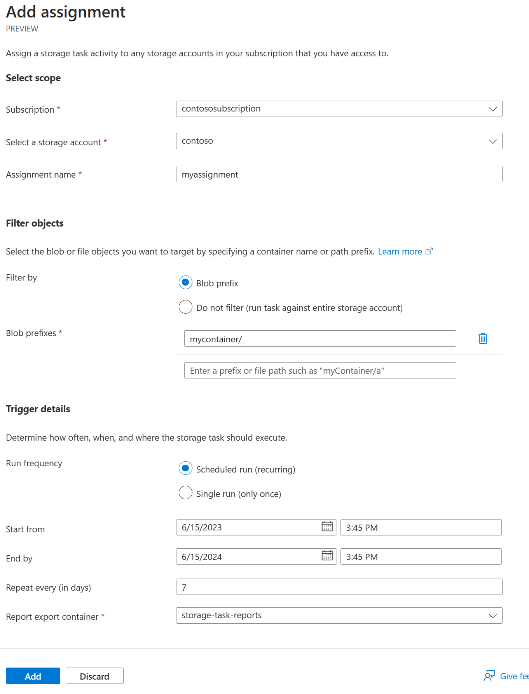
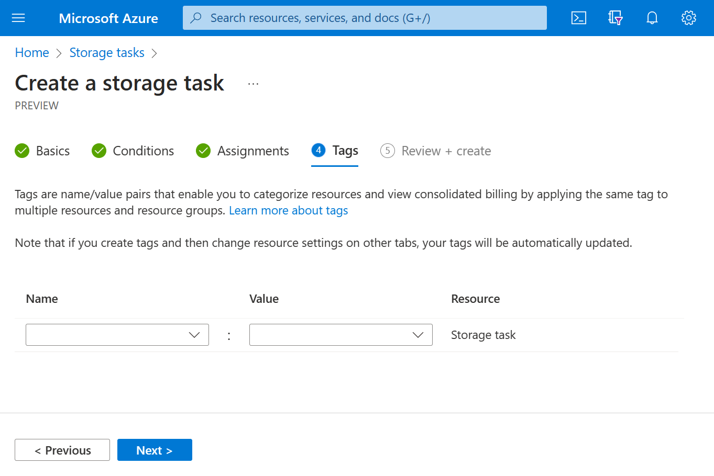
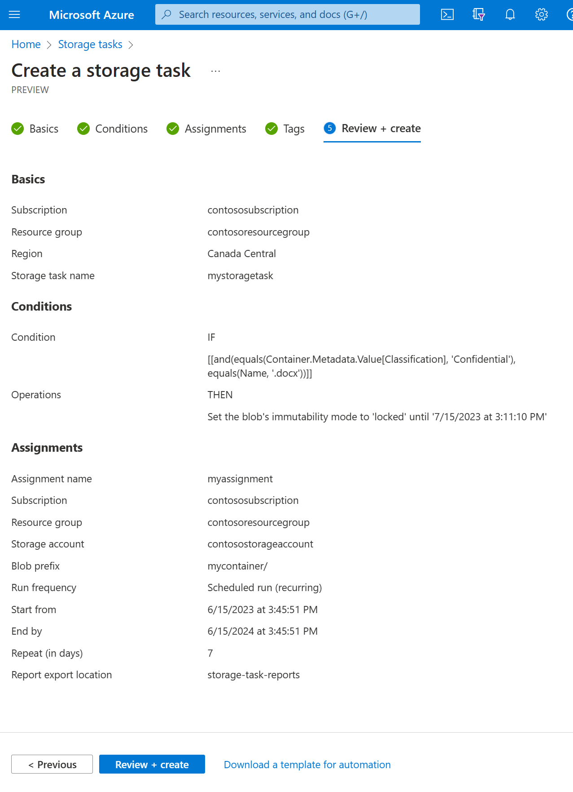

# Create a Storage Task

A storage task can perform operations on containers and blobs in an Azure Storage account. As you create a task, you can define the conditions that must be met by each object (container or blob), and the operations to perform on the object. You can also identify one or more Azure Storage account targets.

In this how-to article, you'll learn how to create a Storage Task. 

> [!IMPORTANT]
> Storage Tasks are currently in PREVIEW and is available in the following regions: \<List regions here\>.
> See the [Supplemental Terms of Use for Microsoft Azure Previews](https://azure.microsoft.com/support/legal/preview-supplemental-terms/) for legal terms that apply to Azure features that are in beta, preview, or otherwise not yet released into general availability.
> To enroll, see \<sign-up form link here\>.

To learn more about Storage Tasks, see [What are Azure Storage Tasks?](overview.md).

## Create a task

In the Azure portal, search for _Storage Tasks_. Then, under **Services**, select **Storage Tasks**.

> [!div class="mx-imgBorder"]
> 

On the **Storage tasks** page, select **Create**.

> [!div class="mx-imgBorder"]
> 

### Basics tab

On the **Basics** tab, provide the essential information for your Storage Task. The following table describes the fields on the **Basics** tab.

| Section | Field | Required or optional | Description |
|--|--|--|--|
| Project details | Subscription | Required | Select the subscription for the new Storage Task. |
| Project details | Resource group | Required | Create a new resource group for this Storage Task, or select an existing one. For more information, see [Resource groups](../../azure-resource-manager/management/overview.md#resource-groups). |
| Instance details | Storage task name | Required | Choose a unique name for your Storage Task. Storage Task names must be between 3 and 18 characters in length and may contain only lowercase letters and numbers. |
| Instance details | Region | Required | Select the appropriate region for your Storage Task. For more information, see [Regions and Availability Zones in Azure](../../availability-zones/az-overview.md). |

The following image shows an example of the **Basics** tab.

> [!div class="mx-imgBorder"]
> 

### Conditions tab

On the **Conditions** tab, define the conditions that must be met by each object (container or blob), and the operations to perform on the object.

You must define at least one condition and one operation. To add conditions, select  **Add new clause**. To add operations, select **Add new operation**. 

The following table describes the fields on the **Conditions** tab.

| Section | Field | Required or optional | Description |
|--|--|--|--|
| If | And/Or | Required | Description. |
| If | Blob property | Required | Put something here. |
| If | Operator | Required | Put something here. |
| If| Property value | Required | Put something here. |
| Then | Operations | Required | Description. |
| Then | Parameter | Required | Put something here. |

The following image shows an example of the **Conditions** ab.

> [!div class="mx-imgBorder"]
> 

To learn more about conditions and operations, see [Storage Task conditions and operations](storage-task-conditions-operations.md).

### Assignments tab

An _assignment_ identifies a storage account target. It also contains properties that can narrow the scope of target objects and specify when and how often a task should run.

To add an assignment, select **Add assignment**. This step is optional. You don't have to add an assignment to create the task.

The following table describes the fields that appear in the **Add assignment** pane.

| Section | Field | Required or optional | Description |
|--|--|--|--|
| Select scope | Subscription | Required | Description. |
| Select scope | Select a storage account | Required | Put something here. |
| Select scope | Assignment name | Required | Put something here. |
| Filter objects | Filter by | Required | Put something here. |
| Filter objects | Blob prefixes | Required | Description. |
| Trigger details | Run frequency | Required | Put something here. |
| Trigger details | Start from | Required | Put something here. |
| Trigger details | End by | Required | Put something here. |
| Trigger details | Repeat very (in days) | Required | Put something here. |
| Trigger details | Report export container | Required | Put something here. |

The following image shows an example of the **Add assignment** pane.

> [!div class="mx-imgBorder"]
> 

To learn more about assignments, see [Storage Task assignment](storage-task-assignment.md).

### Tags tab

On the **Tags** tab, you can specify Resource Manager tags to help organize your Azure resources. For more information, see [Tag resources, resource groups, and subscriptions for logical organization](../../azure-resource-manager/management/tag-resources.md).

The following image shows a standard configuration of the index tag properties for a new storage account.

> [!div class="mx-imgBorder"]
> 

### Review + create tab

When you navigate to the **Review + create** tab, Azure runs validation on the Storage Task settings that you have chosen. If validation passes, you can proceed to create the Storage Task.

If validation fails, then the portal indicates which settings need to be modified.

The following image shows the **Review** tab data prior to the creation of a new Storage Task.

> [!div class="mx-imgBorder"]
> 

## See also

- [Storage Tasks Overview](overview.md)
- [Create, assign, and run a Storage Task](storage-task-quickstart-portal.md)
- [Define conditions and operations](storage-task-conditions-operations-edit.md)
