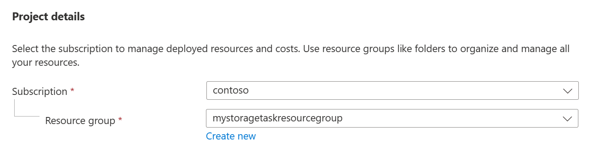
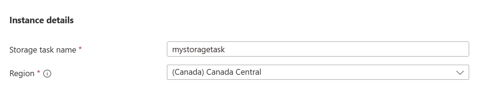
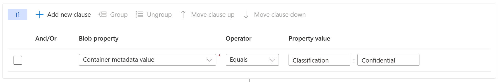

# Quickstart: Create, assign, and run a Storage Task

In this quickstart, you learn how to use the [Azure portal](https://portal.azure.com/) to configure a Storage Task, enable the task to operate on a storage account, and then review run results.

> [!IMPORTANT]
> Storage Tasks are currently in PREVIEW and is available in the following regions: \<List regions here\>.
> See the [Supplemental Terms of Use for Microsoft Azure Previews](https://azure.microsoft.com/support/legal/preview-supplemental-terms/) for legal terms that apply to Azure features that are in beta, preview, or otherwise not yet released into general availability.
> To enroll, see \<sign-up form link here\>.

## Prerequisites

- An Azure subscription. See [create an account for free](https://azure.microsoft.com/free/?WT.mc_id=A261C142F).

- An Azure storage account. See [create a storage account](../common/storage-account-create.md).

- A blob container that has a metadata key named `Classification` which is set to the value `Confidential`.

- A collection of Word documents, Excel workbooks, and PowerPoint presentations that are stored in the blob container.

## Create a task

1. In the Azure portal, search for _Storage Tasks_.

2. Under **Services**, select **Storage Tasks**.

3. On the **Storage tasks** page, select **Create**.

4. In the **Basics** page, under **Project details**, make sure the correct subscription is selected. Then, select **Create new** link to create a new resource group, and name that group _mystoragetaskresourcegroup_.

   > [!div class="mx-imgBorder"]
   > 

5. Under **Instance details**, enter *mystoragetask* for the **Storage task name**, and select any region that is supported by the preview of this service.

   > [!div class="mx-imgBorder"]
   > 

6. Select the **Next** button to open the **Conditions** page.

## Add task conditions

You can specify the conditions of a Storage task by making selections in the **Visual builder** tab of the **Conditions** page. Every Storage task has at least one condition (or _clause_), and one operation to perform when a blob or container meets the specified condition.

1. In the **Select a property** drop-down list of the **If** section, select **Container metadata value**.

2. In the **Enter a metadata name** box, enter _Classification_, and in the **Enter a metadata value** box, enter _Confidential_.

   > [!div class="mx-imgBorder"]
   > 

3. Select **Add new clause**, and then in the **Select a property** drop-down list, select **Blob Name**.

4. For the **Operator** of that condition, select **Ends with**, and in the **Enter a string** box, enter _.docx_.

## Add an assignment

Put something here.

## Deploy the task

Put something here.

## Enable the task assignment

Put something here

## View results of the task run

Put something here.

## Next steps

[Create a Storage Task](storage-task-create.md)