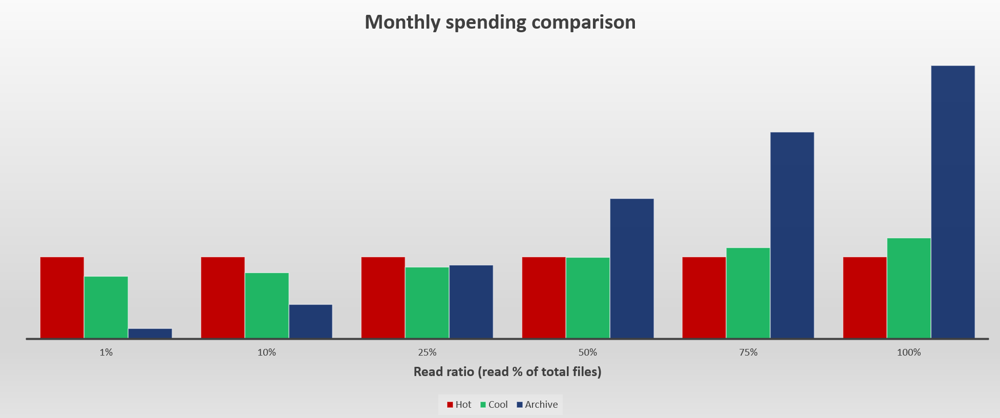
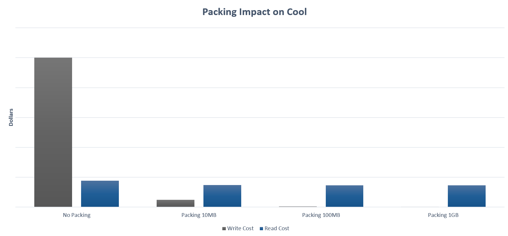
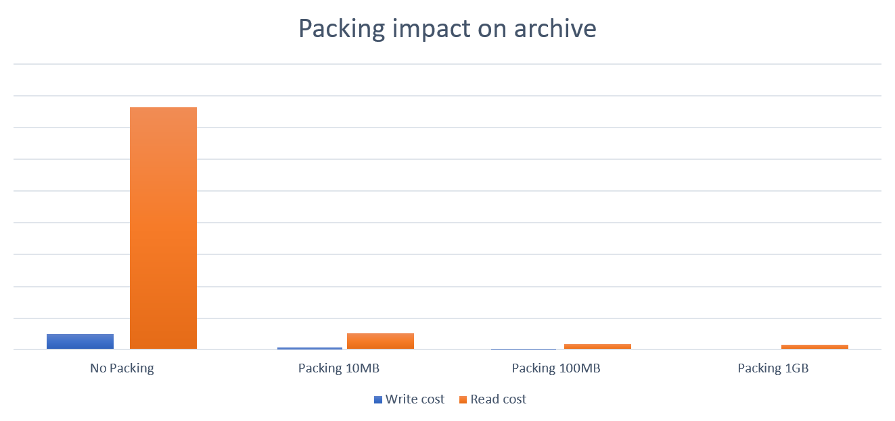

# Best practices for using blob access tiers

This article provides best practice guidelines that help you use access tiers to optimize performance and reduce costs. To learn more about access tiers, see [Access tiers for blob data](access-tiers-overview.md?tabs=azure-portal). 

## Choose the most cost-efficient access tiers

You can reduce costs by placing blob data into the most cost-efficient access tiers. Choose from three tiers that are designed to optimize your costs around data use. For example, the hot tier has a higher storage cost but lower read cost. Therefore, if you plan to access data frequently, the hot tier might be the most cost-efficient choice. If you plan to read data less frequently, the cool, cold or archive tier might make the most sense because it raises the cost of reading data while reducing the cost of storing data.

To identify the most optimal access tier, try to estimate what percentage of the data will be read on a monthly basis. The following chart shows the impact on monthly spending given various read percentages. 

> [!div class="mx-imgBorder"]
> 

To model and analyze the cost of using cool or cold versus archive storage, see [Archive versus cold and cool](archive-cost-estimation.md#archive-versus-cold-and-cool). You can apply similar modeling techniques to compare the cost of hot to cool, cold or archive.

## Migrate data directly to the most cost-efficient access tiers

Choosing the most optimal tier up front can reduce costs. If you change the tier of a block blob that you've already uploaded, then you'll pay the cost of writing to the initial tier when you first upload the blob, and then pay the cost of writing to the desired tier. If you change tiers by using a lifecycle management policy, then that policy will require a day to take effect and a day to complete execution. You'll also incur the capacity cost of storing data in the initial tier prior to the tier change.

- For guidance about how to upload to a specific access tier, see [Set a blob's access tier](access-tiers-online-manage.md). 

- For offline data movement to the desired tier, see [Azure Data Box](https://azure.microsoft.com/products/databox/).

## Move data into the most cost-efficient access tiers

After data is uploaded, you should periodically analyze your containers and blobs to understand how they are stored, organized, and used in production. Then, use lifecycle management policies to move data to the most cost-efficient tiers. For example, data that has not been accessed for more than 30 days might be more cost efficient if placed into the cool tier. Consider archiving data that has not been accessed for over 180 days. 

To gather telemetry, enable [blob inventory reports](blob-inventory.md) and enable [last access time tracking](lifecycle-management-policy-configure.md#optionally-enable-access-time-tracking). Analyze use patterns based on the last access time by using tools such as Azure Synapse or Azure Databricks. To learn about ways to analyze your data, see any of these articles:

- [Tutorial: Analyze blob inventory reports](storage-blob-inventory-report-analytics.md)

- [Calculate blob count and total size per container using Azure Storage inventory](calculate-blob-count-size.md)

- [How to calculate Container Level Statistics in Azure Blob Storage with Azure Databricks](https://techcommunity.microsoft.com/t5/azure-paas-blog/how-to-calculate-container-level-statistics-in-azure-blob/ba-p/3614650)

## Tier append and page blobs

Your analysis might reveal append or page blobs that are not actively used. For example, you might have log files (append blobs) that are no longer being read or written to, but you'd like to store them for compliance reasons. Similarly, you might want to back up disks or disk snapshots (page blobs). You can move these blobs into cooler tiers as well.  However, you must first convert them to block blobs. 

For information about how to convert append and page blobs to block blobs, see [Convert append blobs and page blobs to block blobs](convert-append-and-page-blobs-to-block-blobs.md).

## Pack small files before moving data to cooler tiers

Each read or write operation incurs a cost. To reduce the cost of reading and writing data, consider packing small files into larger ones by using file formats such as TAR or ZIP. Fewer files reduce the number of operations required to transfer data. 

The following chart shows the relative impact of packing files for the cool tier. The read cost assumes a monthly read percentage of 30%.

> [!div class="mx-imgBorder"]
> 

The following chart shows the relative impact of packing files for the archive tier. The read cost assumes a monthly read percentage of 30%.

> [!div class="mx-imgBorder"]
> 

To model and analyze the cost saving of packing files, see **Packing Saving** tab in this [workbook](https://azure.github.io/Storage/docs/backup-and-archive/azure-archive-storage-cost-estimation/azure-archive-storage-cost-estimation.xlsx).

> [!TIP]
> To facilitate search and read scenarios, consider creating an index that maps packed file paths with original file paths, and then storing these indexes as block blobs in the hot tier.

## Next steps

- [Set a blob's access tier](access-tiers-online-manage.md)
- [Archive a blob](archive-blob.md)
- [Optimize costs by automatically managing the data lifecycle](lifecycle-management-overview.md)
- [Estimate the cost of archiving data](archive-cost-estimation.md)
