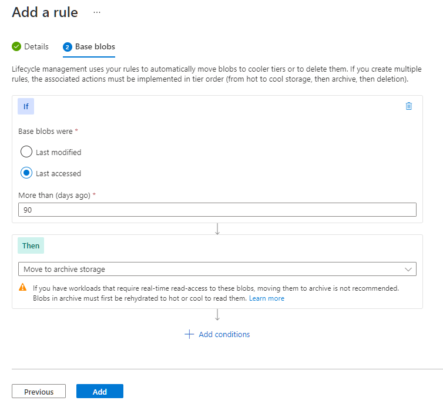
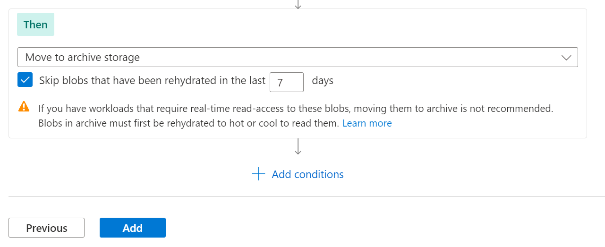

# Archive a blob

The archive tier is an offline tier for storing blob data that is rarely accessed. The archive tier offers the lowest storage costs, but higher data retrieval costs and latency compared to the online tiers (hot and cool). Data must remain in the archive tier for at least 180 days or be subject to an early deletion charge. For more information about the archive tier, see [Archive access tier](access-tiers-overview.md#archive-access-tier).

While a blob is in the archive tier, it can't be read or modified. To read or download a blob in the archive tier, you must first rehydrate it to an online tier, either hot or cool. Data in the archive tier can take up to 15 hours to rehydrate, depending on the priority you specify for the rehydration operation. For more information about blob rehydration, see [Overview of blob rehydration from the archive tier](archive-rehydrate-overview.md).

> [!CAUTION]
> A blob in the archive tier is offline. That is, it cannot be read or modified until it is rehydrated. The rehydration process can take several hours and has associated costs. Before you move data to the archive tier, consider whether taking blob data offline may affect your workflows.

You can use the Azure portal, PowerShell, Azure CLI, or one of the Azure Storage client libraries to manage data archiving.

## Archive blobs on upload

To archive one ore more blob on upload, create the blob directly in the archive tier.

### [Portal](#tab/azure-portal)

To archive a blob or set of blobs on upload from the Azure portal, follow these steps:

1. Navigate to the target container.
1. Select the **Upload** button.
1. Select the file or files to upload.
1. Expand the **Advanced** section, and set the **Access tier** to *Archive*.
1. Select the **Upload** button.

    :::image type="content" source="media/archive-blob/upload-blobs-archive-portal.png" alt-text="Screenshot showing how to upload blobs to the archive tier in the Azure portal.":::

### [PowerShell](#tab/azure-powershell)

To archive a blob or set of blobs on upload with PowerShell, call the [Set-AzStorageBlobContent](/powershell/module/az.storage/set-azstorageblobcontent) command, as shown in the following example. Remember to replace the placeholder values in brackets with your own values:

```azurepowershell
$rgName = <resource-group>
$storageAccount = <storage-account>
$containerName = <container>

# Get context object
$ctx = New-AzStorageContext -StorageAccountName $storageAccount -UseConnectedAccount

# Create new container.
New-AzStorageContainer -Name $containerName -Context $ctx

# Upload a single file named blob1.txt to the archive tier.
Set-AzStorageBlobContent -Container $containerName `
    -File "blob1.txt" `
    -Blob "blob1.txt" `
    -Context $ctx `
    -StandardBlobTier Archive

# Upload the contents of a sample-blobs directory to the archive tier, recursively.
Get-ChildItem -Path "C:\sample-blobs" -File -Recurse | 
    Set-AzStorageBlobContent -Container $containerName `
        -Context $ctx `
        -StandardBlobTier Archive
```

### [Azure CLI](#tab/azure-cli)

To archive a single blob on upload with Azure CLI, call the [az storage blob upload](/cli/azure/storage/blob#az-storage-blob-upload) command, as shown in the following example. Remember to replace the placeholder values in brackets with your own values:

```azurecli
az storage blob upload \
    --account-name <storage-account> \
    --container-name <container> \
    --name <blob> \
    --file <file> \
    --tier Archive \
    --auth-mode login
```

To archive a set of blobs on upload with Azure CLI, call the [az storage blob upload-batch](/cli/azure/storage/blob#az-storage-blob-upload-batch) command, as shown in the following example. Remember to replace the placeholder values in brackets with your own values:

```azurecli
az storage blob upload-batch \
    --destination <container> \
    --source <source-directory> \
    --account-name <storage-account> \
    --tier Archive \
    --auth-mode login
```

### [AzCopy](#tab/azcopy)

To archive a single blob on upload with AzCopy, call the [azcopy copy](../common/storage-ref-azcopy-copy.md) command. Provide a local file as the source and the target blob URI as the destination, and specify the archive tier as the target tier, as shown in the following example. Remember to replace the placeholder values in brackets with your own values:

> [!NOTE]
> This example encloses path arguments with single quotes (''). Use single quotes in all command shells except for the Windows Command Shell (cmd.exe). If you're using a Windows Command Shell (cmd.exe), enclose path arguments with double quotes ("") instead of single quotes (''). <br>This example excludes the SAS token because it assumes that you've provided authorization credentials by using Azure Active Directory (Azure AD).  See the [Get started with AzCopy](../common/storage-use-azcopy-v10.md) article to learn about the ways that you can provide authorization credentials to the storage service.

```azcopy
azcopy copy 'C:\temp\myTextFile.txt' 'https://<storage-account>.blob.core.windows.net/<container>/myTextFile-archived.txt' --blob-type BlockBlob --block-blob-tier Archive
```

For other examples, see [Upload files to Azure Blob storage by using AzCopy](../common/storage-use-azcopy-blobs-upload.md).

---

## Archive an existing blob

You can move an existing blob to the archive tier in one of two ways:

- You can change a blob's tier with the [Set Blob Tier](/rest/api/storageservices/set-blob-tier) operation. **Set Blob Tier** moves a single blob from one tier to another.

    Keep in mind that when you move a blob to the archive tier with **Set Blob Tier**, then you can't read or modify the blob's data until you rehydrate the blob. If you may need to read or modify the blob's data before the early deletion interval has elapsed, then consider using a **Copy Blob** operation to create a copy of the blob in the archive tier.

- You can copy a blob in an online tier to the archive tier with the [Copy Blob](/rest/api/storageservices/copy-blob) operation. You can call the **Copy Blob** operation to copy a blob from an online tier (hot or cool) to the archive tier. The source blob remains in the online tier, and you can continue to read or modify its data in the online tier.

### Archive an existing blob by changing its tier

Use the **Set Blob Tier** operation to move a blob from the Hot or cool tier to the archive tier. The **Set Blob Tier** operation is best for scenarios where you won't need to access the archived data before the early deletion interval has elapsed.

The **Set Blob Tier** operation changes the tier of a single blob. To move a set of blobs to the archive tier with optimum performance, Microsoft recommends performing a bulk archive operation. The bulk archive operation sends a batch of **Set Blob Tier** calls to the service in a single transaction. For more information, see [Bulk archive](#bulk-archive).  

#### [Portal](#tab/azure-portal)

To move an existing blob to the archive tier in the Azure portal, follow these steps:

1. Navigate to the blob's container.
1. Select the blob to archive.
1. Select the **Change tier** button.
1. Select *Archive* from the **Access tier** dropdown.
1. Select **Save**.

    :::image type="content" source="media/archive-blob/set-blob-tier-archive-portal.png" alt-text="Screenshot showing how to set a blob's tier to Archive in the Azure portal":::

#### [PowerShell](#tab/azure-powershell)

To change a blob's tier from hot or cool to Archive with PowerShell, use the blob's **BlobClient** property to return a .NET reference to the blob, then call the **SetAccessTier** method on that reference. Remember to replace placeholders in angle brackets with your own values:

```azurepowershell
# Initialize these variables with your values.
$rgName = "<resource-group>"
$accountName = "<storage-account>"
$containerName = "<container>"
$blobName = "<blob>"

# Get the storage account context
$ctx = (Get-AzStorageAccount `
        -ResourceGroupName $rgName `
        -Name $accountName).Context

# Change the blob's access tier to Archive.
$blob = Get-AzStorageBlob -Container $containerName -Blob $blobName -Context $ctx
$blob.BlobClient.SetAccessTier("Archive", $null)
```

#### [Azure CLI](#tab/azure-cli)

To change a blob's tier from hot or cool to Archive with Azure CLI, call the [az storage blob set-tier](/cli/azure/storage/blob#az-storage-blob-set-tier) command. Remember to replace placeholders in angle brackets with your own values:

```azurecli
az storage blob set-tier \
    --account-name <storage-account> \
    --container-name <container> \
    --name <blob> \
    --tier Archive \
    --auth-mode login
```

### [AzCopy](#tab/azcopy)

To change a blob's tier from hot or cool to Archive, use the [azcopy set-properties](..\common\storage-ref-azcopy-set-properties.md) command and set the `-block-blob-tier` parameter to `archive`. 

> [!IMPORTANT]
> The ability to change a blob's tier by using AzCopy is currently in PREVIEW.
> See the [Supplemental Terms of Use for Microsoft Azure Previews](https://azure.microsoft.com/support/legal/preview-supplemental-terms/) for legal terms that apply to Azure features that are in beta, preview, or otherwise not yet released into general availability.

> [!NOTE]
> This example encloses path arguments with single quotes (''). Use single quotes in all command shells except for the Windows Command Shell (cmd.exe). If you're using a Windows Command Shell (cmd.exe), enclose path arguments with double quotes ("") instead of single quotes (''). <br>This example excludes the SAS token because it assumes that you've provided authorization credentials by using Azure Active Directory (Azure AD).  See the [Get started with AzCopy](../common/storage-use-azcopy-v10.md) article to learn about the ways that you can provide authorization credentials to the storage service.

```azcopy
azcopy set-properties 'https://<storage-account-name>.blob.core.windows.net/<container-name>/<blob-name>' --block-blob-tier=archive
```

To change the access tier for all blobs in a virtual directory, refer to the virtual directory name instead of the blob name, and then append `--recursive=true` to the command.

```azcopy
azcopy set-properties 'https://<storage-account-name>.blob.core.windows.net/<container-name>/myvirtualdirectory' --block-blob-tier=archive --recursive=true
```


---

### Archive an existing blob with a copy operation

Use the [Copy Blob](/rest/api/storageservices/copy-blob) operation to copy a blob from the hot or cool tier to the archive tier. The source blob remains in the hot or cool tier, while the destination blob is created in the archive tier.

A **Copy Blob** operation is best for scenarios where you may need to read or modify the archived data before the early deletion interval has elapsed. You can access the source blob's data without needing to rehydrate the archived blob.

#### [Portal](#tab/azure-portal)

N/A

#### [PowerShell](#tab/azure-powershell)

To copy a blob from an online tier to the archive tier with PowerShell, call the [Start-AzStorageBlobCopy](/powershell/module/az.storage/start-azstorageblobcopy) command and specify the archive tier. Remember to replace placeholders in angle brackets with your own values:

```azurepowershell
# Initialize these variables with your values.
$rgName = "<resource-group>"
$accountName = "<storage-account>"
$srcContainerName = "<source-container>"
$destContainerName = "<dest-container>"
$srcBlobName = "<source-blob>"
$destBlobName = "<dest-blob>"

# Get the storage account context
$ctx = (Get-AzStorageAccount `
        -ResourceGroupName $rgName `
        -Name $accountName).Context

# Copy the source blob to a new destination blob in archive tier.
Start-AzStorageBlobCopy -SrcContainer $srcContainerName `
    -SrcBlob $srcBlobName `
    -DestContainer $destContainerName `
    -DestBlob $destBlobName `
    -StandardBlobTier Archive `
    -Context $ctx
```

#### [Azure CLI](#tab/azure-cli)

To copy a blob from an online tier to the archive tier with Azure CLI, call the [az storage blob copy start](/cli/azure/storage/blob/copy#az-storage-blob-copy-start) command and specify the archive tier. Remember to replace placeholders in angle brackets with your own values:

```azurecli
az storage blob copy start \
    --source-container <source-container> \
    --source-blob <source-blob> \
    --destination-container <dest-container> \
    --destination-blob <dest-blob> \
    --account-name <storage-account> \
    --tier Archive \
    --auth-mode login
```

#### [AzCopy](#tab/azcopy)

To copy a blob from an online tier to the archive tier with AzCopy, specify the URI for the source blob and the URI for the destination blob. The destination blob should have a different name from the source blob, and shouldn't already exist.

> [!NOTE]
> This example encloses path arguments with single quotes (''). Use single quotes in all command shells except for the Windows Command Shell (cmd.exe). If you're using a Windows Command Shell (cmd.exe), enclose path arguments with double quotes ("") instead of single quotes (''). <br>This example excludes the SAS token because it assumes that you've provided authorization credentials by using Azure Active Directory (Azure AD).  See the [Get started with AzCopy](../common/storage-use-azcopy-v10.md) article to learn about the ways that you can provide authorization credentials to the storage service.

Remember to replace placeholders in angle brackets with your own values:

```azcopy
azcopy copy 'https://<source-account>.blob.core.windows.net/sample-container/blob1.txt' 'https://<dest-account>.blob.core.windows.net/sample-container/blob1-archived.txt' --blob-type BlockBlob --block-blob-tier Archive
```

---

## Bulk archive

To move blobs to the archive tier in a container or a folder, enumerate blobs and call the Set Blob Tier operation on each one. The following example shows how to perform this operation:

### [Portal](#tab/azure-portal)

N/A

### [PowerShell](#tab/azure-powershell)

```azurepowershell
# Initialize these variables with your values.
    $rgName = "<resource-group>"
    $accountName = "<storage-account>"
    $containerName = "<container>"
    $folderName = "<folder>/"

    $ctx = (Get-AzStorageAccount -ResourceGroupName $rgName -Name $accountName).Context

    $blobCount = 0
    $Token = $Null
    $MaxReturn = 5000

    do {
        $Blobs = Get-AzStorageBlob -Context $ctx -Container $containerName -Prefix $folderName -MaxCount $MaxReturn -ContinuationToken $Token
        if($Blobs -eq $Null) { break }

        #Set-StrictMode will cause Get-AzureStorageBlob returns result in different data types when there is only one blob
        if($Blobs.GetType().Name -eq "AzureStorageBlob")
        {
            $Token = $Null
        }
        else
        {
            $Token = $Blobs[$Blobs.Count - 1].ContinuationToken;
        }

        $Blobs | ForEach-Object {
                if($_.BlobType -eq "BlockBlob") {
                    $_.BlobClient.SetAccessTier("Archive", $null)
                }
            }
    }
    While ($Token -ne $Null)
    
```

### [Azure CLI](#tab/azure-cli)

```azurecli
az storage blob list --account-name $accountName --account-key $key \
    --container-name $containerName --prefix $folderName \
    --query "[?properties.blobTier == 'Cool'].name" --output tsv \
    | xargs -I {} -P 10 \
    az storage blob set-tier --account-name $accountName --account-key $key \
    --container-name $containerName --tier Archive --name "{}" 
```

### [AzCopy](#tab/azcopy)

N/A

---

When moving a large number of blobs to the archive tier, use a batch operation for optimal performance. A batch operation sends multiple API calls to the service with a single request. The suboperations supported by the [Blob Batch](/rest/api/storageservices/blob-batch) operation include [Delete Blob](/rest/api/storageservices/delete-blob) and [Set Blob Tier](/rest/api/storageservices/set-blob-tier).

> [!NOTE]
> The [Set Blob Tier](/rest/api/storageservices/set-blob-tier) suboperation of the [Blob Batch](/rest/api/storageservices/blob-batch) operation is not yet supported in accounts that have a hierarchical namespace.

To archive blobs with a batch operation, use one of the Azure Storage client libraries. The following code example shows how to perform a basic batch operation with the .NET client library:

:::code language="csharp" source="~/azure-storage-snippets/blobs/howto/dotnet/dotnet-v12/AccessTiers.cs" id="Snippet_BulkArchiveContainerContents":::

For an in-depth sample application that shows how to change tiers with a batch operation, see [AzBulkSetBlobTier](/samples/azure/azbulksetblobtier/azbulksetblobtier/).

## Use lifecycle management policies to archive blobs

You can optimize costs for blob data that is rarely accessed by creating lifecycle management policies that automatically move blobs to the archive tier when they haven't been accessed or modified for a specified period of time. After you configure a lifecycle management policy, Azure Storage runs it once per day. For more information about lifecycle management policies, see [Optimize costs by automatically managing the data lifecycle](lifecycle-management-overview.md).

You can use the Azure portal, PowerShell, Azure CLI, or an Azure Resource Manager template to create a lifecycle management policy. For simplicity, this section shows how to create a lifecycle management policy in the Azure portal only. For more examples showing how to create lifecycle management policies, see [Configure a lifecycle management policy](lifecycle-management-policy-configure.md).

> [!CAUTION]
> Before you use a lifecycle management policy to move data to the archive tier, verify that that data does not need to be deleted or moved to another tier for at least 180 days. Data that is deleted or moved to a different tier before the 180 day period has elapsed is subject to an early deletion fee.
>
> Also keep in mind that data in the archive tier must be rehydrated before it can be read or modified. Rehydrating a blob from the archive tier can take several hours and has associated costs.

To create a lifecycle management policy to archive blobs in the Azure portal, follow these steps:

#### Step 1: Create the rule and specify the blob type

1. Navigate to your storage account in the portal.

2. Under **Data management**, locate the **Lifecycle management** settings.

3. Select the **Add a rule** button.

4. On the **Details** tab, specify a name for your rule.

5. Specify the rule scope: either **Apply rule to all blobs in your storage account**, or **Limit blobs with filters**.

6. Select the types of blobs for which the rule is to be applied, and specify whether to include blob snapshots or versions.

    :::image type="content" source="media/archive-blob/lifecycle-policy-details-tab-portal.png" alt-text="Screenshot showing how to configure a lifecycle management policy - Details tab.":::

#### Step 2: Add rule conditions

1. Depending on your selections, you can configure rules for base blobs (current versions), previous versions, or blob snapshots. Specify one of two conditions to check for:

    - Objects were last modified some number of days ago.
    - Objects were created some number of days ago.
    - Objects were last accessed some number of days ago.

    Only one of these conditions can be applied to move a particular type of object to the archive tier per rule. For example, if you define an action that archives base blobs if they haven't been modified for 90 days, then you can't also define an action that archives base blobs if they haven't been accessed for 90 days. Similarly, you can define one action per rule with either of these conditions to archive previous versions, and one to archive snapshots.

8. Next, specify the number of days to elapse after the object is modified or accessed.

9. Specify that the object is to be moved to the archive tier after the interval has elapsed.

    > [!div class="mx-imgBorder"]
    > 

10. If you chose to limit the blobs affected by the rule with filters, you can specify a filter, either with a blob prefix or blob index match.
   
#### Step 3: Ensure that the rule excludes rehydrated blobs

If you rehydrate a blob by changing its tier, this rule will move the blob back to the archive tier if the last modified time, creation time, or last access time is beyond the threshold set for the policy. 

If you selected the **Last modified** rule condition, you can prevent this from happening by selecting **Skip blobs that have been rehydrated in the last**, and then entering the number of days you want a rehydrated blob to be excluded from this rule.

> [!div class="mx-imgBorder"]
> 

> [!NOTE]
> This option appears only if you selected the **Last modified** rule condition.

Select the **Add** button to add the rule to the policy.


#### View the policy JSON

After you create the lifecycle management policy, you can view the JSON for the policy on the **Lifecycle management** page by switching from **List view** to **Code view**.

Here's the JSON for the simple lifecycle management policy created in the images shown above:

```json
{
  "rules": [
    {
      "enabled": true,
      "name": "sample-archive-rule",
      "type": "Lifecycle",
      "definition": {
        "actions": {
          "baseBlob": {
            "tierToArchive": {
              "daysAfterLastAccessTimeGreaterThan": 90,
              "daysAfterLastTierChangeGreaterThan": 7
            }
          }
        },
        "filters": {
          "blobTypes": [
            "blockBlob"
          ]
        }
      }
    }
  ]
}
```

## See also

- [Hot, cool, and archive access tiers for blob data](access-tiers-overview.md)
- [Blob rehydration from the archive tier](archive-rehydrate-overview.md)
- [Rehydrate an archived blob to an online tier](archive-rehydrate-to-online-tier.md)
