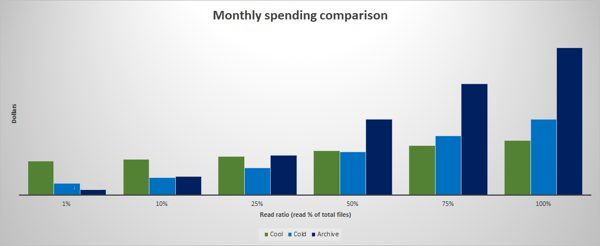

# Estimate the cost of archiving data

The archive tier is an offline tier for storing data that is rarely accessed. The archive access tier has the lowest storage cost. However, this tier has higher data retrieval costs with a higher latency as compared to the hot, cool and cold tiers. 

This article explains how to calculate the cost of using archive storage and then presents a few example scenarios. 

## Calculate costs

The cost to archive data is derived from these three components:

- Cost to write data to the archive tier
- Cost to store data in the archive tier
- Cost to rehydrate data from the archive tier

The following sections show you how to calculate each component.

This article uses fictitious prices in all calculations. You can find these sample prices in the [Sample prices](#sample-prices) section at the end of this article. These prices are meant only as examples, and shouldn't be used to calculate your costs.

For official prices, see [Azure Blob Storage pricing](https://azure.microsoft.com/pricing/details/storage/blobs/) or [Azure Data Lake Storage pricing](https://azure.microsoft.com/pricing/details/storage/data-lake/). For more information about how to choose the correct pricing page, see [Understand the full billing model for Azure Blob Storage](../common/storage-plan-manage-costs.md).

#### The cost to write

You can calculate the cost of writing to the archive tier by multiplying the <u>number of write operations</u> by the <u>price of each operation</u>. The price of an operation depends on which ones you use to write data to the archive tier.

###### Put Blob

If you use the [Put Blob](/rest/api/storageservices/put-blob) operation, then the number of operations is the same as the number of blobs. For example, if you plan to write 30,000 blobs to the archive tier, then that will require 30,000 operations. Each operation is charged the price of an **archive** write operation. 

> [!TIP]
> Operations are billed per 10,000. Therefore, if the price per 10,000 operations is $0.10, then the price of a single operation is $0.10 / 10,000 = $0.00001. 

###### Put Block and Put Block List

If you upload a blob by using the [Put Block](/rest/api/storageservices/put-block) and [Put Block List](/rest/api/storageservices/put-block-list) operations, then an upload will require multiple operations, and each of those operations are charged separately. Each [Put Block](/rest/api/storageservices/put-block) operation is charged at the price of a **hot** write operation. The number of [Put Block](/rest/api/storageservices/put-block) operations that you need depends on the block size that you specify to upload the data. For example, if the blob size is 100 MiB and you choose block size to 10 MiB when you upload that blob, you would use 10 [Put Block](/rest/api/storageservices/put-block) operations. Blocks are written (committed) to the archive tier by using the [Put Block List](/rest/api/storageservices/put-block-list) operation. That operation is charged the price of an **archive** write operation. Therefore, to upload a single blob, your cost is (<u>number of blocks</u> * <u>price of a hot write operation) + price of an archive write operation</u>.

> [!NOTE]
> If you're not using an SDK or the REST API directly, you might have to investigate which operations your data transfer tool is using to upload files. You might be able to determine this by reaching out the tool provider or by using storage logs. 

###### Set Blob Tier

If you use the [Set Blob Tier](/rest/api/storageservices/set-blob-tier) operation to move a blob from the cool, cold, or hot tier to the archive tier, you're charged the price of an **archive** write operation. 

#### The cost to store

You can calculate the storage costs by multiplying the <u>size of the data</u> in GB by the <u>price of archive storage</u>.

For example (assuming the sample pricing), if you plan to store 10 TB archived blobs, the capacity cost is $0.00099 * 10 * 1024 = $10.14 per month. 

#### The cost to rehydrate

Blobs in the archive tier are offline and can't be read or modified. To read or modify data in an archived blob, you must first rehydrate the blob to an online tier (either the hot cool, or cold tier). 

You can calculate the cost to rehydrate data by adding the <u>cost to retrieve data</u> to the <u>cost of reading the data</u>.

Assuming sample pricing, the cost of retrieving 1 GB of data from the archive tier would be 1 * $0.02 = $0.02. 

Read operations are billed per 10,000. Therefore, if the cost per 10,000 operations is $5.00, then the cost of a single operation is $5.00 / 10,000 = $0.0005. The cost of reading 1000 blobs at standard priority is 1000 * $0.0005 = $0.50.

In this example, the total cost to rehydrate (retrieving + reading) would be $0.02 + $0.50 = $0.52.

> [!NOTE]
> If you set the rehydration priority to high, then the data retrieval and read rates increase.

If you plan to rehydrate data, you should try to avoid an early deletion fee. To review your options, see [Blob rehydration from the Archive tier](archive-rehydrate-overview.md).

## Scenario: One-time data backup

This scenario assumes that you plan to remove on-premises tapes or file servers by migrating backup data to cloud storage. If you don't expect users to access that data often, then it might make sense to migrate that data directly to the archive tier. In the first month, you'd assume the cost of writing data to the archive tier. In the remaining months, you'd pay only for the cost to store the data and the cost to rehydrate data as needed for the occasional read operation.

Using the [Sample prices](#sample-prices) that appear in this article, the following table demonstrates three months of spending. 

This scenario assumes an initial ingest of 2,000,000 files totaling 102,400 GB in size to archive. It also assumes one-time read each month of about 1% of archived capacity. The operation used this scenario is the [Put Blob](/rest/api/storageservices/put-blob) operation. 

 
<table>
    <tr>
        <th>Cost factor</th>
        <th>January</th>
        <th>February</th>
        <th>March</th>
        <th>Projected annual</th>
    </tr>
    <tr>
        <td>Write transactions</td>
        <td>2,000,000</td>
        <td>0</td>
        <td>0</td>
        <td>2,000,000</td>
    </tr>
    <tr>
        <td>Price of a single write operation</td>
        <td>$0.00001</td>
        <td>$0.00001</td>
        <td>$0.00001</td>
        <td>$0.00001</td>
    </tr>
    <tr>
        <td><strong>Cost to write (transactions * price of a write operation)</strong></td>
        <td><strong>$20.00</strong></td>
        <td><strong>$0.00</strong></td>
        <td><strong>$0.00</strong></td>
        <td><strong>$20.00</strong></td>
    </tr>
    <tr>
        <td>Total file size (GB)</td>
        <td>102,400</td>
        <td>102,400</td>
        <td>102,400</td>
        <td>1,228,800</td>
    </tr>
    <tr>
        <td>Data prices (pay-as-you-go)</td>
        <td>$0.00099</td>
        <td>$0.00099</td>
        <td>$0.00099</td>
        <td>$0.00099</td>
    </tr>
    <tr>
        <td><strong>Cost to store (file size * data price)</strong></td>
        <td><strong>$101.38</strong></td>
        <td><strong>$101.38</strong></td>
        <td><strong>$101.38</strong></td>
        <td><strong>$1,216.51</strong></td>
    </tr>
    <tr>
        <td>Data retrieval size</td>
        <td>1,024</td>
        <td>1,024</td>
        <td>1,024</td>
        <td>12,288</td>
    </tr>
    <tr>
        <td>Price of data retrieval</td>
        <td>$0.02</td>
        <td>$0.02</td>
        <td>$0.02</td>
        <td>$0.02</td>
    </tr>
    <tr>
        <td>Number of read transactions (File count * 1%)</td>
        <td>20,000</td>
        <td>20,000</td>
        <td>20,000</td>
        <td>240,000</td>
    </tr>
    <tr>
        <td>Price of a single read operation</td>
        <td>$0.0005</td>
        <td>$0.0005</td>
        <td>$0.0005</td>
        <td>$0.0005</td>
    </tr>
    <tr>
        <td><strong>Cost to rehydrate (cost to retrieve + cost to read)</strong></td>
        <td><strong>$30.48</strong></td>
        <td><strong>$30.48</strong></td>
        <td><strong>$30.48</strong></td>
        <td><strong>$365.76</strong></td>
    </tr>
    <tr>
        <td><strong>Total cost</strong></td>
        <td><strong>$151.86</strong></td>
        <td><strong>$131.86</strong></td>
        <td><strong>$131.86</strong></td>
        <td><strong>$1,602.27</strong></td>
    </tr>
</table>

> [!TIP]
> To view these costs over 12 months, open the **One-Time Backup** tab of this [workbook](https://azure.github.io/Storage/docs/backup-and-archive/azure-archive-storage-cost-estimation/azure-archive-storage-cost-estimation.xlsx). You can modify the values in that worksheet to estimate your costs. 

## Scenario: Continuous tiering

This scenario assumes that you plan to periodically move data to the archive tier. Perhaps you're using [Blob Storage inventory reports](blob-inventory.md) to gauge which blobs are accessed less frequently, and then using [lifecycle management policies](lifecycle-management-overview.md) to automate the archival process.

Each month, you'd assume the cost of writing to the archive tier. The cost to store and then rehydrate data would increase over time as you archive more blobs. 

Using the [Sample prices](#sample-prices) that appear in this article, the following table demonstrates three months of spending. 

This scenario assumes a monthly ingest of 200,000 files totaling 10,240 GB in size to archive. It also assumes a one-time read each month of about 1% of archived capacity. The operation used this scenario is the [Put Blob](/rest/api/storageservices/put-blob) operation. 
  

<table>
    <tr>
        <th>Cost factor</th>
        <th>January</th>
        <th>February</th>
        <th>March</th>
        <th>Projected annual</th>
    </tr>
    <tr>
        <td>Write transactions</td>
        <td>200,000</td>
        <td>200,000</td>
        <td>200,000</td>
        <td>2,400,000</td>
    </tr>
    <tr>
        <td>Price of a single write operation</td>
        <td>$0.00001</td>
        <td>$0.00001</td>
        <td>$0.00001</td>
        <td>$0.00001</td>
    </tr>
    <tr>
        <td><strong>Cost to write (transactions * price of a write operation)</></strong></td>
        <td><strong>$2.00</strong></td>
        <td><strong>$2.00</strong></td>
        <td><strong>$2.00</strong></td>
        <td><strong>$24.00</strong></td>
    </tr>
    <tr>
        <td>Total file size (GB)</td>
        <td>10,240</td>
        <td>20,480</td>
        <td>39,720</td>
        <td>122,880</td>
    </tr>
    <tr>
        <td>Data prices (pay-as-you-go)</td>
        <td>$0.00099</td>
        <td>$0.00099</td>
        <td>$0.00099</td>
        <td>$0.00099</td>
    </tr>
    <tr>
        <td><strong>Cost to store (file size * data price)</strong></td>
        <td><strong>$10.14</strong></td>
        <td><strong>20.28</></td>
        <td><strong>$30.41</></td>
        <td><strong>$790.73</strong></td>
    </tr>
    <tr>
        <td>Price of data retrieval</td>
        <td>$0.02</td>
        <td>$0.02</td>
        <td>$0.02</td>
        <td>$0.02</td>
    </tr>
    <tr>
        <td>Number of read transactions (File count * 1% storage read)</td>
        <td>2,000</td>
        <td>4,000</td>
        <td>6,000</td>
        <td>156,000</td>
    </tr>
    <tr>
        <td>Price of a single read operation</td>
        <td>$0.0005</td>
        <td>$0.0005</td>
        <td>$0.0005</td>
        <td>$0.0005</td>
    </tr>
    <tr>
        <td><strong>Cost to rehydrate (cost to retrieve + cost to read)</strong></td>
        <td><strong>$3.05</strong></td>
        <td><strong>$6.10</strong></td>
        <td><strong>$9.14</strong></td>
        <td><strong>$237.74</strong></td>
    </tr>
    <tr>
        <td><strong>Total cost</strong></td>
        <td><strong>$15.19</strong></td>
        <td><strong>$28.37</strong></td>
        <td><strong>$41.56</strong></td>
        <td><strong>$1,052.48</strong></td>
    </tr>
</table>

> [!TIP]
> To view these costs over 12 months, open the **Continuous Tiering** tab of this [workbook](https://azure.github.io/Storage/docs/backup-and-archive/azure-archive-storage-cost-estimation/azure-archive-storage-cost-estimation.xlsx). You can modify the values in that worksheet to estimate your costs. 

## Archive versus cold and cool

Archive storage is the lowest cost tier. However, it can take up to 15 hours to rehydrate 10 GiB files. To learn more, see [Blob rehydration from the Archive tier](archive-rehydrate-overview.md). The archive tier might not be the best fit if your workloads must read data quickly. The cool tier offers a near real-time read latency with a lower price than that the hot tier. Understanding your access requirements will help you to choose between the cool, cold, and archive tiers.

The following table compares the cost of archive storage with the cost of cool and cold storage by using the [Sample prices](#sample-prices) that appear in this article. This scenario assumes a monthly ingest of 200,000 files totaling 10,240 GB in size to archive. It also assumes 1 read each month about 10% of stored capacity (1024 GB), and 10% of total transactions (20,000).
  

<table>
    <tr>
        <th>Cost factor</th>
        <th>Archive</th>
        <th>Cold</th>
        <th>Cool</th>
    </tr>
    <tr>
        <td>Write transactions</td>
        <td>200,000</td>
        <td>200,000</td>
        <td>200,000</td>
    </tr>
    <tr>
        <td>Price of a single write operation</td>
        <td>$0.00001</td>
        <td>$0.000018</td>
        <td>$0.00001</td>
    </tr>
    <tr>
        <td><strong>Cost to write (transactions * price of a write operation)</strong></td>
        <td><strong>$2.00</strong></td>
        <td><strong>$3.60</strong></td>
        <td><strong>$2.00</strong></td>
    </tr>
    <tr>
        <td>Total file size (GB)</td>
        <td>10,240</td>
        <td>10,240</td>
        <td>10,240</td>
    </tr>
    <tr>
        <td>Data prices (pay-as-you-go)</td>
        <td>$0.00099</td>
        <td>$0.0036</td>
        <td>$0.0152</td>
    </tr>
    <tr>
        <td><strong>Cost to store (file size * data price)</strong></td>
        <td><strong>$10.14</strong></td>
        <td><strong>$36.86</strong></td>
        <td><strong>$155.65</strong></td>
    </tr>    
    <tr>
        <td>Data retrieval size</td>
        <td>1,024</td>
        <td>1,024</td>
        <td>1,024</td>
    </tr>
    <tr>
        <td>Price of data retrieval per GB</td>
        <td>$0.02</td>
        <td>$0.03</td>
        <td>$0.01</td>
    </tr>
    <tr>
        <td>Number of read transactions</td>
        <td>20,000</td>
        <td>20,000</td>
        <td>20,000</td>
    </tr>
    <tr>
        <td>Price of a single read operation</td>
        <td>$0.0005</td>
        <td>$0.00001</td>
        <td>$0.000001</td>
    </tr>
    <tr>
        <td><strong>Cost to rehydrate (cost to retrieve + cost to read)</strong></td>
        <td><strong>$30.48</strong></td>
        <td><strong>$30.92</strong></td>
        <td><strong>$10.26</strong></td>
    </tr>
    <tr>
        <td><strong>Monthly cost</strong></td>
        <td><strong>$42.62</strong></td>
        <td><strong>$71.38</strong></td>
        <td><strong>$167.91</strong></td>
    </tr>
</table>

> [!TIP]
> To view live formula of these costs, open the **Choose Tiers** tab of this [workbook](https://azure.github.io/Storage/docs/backup-and-archive/azure-archive-storage-cost-estimation/azure-archive-storage-cost-estimation.xlsx). You can modify the values in that worksheet to estimate your costs. 

The following chart shows the impact on monthly spending given various read percentages. This chart assumes a monthly ingest of 1,000,000 files totaling 10,240 GB in size.

For example, the second pair of bars assumes that workloads read 100,000 files (**10%** of 1,000,000 files) and 1,024 GB (**10%** of 10,240 GB). Assuming the sample pricing, the estimated monthly cost of cool storage is **$175.99** and the estimated monthly cost of archive storage is **$90.62**.

This chart shows a break-even point at or around the 25% read level. After that level, the cost of archive storage begins to rise relative to the cost of cool storage.

> [!div class="mx-imgBorder"]
> 

## Sample prices

This article uses the following fictitious prices. 

> [!IMPORTANT]
> These prices are meant only as examples, and should not be used to calculate your costs.

| Price factor                                          | Archive  | Cold      | Cool      |
|-------------------------------------------------------|----------|-----------|-----------|
| Price of write transactions (per 10,000)              | $0.10    | $0.18     | $0.10     |
| Price of a single write operation (cost / 10,000)     | $0.00001 | $0.000018 | $0.00001  |
| Data prices (pay-as-you-go)                           | $0.00099 | $0.0036   | $0.0152   |
| Price of read transactions (per 10,000)               | $5.00    | $0.10     | $0.01     |
| Price of a single read operation (cost / 10,000)      | $0.0005  | $0.00001  | $0.000001 |
| Price of high priority read transactions (per 10,000) | $50.00   | N/A       | N/A       |
| Price of data retrieval (per GB)                      | $0.02    | $0.03     | $0.01     |
| Price of high priority data retrieval (per GB)        | $0.10    | N/A       | N/A       |

For official prices, see [Azure Blob Storage pricing](https://azure.microsoft.com/pricing/details/storage/blobs/) or [Azure Data Lake Storage pricing](https://azure.microsoft.com/pricing/details/storage/data-lake/). 

For more information about how to choose the correct pricing page, see [Understand the full billing model for Azure Blob Storage](../common/storage-plan-manage-costs.md).

## Next steps

- [Set a blob's access tier](access-tiers-online-manage.md)
- [Archive a blob](archive-blob.md)
- [Optimize costs by automatically managing the data lifecycle](lifecycle-management-overview.md)
