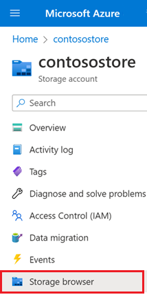
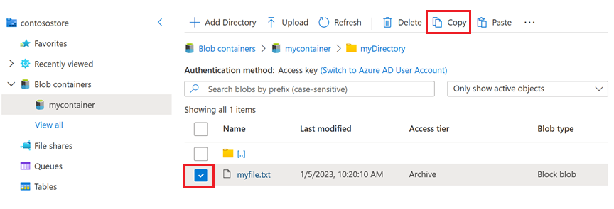
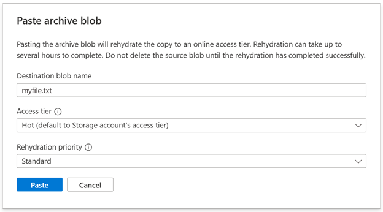
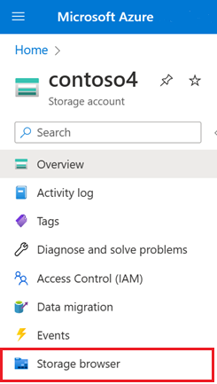
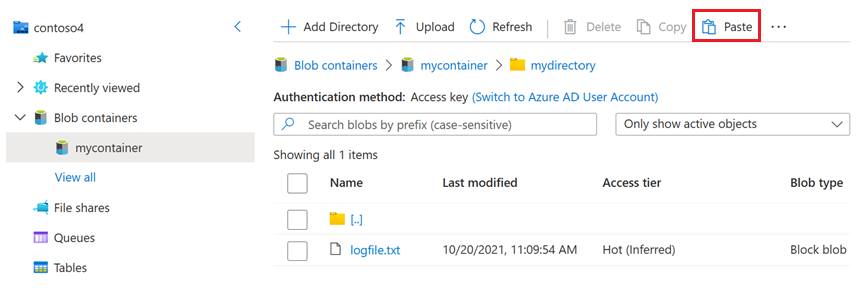

# Rehydrate an archived blob to an online tier

To read a blob that is in the archive tier, you must first rehydrate the blob to an online tier (hot or cool) tier. You can rehydrate a blob in one of two ways:

- By copying it to a new blob in the hot or cool tier with the [Copy Blob](/rest/api/storageservices/copy-blob) operation. 
- By changing its tier from archive to hot or cool with the [Set Blob Tier](/rest/api/storageservices/set-blob-tier) operation.

When you rehydrate a blob, you can specify the priority for the operation to either standard priority or high priority. A standard-priority rehydration operation may take up to 15 hours to complete. A high-priority operation is prioritized over standard-priority requests and may complete in less than one hour for objects under 10 GB in size. You can change the rehydration priority from *Standard* to *High* while the operation is pending.

You can configure Azure Event Grid to fire an event when rehydration is complete and run application code in response. To learn how to handle an event that runs an Azure Function when the blob rehydration operation is complete, see [Run an Azure Function in response to a blob rehydration event](archive-rehydrate-handle-event.md).

For more information about rehydrating a blob, see [Blob rehydration from the archive tier](archive-rehydrate-overview.md).

## Rehydrate a blob with a copy operation

To rehydrate a blob from the archive tier by copying it to an online tier, use the Azure portal, PowerShell, Azure CLI, or one of the Azure Storage client libraries. Keep in mind that when you copy an archived blob to an online tier, the source and destination blobs must have different names.

Copying an archived blob to an online destination tier is supported within the same storage account. Beginning with service version 2021-02-12, you can copy an archived blob to a different storage account, as long as the destination account is in the same region as the source account.

After the copy operation is complete, the destination blob appears in the archive tier. The destination blob is then rehydrated to the online tier that you specified in the copy operation. When the destination blob is fully rehydrated, it becomes available in the new online tier.

### Rehydrate a blob to the same storage account

The following examples show how to copy an archived blob to a blob in the hot tier in the same storage account.

#### [Portal](#tab/azure-portal)

1. Navigate to the source storage account in the Azure portal.

2. In the navigation pane for the storage account, select **Storage browser**.

   > [!div class="mx-imgBorder"]
   > 

3. In storage browser, navigate to the location of the archived blob, select the checkbox that appears beside the blob, and then select the **Copy** button. 

   > [!div class="mx-imgBorder"]
   > 

4. Navigate to the container where you would like to place the rehydrated blob, and then select the **Paste** button.

   The **Paste archive blob** dialog box appears.

   > [!div class="mx-imgBorder"]
   > 

   > [!NOTE]
   > If you select the **Paste** button while in the same location as the source blob, then the default name that appears in the **Destination blob name** field contains a numeric suffix. This ensures that the source and destination blobs have different names. You can change this name if you want as long as the name is different than the name of the source blob.

5. In the **Paste archive blob** dialog box, choose an access tier and a rehydration priority. Then, select **Paste** to rehydrate the blob.

   > [!IMPORTANT]
   > Don't delete the source blob while it is rehydrating.


#### [PowerShell](#tab/azure-powershell)

To copy an archived blob to an online tier with PowerShell, call the [Start-AzStorageBlobCopy](/powershell/module/az.storage/start-azstorageblobcopy) command and specify the target tier and the rehydration priority. Remember to replace placeholders in angle brackets with your own values:

```azurepowershell
# Initialize these variables with your values.
$rgName = "<resource-group>"
$accountName = "<storage-account>"
$srcContainerName = "<source-container>"
$destContainerName = "<dest-container>"
$srcBlobName = "<source-blob>"
$destBlobName = "<dest-blob>"

# Get the storage account context
$ctx = (Get-AzStorageAccount `
        -ResourceGroupName $rgName `
        -Name $accountName).Context

# Copy the source blob to a new destination blob in hot tier with Standard priority.
Start-AzStorageBlobCopy -SrcContainer $srcContainerName `
    -SrcBlob $srcBlobName `
    -DestContainer $destContainerName `
    -DestBlob $destBlobName `
    -StandardBlobTier Hot `
    -RehydratePriority Standard `
    -Context $ctx
```

#### [Azure CLI](#tab/azure-cli)

To copy an archived blob to an online tier with Azure CLI, call the [az storage blob copy start](/cli/azure/storage/blob/copy#az-storage-blob-copy-start) command and specify the target tier and the rehydration priority. Remember to replace placeholders in angle brackets with your own values:

```azurecli
az storage blob copy start \
    --source-container <source-container> \
    --source-blob <source-blob> \
    --destination-container <dest-container> \
    --destination-blob <dest-blob> \
    --account-name <storage-account> \
    --tier hot \
    --rehydrate-priority standard \
    --auth-mode login
```

#### [AzCopy](#tab/azcopy)

N/A

---

### Rehydrate a blob to a different storage account in the same region

The following examples show how to copy an archived blob to a blob in the hot tier in a different storage account.

> [!NOTE]
> The destination and source account must be in the same region.

#### [Portal](#tab/azure-portal)

1. Navigate to the source storage account in the Azure portal.

2. In the navigation pane for the storage account, select **Storage browser**.

   > [!div class="mx-imgBorder"]
   > 

3. In storage browser, navigate to the location of the archived blob, select the checkbox that appears beside the blob, and then select the **Copy** button. 

   > [!div class="mx-imgBorder"]
   > 

4. Navigate to the destination storage account, and in the navigation pane, select **Storage browser**.

   > [!div class="mx-imgBorder"]
   > 

1. Navigate to the container where you would like to place the rehydrated blob, and then select the **Paste** button.

   > [!div class="mx-imgBorder"]
   > 

   The **Paste archive blob** dialog box appears.

   > [!div class="mx-imgBorder"]
   > 

5. In the **Paste archive blob** dialog box, choose an access tier and a rehydration priority. Then, select **Paste** to rehydrate the blob.

   > [!IMPORTANT]
   > Don't delete the source blob while it is rehydrating.

#### [PowerShell](#tab/azure-powershell)

To copy an archived blob to a blob in an online tier in a different storage account with PowerShell, make sure you've installed the [Az.Storage](https://www.powershellgallery.com/packages/Az.Storage/) module, version 4.4.0 or higher. Next, call the [Start-AzStorageBlobCopy](/powershell/module/az.storage/start-azstorageblobcopy) command and specify the target online tier and the rehydration priority. You must specify a shared access signature (SAS) with read permissions for the archived source blob.

The following example shows how to copy an archived blob to the hot tier in a different storage account. Remember to replace placeholders in angle brackets with your own values:


```powershell
$rgName = "<resource-group>"
$srcAccount = "<source-account>"
$destAccount = "<dest-account>"
$srcContainer = "<source-container>"
$destContainer = "<dest-container>" 
$srcBlob = "<source-blob>"
$destBlob = "<destination-blob>"

# Get the destination account context
$destCtx = New-AzStorageContext -StorageAccountName $destAccount -UseConnectedAccount

# Get the source account context
$srcCtx = New-AzStorageContext -StorageAccountName $srcAccount -UseConnectedAccount

# Get the SAS URI for the source blob
$srcBlobUri = New-AzStorageBlobSASToken -Container $srcContainer `
    -Blob $srcBlob `
    -Permission rwd `
    -ExpiryTime (Get-Date).AddDays(1) `
    -FullUri `
    -Context $srcCtx

# Start the cross-account copy operation
Start-AzStorageBlobCopy -AbsoluteUri $srcBlobUri `
    -DestContainer $destContainer `
    -DestBlob $destBlob `
    -DestContext $destCtx `
    -StandardBlobTier Hot `
    -RehydratePriority Standard
```

#### [Azure CLI](#tab/azure-cli)

To copy an archived blob to a blob in an online tier in a different storage account with the Azure CLI, make sure you have installed version 2.35.0 or higher. Next, call the [az storage blob copy start](/cli/azure/storage/blob/copy#az-storage-blob-copy-start) command and specify the target online tier and the rehydration priority. You must specify a shared access signature (SAS) with read permissions for the archived source blob.

The following example shows how to copy an archived blob to the hot tier in a different storage account. Remember to replace placeholders in angle brackets with your own values:

```azurecli
# Specify the expiry interval
end=`date -u -d "1 day" '+%Y-%m-%dT%H:%MZ'`

# Get a SAS for the source blob
srcBlobUri=$(az storage blob generate-sas \
            --account-name <source-account> \ 
            --container <source-container> \
            --name <archived-source-blob> \
            --permissions rwd \
            --expiry $end \
            --https-only \
            --full-uri \
            --as-user \
            --auth-mode login | tr -d '"')

# Copy to the destination blob in the hot tier
az storage blob copy start \
    --source-uri $srcBlobUri \
    --account-name <dest-account> \
    --destination-container <dest-container> \
    --destination-blob <dest-blob> \
    --tier Hot \
    --rehydrate-priority Standard \
    --auth-mode login
```

#### [AzCopy](#tab/azcopy)

N/A

---

#### Rehydrate from a secondary region

If you've configured your storage account to use read-access geo-redundant storage (RA-GRS), then you can copy an archived blob that is located in a secondary region to an online tier in a different storage account that is located in that same secondary region. 

To rehydrate from a secondary region, use the same guidance that is presented in the previous section ([Rehydrate a blob to a different storage account in the same region](#rehydrate-a-blob-to-a-different-storage-account-in-the-same-region). Append the suffix `–secondary` to the account name of the source endpoint. For example, if your primary endpoint for Blob storage is `myaccount.blob.core.windows.net`, then the secondary endpoint is `myaccount-secondary.blob.core.windows.net`. The account access keys for your storage account are the same for both the primary and secondary endpoints.

To learn more about obtaining read access to secondary regions, see [Read access to data in the secondary region](../common/storage-redundancy.md?toc=/azure/storage/blobs/toc.json#read-access-to-data-in-the-secondary-region).

## Rehydrate a blob by changing its tier

To rehydrate a blob by changing its tier from archive to hot or cool, use the Azure portal, PowerShell, or Azure CLI.

### [Portal](#tab/azure-portal)

To change a blob's tier from archive to hot or cool in the Azure portal, follow these steps:

1. Locate the blob to rehydrate in the Azure portal.
1. Select the **More** button on the right side of the page.
1. Select **Change tier**.
1. Select the target access tier from the **Access tier** dropdown.
1. From the **Rehydrate priority** dropdown, select the desired rehydration priority. Keep in mind that setting the rehydration priority to *High* typically results in a faster rehydration, but also incurs a greater cost.

    :::image type="content" source="media/archive-rehydrate-to-online-tier/rehydrate-change-tier-portal.png" alt-text="Screenshot showing how to rehydrate a blob from the archive tier in the Azure portal. ":::

1. Select the **Save** button.

### [PowerShell](#tab/azure-powershell)

To change a blob's tier from archive to hot or cool with PowerShell, use the blob's **BlobClient** property to return a .NET reference to the blob, then call the **SetAccessTier** method on that reference. Remember to replace placeholders in angle brackets with your own values:

```azurepowershell
# Initialize these variables with your values.
$rgName = "<resource-group>"
$accountName = "<storage-account>"
$containerName = "<container>"
$blobName = "<archived-blob>"

# Get the storage account context
$ctx = (Get-AzStorageAccount `
        -ResourceGroupName $rgName `
        -Name $accountName).Context

# Change the blob's access tier to hot with Standard priority.
$blob = Get-AzStorageBlob -Container $containerName -Blob $blobName -Context $ctx
$blob.BlobClient.SetAccessTier("Hot", $null, "Standard")
```

### [Azure CLI](#tab/azure-cli)

To change a blob's tier from archive to hot or cool with Azure CLI, call the [az storage blob set-tier](/cli/azure/storage/blob#az-storage-blob-set-tier) command. Remember to replace placeholders in angle brackets with your own values:

```azurecli
az storage blob set-tier \
    --account-name <storage-account> \
    --container-name <container> \
    --name <archived-blob> \
    --tier Hot \
    --rehydrate-priority Standard \
    --auth-mode login
```

### [AzCopy](#tab/azcopy)

To change a blob's tier from archive to hot or cool with AzCopy, use the [azcopy set-properties](..\common\storage-ref-azcopy-set-properties.md) command and set the `-block-blob-tier` parameter to the desired tier, and the `--rehydrate-priority` to `standard` or `high`. By default, this parameter is set to `standard`. To learn more about the trade offs of each option, see [Rehydration priority](archive-rehydrate-overview.md#rehydration-priority). 

> [!IMPORTANT]
> The ability to change a blob's tier by using AzCopy is currently in PREVIEW.
> See the [Supplemental Terms of Use for Microsoft Azure Previews](https://azure.microsoft.com/support/legal/preview-supplemental-terms/) for legal terms that apply to Azure features that are in beta, preview, or otherwise not yet released into general availability.

> [!NOTE]
> This example encloses path arguments with single quotes (''). Use single quotes in all command shells except for the Windows Command Shell (cmd.exe). If you're using a Windows Command Shell (cmd.exe), enclose path arguments with double quotes ("") instead of single quotes (''). <br>This example also contains no SAS token because it assumes that you've provided authorization credentials by using Azure Active Directory (Azure AD).  See the [Get started with AzCopy](../common/storage-use-azcopy-v10.md) article to learn about the ways that you can provide authorization credentials to the storage service.

```azcopy
azcopy set-properties 'https://<storage-account-name>.blob.core.windows.net/<container-name>/<blob-name>' --block-blob-tier=hot --rehydrate-priority=high
```

---

## Bulk rehydrate a set of blobs

To rehydrate archived blobs in a container or folder to the hot or cool tier, enumerate through the blobs and call the Set Blob Tier operation on each one. The following example shows you how to perform this operation:

### [Portal](#tab/azure-portal)

N/A

### [PowerShell](#tab/azure-powershell)

```azurepowershell
    # Initialize these variables with your values.
    $rgName = "<resource-group>"
    $accountName = "<storage-account>"
    $containerName = "<container>"
    $folderName = "<folder>/"
    
    $ctx = (Get-AzStorageAccount -ResourceGroupName $rgName -Name $accountName).Context
    
    $blobCount = 0
    $Token = $Null
    $MaxReturn = 5000
    
    do {
        $Blobs = Get-AzStorageBlob -Context $ctx -Container $containerName -Prefix $folderName -MaxCount $MaxReturn -ContinuationToken $Token
        if($Blobs -eq $Null) { break }
        #Set-StrictMode will cause Get-AzureStorageBlob returns result in different data types when there is only one blob
        if($Blobs.GetType().Name -eq "AzureStorageBlob")
        {
            $Token = $Null
        }
        else
        {
            $Token = $Blobs[$Blobs.Count - 1].ContinuationToken;
        }
        $Blobs | ForEach-Object {
                if(($_.BlobType -eq "BlockBlob") -and ($_.AccessTier -eq "Archive") ) {
                    $_.BlobClient.SetAccessTier("Hot", $null, "Standard")
                }
            }
    }
    While ($Token -ne $Null)
    
```

### [Azure CLI](#tab/azure-cli)

```azurecli

az storage blob list --account-name $accountName --account-key $key \
    --container-name $containerName --prefix $folderName \
    --query "[?properties.blobTier == 'Archive'].name" --output tsv \
    | xargs -I {} -P 10 \
    az storage blob set-tier --account-name $accountName --account-key $key \
    --container-name $containerName --tier Hot --name "{}" 

```

### [AzCopy](#tab/azcopy)

N/A

---

To rehydrate a large number of blobs at one time, call the [Blob Batch](/rest/api/storageservices/blob-batch) operation to call [Set Blob Tier](/rest/api/storageservices/set-blob-tier) as a bulk operation. 

> [!NOTE]
> Rehydrating blobs by calling the [Blob Batch](/rest/api/storageservices/blob-batch) operation is not yet supported in accounts that have a hierarchial namespace.

For a code example that shows how to perform the batch operation, see [AzBulkSetBlobTier](/samples/azure/azbulksetblobtier/azbulksetblobtier/).


## Check the status of a rehydration operation

While the blob is rehydrating, you can check its status and rehydration priority using the Azure portal, PowerShell, or Azure CLI. The status property may return *rehydrate-pending-to-hot* or *rehydrate-pending-to-cool*, depending on the target tier for the rehydration operation. The rehydration priority property returns either *Standard* or *High*.

Keep in mind that rehydration of an archived blob may take up to 15 hours, and repeatedly polling the blob's status to determine whether rehydration is complete is inefficient. Using Azure Event Grid to capture the event that fires when rehydration is complete offers better performance and cost optimization. To learn how to run an Azure Function when an event fires on blob rehydration, see [Run an Azure Function in response to a blob rehydration event](archive-rehydrate-handle-event.md).

### [Portal](#tab/azure-portal)

To check the status and priority of a pending rehydration operation in the Azure portal, display the **Change tier** dialog for the blob:

:::image type="content" source="media/archive-rehydrate-to-online-tier/rehydration-status-portal.png" alt-text="Screenshot showing the rehydration status for a blob in the Azure portal.":::

When the rehydration is complete, you can see in the Azure portal that the fully rehydrated blob now appears in the targeted online tier.

:::image type="content" source="media/archive-rehydrate-to-online-tier/set-blob-tier-rehydrated.png" alt-text="Screenshot showing the rehydrated blob in the cool tier and the log blob written by the event handler.":::

### [PowerShell](#tab/azure-powershell)

To check the status and priority of a pending rehydration operation with PowerShell, call the [Get-AzStorageBlob](/powershell/module/az.storage/get-azstorageblob) command, and check the **ArchiveStatus** and **RehydratePriority** properties of the blob. If the rehydration is a copy operation, check these properties on the destination blob. Remember to replace placeholders in angle brackets with your own values:

```azurepowershell
$rehydratingBlob = Get-AzStorageBlob -Container $containerName -Blob $blobName -Context $ctx
$rehydratingBlob.BlobProperties.ArchiveStatus
$rehydratingBlob.BlobProperties.RehydratePriority
```

### [Azure CLI](#tab/azure-cli)

To check the status and priority of a pending rehydration operation with Azure CLI, call the [az storage blob show](/cli/azure/storage/blob#az-storage-blob-show) command, and check the **rehydrationStatus** and **rehydratePriority** properties of the destination blob. Remember to replace placeholders in angle brackets with your own values:

```azurecli
az storage blob show \
    --account-name <storage-account> \
    --container-name <container> \
    --name <blob> \
    --query '[rehydratePriority, properties.rehydrationStatus]' \
    --output tsv \
    --auth-mode login
```

### [AzCopy](#tab/azcopy)

N/A

---

## Change the rehydration priority of a pending operation

While a standard-priority rehydration operation is pending, you can change the rehydration priority setting for a blob from *Standard* to *High* to rehydrate that blob more quickly.

The rehydration priority setting can't be lowered from *High* to *Standard* for a pending operation. Also keep in mind that changing the rehydration priority may have a billing impact. For more information, see [Blob rehydration from the archive tier](archive-rehydrate-overview.md).

### Change the rehydration priority for a pending Set Blob Tier operation

To change the rehydration priority while a standard-priority [Set Blob Tier](/rest/api/storageservices/set-blob-tier) operation is pending, use the Azure portal, PowerShell, Azure CLI, or one of the Azure Storage client libraries.

#### [Portal](#tab/azure-portal)

To change the rehydration priority for a pending operation with the Azure portal, follow these steps:

1. Navigate to the blob for which you want to change the rehydration priority, and select the blob.
1. Select the **Change tier** button.
1. In the **Change tier** dialog, set the access tier to the target online access tier for the rehydrating blob (hot or cool). The **Archive status** field shows the target online tier.
1. In the **Rehydrate priority** dropdown, set the priority to *High*.
1. Select **Save**.

    :::image type="content" source="media/archive-rehydrate-to-online-tier/update-rehydration-priority-portal.png" alt-text="Screenshot showing how to update the rehydration priority for a rehydrating blob in Azure portal.":::

#### [PowerShell](#tab/azure-powershell)

To change the rehydration priority for a pending operation with PowerShell, make sure that you've installed the [Az.Storage](https://www.powershellgallery.com/packages/Az.Storage) module, version 3.12.0 or later. Next, get the blob's properties from the service. This step is necessary to ensure that you have an object with the most recent property settings. Finally, use the blob's **BlobClient** property to return a .NET reference to the blob, then call the **SetAccessTier** method on that reference.

```azurepowershell
# Get the blob from the service.
$rehydratingBlob = Get-AzStorageBlob -Container $containerName -Blob $blobName -Context $ctx

# Verify that the current rehydration priority is Standard. 
if ($rehydratingBlob.BlobProperties.RehydratePriority -eq "Standard")
{
    # Change rehydration priority to High, using the same target tier.
    if ($rehydratingBlob.BlobProperties.ArchiveStatus -eq "rehydrate-pending-to-hot")
    {
        $rehydratingBlob.BlobClient.SetAccessTier("Hot", $null, "High")
        "Changing rehydration priority to High for blob moving to hot tier."
    }
    
    if ($rehydratingBlob.BlobProperties.ArchiveStatus -eq "rehydrate-pending-to-cool")
    {
        $rehydratingBlob.BlobClient.SetAccessTier("Cool", $null, "High")
        "Changing rehydration priority to High for blob moving to cool tier."
    }
}
```

#### [Azure CLI](#tab/azure-cli)

To change the rehydration priority for a pending operation with Azure CLI, first make sure that you've installed the Azure CLI, version 2.29.2 or later. For more information about installing the Azure CLI, see [How to install the Azure CLI](/cli/azure/install-azure-cli).

Next, call the [az storage blob set-tier](/cli/azure/storage/blob#az-storage-blob-set-tier) command with the `--rehydrate-priority` parameter set to *High*. The target tier (hot or cool) must be the same tier that you originally specified for the rehydration operation. Remember to replace placeholders in angle brackets with your own values:

```azurecli
# Update the rehydration priority for a blob moving to the hot tier.
az storage blob set-tier \
    --account-name <storage-account> \
    --container-name <container> \
    --name <blob> \
    --tier Hot \
    --rehydrate-priority High \
    --auth-mode login

# Show the updated property values.
az storage blob show \
    --account-name <storage-account> \
    --container-name <container> \
    --name <blob> \
    --query '[rehydratePriority, properties.rehydrationStatus]' \
    --output tsv \
    --auth-mode login
```

#### [AzCopy](#tab/azcopy)

N/A

---

### Change the rehydration priority for a pending Copy Blob operation

When you rehydrate a blob by copying the archived blob to an online tier, Azure Storage immediately creates the destination blob in the archive tier. The destination blob is then rehydrated to the target tier with the priority specified on the copy operation. For more information on rehydrating an archived blob with a copy operation, see [Copy an archived blob to an online tier](archive-rehydrate-overview.md#copy-an-archived-blob-to-an-online-tier).

To perform the copy operation from the archive tier to an online tier with Standard priority, use PowerShell, Azure CLI, or one of the Azure Storage client libraries. For more information, see [Rehydrate a blob with a copy operation](archive-rehydrate-to-online-tier.md#rehydrate-a-blob-with-a-copy-operation). Next, to change the rehydration priority from *Standard* to *High* for the pending rehydration, call **Set Blob Tier** on the destination blob and specify the target tier.

#### [Portal](#tab/azure-portal)

After you've initiated the copy operation, you'll see in the Azure portal, that both the source and destination blob are in the archive tier. The destination blob is rehydrating with Standard priority.

:::image type="content" source="media/archive-rehydrate-to-online-tier/rehydration-properties-portal-standard-priority.png" alt-text="Screenshot showing destination blob in archive tier and rehydrating with Standard priority.":::

To change the rehydration priority for the destination blob, follow these steps:

1. Select the destination blob.
1. Select the **Change tier** button.
1. In the **Change tier** dialog, set the access tier to the target online access tier for the rehydrating blob (hot or cool). The **Archive status** field shows the target online tier.
1. In the **Rehydrate priority** dropdown, set the priority to *High*.
1. Select **Save**.

The destination blob's properties page now shows that it's rehydrating with High priority.

:::image type="content" source="media/archive-rehydrate-to-online-tier/rehydration-properties-portal-high-priority.png" alt-text="Screenshot showing destination blob in archive tier and rehydrating with High priority.":::

#### [PowerShell](#tab/azure-powershell)

After you've initiated the copy operation, check the properties of the destination blob. You'll see that the destination blob is in the archive tier and is rehydrating with Standard priority.

```azurepowershell
# Initialize these variables with your values.
$rgName = "<resource-group>"
$accountName = "<storage-account>"
$destContainerName = "<container>"
$destBlobName = "<destination-blob>"

# Get the storage account context
$ctx = (Get-AzStorageAccount `
        -ResourceGroupName $rgName `
        -Name $accountName).Context

# Get properties for the destination blob.
$destinationBlob = Get-AzStorageBlob -Container $destContainerName `
    -Blob $destBlobName `
    -Context $ctx

$destinationBlob.BlobProperties.AccessTier
$destinationBlob.BlobProperties.ArchiveStatus
$destinationBlob.BlobProperties.RehydratePriority
```

Next, call the **SetAccessTier** method via PowerShell to change the rehydration priority for the destination blob to *High*, as described in [Change the rehydration priority for a pending Set Blob Tier operation](#change-the-rehydration-priority-for-a-pending-set-blob-tier-operation). The target tier (hot or cool) must be the same tier that you originally specified for the rehydration operation. Check the properties again to verify that the blob is now rehydrating with High priority.

#### [Azure CLI](#tab/azure-cli)

After you've initiated the copy operation, check the properties of the destination blob. You'll see that the destination blob is in the archive tier and is rehydrating with Standard priority.

```azurecli
az storage blob show \
    --account-name <storage-account> \
    --container-name <container> \
    --name <blob> \
    --query '[rehydratePriority, properties.rehydrationStatus]' \
    --output tsv \
    --auth-mode login
```

Next, call the [az storage blob set-tier](/cli/azure/storage/blob#az-storage-blob-set-tier) command with the `--rehydrate-priority` parameter set to *High*, as described in [Change the rehydration priority for a pending Set Blob Tier operation](#change-the-rehydration-priority-for-a-pending-set-blob-tier-operation). The target tier (hot or cool) must be the same tier that you originally specified for the rehydration operation. Check the properties again to verify that the blob is now rehydrating with High priority.


#### [AzCopy](#tab/azcopy)

N/A

---

## See also

- [hot, cool, and archive access tiers for blob data](access-tiers-overview.md).
- [Overview of blob rehydration from the archive tier](archive-rehydrate-overview.md)
- [Run an Azure Function in response to a blob rehydration event](archive-rehydrate-handle-event.md)
- [Reacting to Blob storage events](storage-blob-event-overview.md)
