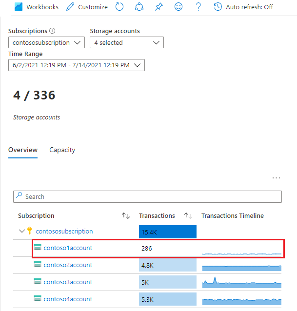
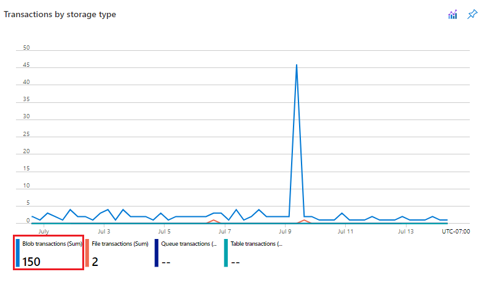
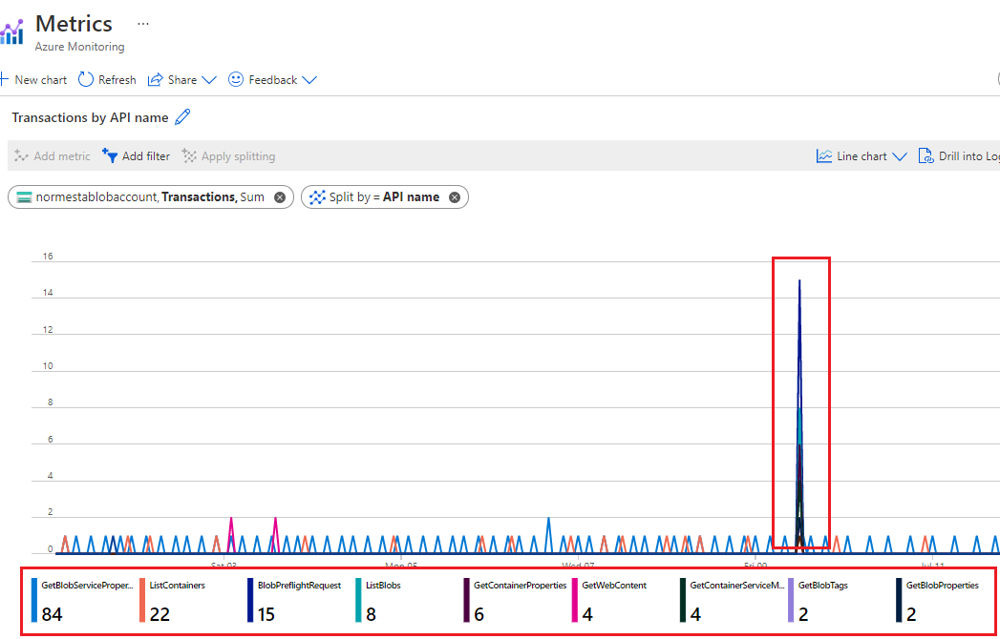
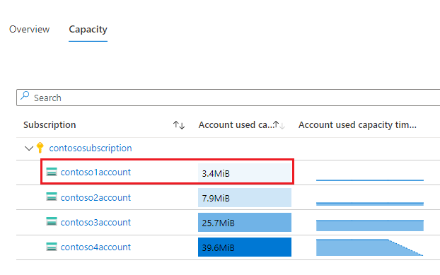
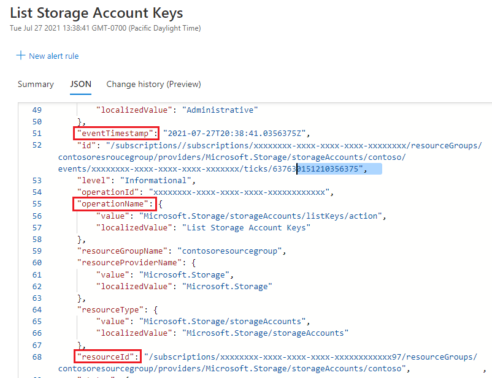
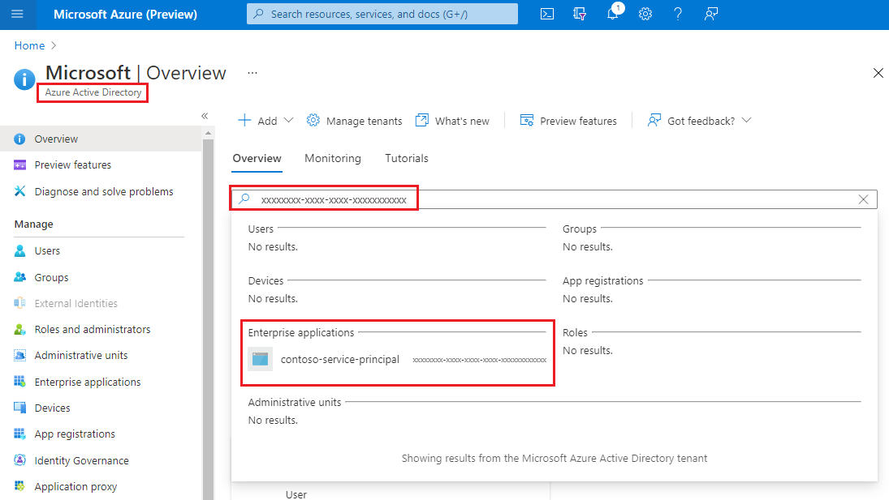

# Best practices for monitoring Azure Blob Storage

This article features a collection of common storage monitoring scenarios, and provides you with best practice guidelines to accomplish them.

## Identify storage accounts with no or low use

Storage Insights is a dashboard on top of Azure Storage metrics and logs. You can use Storage Insights to examine the transaction volume and used capacity of all your accounts. That information can help you decide which accounts you might want to retire. To configure Storage Insights, see [Monitoring your storage service with Azure Monitor Storage insights](../common/storage-insights-overview.md?toc=/azure/azure-monitor/toc.json).

### Analyze transaction volume

From the [Storage Insights view in Azure monitor](../common/storage-insights-overview.md?toc=/azure/azure-monitor/toc.json#view-from-azure-monitor), sort your accounts in ascending order by using the **Transactions** column. The following image shows an account with low transaction volume over the specified period.

> [!div class="mx-imgBorder"]
> 

Click the account link to learn more about these transactions. In this example, most requests are made to the Blob Storage service.

> [!div class="mx-imgBorder"]
> 

To determine what sorts of requests are being made, drill into the **Transactions by API name** chart.

> [!div class="mx-imgBorder"]
> 

In this example, all requests are listing operations or requests for account property information. There are no read and write transactions. This might lead you to believe that the account is not being used in a significant way.

### Analyze used capacity

From the **Capacity** tab of the [Storage Insights view in Azure monitor](../common/storage-insights-overview.md#view-from-azure-monitor), sort your accounts in ascending order by using the **Account used capacity** column. The following image shows an account with lower capacity volume than other accounts.

> [!div class="mx-imgBorder"]
> 

To examine the blobs associated with this used capacity, you can use Storage Explorer. For large numbers of blobs, consider generating a report by using a [Blob Inventory policy](blob-inventory.md).

## Monitor the use of a container

If you partition your customer's data by container, then can monitor how much capacity is used by each customer. You can use Azure Storage blob inventory to take an inventory of blobs with size information. Then, you can aggregate the size and count at the container level. For an example, see [Calculate blob count and total size per container using Azure Storage inventory](calculate-blob-count-size.md).

You can also evaluate traffic at the container level by querying logs. To learn more about writing Log Analytic queries, see [Log Analytics](../../azure-monitor/logs/log-analytics-tutorial.md). To learn more about the storage logs schema, see [Azure Blob Storage monitoring data reference](monitor-blob-storage-reference.md#resource-logs-preview).

Here's a query to get the number of read transactions and the number of bytes read on each container.

```kusto
StorageBlobLogs
| where OperationName  == "GetBlob"
| extend ContainerName = split(parse_url(Uri).Path, "/")[1]
| summarize ReadSize = sum(ResponseBodySize), ReadCount = count() by tostring(ContainerName)
```

The following query uses a similar query to obtain information about write operations.

```kusto
StorageBlobLogs
| where OperationName == "PutBlob" or
  OperationName == "PutBlock" or
  OperationName == "PutBlockList" or
  OperationName == "AppendBlock" or
  OperationName == "SnapshotBlob" or
  OperationName == "CopyBlob" or
  OperationName == "SetBlobTier"
| extend ContainerName = split(parse_url(Uri).Path, "/")[1]
| summarize WriteSize = sum(RequestBodySize), WriteCount = count() by tostring(ContainerName)
```

The above query references the names of multiple operations because more than one type of operation can count as a write operation. To learn more about which operations are considered read and write operations, see either [Azure Blob Storage pricing](https://azure.microsoft.com/pricing/details/storage/blobs/) or [Azure Data Lake Storage pricing](https://azure.microsoft.com/pricing/details/storage/data-lake/).

## Audit account activity

In many cases, you'll need to audit the activities of your storage accounts for security and compliance. Operations on storage accounts fall into two categories: *Control Plane* and *Data Plane*.

A control plane operation is any Azure Resource Manager request to create a storage account or to update a property of an existing storage account. For more information, see [Azure Resource Manager](../../azure-resource-manager/management/overview.md).

A data plane operation is an operation on the data in a storage account that results from a request to the storage service endpoint. For example, a data plane operation is executed when you upload a blob to a storage account or download a blob from a storage account. For more information, see [Azure Storage API](/rest/api/storageservices/).

The section shows you how to identify the "when", "who", "what" and "how" information of control and data plane operations.

### Auditing control plane operations

Resource Manager operations are captured in the [Azure activity log](../../azure-monitor/essentials/activity-log.md). To view the activity log, open your storage account in the Azure portal, and then select **Activity log**.

> [!div class="mx-imgBorder"]
> 

Open any log entry to view JSON that describes the activity. The following JSON shows the "when", "what" and "how" information of a control plane operation:

> [!div class="mx-imgBorder"]
> 

The availability of the  "who" information depends on the method of authentication that was used to perform the control plane operation. If the authorization was performed by an Azure AD security principal, the object identifier of that security principal would also appear in this JSON output (For example: `"http://schemas.microsoft.com/identity/claims/objectidentifier": "xxxxxxxx-xxxx-xxxx-xxxx-xxxxxxxxxxx"`). Because you might not always see other identity-related information such as an email address or name, the object identifier is always the best way to uniquely identify the security principal.

You can find the friendly name of that security principal by taking the value of the object identifier, and searching for the security principal in Azure AD page of the Azure portal. The following screenshot shows a search result in Azure AD.

> [!div class="mx-imgBorder"]
> 

### Auditing data plane operations

Data plane operations are captured in [Azure resource logs for Storage](monitor-blob-storage.md#analyzing-logs). You can [configure Diagnostic setting](../../azure-monitor/platform/diagnostic-settings.md) to export logs to Log Analytics workspace for a native query experience.

Here's a Log Analytics query that retrieves the "when", "who", "what", and "how" information in a list of log entries.

```kusto
StorageBlobLogs
| where TimeGenerated > ago(3d)
| project TimeGenerated, AuthenticationType, RequesterObjectId, OperationName, Uri
```

For the "when" portion of your audit, the `TimeGenerated` field shows when the log entry was recorded.

For the "what" portion of your audit, the `Uri` field shows the item was modified or read.

For the "how" portion of your audit, the `OperationName` field shows which operation was executed.
> [!TIP] 
> For example, if you suspect that a blob or container has been deleted by mistake, then add a `where` clause that returns only log entries where the `OperationName` is set to either [Delete blob](/rest/api/storageservices/delete-blob) or [Delete Container](/rest/api/storageservices/delete-container).
For the "who" portion of your audit, `AuthenticationType` shows which type of authentication was used to make a request. This field can show any of the types of authentication that Azure Storage supports including the use of an account key, a SAS token, or Azure Active Directory (Azure AD) authentication.

If the request is authorized by using Azure AD, you can use the `RequestObjectId` field to identify the "who". Shared Key and SAS authentication provide no means of auditing individual identities. In those cases, the `callerIPAddress` and `userAgentHeader` fields might help you to identify the source of the operation. If a SAS token was used to authorize an operation, you can identify that token, and if you've mapped tokens to token recipients at your end, you can identify which user, organization, or application has performed the operation. See [Identifying the SAS token used to authorize a request](#identifying-the-sas-token-used-to-authorize-a-request).

#### Identifying the security principal used to authorize a request

If a request was authenticated by using Azure AD, the `RequesterObjectId` field provides the most reliable way to identify the security principal. You can find the friendly name of that security principal by taking the value of the `RequesterObjectId` field, and searching for the security principal in Azure AD page of the Azure portal. The following screenshot shows a search result in Azure AD.

> [!div class="mx-imgBorder"]
> 

In some cases, a user principal name or *UPN* might appear in logs. For example, if the security principal is an Azure AD user, the UPN will likely appear. For other types of security principals such as user assigned managed identities, or in certain scenarios such as cross Azure AD tenant authentication, the UPN will not appear in logs.

This query shows all read operations performed by OAuth security principals.

```kusto
StorageBlobLogs
| where TimeGenerated > ago(3d)
  and OperationName == "GetBlob"
  and AuthenticationType == "OAuth"
| project TimeGenerated, AuthenticationType, RequesterObjectId, OperationName, Uri
```

Shared Key and SAS authentication provide no means of auditing individual identities. Therefore, if you want to improve your ability to audit based on identity, we recommended that you transition to Azure AD, and prevent shared key and SAS authentication. To learn how to prevent Shared Key and SAS authentication, see [Prevent Shared Key authorization for an Azure Storage account](../common/shared-key-authorization-prevent.md?toc=/azure/storage/blobs/toc.json&tabs=portal). To get started with Azure AD, see [Authorize access to blobs using Azure Active Directory](authorize-access-azure-active-directory.md).

#### Identifying the SAS token used to authorize a request

You can query for operations that were authorized by using a SAS token. For example, this query returns all write operations that were authorized by using a SAS token.

```kusto
StorageBlobLogs
| where TimeGenerated > ago(3d)
  and OperationName == "PutBlob"
  and AuthenticationType == "SAS"
| project TimeGenerated, AuthenticationType, AuthenticationHash, OperationName, Uri
```

For security reasons, SAS tokens don't appear in logs. However, the SHA-256 hash of the SAS token will appear in the `AuthenticationHash` field that is returned by this query. 

If you've distributed several SAS tokens, and you want to know which SAS tokens are being used, you'll have to convert each of your SAS tokens to an SHA-256 hash, and then compare that hash to the hash value that appears in logs.

First decode each SAS token string. The following example decodes a SAS token string by using PowerShell.

```powershell
[uri]::UnescapeDataString("<SAS token goes here>")
```

Then, you can pass that string to the [Get-FileHash](/powershell/module/microsoft.powershell.utility/get-filehash) PowerShell cmdlet. For an example, see [Example 4: Compute the hash of a string](/powershell/module/microsoft.powershell.utility/get-filehash#example-4--compute-the-hash-of-a-string).

Alternatively, you can pass the decoded string to the [hash_sha256()](/azure/data-explorer/kusto/query/sha256hashfunction) function as part of a query when you use Azure Data Explorer.

SAS tokens do not contain identity information. One way to track the activities of users or organizations, is to keep a mapping of users or organizations to various SAS token hashes.

## Optimize cost for infrequent queries

You can export logs to Log Analytics for rich native query capabilities. When you have massive transactions on your storage account, the cost of using logs with Log Analytics might be high. For more information, see [Azure Log Analytics Pricing](https://azure.microsoft.com/pricing/details/monitor/). If you only plan to query logs occasionally (for example, query logs for compliance auditing), you can consider reducing the total cost by exporting logs to storage account, and then using a serverless query solution on top of log data, for example, Azure Synapse.

With Azure Synapse, you can create server-less SQL pool to query log data when you need. This could save costs significantly.

1. Export logs to storage account. For more information, see [Creating a diagnostic setting](../../azure-monitor/platform/diagnostic-settings.md).

2. Create and configure a Synapse workspace. For more information, see [Quickstart: Create a Synapse workspace](../../synapse-analytics/quickstart-create-workspace.md).

2. Query logs. For more information, see [Query JSON files using serverless SQL pool in Azure Synapse Analytics](../../synapse-analytics/sql/query-json-files.md).

   Here's an example:

   ```sql
    select
        JSON_VALUE(doc, '$.time') AS time,
        JSON_VALUE(doc, '$.properties.accountName') AS accountName,
        JSON_VALUE(doc, '$.identity.type') AS identityType,
        JSON_VALUE(doc, '$.identity.requester.objectId') AS requesterObjectId,
        JSON_VALUE(doc, '$.operationName') AS operationName,
        JSON_VALUE(doc, '$.callerIpAddress') AS callerIpAddress,
        JSON_VALUE(doc, '$.uri') AS uri
        doc
    from openrowset(
            bulk 'https://demo2uswest4log.blob.core.windows.net/insights-logs-storageread/resourceId=/subscriptions/xxxxxxxx-xxxx-xxxx-xxxx-xxxxxxxxxxxx/resourceGroups/mytestrp/providers/Microsoft.Storage/storageAccounts/demo2uswest/blobServices/default/y=2021/m=03/d=19/h=*/m=*/PT1H.json',
            format = 'csv', fieldterminator ='0x0b', fieldquote = '0x0b'
        ) with (doc nvarchar(max)) as rows
    order by JSON_VALUE(doc, '$.time') desc

   ```

## See also

- [Monitoring Azure Blob Storage](monitor-blob-storage.md).
- [Azure Blob Storage monitoring data reference](monitor-blob-storage-reference.md)
- [Tutorial: Use Kusto queries in Azure Data Explorer and Azure Monitor](/azure/data-explorer/kusto/query/tutorial?pivots=azuredataexplorer).
- [Get started with log queries in Azure Monitor](../../azure-monitor/logs/get-started-queries.md).
