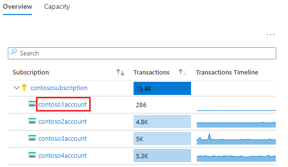
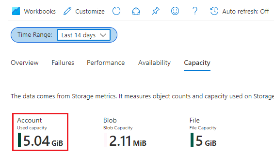
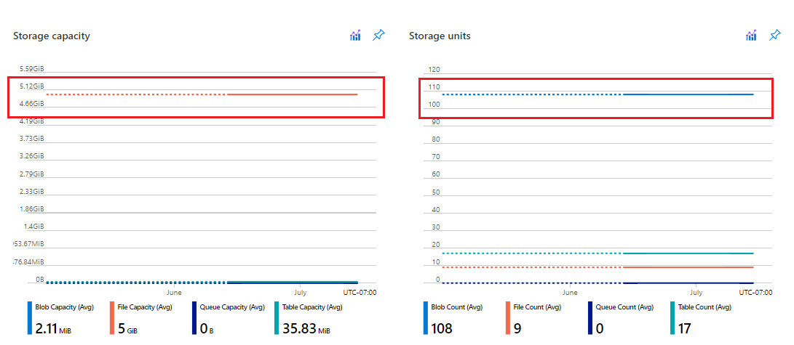

# Scenarios and best practices for monitoring Azure Blob Storage

Intro goes here

## Identify storage accounts with no or low use

Look at the transaction volume and capacity of your accounts to find those accounts that aren't being used. You can use Storage Insights to find them. Storage Insights is a tool that gives you a unified view of the performance, capacity, and availability metrics of all your accounts. See [Monitoring your storage service with Azure Monitor Storage insights](../../azure-monitor/insights/storage-insights-overview.md) to learn how to set that up.

### Examine transactions

In Storage Insights, sort results in descending order by **Transactions**. This image shows an account with very low usage over the time period. 

> [!div class="mx-imgBorder"]
> 

Before you retire an account with low use, you might want to know more about those small transactions. For example, when is the transaction occurring, what data is being written or read, and who is performing the transaction. That way, you can determine whether these transactions are critical or if you can work with the entities that perform these transactions to direct their queries to another account. 

You can investigate the nature of transactions by clicking the account link to see transaction by storage account type. 

> [!div class="mx-imgBorder"]
> 

Over any given timeframe, you can see which storage service is receiving requests. The following image shows that `contoso1account` receives the vast majority of it's small number of requests in the Blob Storage service. Therefore, you can investigate the nature of transactions to that service.

> [!div class="mx-imgBorder"]
> 

To identity what types of request are being made to the account, drill into the **Transactions by API name** chart. This image shows that all of the requests being made to the account are listing operations and requests for account property information. There are no read and write transactions. This might lead you to believe that the account is not being used in a significant way. 

> [!div class="mx-imgBorder"]
> 

This image does show a spike of activity on `July 9 2021`. If you want to investigate further, you can use query resource logs to figure out who made those requests, what information was obtained. See the blah section for details about how to find and parse that information. 

### Examine capacity

Have a look at your used capacity to see if theres any data in your account.  Choose the **Capacity** tab, and pick any time frame. This image shows about 5 Gib worth of files in the account. 

> [!div class="mx-imgBorder"]
> 

However the charts reveal that over this period, the capacity level is unchanged. 

> [!div class="mx-imgBorder"]
> 

This points to a lack of activity. The charts show that there are only `9` files. Therefore, they are likely large files and you can examine them easily by using Storage Explorer in the browser. You can use resource logs if you want to identify the client that uploaded these files. See activity log section of this doc.  It appears that there are `108` small blobs. You can either browse them in Storage Explorer or you can set up a Blob Inventory policy to give you more resolution about each of those blobs. To identity the client that uploaded them, use resource logs. 

## Monitor the use of a container

This scenario is about clearly identifying container use. For example, ISV partners might build solutions that use blob storage to host data. For example, container A for customer A and container B for customer B. All data stored in separate container. If they want to charge their customers for data use, they need to clearly identify how much data is being used by container. 

Another way to phrase this scenario is that customers want effective ways to meter costs in their Azure data estate. They want to identify costs and account for them at a granular level. For example: tagging, how much data is being queried or consumed by other departments. Keeping track of costs at folder or container level.

- The time of the transaction (time)
- OperationName - revealing if it is a read write or delete operation.
- CallerIpAddress can help you determine which client performed the operation.
- URI shows what the file is.
- Identify the caller by how they authorized the call.

### Determine space used

This is the solution with inventory - [Calculate blob count and total size per container using Azure Storage inventory](calculate-blob-count-size.md).

### Determine transaction costs associated with the container.

Figure out a way to attribute transaction costs and other costs associated with container traffic for the purpose of departmental billing.

## Audit account activity

This is about compliance auditing. Compliance auditing companies will often time be hired to audit a companies cloud platform based on controls. A popular control that relates to this scenario is about "access management". We need to use this section to discuss both data plane and control plane operations audit. The key elements of logs - who, what, when.

Fields that you can use:

|Who|What|When|
|---|---|--|
|||

### Control plane audit

In this case you'd like to determine the who, what, when.


### Data plane audit

Need examples here of specific types of queries. What to put here?

Open Logs from the Monitor menu.

Choose the storage account from the "Select Scope" option

Get a basic idea of what types of transactions are occurring in specific time frames by using query like this:

```kusto
StorageBlobLogs 
| project TimeGenerated, OperationName, Category, AuthenticationType   
```
You can also use aggregates to determine how many of these transactions are attributed to certain things like categories, operation names, and auth types.

For example by category:

```kusto
StorageBlobLogs 
| summarize count() by Category
```
or by operation

```kusto
StorageBlobLogs 
| summarize count() by OperationName
```

or by Auth type

```kusto
StorageBlobLogs 
| summarize count() by AuthenticationType
```

If you get alot OAuth calls, you can try to determine who is making those calls

### Analyze traffic per source

Determine traffic by bytes or by operation from a source. Source could be any of these things:

Azure Active Directory (Azure AD) identity

- Service principal
- AAD user-assigned managed identity
- AAD system-assigned managed identity

Anonymous identity via shared key or SAS authorization

- IP address
- Agent

An IP address can be shared by multiple users or applications. An agent could also be used. Lay out those challenges as well.

#### Identify all sources

// log analytic query to return all sources that have made requests

// Guidance here for more clearly identifying sources. For example - translating IDs to UPNs etc.

    |Auth method| log entry|
    |--|--|
    | AAD user | RequesterUserName|
    | AAD service principal | RequesterUpn |
    | AAD user-assigned managed identity | ? |
    | AAD system-assigned managed identity | ? |
    | Shared Key | ? |
    | SAS token | ? |

Provide guidance for converting values to find identity.

### Identity bytes read or written by source

// Log Analytic query to return byte count for each source
// Metrics?

### Identify operations by source

// Log Analytic query to return operations for each user.
// Metric?


## Optimize cost

#### Optimize cost for infrequent queries

This is a scenario that applies in cases where there may be an annual compliance audit. For a massive number of transactions, the cost of using Log Analytics might be high relative to just archiving to storage and using other query techniques. Log Analytics makes sense when customers want to leverage rich capabilities on Log Analytics.
One way to reduce the cost of querying data is to archive logs to a storage account and then query logs in a Synapse workspace or use Query acceleration.

1. Archive logs to storage account. See [Creating a diagnostic setting](monitor-blob-storage.md#creating-a-diagnostic-setting).

2. Consider the use of tiering to move data that you don't frequently use to colder storage. You might also even consider archive storage and then rehydrate that to hotter tier. Make sure to mention considerations around query cost and rehydration cost as well.

##### Query Acceleration

To learn more about how to set up query acceleration, see [Filter data by using Azure Data Lake Storage query acceleration](data-lake-storage-query-acceleration-how-to.md).

Here's an example for checking total blob size

```powershell
Function Get-QueryCsv($ctx, $container, $blob, $query, $hasheaders) {
    $tempfile = New-TemporaryFile
    $informat = New-AzStorageBlobQueryConfig -AsCsv -HasHeader:$hasheaders
    Get-AzStorageBlobQueryResult -Context $ctx -Container $container -Blob $blob -InputTextConfiguration $informat -OutputTextConfiguration (New-AzStorageBlobQueryConfig -AsCsv -HasHeader) -ResultFile $tempfile.FullName -QueryString $query -Force
    Get-Content $tempfile.FullName
}
 
$query = [string]::Format("SELECT SUM(CAST(_4 AS INT)) FROM BlobStorage where SUBSTRING(_1, 0, {1}) = '{2}'", $targetContainer.Length, $targetContainer.Length, $targetContainer)
Get-QueryCsv $ctx $inventoryContainer $blob $query $true

```

Here's an example for getting total blob count:

```powershell
$query = [string]::Format("SELECT COUNT(*) FROM BlobStorage where SUBSTRING(_1, 0, {1}) = '{2}'", $targetContainer.Length, $targetContainer.Length, $targetContainer)
Get-QueryCsv $ctx $inventoryContainer $blob $query $true

```

##### Azure Synapse

This option is available only for accounts that have the hierarchical namespace feature enabled on them.

1. Create and configure a Synapse workspace. See [Quickstart: Create a Synapse workspace](../../azure/synapse-analytics/quickstart-create-workspace.md).

2. Query logs. See [Query JSON files using serverless SQL pool in Azure Synapse Analytics](../../synapse-analytics/sql/query-json-files.md).

   Here's an example:

   ```sql
    select
        JSON_VALUE(doc, '$.time') AS time,
        JSON_VALUE(doc, '$.properties.accountName') AS accountName,
        JSON_VALUE(doc, '$.identity.type') AS identityType,    
        JSON_VALUE(doc, '$.identity.requester.objectId') AS requesterObjectId,
        JSON_VALUE(doc, '$.operationName') AS operationName,
        JSON_VALUE(doc, '$.callerIpAddress') AS callerIpAddress,
        JSON_VALUE(doc, '$.uri') AS uri
        doc
    from openrowset(
            bulk 'https://demo2uswest4log.blob.core.windows.net/insights-logs-storageread/resourceId=/subscriptions/d151d0d8-eee6-40fb-91a2-47ec72d2e8e5/resourceGroups/mytestrp/providers/Microsoft.Storage/storageAccounts/demo2uswest/blobServices/default/y=2021/m=03/d=19/h=*/m=*/PT1H.json',
            format = 'csv', fieldterminator ='0x0b', fieldquote = '0x0b'
        ) with (doc nvarchar(max)) as rows
    order by JSON_VALUE(doc, '$.time') desc

   ```

## See also

- [Monitoring Azure Blob Storage](monitor-blob-storage.md).

  

