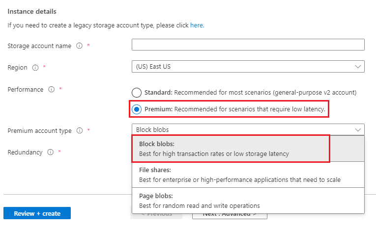
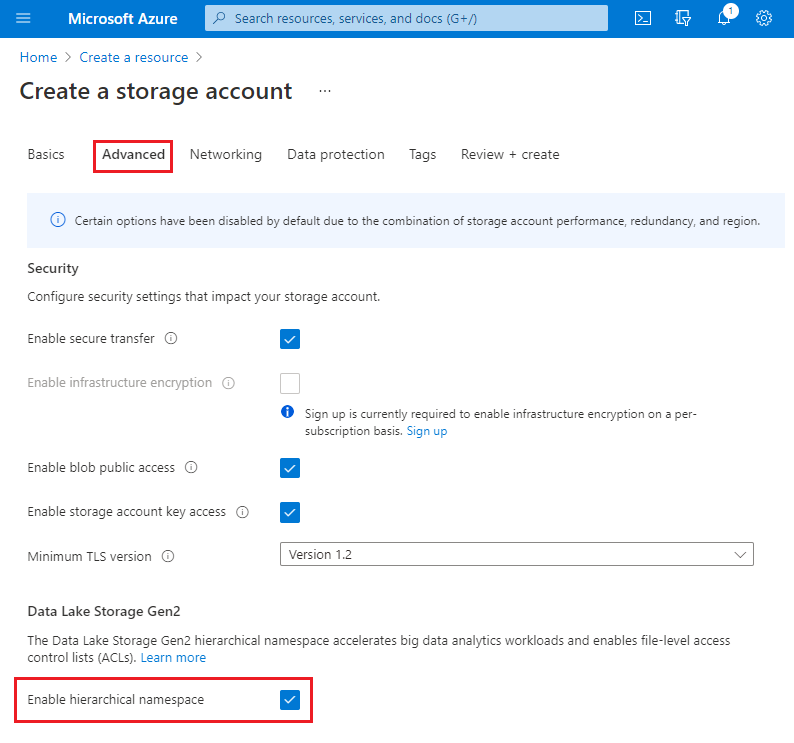

# Create a storage account to use with Azure Data Lake Storage Gen2

To use Data Lake Storage Gen2 capabilities, create a storage account that has a hierarchical namespace.

For step-by-step guidance, see [Create a storage account](../common/storage-account-create.md?toc=/azure/storage/blobs/toc.json).

As you create the account, make sure to select the options described in this article.

## Choose a storage account type

Data Lake Storage capabilities are supported in the following types of storage accounts:

- Standard general-purpose v2
- Premium block blob

For information about how to choose between them, see [storage account overview](../common/storage-account-overview.md?toc=/azure/storage/blobs/toc.json).

You can choose between these two types of accounts in the **Basics** tab of the **Create a storage account** page.

To create a standard general-purpose v2 account, select **Standard**.

To create a premium block blob account, select **Premium**. Then, in the **Premium account type** dropdown list, select **Block blobs**.

> [!div class="mx-imgBorder"]
> 

## Enable the hierarchical namespace

Unlock Data Lake Storage capabilities by selecting the **enable hierarchical namespace** setting in the **Advanced** tab of the **Create storage account** page. 

The following image shows this setting in the **Create storage account** page.

> [!div class="mx-imgBorder"]
> 

To enable Data Lake Storage capabilities on an existing account, see [Upgrade Azure Blob Storage with Azure Data Lake Storage Gen2 capabilities](upgrade-to-data-lake-storage-gen2-how-to.md).

## Next steps

- [Storage account overview](../common/storage-account-overview.md)
- [Upgrade Azure Blob Storage with Azure Data Lake Storage Gen2 capabilities](upgrade-to-data-lake-storage-gen2-how-to.md)
- [Access control in Azure Data Lake Storage Gen2](data-lake-storage-access-control.md)
