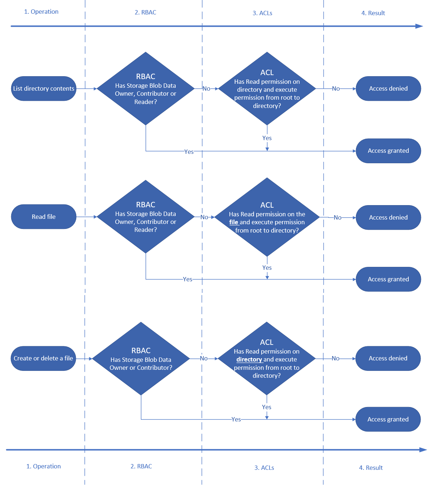

# Access control model in Azure Data Lake Storage Gen2

Data Lake Storage Gen2 supports the following authorization mechanisms:

- Shared Key authorization
- Shared access signature (SAS) authorization
- Role-based access control (Azure RBAC)
- Attribute-based access control (Azure ABAC)
- Access control lists (ACL)

[Shared Key and SAS authorization](#shared-key-and-shared-access-signature-sas-authorization) grants access to a user (or application) without requiring them to have an identity in Microsoft Entra ID. With these two forms of authentication, Azure RBAC, Azure ABAC, and ACLs have no effect.

Azure RBAC and ACL both require the user (or application) to have an identity in Microsoft Entra ID. Azure RBAC lets you grant "coarse-grain" access to storage account data, such as read or write access to **all** of the data in a storage account. Azure ABAC allows you to refine RBAC role assignments by adding conditions. For example, you can grant read or write access to all data objects in a storage account that have a specific tag. ACLs let you grant "fine-grained" access, such as write access to a specific directory or file.

This article focuses on Azure RBAC, ABAC, and ACLs, and how the system evaluates them together to make authorization decisions for storage account resources.

## Role-based access control (Azure RBAC)

Azure RBAC uses role assignments to apply sets of permissions to [security principals](../../role-based-access-control/overview.md#security-principal). A security principal is an object that represents a user, group, service principal, or managed identity that is defined in Microsoft Entra ID. A permission set can give a security principal a "coarse-grain" level of access such as read or write access to **all** of the data in a storage account or **all** of the data in a container.

The following roles permit a security principal to access data in a storage account.

|Role|Description|
|--|--|
| [Storage Blob Data Owner](../../role-based-access-control/built-in-roles.md#storage-blob-data-owner) | Full access to Blob storage containers and data. This access permits the security principal to set the owner an item, and to modify the ACLs of all items. |
| [Storage Blob Data Contributor](../../role-based-access-control/built-in-roles.md#storage-blob-data-owner) | Read, write, and delete access to Blob storage containers and blobs. This access does not permit the security principal to set the ownership of an item, but it can modify the ACL of items that are owned by the security principal. |
| [Storage Blob Data Reader](../../role-based-access-control/built-in-roles.md#storage-blob-data-reader) | Read and list Blob storage containers and blobs. |

Roles such as [Owner](../../role-based-access-control/built-in-roles.md#owner), [Contributor](../../role-based-access-control/built-in-roles.md#contributor), [Reader](../../role-based-access-control/built-in-roles.md#reader), and [Storage Account Contributor](../../role-based-access-control/built-in-roles.md#storage-account-contributor) permit a security principal to manage a storage account, but do not provide access to the data within that account. However, these roles (excluding **Reader**) can obtain access to the storage keys, which can be used in various client tools to access the data.

## Attribute-based access control (Azure ABAC)

Azure ABAC builds on Azure RBAC by adding role assignment conditions based on attributes in the context of specific actions. A role assignment condition is an additional check that you can optionally add to your role assignment to provide more refined access control. You cannot explicitly deny access to specific resources using conditions.

For more information on using Azure ABAC to control access to Azure Storage, see [Authorize access to Azure Blob Storage using Azure role assignment conditions](storage-auth-abac.md).

## Access control lists (ACLs)

ACLs give you the ability to apply "finer grain" level of access to directories and files. An *ACL* is a permission construct that contains a series of *ACL entries*. Each ACL entry associates security principal with an access level. To learn more, see [Access control lists (ACLs) in Azure Data Lake Storage Gen2](data-lake-storage-access-control.md).

## How permissions are evaluated

During security principal-based authorization, permissions are evaluated as shown in the following diagram.

> [!div class="mx-imgBorder"]
> 

1. Azure determines whether a role assignment exists for the principal.
    - If a role assignment exists, the role assignment conditions (2) are evaluated next.
    - If not, the ACLs (4) are evaluated next.
1. Azure determines whether any ABAC role assignment conditions exist.
    - If no conditions exist, access is granted.
    - If conditions exist, they are evaluated to see if they match the request (3).
1. Azure determines whether all of the ABAC role assignment conditions match the attributes of the request.
    - If all of them match, access is granted.
    - If at least one of them does not match, the ACLs (4) are evaluated next.
1. If access has not been explicitly granted after evaluating the role assignments and conditions, the ACLs are evaluated.
    - If the ACLs permit the requested level of access, access is granted.
    - If not, access is denied.

> [!IMPORTANT]
> Because of the way that access permissions are evaluated by the system, you **cannot** use an ACL to **restrict** access that has already been granted by a role assignment and its conditions. That's because the system evaluates Azure role assignments and conditions first, and if the assignment grants sufficient access permission, ACLs are ignored.

The following diagram shows the permission flow for three common operations: listing directory contents, reading a file, and writing a file.

> [!div class="mx-imgBorder"]
> 

## Permissions table: Combining Azure RBAC, ABAC, and ACLs

The following table shows you how to combine Azure roles, conditions, and ACL entries so that a security principal can perform the operations listed in the **Operation** column. This table shows a column that represents each level of a fictitious directory hierarchy. There's a column for the root directory of the container (`/`), a subdirectory named **Oregon**, a subdirectory of the Oregon directory named **Portland**, and a text file in the Portland directory named **Data.txt**. Appearing in those columns are [short form](data-lake-storage-access-control.md#short-forms-for-permissions) representations of the ACL entry required to grant permissions. **N/A** (_Not applicable_) appears in the column if an ACL entry is not required to perform the operation.

| Operation                | Assigned Azure role (with or without conditions) | /        | Oregon/  | Portland/ | Data.txt |
|--------------------------|----------------------------------|----------|----------|-----------|----------|
| Read Data.txt            |   Storage Blob Data Owner        | N/A      | N/A      | N/A       | N/A    |
|                          |   Storage Blob Data Contributor  | N/A      | N/A      | N/A       | N/A    |
|                          |   Storage Blob Data Reader       | N/A      | N/A      | N/A       | N/A    |
|                          |   None                           | `--X`    | `--X`    | `--X`     | `R--`  |
| Append to Data.txt       |   Storage Blob Data Owner        | N/A      | N/A      | N/A       | N/A    |
|                          |   Storage Blob Data Contributor  | N/A      | N/A      | N/A       | N/A    |
|                          |   Storage Blob Data Reader       | `--X`    | `--X`    | `--X`     | `-W-`  |
|                          |   None                           | `--X`    | `--X`    | `--X`     | `RW-`  |
| Delete Data.txt          |   Storage Blob Data Owner        | N/A      | N/A      | N/A       | N/A    |
|                          |   Storage Blob Data Contributor  | N/A      | N/A      | N/A       | N/A    |
|                          |   Storage Blob Data Reader       | `--X`    | `--X`    | `-WX`     | N/A    |
|                          |   None                           | `--X`    | `--X`    | `-WX`     | N/A    |
| Create Data.txt          |   Storage Blob Data Owner        | N/A      | N/A      | N/A       | N/A    |
|                          |   Storage Blob Data Contributor  | N/A      | N/A      | N/A       | N/A    |
|                          |   Storage Blob Data Reader       | `--X`    | `--X`    | `-WX`     | N/A    |
|                          |   None                           | `--X`    | `--X`    | `-WX`     | N/A    |
| List /                   |   Storage Blob Data Owner        | N/A      | N/A      | N/A       | N/A    |
|                          |   Storage Blob Data Contributor  | N/A      | N/A      | N/A       | N/A    |
|                          |   Storage Blob Data Reader       | N/A      | N/A      | N/A       | N/A    |
|                          |   None                           | `R-X`    | N/A      | N/A       | N/A    |
| List /Oregon/            |   Storage Blob Data Owner        | N/A      | N/A      | N/A       | N/A    |
|                          |   Storage Blob Data Contributor  | N/A      | N/A      | N/A       | N/A    |
|                          |   Storage Blob Data Reader       | N/A      | N/A      | N/A       | N/A    |
|                          |   None                           | `--X`    | `R-X`    | N/A       | N/A    |
| List /Oregon/Portland/   |   Storage Blob Data Owner        | N/A      | N/A      | N/A       | N/A    |
|                          |   Storage Blob Data Contributor  | N/A      | N/A      | N/A       | N/A    |
|                          |   Storage Blob Data Reader       | N/A      | N/A      | N/A       | N/A    |
|                          |   None                           | `--X`    | `--X`    | `R-X`     | N/A    |

> [!NOTE]
> To view the contents of a container in Azure Storage Explorer, security principals must [sign in to Storage Explorer by using Microsoft Entra ID](../../vs-azure-tools-storage-manage-with-storage-explorer.md?tabs=windows#attach-to-an-individual-resource), and (at a minimum) have read access (R--) to the root folder (`\`) of a container. This level of permission does give them the ability to list the contents of the root folder. If you don't want the contents of the root folder to be visible, you can assign them [Reader](../../role-based-access-control/built-in-roles.md#reader) role. With that role, they'll be able to list the containers in the account, but not container contents. You can then grant access to specific directories and files by using ACLs.

## Security groups

[!INCLUDE [Security groups](../../../includes/azure-storage-data-lake-groups.md)]

## Limits on Azure role assignments and ACL entries

By using groups, you're less likely to exceed the maximum number of role assignments per subscription and the maximum number of ACL entries per file or directory. The following table describes these limits.

[!INCLUDE [Security groups](../../../includes/azure-storage-data-lake-rbac-acl-limits.md)]

## Shared Key and Shared Access Signature (SAS) authorization

Azure Data Lake Storage Gen2 also supports [Shared Key](/rest/api/storageservices/authorize-with-shared-key) and [SAS](../common/storage-sas-overview.md?toc=/azure/storage/blobs/toc.json) methods for authentication. A characteristic of these authentication methods is that no identity is associated with the caller and therefore security principal permission-based authorization cannot be performed.

In the case of Shared Key, the caller effectively gains 'super-user' access, meaning full access to all operations on all resources including data, setting owner, and changing ACLs.

SAS tokens include allowed permissions as part of the token. The permissions included in the SAS token are effectively applied to all authorization decisions, but no additional ACL checks are performed.

## Next steps

To learn more about access control lists, see [Access control lists (ACLs) in Azure Data Lake Storage Gen2](data-lake-storage-access-control.md).
