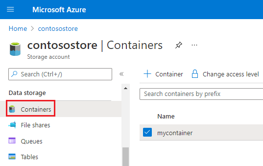
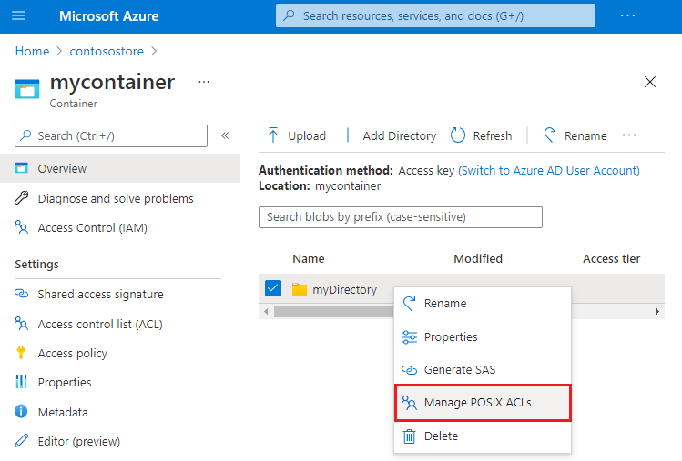
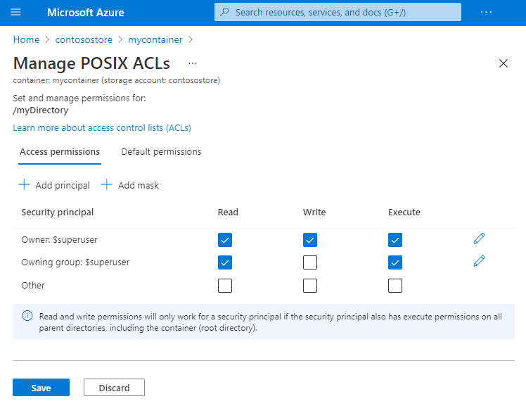
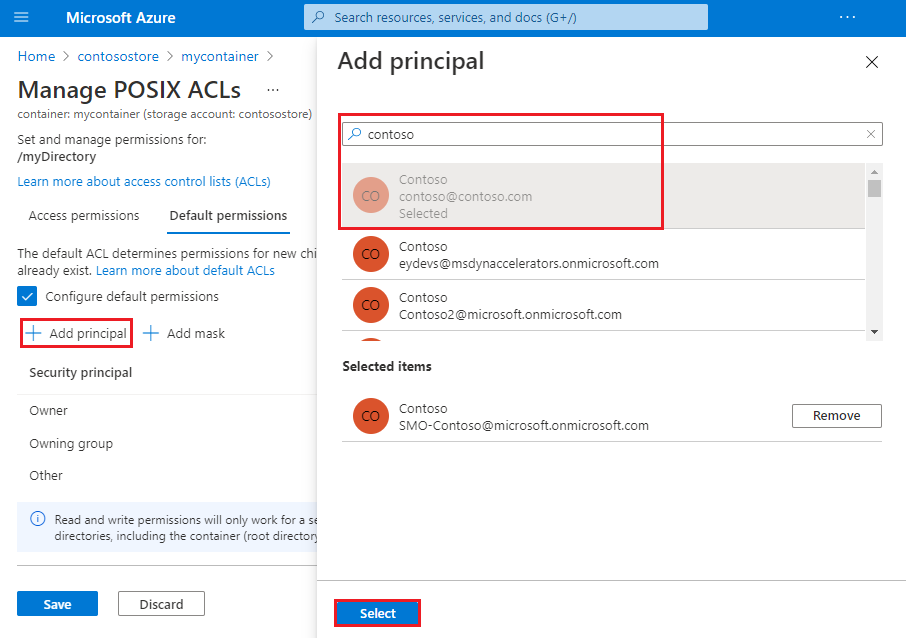
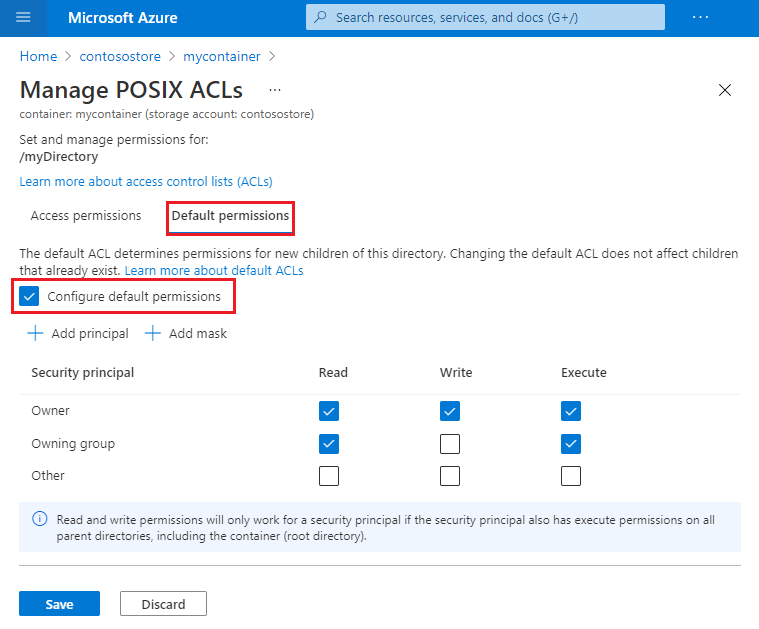

# Use the Azure portal to manage ACLs in Azure Data Lake Storage Gen2

This article shows you how to use [Azure portal](https://portal.azure.com/) to manage the access control list (ACL) of a directory or blob in storage accounts that have the hierarchical namespace featured enabled on them.

For information about the structure of the ACL, see [Access control lists (ACLs) in Azure Data Lake Storage Gen2](data-lake-storage-access-control.md).

To learn about how to use ACLs and Azure roles together, see [Access control model in Azure Data Lake Storage Gen2](data-lake-storage-access-control-model.md).

## Prerequisites

- An Azure subscription. See [Get Azure free trial](https://azure.microsoft.com/pricing/free-trial/).

- A storage account that has the hierarchical namespace featured enabled on it. Follow [these](create-data-lake-storage-account.md) instructions to create one.

- You must have one of the following security permissions:

  - Your user identity has been assigned the [Storage Blob Data Owner](../../role-based-access-control/built-in-roles.md#storage-blob-data-owner) role in the scope of either the target container, storage account, parent resource group or subscription.

  - You're the owning user of the target container, directory, or blob to which you plan to apply ACL settings.

## Manage an ACL

1. Sign in to the [Azure portal](https://portal.azure.com/) to get started.

2. Locate your storage account and display the account overview.

3. Select **Containers** under **Data storage**.

   The containers in the storage account appear.

   > [!div class="mx-imgBorder"]
   > 

5. Navigate to any container, directory, or blob. Right-click the object, and then select **Manage ACL**.

   > [!div class="mx-imgBorder"]
   > 

   The **Access permissions** tab of the **Manage ACL** page appears. Use the controls in this tab to manage access to the object.

   > [!div class="mx-imgBorder"]
   > 

7. To add a *security principal* to the ACL, select the **Add principal** button.

   > [!TIP]
   > A security principal is an object that represents a user, group, service principal, or managed identity that is defined in Azure Active Directory (AD).

   Find the security principal by using the search box, and then select the **Select** button.

   > [!div class="mx-imgBorder"]
   > 

   > [!NOTE]
   > We recommend that you create a security group in Azure AD, and then maintain permissions on the group rather than for individual users. For details on this recommendation, as well as other best practices, see [Access control model in Azure Data Lake Storage Gen2](data-lake-storage-access-control-model.md).

8. To manage the *default ACL*, select the **default permissions** tab, and then select the **Configure default permissions** checkbook.

   > [!TIP]
   > A default ACL is a template of an ACL that determines the access ACLs for any child items that are created under a directory. A blob doesn't have a default ACL, so this tab appears only for directories.

   > [!div class="mx-imgBorder"]
   > 

## Apply an ACL recursively

You can apply ACL entries recursively on the existing child items of a parent directory without having to make these changes individually for each child item. However, you can't apply ACL entries recursively by using the Azure portal.

To apply ACLs recursively, use Azure Storage Explorer, PowerShell, or the Azure CLI. If you prefer to write code, you can also use the .NET, Java, Python, or Node.js APIs.

You can find the complete list of guides here: [How to set ACLs](data-lake-storage-access-control.md#how-to-set-acls).

## Next steps

Learn about the Data Lake Storage Gen2 permission model.

> [!div class="nextstepaction"]
> [Access control model in Azure Data Lake Storage Gen2](./data-lake-storage-access-control-model.md)
