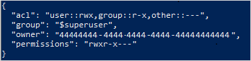
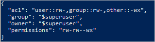

# Use Azure CLI to manage ACLs in Azure Data Lake Storage Gen2

This article shows you how to use the [Azure CLI](/cli/azure/) to get, set, and update the access control lists of directories and files.

ACL inheritance is already available for new child items that are created under a parent directory. But you can also add, update, and remove ACLs recursively on the existing child items of a parent directory without having to make these changes individually for each child item.

[Reference](/cli/azure/storage/fs/access) | [Samples](https://github.com/Azure/azure-cli/blob/dev/src/azure-cli/azure/cli/command_modules/storage/docs/ADLS%20Gen2.md) | [Give feedback](https://github.com/Azure/azure-cli-extensions/issues)

## Prerequisites

- An Azure subscription. For more information, see [Get Azure free trial](https://azure.microsoft.com/pricing/free-trial/).

- A storage account that has hierarchical namespace enabled. Follow [these](create-data-lake-storage-account.md) instructions to create one.

- Azure CLI version `2.14.0` or higher.

- One of the following security permissions:

  - A provisioned Microsoft Entra ID [security principal](../../role-based-access-control/overview.md#security-principal) that has been assigned the [Storage Blob Data Owner](../../role-based-access-control/built-in-roles.md#storage-blob-data-owner) role, scoped to the target container, storage account, parent resource group, or subscription..

  - Owning user of the target container or directory to which you plan to apply ACL settings. To set ACLs recursively, this includes all child items in the target container or directory.

  - Storage account key.

## Ensure that you have the correct version of Azure CLI installed

1. Open the [Azure Cloud Shell](../../cloud-shell/overview.md), or if you've [installed](/cli/azure/install-azure-cli) the Azure CLI locally, open a command console application such as Windows PowerShell.

2. Verify that the version of Azure CLI that have installed is `2.14.0` or higher by using the following command.

   ```azurecli
    az --version
   ```

   If your version of Azure CLI is lower than `2.14.0`, then install a later version. For more information, see [Install the Azure CLI](/cli/azure/install-azure-cli).

## Connect to the account

1. If you're using Azure CLI locally, run the login command.

   ```azurecli
   az login
   ```

   If the CLI can open your default browser, it will do so and load an Azure sign-in page.

   Otherwise, open a browser page at [https://aka.ms/devicelogin](https://aka.ms/devicelogin) and enter the authorization code displayed in your terminal. Then, sign in with your account credentials in the browser.

   To learn more about different authentication methods, see [Authorize access to blob or queue data with Azure CLI](./authorize-data-operations-cli.md).

2. If your identity is associated with more than one subscription, then set your active subscription to subscription of the storage account that will host your static website.

   ```azurecli
   az account set --subscription <subscription-id>
   ```

   Replace the `<subscription-id>` placeholder value with the ID of your subscription.

> [!NOTE]
> The example presented in this article show Microsoft Entra authorization. To learn more about authorization methods, see [Authorize access to blob or queue data with Azure CLI](./authorize-data-operations-cli.md).

## Get ACLs

Get the ACL of a **directory** by using the [az storage fs access show](/cli/azure/storage/fs#az-storage-fs-show) command.

This example gets the ACL of a directory, and then prints the ACL to the console.

```azurecli
az storage fs access show -p my-directory -f my-file-system --account-name mystorageaccount --auth-mode login
```

Get the access permissions of a **file** by using the [az storage fs access show](/cli/azure/storage/fs#az-storage-fs-show) command.

This example gets the ACL of a file and then prints the ACL to the console.

```azurecli
az storage fs access show -p my-directory/upload.txt -f my-file-system --account-name mystorageaccount --auth-mode login
```

The following image shows the output after getting the ACL of a directory.



In this example, the owning user has read, write, and execute permissions. The owning group has only read and execute permissions. For more information about access control lists, see [Access control in Azure Data Lake Storage Gen2](data-lake-storage-access-control.md).

## Set ACLs

When you *set* an ACL, you **replace** the entire ACL including all of it's entries. If you want to change the permission level of a security principal or add a new security principal to the ACL without affecting other existing entries, you should *update* the ACL instead. To update an ACL instead of replace it, see the [Update ACLs](#update-acls) section of this article.

If you choose to *set* the ACL, you must add an entry for the owning user, an entry for the owning group, and an entry for all other users. To learn more about the owning user, the owning group, and all other users, see [Users and identities](data-lake-storage-access-control.md#users-and-identities).

This section shows you how to:

- Set an ACL
- Set ACLs recursively

### Set an ACL

Use the [az storage fs access set](/cli/azure/storage/fs/access#az-storage-fs-access-set) command to set the ACL of a **directory**.

This example sets the ACL on a directory for the owning user, owning group, or other users, and then prints the ACL to the console.

```azurecli
az storage fs access set --acl "user::rw-,group::rw-,other::-wx" -p my-directory -f my-file-system --account-name mystorageaccount --auth-mode login
```

This example sets the *default* ACL on a directory for the owning user, owning group, or other users, and then prints the ACL to the console.

```azurecli
az storage fs access set --acl "default:user::rw-,group::rw-,other::-wx" -p my-directory -f my-file-system --account-name mystorageaccount --auth-mode login
```

Use the [az storage fs access set](/cli/azure/storage/fs/access#az-storage-fs-access-set) command to set the acl of a **file**.

This example sets the ACL on a file for the owning user, owning group, or other users, and then prints the ACL to the console.

```azurecli
az storage fs access set --acl "user::rw-,group::rw-,other::-wx" -p my-directory/upload.txt -f my-file-system --account-name mystorageaccount --auth-mode login
```

> [!NOTE]
> To a set the ACL of a specific group or user, use their respective object IDs. For example, to set the ACL of a **group**, use `group:xxxxxxxx-xxxx-xxxx-xxxx-xxxxxxxxxxxx`. To set the ACL of a **user**, use `user:xxxxxxxx-xxxx-xxxx-xxxx-xxxxxxxxxxxx`.

The following image shows the output after setting the ACL of a file.



In this example, the owning user and owning group have only read and write permissions. All other users have write and execute permissions. For more information about access control lists, see [Access control in Azure Data Lake Storage Gen2](data-lake-storage-access-control.md).

### Set ACLs recursively

Set ACLs recursively by using the [az storage fs access set-recursive](/cli/azure/storage/fs/access#az-storage-fs-access-set-recursive) command.

This example sets the ACL of a directory named `my-parent-directory`. These entries give the owning user read, write, and execute permissions, gives the owning group only read and execute permissions, and gives all others no access. The last ACL entry in this example gives a specific user with the object ID "xxxxxxxx-xxxx-xxxx-xxxx-xxxxxxxxxxxx" read and execute permissions.

```azurecli
az storage fs access set-recursive --acl "user::rwx,group::r-x,other::---,user:xxxxxxxx-xxxx-xxxx-xxxx-xxxxxxxxxxxx:r-x" -p my-parent-directory/ -f my-container --account-name mystorageaccount --auth-mode login
```

> [!NOTE]
> If you want to set a **default** ACL entry, add the prefix `default:` to each entry. For example, `default:user::rwx` or `default:user:xxxxxxxx-xxxx-xxxx-xxxx-xxxxxxxxxxxx:r-x`.

## Update ACLs

When you *update* an ACL, you modify the ACL instead of replacing the ACL. For example, you can add a new security principal to the ACL without affecting other security principals listed in the ACL. To replace the ACL instead of update it, see the [Set ACLs](#set-acls) section of this article.

To update an ACL, create a new ACL object with the ACL entry that you want to update, and then use that object in update ACL operation. Do not get the existing ACL, just provide ACL entries to be updated.

This section shows you how to:

- Update an ACL
- Update ACLs recursively

### Update an ACL

Update the ACL of a file by using the [az storage fs access update-recursive](/cli/azure/storage/fs/access#az-storage-fs-access-update-recursive) command.

This example updates an ACL entry with write permission.

```azurecli
az storage fs access update-recursive --acl "user:xxxxxxxx-xxxx-xxxx-xxxx-xxxxxxxxxxxx:rwx" -p my-parent-directory/myfile.txt -f my-container --account-name mystorageaccount --auth-mode login
```

To a update the ACL of a specific group or user, use their respective object IDs. For example, `group:xxxxxxxx-xxxx-xxxx-xxxx-xxxxxxxxxxxx` or `user:xxxxxxxx-xxxx-xxxx-xxxx-xxxxxxxxxxxx`.

> [!NOTE]
> Updating the ACL of a single directory without updating the ACL of child items is not supported by the Azure CLI. To update the ACL of a directory without modifying the ACLs of all child items in that directory, use any of the other supported tools and SDKs. See [How to set ACLs](data-lake-storage-access-control.md#how-to-set-acls).

### Update ACLs recursively

Update ACLs recursively by using the [az storage fs access update-recursive](/cli/azure/storage/fs/access#az-storage-fs-access-update-recursive) command.

This example updates an ACL entry with write permission.

```azurecli
az storage fs access update-recursive --acl "user:xxxxxxxx-xxxx-xxxx-xxxx-xxxxxxxxxxxx:rwx" -p my-parent-directory/ -f my-container --account-name mystorageaccount --auth-mode login
```

> [!NOTE]
> If you want to update a **default** ACL entry, add the prefix `default:` to each entry. For example, `default:user:xxxxxxxx-xxxx-xxxx-xxxx-xxxxxxxxxxxx:r-x`.

## Remove ACL entries recursively

You can remove one or more ACL entries recursively. To remove an ACL entry, create a new ACL object for ACL entry to be removed, and then use that object in remove ACL operation. Do not get the existing ACL, just provide the ACL entries to be removed.

Remove ACL entries by using the [az storage fs access remove-recursive](/cli/azure/storage/fs/access#az-storage-fs-access-remove-recursive) command.

This example removes an ACL entry from the root directory of the container.

```azurecli
az storage fs access remove-recursive --acl "user:xxxxxxxx-xxxx-xxxx-xxxx-xxxxxxxxxxxx" -p my-parent-directory/ -f my-container --account-name mystorageaccount --auth-mode login
```

> [!NOTE]
> If you want to remove a **default** ACL entry, add the prefix `default:` to each entry. For example, `default:user:xxxxxxxx-xxxx-xxxx-xxxx-xxxxxxxxxxxx`.

## Recover from failures

You might encounter runtime or permission errors when modifying ACLs recursively. For runtime errors, restart the process from the beginning. Permission errors can occur if the security principal doesn't have sufficient permission to modify the ACL of a directory or file that is in the directory hierarchy being modified. Address the permission issue, and then choose to either resume the process from the point of failure by using a continuation token, or restart the process from beginning. You don't have to use the continuation token if you prefer to restart from the beginning. You can reapply ACL entries without any negative impact.

In the event of a failure, you can return a continuation token by setting the `--continue-on-failure` parameter to `false`. After you address the errors, you can resume the process from the point of failure by running the command again, and then setting the `--continuation` parameter to the continuation token.

```azurecli
az storage fs access set-recursive --acl "user::rw-,group::r-x,other::---" --continue-on-failure false --continuation xxxxxxx -p my-parent-directory/ -f my-container --account-name mystorageaccount --auth-mode login  
```

If you want the process to complete uninterrupted by permission errors, you can specify that.

To ensure that the process completes uninterrupted, set the `--continue-on-failure` parameter to `true`.

```azurecli
az storage fs access set-recursive --acl "user::rw-,group::r-x,other::---" --continue-on-failure true --continuation xxxxxxx -p my-parent-directory/ -f my-container --account-name mystorageaccount --auth-mode login  
```

[!INCLUDE [updated-for-az](../../../includes/recursive-acl-best-practices.md)]

## See also

- [Samples](https://github.com/Azure/azure-cli/blob/dev/src/azure-cli/azure/cli/command_modules/storage/docs/ADLS%20Gen2.md)
- [Give feedback](https://github.com/Azure/azure-cli-extensions/issues)
- [Known issues](data-lake-storage-known-issues.md#api-scope-data-lake-client-library)
- [Access control model in Azure Data Lake Storage Gen2](data-lake-storage-access-control.md)
- [Access control lists (ACLs) in Azure Data Lake Storage Gen2](data-lake-storage-access-control.md)
