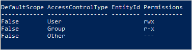
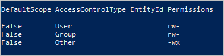

# Use PowerShell to manage ACLs in Azure Data Lake Storage Gen2

This article shows you how to use PowerShell to get, set, and update the access control lists of directories and files.

ACL inheritance is already available for new child items that are created under a parent directory. But you can also add, update, and remove ACLs recursively on the existing child items of a parent directory without having to make these changes individually for each child item.

[Reference](/powershell/module/Az.Storage/) | [Give feedback](https://github.com/Azure/azure-powershell/issues)

## Prerequisites

- An Azure subscription. For more information, see [Get Azure free trial](https://azure.microsoft.com/pricing/free-trial/).

- A storage account that has hierarchical namespace (HNS) enabled. Follow [these](create-data-lake-storage-account.md) instructions to create one.

- Azure CLI version `2.6.0` or higher.

- One of the following security permissions:

  - A provisioned Azure Active Directory (AD) [security principal](../../role-based-access-control/overview.md#security-principal) that has been assigned the [Storage Blob Data Owner](../../role-based-access-control/built-in-roles.md#storage-blob-data-owner) role, scoped to the target container, storage account, parent resource group, or subscription..

  - Owning user of the target container or directory to which you plan to apply ACL settings. To set ACLs recursively, this includes all child items in the target container or directory.

  - Storage account key.

## Install the PowerShell module

1. Verify that the version of PowerShell that have installed is `5.1` or higher by using the following command.

   ```powershell
   echo $PSVersionTable.PSVersion.ToString()
   ```

   To upgrade your version of PowerShell, see [Upgrading existing Windows PowerShell](/powershell/scripting/install/installing-windows-powershell#upgrading-existing-windows-powershell)

2. Install **Az.Storage** module.

   ```powershell
   Install-Module Az.Storage -Repository PSGallery -Force  
   ```

   For more information about how to install PowerShell modules, see [Install the Azure PowerShell module](/powershell/azure/install-azure-powershell)

## Connect to the account

Choose how you want your commands to obtain authorization to the storage account.

### Option 1: Obtain authorization by using Azure Active Directory (AD)

> [!NOTE]
> If you're using Azure Active Directory (Azure AD) to authorize access, then make sure that your security principal has been assigned the [Storage Blob Data Owner role](../../role-based-access-control/built-in-roles.md#storage-blob-data-owner). To learn more about how ACL permissions are applied and the effects of changing them, see [Access control model in Azure Data Lake Storage Gen2](./data-lake-storage-access-control-model.md).

With this approach, the system ensures that your user account has the appropriate Azure role-based access control (Azure RBAC) assignments and ACL permissions.

1. Open a Windows PowerShell command window, and then sign in to your Azure subscription with the `Connect-AzAccount` command and follow the on-screen directions.

   ```powershell
   Connect-AzAccount
   ```

2. If your identity is associated with more than one subscription, then set your active subscription to subscription of the storage account that you want create and manage directories in. In this example, replace the `<subscription-id>` placeholder value with the ID of your subscription.

   ```powershell
   Select-AzSubscription -SubscriptionId <subscription-id>
   ```

3. Get the storage account context.

   ```powershell
   $ctx = New-AzStorageContext -StorageAccountName '<storage-account-name>' -UseConnectedAccount
   ```

### Option 2: Obtain authorization by using the storage account key

With this approach, the system doesn't check Azure RBAC or ACL permissions. Get the storage account context by using an account key.

```powershell
$ctx = New-AzStorageContext -StorageAccountName '<storage-account-name>' -StorageAccountKey '<storage-account-key>'
```

## Get ACLs

Get the ACL of a directory or file by using the `Get-AzDataLakeGen2Item`cmdlet.

This example gets the ACL of the root directory of a **container** and then prints the ACL to the console.

```powershell
$filesystemName = "my-file-system"
$filesystem = Get-AzDataLakeGen2Item -Context $ctx -FileSystem $filesystemName
$filesystem.ACL
```

This example gets the ACL of a **directory**, and then prints the ACL to the console.

```powershell
$filesystemName = "my-file-system"
$dirname = "my-directory/"
$dir = Get-AzDataLakeGen2Item -Context $ctx -FileSystem $filesystemName -Path $dirname
$dir.ACL
```

This example gets the ACL of a **file** and then prints the ACL to the console.

```powershell
$filePath = "my-directory/upload.txt"
$file = Get-AzDataLakeGen2Item -Context $ctx -FileSystem $filesystemName -Path $filePath
$file.ACL
```

The following image shows the output after getting the ACL of a directory.



In this example, the owning user has read, write, and execute permissions. The owning group has only read and execute permissions. For more information about access control lists, see [Access control in Azure Data Lake Storage Gen2](data-lake-storage-access-control.md).

## Set ACLs

When you *set* an ACL, you **replace** the entire ACL including all of it's entries. If you want to change the permission level of a security principal or add a new security principal to the ACL without affecting other existing entries, you should *update* the ACL instead. To update an ACL instead of replace it, see the [Update ACLs](#update-acls) section of this article.

If you choose to *set* the ACL, you must add an entry for the owning user, an entry for the owning group, and an entry for all other users. To learn more about the owning user, the owning group, and all other users, see [Users and identities](data-lake-storage-access-control.md#users-and-identities).

This section shows you how to:

- Set an ACL
- Set ACLs recursively

### Set an ACL

Use the `set-AzDataLakeGen2ItemAclObject` cmdlet to create an ACL for the owning user, owning group, or other users. Then, use the `Update-AzDataLakeGen2Item` cmdlet to commit the ACL.

This example sets the ACL on the root directory of a **container** for the owning user, owning group, or other users, and then prints the ACL to the console.

```powershell
$filesystemName = "my-file-system"
$acl = set-AzDataLakeGen2ItemAclObject -AccessControlType user -Permission rw-
$acl = set-AzDataLakeGen2ItemAclObject -AccessControlType group -Permission rw- -InputObject $acl
$acl = set-AzDataLakeGen2ItemAclObject -AccessControlType other -Permission -wx -InputObject $acl
Update-AzDataLakeGen2Item -Context $ctx -FileSystem $filesystemName -Acl $acl
$filesystem = Get-AzDataLakeGen2Item -Context $ctx -FileSystem $filesystemName
$filesystem.ACL
```

This example sets the ACL on a **directory** for the owning user, owning group, or other users, and then prints the ACL to the console.

```powershell
$filesystemName = "my-file-system"
$dirname = "my-directory/"
$acl = set-AzDataLakeGen2ItemAclObject -AccessControlType user -Permission rw-
$acl = set-AzDataLakeGen2ItemAclObject -AccessControlType group -Permission rw- -InputObject $acl
$acl = set-AzDataLakeGen2ItemAclObject -AccessControlType other -Permission -wx -InputObject $acl
Update-AzDataLakeGen2Item -Context $ctx -FileSystem $filesystemName -Path $dirname -Acl $acl
$dir = Get-AzDataLakeGen2Item -Context $ctx -FileSystem $filesystemName -Path $dirname
$dir.ACL
```

> [!NOTE]
> If you want to set a **default** ACL entry, use the **-DefaultScope** parameter when you run the **Set-AzDataLakeGen2ItemAclObject** command. For example: `$acl = set-AzDataLakeGen2ItemAclObject -AccessControlType user -Permission rwx -DefaultScope`.

This example sets the ACL on a **file** for the owning user, owning group, or other users, and then prints the ACL to the console.

```powershell
$filesystemName = "my-file-system"
$filePath = "my-directory/upload.txt"
$acl = set-AzDataLakeGen2ItemAclObject -AccessControlType user -Permission rw-
$acl = set-AzDataLakeGen2ItemAclObject -AccessControlType group -Permission rw- -InputObject $acl
$acl = set-AzDataLakeGen2ItemAclObject -AccessControlType other -Permission "-wx" -InputObject $acl
Update-AzDataLakeGen2Item -Context $ctx -FileSystem $filesystemName -Path $filePath -Acl $acl
$file = Get-AzDataLakeGen2Item -Context $ctx -FileSystem $filesystemName -Path $filePath
$file.ACL
```

> [!NOTE]
> To set the ACL of a specific group or user, service principal, or managed identity, use their respective object IDs. For example, to set the ACL of a **group**, use `group:xxxxxxxx-xxxx-xxxx-xxxx-xxxxxxxxxxxx`. To set the ACL of a **user**, use `user:xxxxxxxx-xxxx-xxxx-xxxx-xxxxxxxxxxxx`.

The following image shows the output after setting the ACL of a file.



In this example, the owning user and owning group have only read and write permissions. All other users have write and execute permissions. For more information about access control lists, see [Access control in Azure Data Lake Storage Gen2](data-lake-storage-access-control.md).

### Set ACLs recursively

Set ACLs recursively by using the **Set-AzDataLakeGen2AclRecursive** cmdlet.

This example sets the ACL of a directory named `my-parent-directory`. These entries give the owning user read, write, and execute permissions, gives the owning group only read and execute permissions, and gives all others no access. The last ACL entry in this example gives a specific user with the object ID "xxxxxxxx-xxxx-xxxx-xxxx-xxxxxxxxxxxx" read and execute permissions.

```powershell
$filesystemName = "my-container"
$dirname = "my-parent-directory/"
$userID = "xxxxxxxx-xxxx-xxxx-xxxx-xxxxxxxxxxxx";

$acl = Set-AzDataLakeGen2ItemAclObject -AccessControlType user -Permission rwx
$acl = Set-AzDataLakeGen2ItemAclObject -AccessControlType group -Permission r-x -InputObject $acl
$acl = Set-AzDataLakeGen2ItemAclObject -AccessControlType other -Permission "---" -InputObject $acl
$acl = Set-AzDataLakeGen2ItemAclObject -AccessControlType user -EntityId $userID -Permission r-x -InputObject $acl

Set-AzDataLakeGen2AclRecursive -Context $ctx -FileSystem $filesystemName -Path $dirname -Acl $acl

```

> [!NOTE]
> If you want to set a **default** ACL entry, use the **-DefaultScope** parameter when you run the **Set-AzDataLakeGen2ItemAclObject** command. For example: `$acl = set-AzDataLakeGen2ItemAclObject -AccessControlType user -Permission rwx -DefaultScope`.

To see an example that sets ACLs recursively in batches by specifying a batch size, see the [Set-AzDataLakeGen2AclRecursive](/powershell/module/az.storage/set-azdatalakegen2aclrecursive) reference article.

## Update ACLs

When you *update* an ACL, you modify the ACL instead of replacing the ACL. For example, you can add a new security principal to the ACL without affecting other security principals listed in the ACL. To replace the ACL instead of update it, see the [Set ACLs](#set-acls) section of this article.

This section shows you how to:

- Update an ACL
- Update ACLs recursively

### Update an ACL

First, get the ACL. Then, use the `set-AzDataLakeGen2ItemAclObject` cmdlet to add or update an ACL entry. Use the `Update-AzDataLakeGen2Item` cmdlet to commit the ACL.

This example creates or updates the ACL on a **directory** for a user.

```powershell
$filesystemName = "my-file-system"
$dirname = "my-directory/"
$acl = (Get-AzDataLakeGen2Item -Context $ctx -FileSystem $filesystemName -Path $dirname).ACL
$acl = set-AzDataLakeGen2ItemAclObject -AccessControlType user -EntityID xxxxxxxx-xxxx-xxxxxxxxxxx -Permission r-x -InputObject $acl
Update-AzDataLakeGen2Item -Context $ctx -FileSystem $filesystemName -Path $dirname -Acl $acl
```

> [!NOTE]
> If you want to update a **default** ACL entry, use the **-DefaultScope** parameter when you run the **Set-AzDataLakeGen2ItemAclObject** command. For example: `$acl = set-AzDataLakeGen2ItemAclObject -AccessControlType user -EntityID xxxxxxxx-xxxx-xxxxxxxxxxx -Permission r-x -DefaultScope`.

### Update ACLs recursively

Update ACLs recursively by using the **Update-AzDataLakeGen2AclRecursive** cmdlet.

This example updates an ACL entry with write permission.

```powershell
$filesystemName = "my-container"
$dirname = "my-parent-directory/"
$userID = "xxxxxxxx-xxxx-xxxx-xxxx-xxxxxxxxxxxx";

$acl = Set-AzDataLakeGen2ItemAclObject -AccessControlType user -EntityId $userID -Permission rwx

Update-AzDataLakeGen2AclRecursive -Context $ctx -FileSystem $filesystemName -Path $dirname -Acl $acl

```

> [!NOTE]
> To set the ACL of a specific group or user, service principal, or managed identity, use their respective object IDs. For example, to set the ACL of a **group**, use `group:xxxxxxxx-xxxx-xxxx-xxxx-xxxxxxxxxxxx`. To set the ACL of a **user**, use `user:xxxxxxxx-xxxx-xxxx-xxxx-xxxxxxxxxxxx`.

To see an example that updates ACLs recursively in batches by specifying a batch size, see the [Update-AzDataLakeGen2AclRecursive](/powershell/module/az.storage/update-azdatalakegen2aclrecursive) reference article.

## Remove ACL entries

This section shows you how to:

- Remove an ACL entry
- Remove ACL entries recursively

### Remove an ACL entry

This example removes an entry from an existing ACL.

```powershell
$id = "xxxxxxxxx-xxxx-xxxx-xxxx-xxxxxxxxxxxx"

# Create the new ACL object.
[Collections.Generic.List[System.Object]]$aclnew =$acl

foreach ($a in $aclnew)
{
    if ($a.AccessControlType -eq "User"-and $a.DefaultScope -eq $false -and $a.EntityId -eq $id)
    {
        $aclnew.Remove($a);
        break;
    }
}
Update-AzDataLakeGen2Item -Context $ctx -FileSystem $filesystemName -Path $dirname -Acl $aclnew
```

### Remove ACL entries recursively

You can remove one or more ACL entries recursively. To remove an ACL entry, create a new ACL object for ACL entry to be removed, and then use that object in remove ACL operation. Do not get the existing ACL, just provide the ACL entries to be removed.

Remove ACL entries by using the **Remove-AzDataLakeGen2AclRecursive** cmdlet.

This example removes an ACL entry from the root directory of the container.

```powershell
$filesystemName = "my-container"
$userID = "xxxxxxxx-xxxx-xxxx-xxxx-xxxxxxxxxxxx"

$acl = Set-AzDataLakeGen2ItemAclObject -AccessControlType user -EntityId $userID -Permission "---"

Remove-AzDataLakeGen2AclRecursive -Context $ctx -FileSystem $filesystemName  -Acl $acl
```

> [!NOTE]
> If you want to remove a **default** ACL entry, use the **-DefaultScope** parameter when you run the **Set-AzDataLakeGen2ItemAclObject** command. For example: `$acl = set-AzDataLakeGen2ItemAclObject -AccessControlType user -EntityId $userID -Permission "---" -DefaultScope`.

To see an example that removes ACLs recursively in batches by specifying a batch size, see the [Remove-AzDataLakeGen2AclRecursive](/powershell/module/az.storage/remove-azdatalakegen2aclrecursive) reference article.

## Recover from failures

You might encounter runtime or permission errors when modifying ACLs recursively.

For runtime errors, restart the process from the beginning. Permission errors can occur if the security principal doesn't have sufficient permission to modify the ACL of a directory or file that is in the directory hierarchy being modified. Address the permission issue, and then choose to either resume the process from the point of failure by using a continuation token, or restart the process from beginning. You don't have to use the continuation token if you prefer to restart from the beginning. You can reapply ACL entries without any negative impact.

This example return results to the variable, and then pipes failed entries to a formatted table.

```powershell
$result = Set-AzDataLakeGen2AclRecursive -Context $ctx -FileSystem $filesystemName -Path $dirname -Acl $acl
$result
$result.FailedEntries | ft
```

Based on the output of the table, you can fix any permission errors, and then resume execution by using the continuation token.

```powershell
$result = Set-AzDataLakeGen2AclRecursive -Context $ctx -FileSystem $filesystemName -Path $dirname -Acl $acl -ContinuationToken $result.ContinuationToken
$result

```

To see an example that sets ACLs recursively in batches by specifying a batch size, see the [Set-AzDataLakeGen2AclRecursive](/powershell/module/az.storage/set-azdatalakegen2aclrecursive) reference article.

If you want the process to complete uninterrupted by permission errors, you can specify that.

This example uses the `ContinueOnFailure` parameter so that execution continues even if the operation encounters a permission error.

```powershell
$result = Set-AzDataLakeGen2AclRecursive -Context $ctx -FileSystem $filesystemName -Path $dirname -Acl $acl -ContinueOnFailure

echo "[Result Summary]"
echo "TotalDirectoriesSuccessfulCount: `t$($result.TotalFilesSuccessfulCount)"
echo "TotalFilesSuccessfulCount: `t`t`t$($result.TotalDirectoriesSuccessfulCount)"
echo "TotalFailureCount: `t`t`t`t`t$($result.TotalFailureCount)"
echo "FailedEntries:"$($result.FailedEntries | ft)
```

To see an example that sets ACLs recursively in batches by specifying a batch size, see the [Set-AzDataLakeGen2AclRecursive](/powershell/module/az.storage/set-azdatalakegen2aclrecursive) reference article.

[!INCLUDE [updated-for-az](../../../includes/recursive-acl-best-practices.md)]

## See also

- [Known issues](data-lake-storage-known-issues.md#api-scope-data-lake-client-library)
- [Storage PowerShell cmdlets](/powershell/module/az.storage)
- [Access control model in Azure Data Lake Storage Gen2](data-lake-storage-access-control.md)
- [Access control lists (ACLs) in Azure Data Lake Storage Gen2](data-lake-storage-access-control.md)
