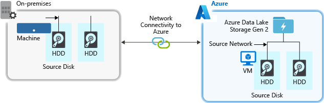
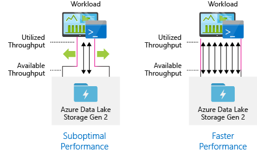

# Best practices for using Azure Data Lake Storage Gen2

This article provides best practice guidelines that help you optimize performance, reduce costs, and secure your Data Lake Storage Gen2 enabled Azure Storage account.

For general suggestions around structuring a data lake, see these articles:

- [Overview of Azure Data Lake Storage for the data management and analytics scenario](/azure/cloud-adoption-framework/scenarios/data-management/best-practices/data-lake-overview?toc=/azure/storage/blobs/toc.json)
- [Provision three Azure Data Lake Storage Gen2 accounts for each data landing zone](/azure/cloud-adoption-framework/scenarios/data-management/best-practices/data-lake-services?toc=/azure/storage/blobs/toc.json)

## Find documentation

Azure Data Lake Storage Gen2 isn't a dedicated service or account type. It's a set of capabilities that support high throughput analytic workloads. The Data Lake Storage Gen2 documentation provides best practices and guidance for using these capabilities. For all other aspects of account management such as setting up network security, designing for high availability, and disaster recovery, see the [Blob storage documentation](storage-blobs-introduction.md) content.

#### Evaluate feature support and known issues

Use the following pattern as you configure your account to use Blob storage features.

1. Review the [Blob Storage feature support in Azure Storage accounts](storage-feature-support-in-storage-accounts.md) article to determine whether a feature is fully supported in your account. Some features aren't yet supported or have partial support in Data Lake Storage Gen2 enabled accounts. Feature support is always expanding so make sure to periodically review this article for updates.

2. Review the [Known issues with Azure Data Lake Storage Gen2](data-lake-storage-known-issues.md) article to see if there are any limitations or special guidance around the feature you intend to use.

3. Scan feature articles for any guidance that is specific to Data Lake Storage Gen2 enabled accounts.

#### Understand the terms used in documentation

As you move between content sets, you notice some slight terminology differences. For example, content featured in the [Blob storage documentation](storage-blobs-introduction.md), will use the term *blob* instead of *file*. Technically, the files that you ingest to your storage account become blobs in your account. Therefore, the term is correct. However, the term *blob* can cause confusion if you're used to the term *file*. You'll also see the term *container* used to refer to a *file system*. Consider these terms as synonymous.

## Consider premium

If your workloads require a low consistent latency and/or require a high number of input output operations per second (IOP), consider using a premium block blob storage account. This type of account makes data available via high-performance hardware. Data is stored on solid-state drives (SSDs) which are optimized for low latency. SSDs provide higher throughput compared to traditional hard drives. The storage costs of premium performance are higher, but transaction costs are lower. Therefore, if your workloads execute a large number of transactions, a premium performance block blob account can be economical.

If your storage account is going to be used for analytics, we highly recommend that you use Azure Data Lake Storage Gen2 along with a premium block blob storage account. This combination of using premium block blob storage accounts along with a Data Lake Storage enabled account is referred to as the [premium tier for Azure Data Lake Storage](premium-tier-for-data-lake-storage.md).

## Optimize for data ingest

When ingesting data from a source system, the source hardware, source network hardware, or the network connectivity to your storage account can be a bottleneck.

### Source hardware

Whether you're using on-premises machines or Virtual Machines (VMs) in Azure, make sure to carefully select the appropriate hardware. For disk hardware, consider using Solid State Drives (SSD) and pick disk hardware that has faster spindles. For network hardware, use the fastest Network Interface Controllers (NIC) as possible. On Azure, we recommend Azure D14 VMs, which have the appropriately powerful disk and networking hardware.

### Network connectivity to the storage account

The network connectivity between your source data and your storage account can sometimes be a bottleneck. When your source data is on premise, consider using a dedicated link with [Azure ExpressRoute](https://azure.microsoft.com/services/expressroute/). If your source data is in Azure, the performance is best when the data is in the same Azure region as your Data Lake Storage Gen2 enabled account.

### Configure data ingestion tools for maximum parallelization

To achieve the best performance, use all available throughput by performing as many reads and writes in parallel as possible.

The following table summarizes the key settings for several popular ingestion tools.

| Tool               | Settings |
|--------------------|------------------------------------------------------|
| [DistCp](data-lake-storage-use-distcp.md#performance-considerations-while-using-distcp)             | -m (mapper)	|
| [Azure Data Factory](../../data-factory/copy-activity-performance.md) | parallelCopies	|
| [Sqoop](/archive/blogs/shanyu/performance-tuning-for-hdinsight-storm-and-microsoft-azure-eventhubs)          | fs.azure.block.size, -m (mapper)	|

> [!NOTE]
> The overall performance of your ingest operations depend on other factors that are specific to the tool that you're using to ingest data. For the best up-to-date guidance, see the documentation for each tool that you intend to use.

Your account can scale to provide the necessary throughput for all analytics scenarios. By default, a Data Lake Storage Gen2 enabled account provides enough throughput in its default configuration to meet the needs of a broad category of use cases. If you run into the default limit, the account can be configured to provide more throughput by contacting [Azure Support](https://azure.microsoft.com/support/faq/).

## Structure data sets

Consider pre-planning the structure of your data. File format, file size, and directory structure can all impact performance and cost.

### File formats

Data can be ingested in various formats. Data can appear in human readable formats such as JSON, CSV, or XML or as compressed binary formats such as `.tar.gz`. Data can come in various sizes as well. Data can be composed of large files (a few terabytes) such as data from an export of a SQL table from your on-premises systems. Data can also come in the form of a large number of tiny files (a few kilobytes) such as data from real-time events from an Internet of things (IoT) solution. You can optimize efficiency and costs by choosing an appropriate file format and file size.

Hadoop supports a set of file formats that are optimized for storing and processing structured data. Some common formats are Avro, Parquet, and Optimized Row Columnar (ORC) format. All of these formats are machine-readable binary file formats. They're compressed to help you manage file size. They have a schema embedded in each file, which makes them self-describing. The difference between these formats is in how data is stored. Avro stores data in a row-based format and the Parquet and ORC formats store data in a columnar format.

Consider using the Avro file format in cases where your I/O patterns are more write heavy, or the query patterns favor retrieving multiple rows of records in their entirety. For example, the Avro format works well with a message bus such as Event Hubs or Kafka that write multiple events/messages in succession.

Consider Parquet and ORC file formats when the I/O patterns are more read heavy or when the query patterns are focused on a subset of columns in the records. Read transactions can be optimized to retrieve specific columns instead of reading the entire record.

Apache Parquet is an open source file format that is optimized for read heavy analytics pipelines. The columnar storage structure of Parquet lets you skip over non-relevant data. Your queries are much more efficient because they can narrowly scope which data to send from storage to the analytics engine. Also, because similar data types (for a column) are stored together, Parquet supports efficient data compression and encoding schemes that can lower data storage costs. Services such as [Azure Synapse Analytics](../../synapse-analytics/overview-what-is.md), [Azure Databricks](/azure/databricks/scenarios/what-is-azure-databricks) and [Azure Data Factory](../../data-factory/introduction.md) have native functionality that take advantage of Parquet file formats.

### File size

Larger files lead to better performance and reduced costs.

Typically, analytics engines such as HDInsight have a per-file overhead that involves tasks such as listing, checking access, and performing various metadata operations. If you store your data as many small files, this can negatively affect performance. In general, organize your data into larger sized files for better performance (256 MB to 100 GB in size). Some engines and applications might have trouble efficiently processing files that are greater than 100 GB in size.

Increasing file size can also reduce transaction costs. Read and write operations are billed in 4 megabyte increments so you're charged for operation whether or not the file contains 4 megabytes or only a few kilobytes. For pricing information, see [Azure Data Lake Storage pricing](https://azure.microsoft.com/pricing/details/storage/data-lake/).

Sometimes, data pipelines have limited control over the raw data, which has lots of small files. In general, we recommend that your system have some sort of process to aggregate small files into larger ones for use by downstream applications. If you're processing data in real time, you can use a real time streaming engine (such as [Azure Stream Analytics](../../stream-analytics/stream-analytics-introduction.md) or [Spark Streaming](https://databricks.com/glossary/what-is-spark-streaming)) together with a message broker (such as [Event Hubs](../../event-hubs/event-hubs-about.md) or [Apache Kafka](https://kafka.apache.org/)) to store your data as larger files. As you aggregate small files into larger ones, consider saving them in a read-optimized format such as [Apache Parquet](https://parquet.apache.org/) for downstream processing.

### Directory structure

Every workload has different requirements on how the data is consumed, but these are some common layouts to consider when working with Internet of Things (IoT), batch scenarios or when optimizing for time-series data.

#### IoT structure

In IoT workloads, there can be a great deal of data being ingested that spans across numerous products, devices, organizations, and customers. It's important to pre-plan the directory layout for organization, security, and efficient processing of the data for down-stream consumers. A general template to consider might be the following layout:

- *{Region}/{SubjectMatter(s)}/{yyyy}/{mm}/{dd}/{hh}/*

For example, landing telemetry for an airplane engine within the UK might look like the following structure:

- *UK/Planes/BA1293/Engine1/2017/08/11/12/*

In this example, by putting the date at the end of the directory structure, you can use ACLs to more easily secure regions and subject matters to specific users and groups. If you put the date structure at the beginning, it would be much more difficult to secure these regions and subject matters. For example, if you wanted to provide access only to UK data or certain planes, you'd need to apply a separate permission for numerous directories under every hour directory. This structure would also exponentially increase the number of directories as time went on.

#### Batch jobs structure

A commonly used approach in batch processing is to place data into an "in" directory. Then, once the data is processed, put the new data into an "out" directory for downstream processes to consume. This directory structure is sometimes used for jobs that require processing on individual files, and might not require massively parallel processing over large datasets. Like the IoT structure recommended above, a good directory structure has the parent-level directories for things such as region and subject matters (for example, organization, product, or producer). Consider date and time in the structure to allow better organization, filtered searches, security, and automation in the processing. The level of granularity for the date structure is determined by the interval on which the data is uploaded or processed, such as hourly, daily, or even monthly.

Sometimes file processing is unsuccessful due to data corruption or unexpected formats. In such cases, a directory structure might benefit from a **/bad** folder to move the files to for further inspection. The batch job might also handle the reporting or notification of these *bad* files for manual intervention. Consider the following template structure:

- *{Region}/{SubjectMatter(s)}/In/{yyyy}/{mm}/{dd}/{hh}/*
- *{Region}/{SubjectMatter(s)}/Out/{yyyy}/{mm}/{dd}/{hh}/*
- *{Region}/{SubjectMatter(s)}/Bad/{yyyy}/{mm}/{dd}/{hh}/*

For example, a marketing firm receives daily data extracts of customer updates from their clients in North America. It might look like the following snippet before and after being processed:

- *NA/Extracts/ACMEPaperCo/In/2017/08/14/updates_08142017.csv*
- *NA/Extracts/ACMEPaperCo/Out/2017/08/14/processed_updates_08142017.csv*

In the common case of batch data being processed directly into databases such as Hive or traditional SQL databases, there isn't a need for an **/in** or **/out** directory because the output already goes into a separate folder for the Hive table or external database. For example, daily extracts from customers would land into their respective directories. Then, a service such as [Azure Data Factory](../../data-factory/introduction.md), [Apache Oozie](https://oozie.apache.org/), or [Apache Airflow](https://airflow.apache.org/) would trigger a daily Hive or Spark job to process and write the data into a Hive table.

#### Time series data structure

For Hive workloads, partition pruning of time-series data can help some queries read only a subset of the data, which improves performance.

Those pipelines that ingest time-series data, often place their files with a structured naming for files and folders. Below is a common example we see for data that is structured by date:

*/DataSet/YYYY/MM/DD/datafile_YYYY_MM_DD.tsv*

Notice that the datetime information appears both as folders and in the filename.

For date and time, the following is a common pattern

*/DataSet/YYYY/MM/DD/HH/mm/datafile_YYYY_MM_DD_HH_mm.tsv*

Again, the choice you make with the folder and file organization should optimize for the larger file sizes and a reasonable number of files in each folder.

## Set up security

Start by reviewing the recommendations in the [Security recommendations for Blob storage](security-recommendations.md) article. You'll find best practice guidance about how to protect your data from accidental or malicious deletion, secure data behind a firewall, and use Azure Active Directory (Azure AD) as the basis of identity management.

Then, review the [Access control model in Azure Data Lake Storage Gen2](data-lake-storage-access-control-model.md) article for guidance that is specific to Data Lake Storage Gen2 enabled accounts. This article helps you understand how to use Azure role-based access control (Azure RBAC) roles together with access control lists (ACLs) to enforce security permissions on directories and files in your hierarchical file system.

## Ingest, process, and analyze

There are many different sources of data and different ways in which that data can be ingested into a Data Lake Storage Gen2 enabled account.

For example, you can ingest large sets of data from HDInsight and Hadoop clusters or smaller sets of *ad hoc* data for prototyping applications. You can ingest streamed data that is generated by various sources such as applications, devices, and sensors. For this type of data, you can use tools to capture and process the data on an event-by-event basis in real time, and then write the events in batches into your account. You can also ingest web server logs, which contain information such as the history of page requests. For log data, consider writing custom scripts or applications to upload them so that you'll have the flexibility to include your data uploading component as part of your larger big data application.

Once the data is available in your account, you can run analysis on that data, create visualizations, and even download data to your local machine or to other repositories such as an Azure SQL database or SQL Server instance.

The following table recommends tools that you can use to ingest, analyze, visualize, and download data. Use the links in this table to find guidance about how to configure and use each tool.

| Purpose | Tools & Tool guidance |
|---|---|
| Ingest ad hoc data| Azure portal, [Azure PowerShell](data-lake-storage-directory-file-acl-powershell.md), [Azure CLI](data-lake-storage-directory-file-acl-cli.md), [REST](/rest/api/storageservices/data-lake-storage-gen2), [Azure Storage Explorer](https://azure.microsoft.com/features/storage-explorer/), [Apache DistCp](data-lake-storage-use-distcp.md), [AzCopy](../common/storage-use-azcopy-v10.md)|
| Ingest relational data | [Azure Data Factory](../../data-factory/connector-azure-data-lake-store.md) |
| Ingest web server logs | [Azure PowerShell](data-lake-storage-directory-file-acl-powershell.md), [Azure CLI](data-lake-storage-directory-file-acl-cli.md), [REST](/rest/api/storageservices/data-lake-storage-gen2), Azure SDKs ([.NET](data-lake-storage-directory-file-acl-dotnet.md), [Java](data-lake-storage-directory-file-acl-java.md), [Python](data-lake-storage-directory-file-acl-python.md), and [Node.js](data-lake-storage-directory-file-acl-javascript.md)), [Azure Data Factory](../../data-factory/connector-azure-data-lake-store.md) |
| Ingest from HDInsight clusters | [Azure Data Factory](../../data-factory/connector-azure-data-lake-store.md), [Apache DistCp](data-lake-storage-use-distcp.md), [AzCopy](../common/storage-use-azcopy-v10.md) |
| Ingest from Hadoop clusters | [Azure Data Factory](../../data-factory/connector-azure-data-lake-store.md), [Apache DistCp](data-lake-storage-use-distcp.md), [WANdisco LiveData Migrator for Azure](migrate-gen2-wandisco-live-data-platform.md), [Azure Data Box](data-lake-storage-migrate-on-premises-hdfs-cluster.md) |
| Ingest large data sets (several terabytes) | [Azure ExpressRoute](../../expressroute/expressroute-introduction.md) |
| Process & analyze data | [Azure Synapse Analytics](../../synapse-analytics/get-started-analyze-storage.md), [Azure HDInsight](../../hdinsight/hdinsight-hadoop-use-data-lake-storage-gen2.md), [Databricks](/azure/databricks/scenarios/databricks-extract-load-sql-data-warehouse) |
| Visualize data | [Power BI](/power-query/connectors/datalakestorage), [Azure Data Lake Storage query acceleration](data-lake-storage-query-acceleration.md) |
| Download data | Azure portal, [PowerShell](data-lake-storage-directory-file-acl-powershell.md), [Azure CLI](data-lake-storage-directory-file-acl-cli.md), [REST](/rest/api/storageservices/data-lake-storage-gen2), Azure SDKs ([.NET](data-lake-storage-directory-file-acl-dotnet.md), [Java](data-lake-storage-directory-file-acl-java.md), [Python](data-lake-storage-directory-file-acl-python.md), and [Node.js](data-lake-storage-directory-file-acl-javascript.md)), [Azure Storage Explorer](data-lake-storage-explorer.md), [AzCopy](../common/storage-use-azcopy-v10.md#transfer-data), [Azure Data Factory](../../data-factory/copy-activity-overview.md), [Apache DistCp](./data-lake-storage-use-distcp.md) |

> [!NOTE]
> This table doesn't reflect the complete list of Azure services that support Data Lake Storage Gen2. To see a list of supported Azure services, their level of support, see [Azure services that support Azure Data Lake Storage Gen2](data-lake-storage-supported-azure-services.md).

## Monitor telemetry

Monitoring the use and performance is an important part of operationalizing your service. Examples include frequent operations, operations with high latency, or operations that cause service-side throttling.

All of the telemetry for your storage account is available through [Azure Storage logs in Azure Monitor](monitor-blob-storage.md). This feature integrates your storage account with Log Analytics and Event Hubs, while also enabling you to archive logs to another storage account. To see the full list of metrics and resources logs and their associated schema, see [Azure Storage monitoring data reference](monitor-blob-storage-reference.md).

Where you choose to store your logs depends on how you plan to access them. For example, if you want to access your logs in near real time, and be able to correlate events in logs with other metrics from Azure Monitor, you can store your logs in a Log Analytics workspace. Then, query your logs by using KQL and author queries, which enumerate the `StorageBlobLogs` table in your workspace.

If you want to store your logs for both near real-time query and long term retention, you can configure your diagnostic settings to send logs to both a Log Analytics workspace and a storage account.

If you want to access your logs through another query engine such as Splunk, you can configure your diagnostic settings to send logs to an event hub and ingest logs from the event hub to your chosen destination.

Azure Storage logs in Azure Monitor can be enabled through the Azure portal, PowerShell, the Azure CLI, and Azure Resource Manager templates. For at-scale deployments, Azure Policy can be used with full support for remediation tasks. For more information, see [ciphertxt/AzureStoragePolicy](https://github.com/ciphertxt/AzureStoragePolicy).

## See also

- [Key considerations for Azure Data Lake Storage](/azure/cloud-adoption-framework/scenarios/data-management/best-practices/data-lake-key-considerations)
- [Access control model in Azure Data Lake Storage Gen2](data-lake-storage-access-control-model.md)
- [The hitchhiker's guide to the Data Lake](https://azure.github.io/Storage/docs/analytics/hitchhikers-guide-to-the-datalake/)
- [Overview of Azure Data Lake Storage Gen2](data-lake-storage-introduction.md)
