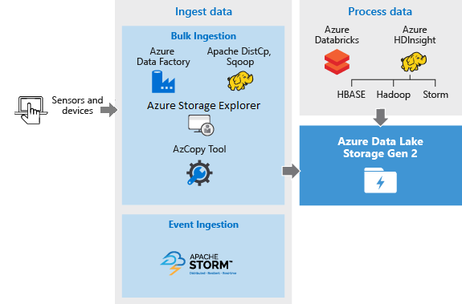
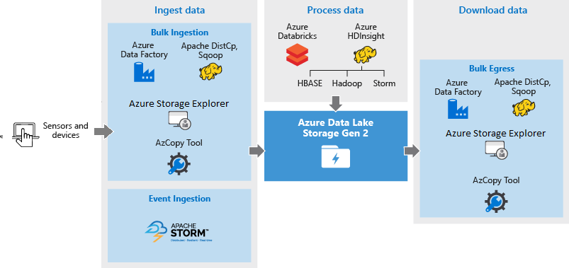

# Best practices for using Azure Data Lake Storage Gen2

Some sort of intro goes here.

## Create a storage account

Maybe brief discussion of how many accounts to open? Draw from hitch guide.
Point to article for creating a storage account.

## Configure a storage account

Talk about various settings of storage account and that this is actually just a blob storage account.
Briefly discuss various features such as resiliency.
Point to blob storage support article for data lake storage gen2.
Add all content about structuring folders and files from best practices

Because customer managed failover is not yet supported you should consider ways for the applications using Data Lake Storage Gen2 to automatically fail over to the secondary region through monitoring triggers or length of failed attempts, or at least send a notification to admins for manual intervention. Keep in mind that there is tradeoff of failing over versus waiting for a service to come back online.

## Prepare to ingest data

When ingesting data from a source system, the source hardware, source network hardware, or the network connectivity to your storage account can be a bottleneck.  

### Source hardware

Whether you are using on-premise machines or Virtual Machines (VMs) in Azure, make sure to carefully select the appropriate hardware. For disk hardware, consider using Solid State Drives (SSD) and pick disk hardware that has faster spindles. For network hardware, use the fastest Network Interface Controllers (NIC) as possible. On Azure, we recommend Azure D14 VMs which have the appropriately powerful disk and networking hardware.

### Network connectivity to the storage account

The network connectivity between your source data and your storage account can sometimes be a bottleneck. When your source data is on premise, consider using a dedicated link with [Azure ExpressRoute](https://azure.microsoft.com/services/expressroute/). If your source data is in Azure, the performance is best when the data is in the same Azure region as your Data Lake Storage Gen2 enabled account.

### Configure data ingestion tools for maximum parallelization

To achieve the best performance, use all available throughput by performing as many reads and writes in parallel as possible.

The following table summarizes the key settings for several popular ingestion tools.  

| Tool               | Settings | 
|--------------------|------------------------------------------------------|
| [DistCp](data-lake-storage-use-distcp.md#performance-considerations-while-using-distcp)             | -m (mapper)	|
| [Azure Data Factory](../../data-factory/copy-activity-performance.md) | parallelCopies	| 
| [Sqoop](/archive/blogs/shanyu/performance-tuning-for-hdinsight-storm-and-microsoft-azure-eventhubs)          | fs.azure.block.size, -m (mapper)	|	

> [!NOTE]
> The overall performance of your ingest operations depend on other factors that are specific to the tool that you're using to ingest data. For the best up-to-date guidance, see the documentation for each tool that you intend to use.

Your account can scale to provide the necessary throughput for all analytics scenarios. By default, a Data Lake Storage Gen2 enabled account provides enough throughput in its default configuration to meet the needs of a broad category of use cases. If you run into the default limit, the account can be configured to provide more throughput by contacting [Azure Support](https://azure.microsoft.com/support/faq/).

## Ingest data

This section highlights the different sources of data and the different ways in which that data can be ingested into a Data Lake Storage Gen2 account.

### Ad hoc data

This represents smaller data sets that are used for prototyping a big data application. There are different ways of ingesting ad hoc data depending on the source of the data. 

Here's a list of tools that you can use to ingest ad hoc data.

| Data Source | Ingest it using |
| --- | --- |
| Local computer |[Azure PowerShell](data-lake-storage-directory-file-acl-powershell.md)  [Azure CLI](data-lake-storage-directory-file-acl-cli.md)  [Storage Explorer](https://azure.microsoft.com/features/storage-explorer/)  [AzCopy tool](../common/storage-use-azcopy-v10.md)|
| Azure Storage Blob |[Azure Data Factory](../../data-factory/connector-azure-data-lake-store.md)  [AzCopy tool](../common/storage-use-azcopy-v10.md)  [DistCp running on HDInsight cluster](data-lake-storage-use-distcp.md)|

### Streamed data

This represents data that can be generated by various sources such as applications, devices, sensors, etc. This data can be ingested into Data Lake Storage Gen2 by a variety of tools. These tools will usually capture and process the data on an event-by-event basis in real-time, and then write the events in batches into Data Lake Storage Gen2 so that they can be further processed.

Here's a list of tools that you can use to ingest streamed data.

|Tool | Guidance |
|---|--|
|Azure Stream Analytics|[Quickstart: Create a Stream Analytics job by using the Azure portal](../../stream-analytics/stream-analytics-quick-create-portal.md)   [Egress to Azure Data Lake Gen2](../../stream-analytics/stream-analytics-define-outputs.md)|
|Azure HDInsight Storm | [Write to Apache Hadoop HDFS from Apache Storm on HDInsight](../../hdinsight/storm/apache-storm-write-data-lake-store.md) |

### Relational data

You can also source data from relational databases. Over a period of time, relational databases collect huge amounts of data which can provide key insights if processed through a big data pipeline. You can use the following tools to move such data into Data Lake Storage Gen2.

Here's a list of tools that you can use to ingest relational data.

|Tool | Guidance |
|---|--|
|Azure Data Factory | [Copy Activity in Azure Data Factory](../../data-factory/copy-activity-overview.md) |

### Web server log data (upload using custom applications)

This type of dataset is specifically called out because analysis of web server log data is a common use case for big data applications and requires large volumes of log files to be uploaded to Data Lake Storage Gen2. You can use any of the following tools to write your own scripts or applications to upload such data.

Here's a list of tools that you can use to ingest Web server log data.

|Tool | Guidance |
|---|--|
|Azure Data Factory | [Copy Activity in Azure Data Factory](../../data-factory/copy-activity-overview.md)  |
|Azure CLI|[Azure CLI](data-lake-storage-directory-file-acl-cli.md)|
|Azure PowerShell|[Azure PowerShell](data-lake-storage-directory-file-acl-powershell.md)|

For uploading web server log data, and also for uploading other kinds of data (e.g. social sentiments data), it is a good approach to write your own custom scripts/applications because it gives you the flexibility to include your data uploading component as part of your larger big data application. In some cases this code may take the form of a script or simple command line utility. In other cases, the code may be used to integrate big data processing into a business application or solution.

### Data associated with Azure HDInsight clusters

Most HDInsight cluster types (Hadoop, HBase, Storm) support Data Lake Storage Gen2 as a data storage repository. HDInsight clusters access data from Azure Storage Blobs (WASB). For better performance, you can copy the data from WASB into a Data Lake Storage Gen2 account associated with the cluster. You can use the following tools to copy the data.

Here's a list of tools that you can use to ingest data associated with HDInsight clusters.

|Tool | Guidance |
|---|--|
|Apache DistCp | [Use DistCp to copy data between Azure Storage Blobs and Azure Data Lake Storage Gen2](./data-lake-storage-use-distcp.md) |
|AzCopy tool | [Transfer data with the AzCopy](../common/storage-use-azcopy-v10.md) |
|Azure Data Factory | [Copy data to or from Azure Data Lake Storage Gen2 by using Azure Data Factory](../../data-factory/load-azure-data-lake-storage-gen2.md) |

### Data stored in on-premises or IaaS Hadoop clusters

Large amounts of data may be stored in existing Hadoop clusters, locally on machines using HDFS. The Hadoop clusters may be in an on-premises deployment or may be within an IaaS cluster on Azure. There could be requirements to copy such data to Azure Data Lake Storage Gen2 for a one-off approach or in a recurring fashion. There are various options that you can use to achieve this. Below is a list of alternatives and the associated trade-offs.

| Approach | Details | Advantages | Considerations |
| --- | --- | --- | --- |
| Use Azure Data Factory (ADF) to copy data directly from Hadoop clusters to Azure Data Lake Storage Gen2 |[ADF supports HDFS as a data source](../../data-factory/connector-hdfs.md) |ADF provides out-of-the-box support for HDFS and first class end-to-end management and monitoring |Requires Data Management Gateway to be deployed on-premises or in the IaaS cluster |
| Use Distcp to copy data from Hadoop to Azure Storage. Then copy data from Azure Storage to Data Lake Storage Gen2 using appropriate mechanism. |You can copy data from Azure Storage to Data Lake Storage Gen2 using: <ul><li>[Azure Data Factory](../../data-factory/copy-activity-overview.md)</li><li>[AzCopy tool](../common/storage-use-azcopy-v10.md)</li><li>[Apache DistCp running on HDInsight clusters](data-lake-storage-use-distcp.md)</li></ul> |You can use open-source tools. |Multi-step process that involves multiple technologies |

### Really large datasets

For uploading datasets that range in several terabytes, using the methods described above can sometimes be slow and costly. In such cases, you can use Azure ExpressRoute.  

Azure ExpressRoute lets you create private connections between Azure data centers and infrastructure on your premises. This provides a reliable option for transferring large amounts of data. To learn more, see [Azure ExpressRoute documentation](../../expressroute/expressroute-introduction.md).

## Structuring data sets

When ingesting data it's important to pre-plan the structure of the data so that security, partitioning, and processing can be utilized effectively. Many of the following recommendations are applicable for all big data workloads. The file size, number of files, and folder structure have an impact on performance.  The following section describes best practices in these areas. Every workload has different requirements on how the data is consumed, but below are some common layouts to consider when working with Internet of Things (IoT) and batch scenarios.

### Directory layout

#### IoT structure

In IoT workloads, there can be a great deal of data being ingested that spans across numerous products, devices, organizations, and customers. It's important to pre-plan the directory layout for organization, security, and efficient processing of the data for down-stream consumers. A general template to consider might be the following layout:

*{Region}/{SubjectMatter(s)}/{yyyy}/{mm}/{dd}/{hh}/*

For example, landing telemetry for an airplane engine within the UK might look like the following structure:

*UK/Planes/BA1293/Engine1/2017/08/11/12/*

In this example, by putting the date at the end of the directory structure, you can use ACLs to more easily secure regions and subject matters to specific users and groups. If you put the data structure at the beginning, it would be much more difficult to secure these regions and subject matters. For example, if you wanted to provide access only to UK data or certain planes, you'd need to apply a separate permission for numerous directories under every hour directory. This structure would also exponentially increase the number of directories as time went on.

#### Batch jobs structure

A commonly used approach in batch processing is to place data into an "in" directory. Then, once the data is processed, put the new data into an "out" directory for downstream processes to consume. This directory structure is sometimes used for jobs that require processing on individual files, and might not require massively parallel processing over large datasets. Like the IoT structure recommended above, a good directory structure has the parent-level directories for things such as region and subject matters (for example, organization, product, or producer). Consider date and time in the structure to allow better organization, filtered searches, security, and automation in the processing. The level of granularity for the date structure is determined by the interval on which the data is uploaded or processed, such as hourly, daily, or even monthly.

Sometimes file processing is unsuccessful due to data corruption or unexpected formats. In such cases, a directory structure might benefit from a **/bad** folder to move the files to for further inspection. The batch job might also handle the reporting or notification of these *bad* files for manual intervention. Consider the following template structure:

*{Region}/{SubjectMatter(s)}/In/{yyyy}/{mm}/{dd}/{hh}/*\
*{Region}/{SubjectMatter(s)}/Out/{yyyy}/{mm}/{dd}/{hh}/*\
*{Region}/{SubjectMatter(s)}/Bad/{yyyy}/{mm}/{dd}/{hh}/*

For example, a marketing firm receives daily data extracts of customer updates from their clients in North America. It might look like the following snippet before and after being processed:

*NA/Extracts/ACMEPaperCo/In/2017/08/14/updates_08142017.csv*\
*NA/Extracts/ACMEPaperCo/Out/2017/08/14/processed_updates_08142017.csv*

In the common case of batch data being processed directly into databases such as Hive or traditional SQL databases, there isn’t a need for an **/in** or **/out** directory because the output already goes into a separate folder for the Hive table or external database. For example, daily extracts from customers would land into their respective directories. Then, a service such as [Azure Data Factory](../../data-factory/introduction.md), [Apache Oozie](https://oozie.apache.org/), or [Apache Airflow](https://airflow.apache.org/) would trigger a daily Hive or Spark job to process and write the data into a Hive table.

#### time series data structure

For Hive workloads, partition pruning of time-series data can help some queries read only a subset of the data which improves performance.    

Those pipelines that ingest time-series data, often place their files with a very structured naming for files and folders. Below is a very common example we see for data that is structured by date:

*\DataSet\YYYY\MM\DD\datafile_YYYY_MM_DD.tsv*

Notice that the datetime information appears both as folders and in the filename.

For date and time, the following is a common pattern

*\DataSet\YYYY\MM\DD\HH\mm\datafile_YYYY_MM_DD_HH_mm.tsv*

Again, the choice you make with the folder and file organization should optimize for the larger file sizes and a reasonable number of files in each folder.

For other directory layout structure suggestions, see [Directory structure](data-lake-storage-best-practices.md#directory-layout-considerations)

### File size

Typically, analytics engines such as HDInsight have a per-file overhead that involve tasks such as listing, checking access, and performing various metadata operations. If you store your data as many small files, this can negatively affect performance. In general, organize your data into larger sized files for better performance (256MB to 100GB in size). Some engines and applications might have trouble efficiently processing files that are greater than 100GB in size.

Sometimes, data pipelines have limited control over the raw data which has lots of small files. In general, we recommend that your system have some sort of process to aggregate small files into larger ones for use by downstream applications. If you're processing data in real-time, you can use a real time streaming engine (such as [Azure Stream Analytics](../../stream-analytics/stream-analytics-introduction.md) or [Spark Streaming](https://databricks.com/glossary/what-is-spark-streaming)) together with a message broker (such as [Event Hub](../../event-hubs/event-hubs-about.md) or [Apache Kafka](https://kafka.apache.org/)) to store your data as larger files.

As you aggregate small files into larger ones, consider saving them in a read-optimized format such as [Apache Parquet](https://parquet.apache.org/) for downstream processing. Apache Parquet is an open source file format that is optimized for read heavy analytics pipelines. The columnar storage structure of Parquet lets you skip over non-relevant data. You're queries are much more efficient because they can narrowly scope which data to send from storage to the analytics engine. Also, because similar data types (for a column) are stored together, Parquet supports efficient data compression and encoding schemes that can lower data storage costs. Services such as [Azure Synapse Analytics](../../synapse-analytics/overview-what-is.md), [Azure Databricks](/azure/databricks/scenarios/what-is-azure-databricks) and [Azure Data Factory](../../data-factory/introduction.md) have native functionality that take advantage of Parquet file formats.

## Set up security

For general information about the Data Lake Storage Gen2 access control model, see [Access control model in Azure Data Lake Storage Gen2](data-lake-storage-access-control-model.md).

For general security recommendations, see [Security recommendations for Blob storage](security-recommendations.md)

## Process data

Once the data is available in Data Lake Storage Gen2 you can run analysis on that data using the supported big data applications. 

Here's a list of tools that you can use to run data analysis jobs on data that is stored in Data Lake Storage Gen2.

|Tool | Guidance |
|---|--|
|Azure HDInsight | [Use Azure Data Lake Storage Gen2 with Azure HDInsight clusters](../../hdinsight/hdinsight-hadoop-use-data-lake-storage-gen2.md) |
|Azure Databricks | [Azure Data Lake Storage Gen2](/azure/databricks/data/data-sources/azure/azure-datalake-gen2)  [Quickstart: Analyze data in Azure Data Lake Storage Gen2 by using Azure Databricks](./data-lake-storage-use-databricks-spark.md?toc=%2fazure%2fstorage%2fblobs%2ftoc.json)  [Tutorial: Extract, transform, and load data by using Azure Databricks](/azure/databricks/scenarios/databricks-extract-load-sql-data-warehouse?toc=%2fazure%2fstorage%2fblobs%2ftoc.json)|

## Visualize and query data

Use the Power BI connector to create visual representations of data stored in Data Lake Storage Gen2. See [Analyze data in Azure Data Lake Storage Gen2 by using Power BI](/power-query/connectors/datalakestorage).

Query acceleration enables applications and analytics frameworks to dramatically optimize data processing by retrieving only the data that they require to perform a given operation. This reduces the time and processing power that is required to gain critical insights into stored data.

Query acceleration accepts filtering predicates and column projections which enable applications to filter rows and columns at the time that data is read from disk. Only the data that meets the conditions of a predicate are transferred over the network to the application. This reduces network latency and compute cost. 

To learn more, see [Azure Data Lake Storage query acceleration](data-lake-storage-query-acceleration.md)

## Download data

You might also want to download or move data from Azure Data Lake Storage Gen2 for scenarios such as:

* Move data to other repositories to interface with your existing data processing pipelines. For example, you might want to move data from Data Lake Storage Gen2 to Azure SQL Database or a SQL Server instance.

* Download data to your local computer for processing in IDE environments while building application prototypes.

Here's a list of tools that you can use to download data from Data Lake Storage Gen2.

|Tool | Guidance |
|---|--|
|Azure Data Factory | [Copy Activity in Azure Data Factory](../../data-factory/copy-activity-overview.md) |
|Apache DistCp | [Use DistCp to copy data between Azure Storage Blobs and Azure Data Lake Storage Gen2](./data-lake-storage-use-distcp.md) |
|Azure Storage Explorer|[Use Azure Storage Explorer to manage directories, files, and ACLs in Azure Data Lake Storage Gen2](data-lake-storage-explorer.md)|
|AzCopy tool|[Transfer data with AzCopy and Blob storage](../common/storage-use-azcopy-v10.md#transfer-data)|

## Monitor account

Data Lake Storage Gen2 provides metrics in the Azure portal under the Data Lake Storage Gen2 account and in Azure Monitor. Availability of Data Lake Storage Gen2 is displayed in the Azure portal. To get the most up-to-date availability of a Data Lake Storage Gen2 account, you must run your own synthetic tests to validate availability. Other metrics such as total storage utilization, read/write requests, and ingress/egress are available to be leveraged by monitoring applications and can also trigger alerts when thresholds (for example, Average latency or # of errors per minute) are exceeded.

## See also

- [Access control model in Azure Data Lake Storage Gen2](data-lake-storage-access-control-model.md)
- [Optimize Azure Data Lake Storage Gen2 for performance](data-lake-storage-performance-tuning-guidance.md)
- [The hitchhiker's guide to the Data Lake](https://github.com/rukmani-msft/adlsguidancedoc/blob/master/Hitchhikers_Guide_to_the_Datalake.md)
- [Overview of Azure Data Lake Storage Gen2](data-lake-storage-introduction.md)

