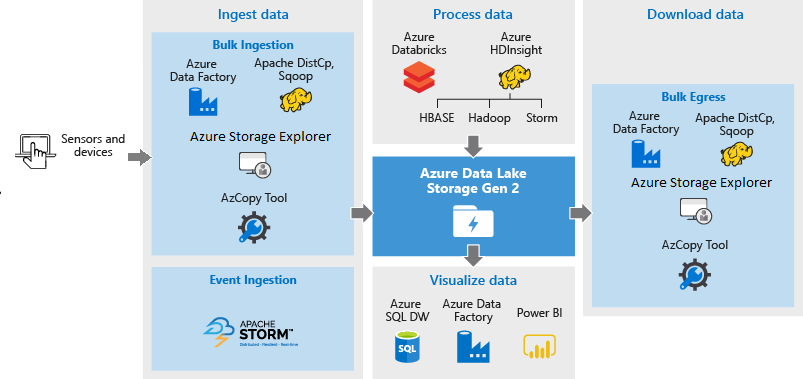

# Using Azure Data Lake Storage Gen2 for big data requirements

There are four key stages in big data processing:

> [!div class="checklist"]
> * Ingesting large amounts of data into a data store, at real-time or in batches
> * Processing the data
> * Downloading the data
> * Visualizing the data

Begin by creating a storage account and a file system. Then, grant access to the data. The first few sections of this article help you accomplish those tasks. In the remaining sections, we'll highlight the options and tools for each  processing phase.

## Create a Data Lake Storage Gen2 account

A Data Lake Storage Gen2 account is a storage account that has a hierarchical namespace. 

To create one, see [Quickstart: Create an Azure Data Lake Storage Gen2 storage account](https://docs.microsoft.com/azure/storage/blobs/data-lake-storage-quickstart-create-account?toc=%2fazure%2fstorage%2fblobs%2ftoc.json).

## Create a file system

A *file system* is a container for folders and files. You need at least one of them to begin ingesting data in your storage account.  Here's a list of tools that you can use to create them.

|Tool | Guidance |
|---|--|
|Azure Storage Explorer | [Create a file system by using Storage Explorer](https://docs.microsoft.com/azure/storage/blobs/data-lake-storage-explorer#create-a-file-system) |
|AzCopy | [Create a Blob container or File Share by using AzCopyV10](https://docs.microsoft.com/azure/storage/common/storage-use-azcopy-v10#transfer-files)|
|Hadoop File System (HDFS) Command Line Interface (CLI) with HDInsight |[Create a file system by using HDFS with HDInsight](https://docs.microsoft.com/azure/storage/blobs/data-lake-storage-use-hdfs-data-lake-storage?toc=%2fazure%2fstorage%2fblobs%2ftoc.json#create-a-file-system) |
|Code in an Azure Databricks Notebook|[Create a storage account file system (Scala)](https://docs.microsoft.com/azure/storage/blobs/data-lake-storage-quickstart-create-databricks-account?toc=%2fazure%2fstorage%2fblobs%2ftoc.json#create-storage-account-file-system)    [Create a file system and mount it (Python)](https://docs.microsoft.com/azure/storage/blobs/data-lake-storage-use-databricks-spark?toc=%2fazure%2fstorage%2fblobs%2ftoc.json#create-a-file-system-and-mount-it)|

It's easiest to create file systems by using Storage Explorer or AzCopy. It takes a bit more work to create file systems by using HDInsight and Databricks. However, if you're planning to use HDInsight or Databricks clusters to process your data anyway, then you can create your clusters first, and use the HDFS CLI to your create file systems.  

## Grant access to the data

Set up the appropriate access permissions to your account, and the data in your account, before you begin ingesting data.

There's three ways to grant access:

* Assign one of these roles to a user, group, user-managed identity, or service principal:

  [Storage Blob Data Reader](https://docs.microsoft.com/azure/role-based-access-control/built-in-roles#storage-blob-data-reader)

  [Storage Blob Data Contributor](https://docs.microsoft.com/azure/role-based-access-control/built-in-roles#storage-queue-data-contributor)

  [Storage Blob Data Owner](https://docs.microsoft.com/azure/role-based-access-control/built-in-roles#storage-blob-data-owner)

* Use a Shared Access Signature (SAS) token.

* Use a storage account key.

This table shows how to grant access for each Azure service or tool.

|Tool | To grant access | Guidance |
|---|--|---|
|Storage Explorer| Assign a role to users and groups | [Assign administrator and non-administrator roles to users with Azure Active Directory](https://docs.microsoft.com/azure/active-directory/fundamentals/active-directory-users-assign-role-azure-portal) |
|AzCopy| Assign a role to users and groups  **or**  Use a SAS token| [Assign administrator and non-administrator roles to users with Azure Active Directory](https://docs.microsoft.com/azure/active-directory/fundamentals/active-directory-users-assign-role-azure-portal)  [Easily Create a SAS to Download a File from Azure Storage–Using Azure Storage Explorer](https://blogs.msdn.microsoft.com/jpsanders/2017/10/12/easily-create-a-sas-to-download-a-file-from-azure-storage-using-azure-storage-explorer/)|
|Apache DistCp | Assign a role to a user-assigned managed identity | [Creating an HDInsight cluster with Data Lake Storage Gen2](https://docs.microsoft.com/azure/hdinsight/hdinsight-hadoop-use-data-lake-storage-gen2) |
|Azure Data Factory| Assign a role to a user-assigned-managed identity **or**  Assing a role to a service principal **or**  Use a storage account key | [Linked service properties](https://docs.microsoft.com/azure/data-factory/connector-azure-data-lake-storage#linked-service-properties) |
|Azure HDInsight| Assign a role to a user-assigned managed identity | [Creating an HDInsight cluster with Data Lake Storage Gen2](https://docs.microsoft.com/azure/hdinsight/hdinsight-hadoop-use-data-lake-storage-gen2)|
|Azure Databricks| Assign a role to a service principal | [How to: Use the portal to create an Azure AD application and service principal that can access resources](https://docs.microsoft.com/azure/active-directory/develop/howto-create-service-principal-portal)|

To grant access to specific file and folders, see these articles.

* [Set file and directory level permissions using Azure Storage Explorer with Azure Data Lake Storage Gen2](https://review.docs.microsoft.com/azure/storage/blobs/data-lake-storage-how-to-set-permissions-storage-explorer)

* [Access control lists on files and directories](https://docs.microsoft.com/azure/storage/blobs/data-lake-storage-access-control#access-control-lists-on-files-and-directories)

To learn about setting up other aspects of security, see [Azure Data Lake Storage Gen2 security guide](https://review.docs.microsoft.com/azure/storage/common/storage-data-lake-storage-security-guide?toc=%2fazure%2fstorage%2fblobs%2ftoc.json).

## Ingest the data

This section highlights the different sources of data and the different ways in which that data can be ingested into a Data Lake Storage Gen2 account.

### Ad hoc data

This represents smaller data sets that are used for prototyping a big data application. There are different ways of ingesting ad hoc data depending on the source of the data. 

Here's a list of tools that you can use to ingest ad hoc data.

| Data Source | Ingest it using |
| --- | --- |
| Local computer |[Storage Explorer](https://azure.microsoft.com/features/storage-explorer/)  [AzCopy tool](../common/storage-use-azcopy-v10.md)|
| Azure Storage Blob |[Azure Data Factory](../../data-factory/connector-azure-data-lake-store.md)  [AzCopy tool](../common/storage-use-azcopy-v10.md)  [DistCp running on HDInsight cluster](data-lake-storage-use-distcp.md)|

### Streamed data

This represents data that can be generated by various sources such as applications, devices, sensors, etc. This data can be ingested into Data Lake Sorage Gen2 by a variety of tools. These tools will usually capture and process the data on an event-by-event basis in real-time, and then write the events in batches into Data Lake Storage Gen2 so that they can be further processed.

Here's a list of tools that you can use to ingest streamed data.

|Tool | Guidance |
|---|--|
|Azure HDInsight Storm | [Write to Apache Hadoop HDFS from Apache Storm on HDInsight](https://docs.microsoft.com/azure/hdinsight/storm/apache-storm-write-data-lake-store) |

### Relational data

You can also source data from relational databases. Over a period of time, relational databases collect huge amounts of data which can provide key insights if processed through a big data pipeline. You can use the following tools to move such data into Data Lake Storage Gen2.

Here's a list of tools that you can use to ingest relational data.

|Tool | Guidance |
|---|--|
|Azure Data Factory | [Copy Activity in Azure Data Factory](https://docs.microsoft.com/azure/data-factory/copy-activity-overview) |

### Web server log data (upload using custom applications)

This type of dataset is specifically called out because analysis of web server log data is a common use case for big data applications and requires large volumes of log files to be uploaded to Data Lake Storage Gen2. You can use any of the following tools to write your own scripts or applications to upload such data.

Here's a list of tools that you can use to ingest Web server log data.

|Tool | Guidance |
|---|--|
|Azure Data Factory | [Copy Activity in Azure Data Factory](https://docs.microsoft.com/azure/data-factory/copy-activity-overview)  |

For uploading web server log data, and also for uploading other kinds of data (e.g. social sentiments data), it is a good approach to write your own custom scripts/applications because it gives you the flexibility to include your data uploading component as part of your larger big data application. In some cases this code may take the form of a script or simple command line utility. In other cases, the code may be used to integrate big data processing into a business application or solution.

### Data associated with Azure HDInsight clusters

Most HDInsight cluster types (Hadoop, HBase, Storm) support Data Lake Storage Gen2 as a data storage repository. HDInsight clusters access data from Azure Storage Blobs (WASB). For better performance, you can copy the data from WASB into a Data Lake Storage Gen2 account associated with the cluster. You can use the following tools to copy the data.

Here's a list of tools that you can use to ingest data associated with HDInsight clusters.

|Tool | Guidance |
|---|--|
|Apache DistCp | [Use DistCp to copy data between Azure Storage Blobs and Azure Data Lake Storage Gen2](https://docs.microsoft.com/azure/storage/blobs/data-lake-storage-use-distcp) |
|AzCopy tool | [Transfer data with the AzCopy](https://docs.microsoft.com/azure/storage/common/storage-use-azcopy-v10) |
|Azure Data Factory | [Copy data to or from Azure Data Lake Storage Gen2 by using Azure Data Factory](https://docs.microsoft.com/azure/data-factory/load-azure-data-lake-storage-gen2) |

### Data stored in on-premises or IaaS Hadoop clusters

Large amounts of data may be stored in existing Hadoop clusters, locally on machines using HDFS. The Hadoop clusters may be in an on-premises deployment or may be within an IaaS cluster on Azure. There could be requirements to copy such data to Azure Data Lake Storage Gen2 for a one-off approach or in a recurring fashion. There are various options that you can use to achieve this. Below is a list of alternatives and the associated trade-offs.

| Approach | Details | Advantages | Considerations |
| --- | --- | --- | --- |
| Use Azure Data Factory (ADF) to copy data directly from Hadoop clusters to Azure Data Lake Storage Gen2 |[ADF supports HDFS as a data source](../../data-factory/connector-hdfs.md) |ADF provides out-of-the-box support for HDFS and first class end-to-end management and monitoring |Requires Data Management Gateway to be deployed on-premises or in the IaaS cluster |
| Use Distcp to copy data from Hadoop to Azure Storage. Then copy data from Azure Storage to Data Lake Storage Gen2 using appropriate mechanism. |You can copy data from Azure Storage to Data Lake Storage Gen2 using: <ul><li>[Azure Data Factory](../../data-factory/copy-activity-overview.md)</li><li>[AzCopy tool](../common/storage-use-azcopy-v10.md)</li><li>[Apache DistCp running on HDInsight clusters](data-lake-storage-use-distcp.md)</li></ul> |You can use open-source tools. |Multi-step process that involves multiple technologies |

### Really large datasets

For uploading datasets that range in several terabytes, using the methods described above can sometimes be slow and costly. In such cases, you can use Azure ExpressRoute.  

Azure ExpressRoute lets you create private connections between Azure data centers and infrastructure on your premises. This provides a reliable option for transferring large amounts of data. To learn more, see [Azure ExpressRoute documentation](../../expressroute/expressroute-introduction.md).

## Process the data

Once the data is available in Data Lake Storage Gen2 you can run analysis on that data using the supported big data applications. 

Here's a list of tools that you can use to run data analysis jobs on data that is stored in Data Lake Storage Gen2.

|Tool | Guidance |
|---|--|
|Azure HDInsight | [Use Azure Data Lake Storage Gen2 with Azure HDInsight clusters](https://docs.microsoft.com/azure/hdinsight/hdinsight-hadoop-use-data-lake-storage-gen2) |
|Azure Databricks | [Azure Data Lake Storage Gen2](https://docs.azuredatabricks.net/spark/latest/data-sources/azure/azure-datalake-gen2.html)  [Quickstart: Analyze data in Azure Data Lake Storage Gen2 by using Azure Databricks](https://docs.microsoft.com/azure/storage/blobs/data-lake-storage-quickstart-create-databricks-account?toc=%2fazure%2fstorage%2fblobs%2ftoc.json)  [Tutorial: Extract, transform, and load data by using Azure Databricks](https://docs.microsoft.com/azure/azure-databricks/databricks-extract-load-sql-data-warehouse?toc=%2fazure%2fstorage%2fblobs%2ftoc.json)|

## Visualize the data

You can use a mix of services to create visual representations of data stored in Data Lake Storage Gen2.

* You can start by using [Azure Data Factory to move data from Data Lake Storage Gen2 to Azure SQL Data Warehouse](../../data-factory/copy-activity-overview.md)
* After that, you can [integrate Power BI with Azure SQL Data Warehouse](../../sql-data-warehouse/sql-data-warehouse-get-started-visualize-with-power-bi.md) to create visual representation of the data.

## Download the data

You might also want to download or move data from Azure Data Lake Storage Gen2 for scenarios such as:

* Move data to other repositories to interface with your existing data processing pipelines. For example, you might want to move data from Data Lake Storage Gen2 to Azure SQL Database or on-premises SQL Server.

* Download data to your local computer for processing in IDE environments while building application prototypes.

Here's a list of tools that you can use to download data from Data Lake Storage Gen2.

|Tool | Guidance |
|---|--|
|Azure Data Factory | [Copy Activity in Azure Data Factory](https://docs.microsoft.com/azure/data-factory/copy-activity-overview) |
|Apache DistCp | [Use DistCp to copy data between Azure Storage Blobs and Azure Data Lake Storage Gen2](https://docs.microsoft.com/azure/storage/blobs/data-lake-storage-use-distcp) |
