# Tutorial: Implement the data lake capture pattern to update a Databricks Delta table

This tutorial shows you how to handle events in a storage account that has a hierarchical namespace.

You'll build a small solution that enables a user to populate a Databricks Delta table by uploading a comma-separated values (csv) file that describes a sales order. You'll build this solution by connecting together an Event Grid subscription, an Azure Function, and a [Job](https://docs.azuredatabricks.net/user-guide/jobs.html) in Azure Databricks.

In this tutorial, you will:

> [!div class="checklist"]
> * Create an Event Grid subscription that calls an Azure Function.
> * Create an Azure Function that receives a notification from an event, and then runs the job in Azure Databricks.
> * Create a Databricks job that inserts a customer order into a Databricks Delta table that is located in the storage account.

We'll build this solution in reverse order, starting with the Azure Databricks workspace.

## Prerequisites

* If you don’t have an Azure subscription, create a [free account](https://azure.microsoft.com/free/?WT.mc_id=A261C142F) before you begin.

* Create a storage account that has a hierarchical namespace (Azure Data Lake Storage Gen2). This tutorial uses a storage account named `contosoorders`. Make sure that your user account has the [Storage Blob Data Contributor role](https://docs.microsoft.com/azure/storage/common/storage-auth-aad-rbac) assigned to it.

  See [Create an Azure Data Lake Storage Gen2 account](data-lake-storage-quickstart-create-account.md).

* Create a service principal. See [How to: Use the portal to create an Azure AD application and service principal that can access resources](https://docs.microsoft.com/azure/active-directory/develop/howto-create-service-principal-portal).

  There's a couple of specific things that you'll have to do as you perform the steps in that article.

  :heavy_check_mark: When performing the steps in the [Assign the application to a role](https://docs.microsoft.com/azure/active-directory/develop/howto-create-service-principal-portal#assign-a-role-to-the-application) section of the article, make sure to assign the **Storage Blob Data Contributor** role to the service principal.

  > [!IMPORTANT]
  > Make sure to assign the role in the scope of the Data Lake Storage Gen2 storage account. You can assign a role to the parent resource group or subscription, but you'll receive permissions-related errors until those role assignments propagate to the storage account.

  :heavy_check_mark: When performing the steps in the [Get values for signing in](https://docs.microsoft.com/azure/active-directory/develop/howto-create-service-principal-portal#get-values-for-signing-in) section of the article, paste the tenant ID, app ID, and password values into a text file. You'll need those values later.

## Create a sales order

First, create a csv file that describes a sales order, and then upload that file to the storage account. Later, you'll use the data from this file to populate the first row in our Databricks Delta table.

1. Open Azure Storage Explorer. Then, navigate to your storage account, and in the **Blob Containers** section, create a new container named **data**.

   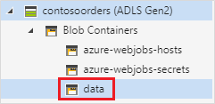

   For more information about how to use Storage Explorer, see [Use Azure Storage Explorer to manage data in an Azure Data Lake Storage Gen2 account](data-lake-storage-explorer.md).

2. In the **data** container, create a folder named **input**.

3. Paste the following text into a text editor.

   ```
   InvoiceNo,StockCode,Description,Quantity,InvoiceDate,UnitPrice,CustomerID,Country
   536365,85123A,WHITE HANGING HEART T-LIGHT HOLDER,6,12/1/2010 8:26,2.55,17850,United Kingdom
   ```

4. Save this file to your local computer and give it the name **data.csv**.

5. In Storage Explorer, upload this file to the **input** folder.  

## Create a job in Azure Databricks

In this section, you'll perform these tasks:

* Create an Azure Databricks workspace.
* Create a notebook.
* Create and populate a Databricks Delta table.
* Add code that inserts rows into the Databricks Delta table.
* Create a Job.

### Create an Azure Databricks workspace

In this section, you create an Azure Databricks workspace using the Azure portal.

1. In the Azure portal, select **Create a resource** > **Analytics** > **Azure Databricks**.

    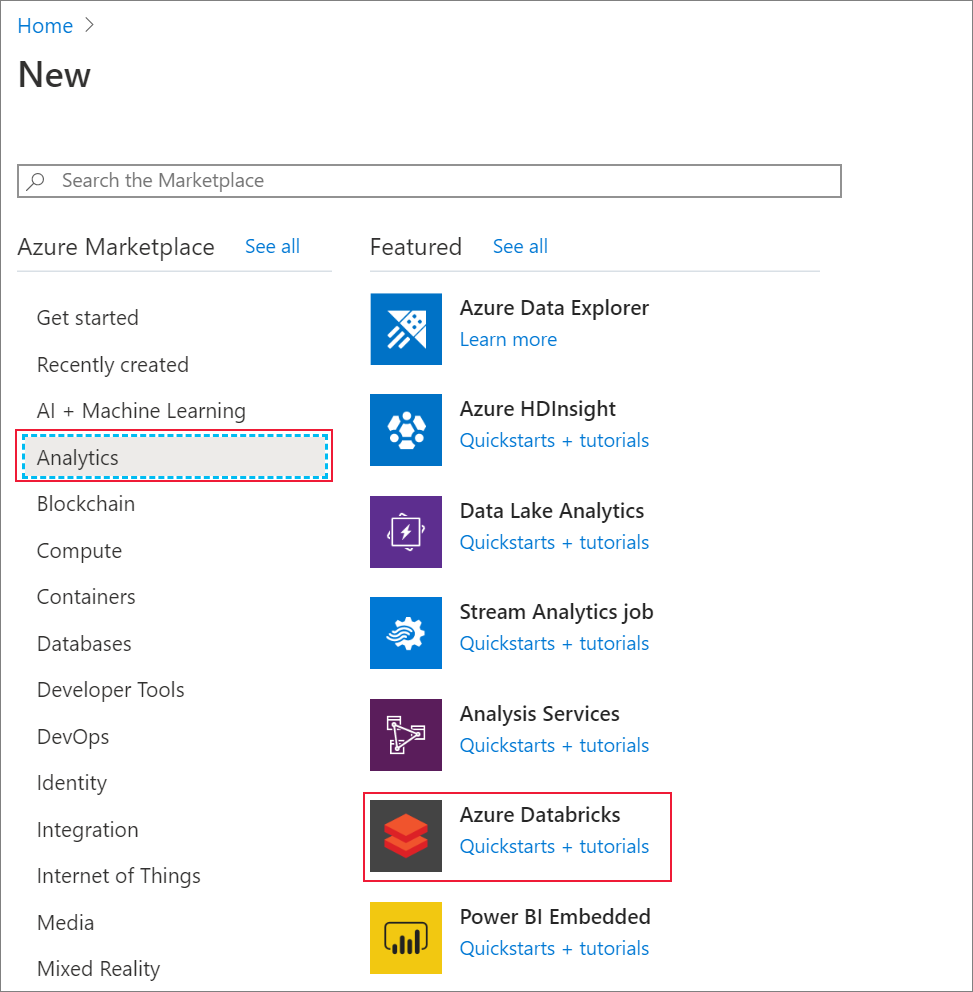

2. Under **Azure Databricks Service**, provide the values to create a Databricks workspace.

    

    The workspace creation takes a few minutes. To monitor the operation status, view the progress bar at the top.

### Create a Spark cluster in Databricks

1. In the [Azure portal](https://portal.azure.com), go to the Azure Databricks workspace that you created, and then select **Launch Workspace**.

2. You are redirected to the Azure Databricks portal. From the portal, select **New** > **Cluster**.

    

3. In the **New cluster** page, provide the values to create a cluster.

    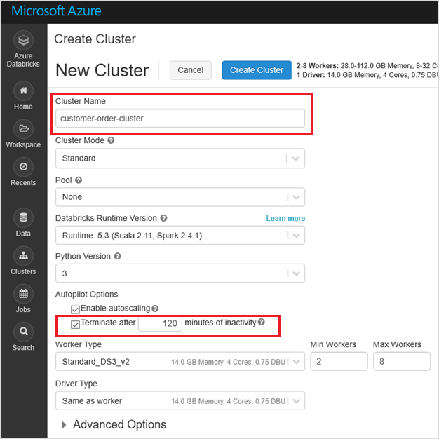

    Accept all other default values other than the following:

    * Enter a name for the cluster.
    * Make sure you select the **Terminate after 120 minutes of inactivity** checkbox. Provide a duration (in minutes) to terminate the cluster, if the cluster is not being used.

4. Select **Create cluster**. Once the cluster is running, you can attach notebooks to the cluster and run Spark jobs.

For more information on creating clusters, see [Create a Spark cluster in Azure Databricks](https://docs.azuredatabricks.net/user-guide/clusters/create.html).

### Create a notebook

1. In the left pane, select **Workspace**. From the **Workspace** drop-down, select **Create** > **Notebook**.

    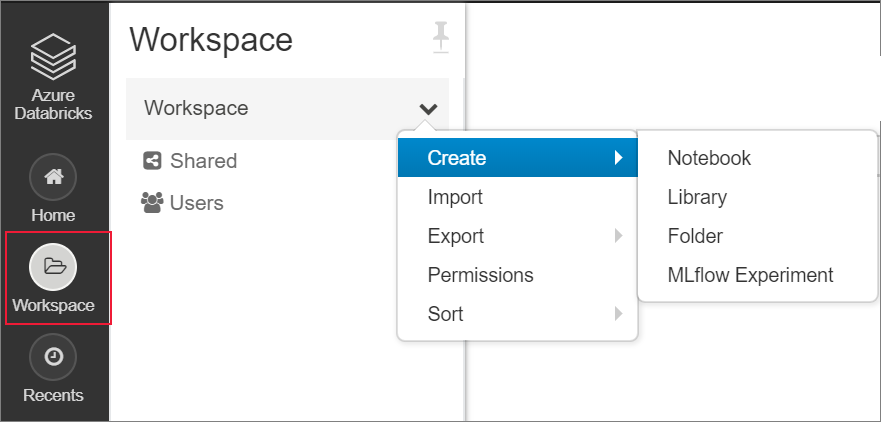

2. In the **Create Notebook** dialog box, enter a name for the notebook. Select **Python** as the language, and then select the Spark cluster that you created earlier.

    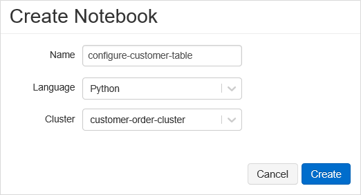

    Select **Create**.

### Create and populate a Databricks Delta table

1. In the notebook that you created, copy and paste the following code block into the first cell, but don't run this code yet.  

   Replace the `appId`, `password`, `tenant` placeholder values in this code block with the values that you collected while completing the prerequisites of this tutorial.

    ```Python
    dbutils.widgets.text('source_file', "", "Source File")

    spark.conf.set("fs.azure.account.auth.type", "OAuth")
    spark.conf.set("fs.azure.account.oauth.provider.type", "org.apache.hadoop.fs.azurebfs.oauth2.ClientCredsTokenProvider")
    spark.conf.set("fs.azure.account.oauth2.client.id", "<appId>")
    spark.conf.set("fs.azure.account.oauth2.client.secret", "<password>")
    spark.conf.set("fs.azure.account.oauth2.client.endpoint", "https://login.microsoftonline.com/<tenant>/oauth2/token")

    adlsPath = 'abfss://data@contosoorders.dfs.core.windows.net/'
    inputPath = adlsPath + dbutils.widgets.get('source_file')
    customerTablePath = adlsPath + 'delta-tables/customers'
    ```

    This code creates a widget named **source_file**. Later, you'll create an Azure Function that calls this code and passes a file path to that widget.  This code also authenticates your service principal with the storage account, and creates some variables that you'll use in other cells.

    > [!NOTE]
    > In a production setting, consider storing your authentication key in Azure Databricks. Then, add a look up key to your code block instead of the authentication key. <br><br>For example, instead of using this line of code: `spark.conf.set("fs.azure.account.oauth2.client.secret", "<password>")`, you would use the following line of code: `spark.conf.set("fs.azure.account.oauth2.client.secret", dbutils.secrets.get(scope = "<scope-name>", key = "<key-name-for-service-credential>"))`. <br><br>After you've completed this tutorial, see the [Azure Data Lake Storage Gen2](https://docs.azuredatabricks.net/spark/latest/data-sources/azure/azure-datalake-gen2.html) article on the Azure Databricks Website to see examples of this approach.

2. Press the **SHIFT + ENTER** keys to run the code in this block.

3. Copy and paste the following code block into a different cell, and then press the **SHIFT + ENTER** keys to run the code in this block.

   ```Python
   from pyspark.sql.types import StructType, StructField, DoubleType, IntegerType, StringType


   inputSchema = StructType([
   StructField("InvoiceNo", IntegerType(), True),
   StructField("StockCode", StringType(), True),
   StructField("Description", StringType(), True),
   StructField("Quantity", IntegerType(), True),
   StructField("InvoiceDate", StringType(), True),
   StructField("UnitPrice", DoubleType(), True),
   StructField("CustomerID", IntegerType(), True),
   StructField("Country", StringType(), True)
   ])

   rawDataDF = (spark.read
    .option("header", "true")
    .schema(inputSchema)
    .csv(adlsPath + 'input')
   )

   (rawDataDF.write
     .mode("overwrite")
     .format("delta")
     .saveAsTable("customer_data", path=customerTablePath))
   ```

   This code creates the Databricks Delta table in your storage account, and then loads some initial data from the csv file that you uploaded earlier.

4. After this code block successfully runs, remove this code block from your notebook.

### Add code that inserts rows into the Databricks Delta table

1. Copy and paste the following code block into a different cell, but don't run this cell.

   ```Python
   upsertDataDF = (spark
     .read
     .option("header", "true")
     .csv(inputPath)
   )
   upsertDataDF.createOrReplaceTempView("customer_data_to_upsert")
   ```

   This code inserts data into a temporary table view by using data from a csv file. The path to that csv file comes from the input widget that you created in an earlier step.

2. Add the following code to merge the contents of the temporary table view with the Databricks Delta table.

   ```
   %sql
   MERGE INTO customer_data cd
   USING customer_data_to_upsert cu
   ON cd.CustomerID = cu.CustomerID
   WHEN MATCHED THEN
     UPDATE SET
       cd.StockCode = cu.StockCode,
       cd.Description = cu.Description,
       cd.InvoiceNo = cu.InvoiceNo,
       cd.Quantity = cu.Quantity,
       cd.InvoiceDate = cu.InvoiceDate,
       cd.UnitPrice = cu.UnitPrice,
       cd.Country = cu.Country
   WHEN NOT MATCHED
     THEN INSERT (InvoiceNo, StockCode, Description, Quantity, InvoiceDate, UnitPrice, CustomerID, Country)
     VALUES (
       cu.InvoiceNo,
       cu.StockCode,
       cu.Description,
       cu.Quantity,
       cu.InvoiceDate,
       cu.UnitPrice,
       cu.CustomerID,
       cu.Country)
   ```

### Create a Job

Create a Job that runs the notebook that you created earlier. Later, you'll create an Azure Function that runs this job when an event is raised.

1. Click **Jobs**.

2. In the **Jobs** page, click **Create Job**.

3. Give the job a name, and then choose the `upsert-order-data` workbook.

   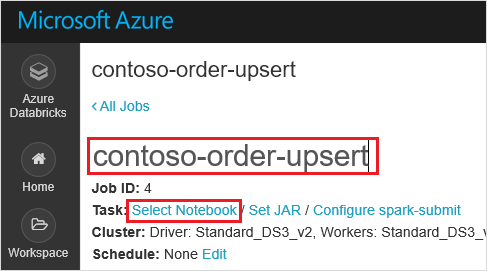

## Create an Azure Function

Create an Azure Function that runs the Job.

1. In the upper corner of the Databricks workspace, choose the people icon, and then choose **User settings**.

   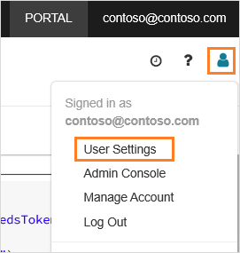

2. Click the **Generate new token** button, and then click the **Generate** button.

   Make sure to copy the token to safe place. Your Azure Function needs this token to authenticate with Databricks so that it can run the Job.
  
3. Select the **Create a resource** button found on the upper left corner of the Azure portal, then select **Compute > Function App**.

   

4. In the **Create** page of the Function App, make sure to select **.NET Core** for the runtime stack, and make sure to configure an Application Insights instance.

   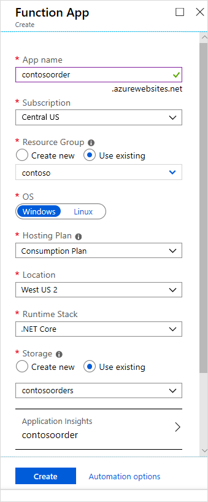

5. In the **Overview** page of the Function App, click **Configuration**.

   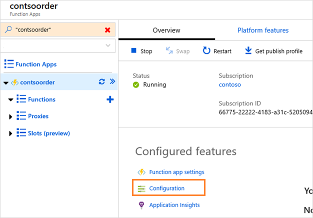

6. In the **Application Settings** page, choose the **New application setting** button to add each setting.

   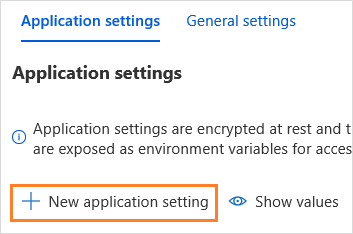

   Add the following settings:

   |Setting name | Value |
   |----|----|
   |**DBX_INSTANCE**| The region of your databricks workspace. For example: `westus2.azuredatabricks.net`|
   |**DBX_PAT**| The personal access token that you generated earlier. |
   |**DBX_JOB_ID**|The identifier of the running job. In our case, this value is `1`.|
7. In the overview page of the function app, click the **New function** button.

   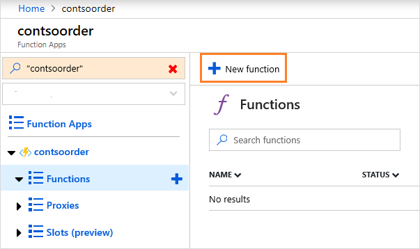

8. Choose **Azure Event Grid Trigger**.

   Install the **Microsoft.Azure.WebJobs.Extensions.EventGrid** extension if you're prompted to do so. If you have to install it, then you'll have to choose **Azure Event Grid Trigger** again to create the function.

   The **New Function** pane appears.

9. In the **New Function** pane, name the function **UpsertOrder**, and then click the **Create** button.

10. Replace the contents of the code file with this code, and then click the **Save** button:

    ```cs
    using "Microsoft.Azure.EventGrid"
    using "Newtonsoft.Json"
    using Microsoft.Azure.EventGrid.Models;
    using Newtonsoft.Json;
    using Newtonsoft.Json.Linq;

    private static HttpClient httpClient = new HttpClient();

    public static async Task Run(EventGridEvent eventGridEvent, ILogger log)
    {
        log.LogInformation("Event Subject: " + eventGridEvent.Subject);
        log.LogInformation("Event Topic: " + eventGridEvent.Topic);
        log.LogInformation("Event Type: " + eventGridEvent.EventType);
        log.LogInformation(eventGridEvent.Data.ToString());

        if (eventGridEvent.EventType == "Microsoft.Storage.BlobCreated" | | eventGridEvent.EventType == "Microsoft.Storage.FileRenamed") {
            var fileData = ((JObject)(eventGridEvent.Data)).ToObject<StorageBlobCreatedEventData>();
            if (fileData.Api == "FlushWithClose") {
                log.LogInformation("Triggering Databricks Job for file: " + fileData.Url);
                var fileUrl = new Uri(fileData.Url);
                var httpRequestMessage = new HttpRequestMessage {
                    Method = HttpMethod.Post,
                    RequestUri = new Uri(String.Format("https://{0}/api/2.0/jobs/run-now", System.Environment.GetEnvironmentVariable("DBX_INSTANCE", EnvironmentVariableTarget.Process))),
                    Headers = {
                        { System.Net.HttpRequestHeader.Authorization.ToString(), "Bearer " +  System.Environment.GetEnvironmentVariable ("DBX_PAT", EnvironmentVariableTarget.Process)},
                        { System.Net.HttpRequestHeader.ContentType.ToString (), "application/json" }
                    },
                    Content = new StringContent(JsonConvert.SerializeObject(new {
                        job_id = System.Environment.GetEnvironmentVariable ("DBX_JOB_ID", EnvironmentVariableTarget.Process) ,
                        notebook_params = new {
                            source_file = String.Join("", fileUrl.Segments.Skip(2))
                        }
                    }))
                 };
                var response = await httpClient.SendAsync(httpRequestMessage);
                response.EnsureSuccessStatusCode();
            }
        }
    }
    ```

   This code parses information about the storage event that was raised, and then creates a request message with url of the file that triggered the event. As part of the message, the function passes a value to the **source_file** widget that you created earlier. the function code sends the message to the Databricks Job and uses the token that you obtained earlier as authentication.

## Create an Event Grid subscription

In this section, you'll create an Event Grid subscription that calls the Azure Function when files are uploaded to the storage account.

1. In the function code page, click the **Add Event Grid subscription** button.

   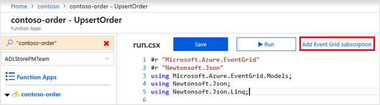

2. In the **Create Event Subscription** page, name the subscription, and then use the fields in the page to select your storage account.

   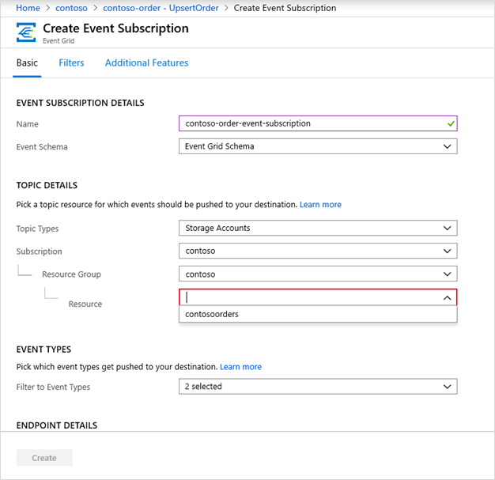

3. In the **Filter to Event Types** drop-down list, select the **Blob Created**, and **Blob Deleted** events, and then click the **Create** button.

## Test the Event Grid subscription

1. Create a file named `customer-order.csv`, paste the following information into that file, and save it to your local computer.

   ```
   InvoiceNo,StockCode,Description,Quantity,InvoiceDate,UnitPrice,CustomerID,Country
   536371,99999,EverGlow Single,228,1/1/2018 9:01,33.85,20993,Sierra Leone
   ```

2. In Storage Explorer, upload this file to the **input** folder of your storage account.

   Uploading a file raises the **Microsoft.Storage.BlobCreated** event. Event Grid notifies all subscribers to that event. In our case, the Azure Function is the only subscriber. The Azure Function parses the event parameters to determine which event occurred. It then passes the URL of the file to the Databricks Job. The Databricks Job reads the file, and adds a row to the Databricks Delta table that is located your storage account.

3. To check if the job succeeded, open your databricks workspace, click the **Jobs** button, and then open your job.

4. Select the job to open the job page.

   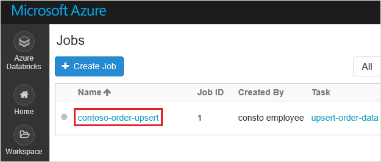

   When the job completes, you'll see a completion status.

   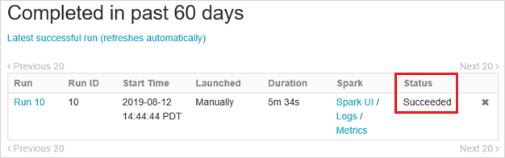

5. In a new workbook cell, run this query in a cell to see the updated delta table.

   ```
   %sql select * from customer_data
   ```

   The returned table shows the latest record.

   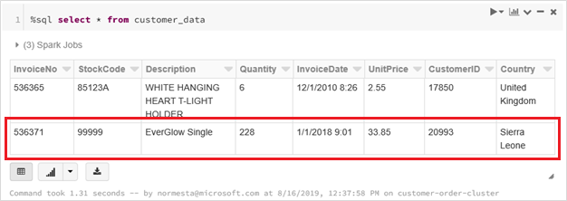

6. To update this record, create a file named `customer-order-update.csv`, paste the following information into that file, and save it to your local computer.

   ```
   InvoiceNo,StockCode,Description,Quantity,InvoiceDate,UnitPrice,CustomerID,Country
   536371,99999,EverGlow Single,22,1/1/2018 9:01,33.85,20993,Sierra Leone
   ```

   This csv file is almost identical to the previous one except the quantity of the order is changed from `228` to `22`.

7. In Storage Explorer, upload this file to the **input** folder of your storage account.

8. Run the `select` query again to see the updated delta table.

   ```
   %sql select * from customer_data
   ```

   The returned table shows the updated record.

   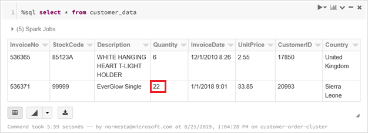

## Clean up resources

When they're no longer needed, delete the resource group and all related resources. To do so, select the resource group for the storage account and select **Delete**.

## Next steps

> [!div class="nextstepaction"]
> [Reacting to Blob storage events](storage-blob-event-overview.md)
