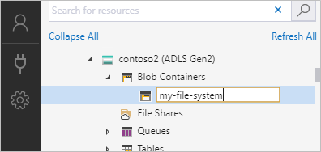
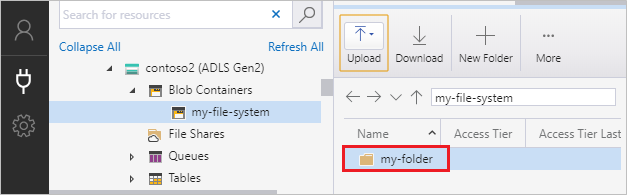
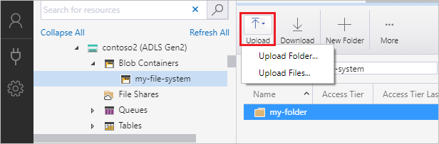
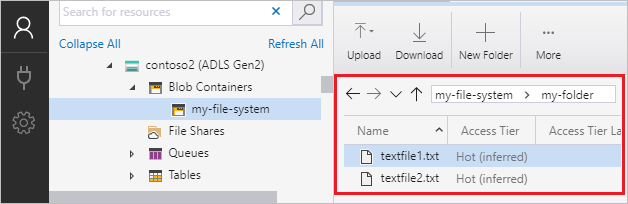

# Use Azure Storage Explorer to manage directories and files in Azure Data Lake Storage Gen2

This article shows you how to use [Azure Storage Explorer](https://azure.microsoft.com/features/storage-explorer/) to create and manage directories and files in storage accounts that has hierarchical namespace (HNS) enabled.

## Prerequisites

- An Azure subscription. See [Get Azure free trial](https://azure.microsoft.com/pricing/free-trial/).

- A storage account that has hierarchical namespace (HNS) enabled. Follow [these](../common/storage-account-create.md) instructions to create one.

- Azure Storage Explorer installed on your local computer. To install Azure Storage Explorer for Windows, Macintosh, or Linux, see [Azure Storage Explorer](https://azure.microsoft.com/features/storage-explorer/).

> [!NOTE]
> Storage Explorer makes use of both the Blob (blob) & Data Lake Storage Gen2 (dfs) [endpoints](../common/storage-private-endpoints.md#private-endpoints-for-azure-storage) when working with Azure Data Lake Storage Gen2. If access to Azure Data Lake Storage Gen2 is configured using private endpoints, ensure that two private endpoints are created for the storage account: one with the target sub-resource `blob` and the other with the target sub-resource `dfs`.

## Sign in to Storage Explorer

When you first start Storage Explorer, the **Microsoft Azure Storage Explorer - Connect** window appears. While Storage Explorer provides several ways to connect to storage accounts, only one way is currently supported for managing ACLs.

|Task|Purpose|
|---|---|
|Add an Azure Account | Redirects you to your organization's sign-in page to authenticate you to Azure. Currently this is the only supported authentication method if you want to manage and set ACLs.|
|Use a connection string or shared access signature URI | Can be used to directly access a container or storage account with a SAS token or a shared connection string. |
|Use a storage account name and key| Use the storage account name and key of your storage account to connect to Azure storage.|

Select **Add an Azure Account** and click **Sign in..**. Follow the on-screen prompts to sign into your Azure account.

When it completes connecting, Azure Storage Explorer loads with the **Explorer** tab shown. This view gives you insight to all of your Azure storage accounts as well as local storage configured through the [Azurite storage emulator](../common/storage-use-azurite.md?toc=%2fazure%2fstorage%2fblobs%2ftoc.json), [Cosmos DB](../../cosmos-db/storage-explorer.md?toc=%2fazure%2fstorage%2fblobs%2ftoc.json) accounts, or [Azure Stack](/azure-stack/user/azure-stack-storage-connect-se?toc=%2fazure%2fstorage%2fblobs%2ftoc.json) environments.

## Create a container

A container holds directories and files. To create one, expand the storage account you created in the proceeding step. Select **Blob Containers**, right-click, and select **Create Blob Container**. Enter the name for your container. See the [Create a container](storage-quickstart-blobs-dotnet.md#create-a-container) section for a list of rules and restrictions on naming containers. When complete, press **Enter** to create the container. Once the container has been successfully created, it is displayed under the **Blob Containers** folder for the selected storage account.

## Create a directory

To create a directory, select the container that you created in the proceeding step. In the container ribbon, choose the **New Folder** button. Enter the name for your directory. When complete, press **Enter** to create the directory. Once the directory has been successfully created, it appears in the editor window.

## Upload blobs to the directory

On the directory ribbon, choose the **Upload** button. This operation gives you the option to upload a folder or a file.

Choose the files or folder to upload.

When you select **OK**, the files selected are queued to upload, each file is uploaded. When the upload is complete, the results are shown in the **Activities** window.

## View blobs in a directory

In the **Azure Storage Explorer** application, select a directory under a storage account. The main pane shows a list of the blobs in the selected directory.

## Download blobs

To download files by using **Azure Storage Explorer**, with a file selected, select **Download** from the ribbon. A file dialog opens and provides you the ability to enter a file name. Select **Save** to start the download of a file to the local location.

## Next steps

Learn how to manage file and directory permission by setting access control lists (ACLs)

> [!div class="nextstepaction"]
> [Use Azure Storage Explorer to manage ACLs in Azure Data Lake Storage Gen2](./data-lake-storage-explorer-acl.md)
