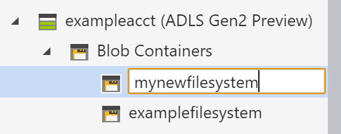

# Quickstart: Use Azure Storage Explorer to manage data in an Azure Data Lake Storage Gen2 account

In this quickstart, you learn how to use [Azure Storage Explorer](https://azure.microsoft.com/features/storage-explorer/) to create a directory and a blob. Next, you learn how to download the blob to your local computer, and how to view all of the blobs in a directory. You also learn how to create a snapshot of a blob, manage directory access policies, and create a shared access signature.

## Prerequisites

[!INCLUDE [storage-quickstart-prereq-include](../../../includes/storage-quickstart-prereq-include.md)]

This quickstart requires that you install Azure Storage Explorer. To install Azure Storage Explorer for Windows, Macintosh, or Linux, see [Azure Storage Explorer](https://azure.microsoft.com/features/storage-explorer/).

## Sign in to Storage Explorer

On first launch, the **Microsoft Azure Storage Explorer - Connect** window is shown. While Storage Explorer provides several ways to connect to storage accounts, only one way is currently supported for managing ACLs.

|Task|Purpose|
|---|---|
|Add an Azure Account | Redirects you to your organizations login page to authenticate you to Azure. Currently this is the only supported authentication method if you want to manage and set ACLs. |

Select **Add an Azure Account** and click **Sign in..**. Follow the on-screen prompts to sign into your Azure account.

When it completes connecting, Azure Storage Explorer loads with the **Explorer** tab shown. This view gives you insight to all of your Azure storage accounts as well as local storage configured through the [Azure Storage Emulator](../common/storage-use-emulator.md?toc=%2fazure%2fstorage%2fblobs%2ftoc.json), [Cosmos DB](../../cosmos-db/storage-explorer.md?toc=%2fazure%2fstorage%2fblobs%2ftoc.json) accounts, or [Azure Stack](/azure-stack/user/azure-stack-storage-connect-se?toc=%2fazure%2fstorage%2fblobs%2ftoc.json) environments.

## Create a file system

Blobs are always uploaded into a directory. This allows you to organize groups of blobs like you organize your files on your computer in folders.

To create a directory, expand the storage account you created in the proceeding step. Select **Blob container**, right-click and select **Create Blob container**. Enter the name for your file system. When complete, press **Enter** to create the file system. Once the blob directory has been successfully created, it is displayed under the **Blob container** folder for the selected storage account.

## Upload blobs to the directory

Blob storage supports block blobs, append blobs, and page blobs. VHD files used to back IaaS VMs are page blobs. Append blobs are used for logging, such as when you want to write to a file and then keep adding more information. Most files stored in Blob storage are block blobs.

On the directory ribbon, select **Upload**. This operation gives you the option to upload a folder or a file.

Choose the files or folder to upload. Select the **blob type**. Acceptable choices are **Append**, **Page**, or **Block** blob.

If uploading a .vhd or .vhdx file, choose **Upload .vhd/.vhdx files as page blobs (recommended)**.

In the **Upload to folder (optional)** field either a folder name to store the files or folders in a folder under the directory. If no folder is chosen, the files are uploaded directly under the directory.

When you select **OK**, the files selected are queued to upload, each file is uploaded. When the upload is complete, the results are shown in the **Activities** window.

## View blobs in a directory

In the **Azure Storage Explorer** application, select a directory under a storage account. The main pane shows a list of the blobs in the selected directory.

## Download blobs

To download blobs using **Azure Storage Explorer**, with a blob selected, select **Download** from the ribbon. A file dialog opens and provides you the ability to enter a file name. Select **Save** to start the download of a blob to the local location.

## Next steps

In this quickstart, you learned how to transfer files between a local disk and Azure Blob storage using **Azure Storage Explorer**. To learn about how to set ACLs on your files and directories, continue to our How-to on the subject.

> [!div class="nextstepaction"]
> [How to set ACLs on files and directories](data-lake-storage-how-to-set-permissions-storage-explorer.md)
