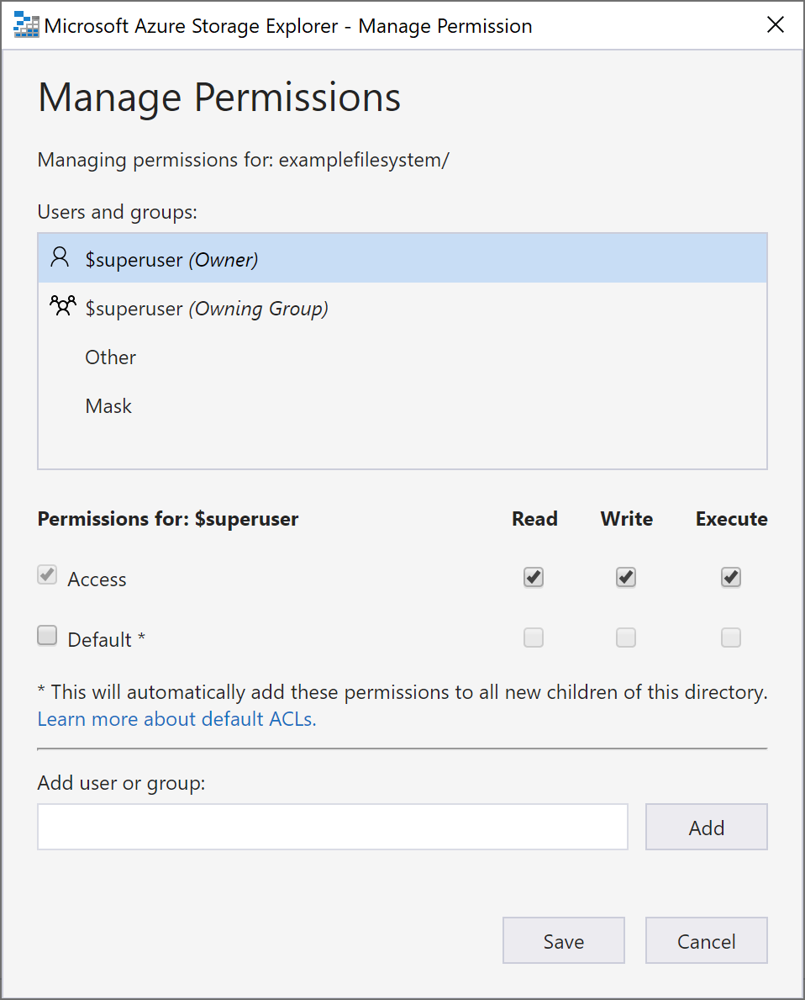

# How to: Set file and directory level permissions using Azure Storage explorer

This article shows how to set file and directory level ACLs through the desktop version of Azure Storage explorer.

This article requires that you install Azure Storage Explorer. To install Azure Storage Explorer for Windows, Macintosh, or Linux, see [Azure Storage Explorer](https://azure.microsoft.com/features/storage-explorer/).

## Sign in to Storage Explorer

On first launch, the **Microsoft Azure Storage Explorer - Connect** window is shown. While Storage Explorer provides several ways to connect to storage accounts, only one way is currently supported for managing ACLs.

|Task|Purpose|
|---|---|
|Add an Azure Account | Redirects you to your organizations login page to authenticate you to Azure. Currently this is the only authentication method that will allow you to manage ACLs using storage explorer.|

Select **Add an Azure Account** and click **Sign in.**. Follow the on-screen prompts to sign into your Azure account.

When it completes connecting, Azure Storage Explorer loads with the **Explorer** tab shown. This view gives you insight to all of your Azure storage accounts as well as local storage configured through the [Azure Storage Emulator](../common/storage-use-emulator.md?toc=%2fazure%2fstorage%2fblobs%2ftoc.json), [Cosmos DB](../../cosmos-db/storage-explorer.md?toc=%2fazure%2fstorage%2fblobs%2ftoc.json) accounts, or [Azure Stack](../../azure-stack/user/azure-stack-storage-connect-se.md?toc=%2fazure%2fstorage%2fblobs%2ftoc.json) environments.

## Managing access

You can set permissions at the root of your filesystem. To do so, right-click your filesystem, and select **Manage Permissions**.

This wil bring up the **Manage Permission** prompt.

The **Manage Access** prompt will allow you to manage permissions for owner and the owners group as well as adding new users to the access control list for whom you can then manage permissions. To learn about permissions, including default permissions, access permissions, and their behavior, see our article on [access control in data lake storage gen2](data-lake-storage-access-control.md#access-control-lists-on-files-and-directories). Making selections here will not set ACLs on any currently existing item inside the directory.

We recommend creating security groups and maintaining permissions on the group rather than individual users. For details on this recommendation and other best practices, see our [best practices for data lake storage gen2](data-lake-storage-best-practices.md) article.

You can manage permissions on individual directories as well as individual files, allowing you fine grain access control. The process for managing permissions on directories and files is the same as described above.