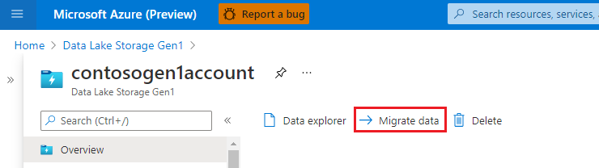
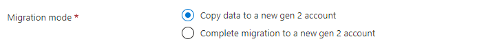
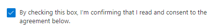
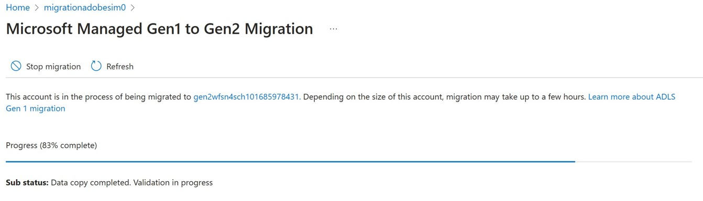
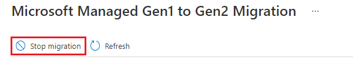
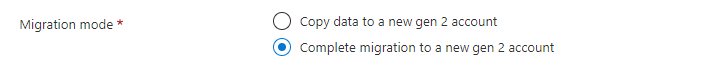

# Migrate Azure Data Lake Storage from Gen1 to Gen2 by using the Azure portal

This article shows you how to simplify the migration by using the Azure portal.

> [!NOTE]
> On **Feb. 29, 2024** Azure Data Lake Storage Gen1 will be retired. For more information, see the [official announcement](https://azure.microsoft.com/updates/action-required-switch-to-azure-data-lake-storage-gen2-by-29-february-2024/). If you use Azure Data Lake Storage Gen1, make sure to migrate to Azure Data Lake Storage Gen2 prior to that date.
>
> Since **April 1, 2023** Microsoft has been freezing Data Lake Storage Gen1 accounts that have zero read or write transactions in the last 180 days. If any of your accounts match that profile, please identify which ones you intend to migrate so that they won't be frozen. Contact your Microsoft account team or send a message to [ADLSGen1toGen2MigrationQA@service.microsoft.com](mailto:ADLSGen1toGen2MigrationQA@service.microsoft.com).

 You can provide your consent in the Azure portal and then migrate your data and metadata (such as timestamps and ACLs) automatically from Azure Data Lake Storage Gen1 to Azure Data Lake Storage Gen2.

Here's a video that tells you more about it.

:::row:::
   :::column span="2":::
      > [!VIDEO https://learn-video.azurefd.net/vod/player?show=inside-azure-for-it&ep=migrate-azure-data-lake-storage-adls-from-gen1-to-gen2-by-using-the-azure-portal]
   :::column-end:::
   :::column span="":::
     &nbsp;&nbsp;&nbsp;&nbsp;&nbsp;**Chapters**:
     ___

     - 00.37 - Introduction
      
     - 01:16 - Preparing for migration
      
     - 07:15 - Copy migration
      
     - 17:40 - Copy vs complete migration
      
     - 19:43 - Complete migration
      
     - 33:15 - Post migration
 
   :::column-end:::
:::row-end:::

Before you start, be sure to read the general guidance on how to migrate from Gen1 to Gen2 in [Azure Data Lake Storage migration guidelines and patterns](data-lake-storage-migrate-gen1-to-gen2.md).

Your account might not qualify for portal-based migration based on certain constraints. When the **Migrate data** button is not enabled in the Azure portal for your Gen1 account, if you have a support plan, you can [file a support request](https://portal.azure.com/#blade/Microsoft_Azure_Support/HelpAndSupportBlade/newsupportrequest). You can also get answers from community experts in [Microsoft Q&A](/answers/topics/azure-data-lake-storage.html).

> [!NOTE]
> For easier reading, this article uses the term *Gen1* to refer to Azure Data Lake Storage Gen1, and the term *Gen2* to refer to Azure Data Lake Storage Gen2.

## Step 1: Create a storage account with Gen2 capabilities

Azure Data Lake Storage Gen2 isn't a dedicated storage account or service type. It's a set of capabilities that you can obtain by enabling the **Hierarchical namespace** feature of an Azure storage account. To create an account that has Gen2 capabilities, see [Create a storage account to use with Azure Data Lake Storage Gen2](create-data-lake-storage-account.md).

As you create the account, make sure to configure settings with the following values.

| Setting | Value |
|--|--|
| **Storage account name** | Any name that you want. This name doesn't have to match the name of your Gen1 account and can be in any subscription of your choice. |
| **Location** | The same region used by the Data Lake Storage Gen1 account |
| **Replication** | LRS or ZRS |
| **Minimum TLS version** | 1.0 |
| **NFS v3** | Disabled |
| **Hierarchical namespace** | Enabled |

> [!NOTE]
> The migration tool in the Azure portal doesn't move account settings. Therefore, after you've created the account, you'll have to manually configure settings such as encryption, network firewalls, data protection.

> [!IMPORTANT]
> Ensure that you use a fresh, newly created storage account that has no history of use. **Don't** migrate to a previously used account or use an account in which containers have been deleted to make the account empty.

## Step 2: Verify Azure role-based access control (Azure RBAC) role assignments

For Gen2, ensure that the [Storage Blob Data Owner](../../role-based-access-control/built-in-roles.md#storage-blob-data-owner) role has been assigned to your Microsoft Entra user identity in the scope of the storage account, parent resource group, or subscription.

For Gen1, ensure that the [Owner](../../role-based-access-control/built-in-roles.md#owner) role has been assigned to your Microsoft Entra identity in the scope of the Gen1 account, parent resource group, or subscription.

## Step 3: Migrate Azure Data Lake Analytics workloads

Azure Data Lake Storage Gen2 doesn't support Azure Data Lake Analytics. Azure Data Lake Analytics [will be retired](https://azure.microsoft.com/updates/migrate-to-azure-synapse-analytics/) on February 29, 2024. If you attempt to use the Azure portal to migrate an Azure Data Lake Storage Gen1 account that is used for Azure Data Lake Analytics, it's possible that you'll break your Azure Data Lake Analytics workloads. You must first [migrate your Azure Data Lake Analytics workloads to Azure Synapse Analytics](../../data-lake-analytics/migrate-azure-data-lake-analytics-to-synapse.md) or another supported compute platform before attempting to migrate your Gen1 account.

For more information, see [Manage Azure Data Lake Analytics using the Azure portal](../../data-lake-analytics/data-lake-analytics-manage-use-portal.md).

## Step 4: Prepare the Gen1 account

File or directory names with only spaces or tabs, ending with a `.`, containing a `:`, or with multiple consecutive forward slashes (`//`) aren't compatible with Gen2. You need to rename these files or directories before you migrate.

For the better performance, consider delaying the migration for at least seven days from the time of the last delete operation. In a Gen1 account, deleted files become _soft_ deleted files, and the Garbage Collector won't remove them permanently until approximately seven days. All files, including soft deleted files, are processed during migration. If you wait until the Garbage Collector has permanently removed deleted files, your wait time can improve.  

## Step 5: Perform the migration

Before you begin, review the two migration options below, and decide whether to only copy data from Gen1 to Gen2 (recommended) or perform a complete migration.

**Option 1: Copy data only (recommended).** In this option, data is copied from Gen1 to Gen2. As the data is being copied, the Gen1 account becomes read-only. After the data is copied, both the Gen1 and Gen2 accounts will be accessible. However, you must update the applications and compute workloads to use the new Gen2 endpoint.

**Option 2: Perform a complete migration.** In this option, data is copied from Gen1 to Gen2. After the data is copied, all the traffic from the Gen1 account will be redirected to the Gen2-enabled account. Redirected requests use the [Gen1 compatibility layer](#gen1-compatibility-layer) to translate Gen1 API calls to Gen2 equivalents. During the migration, the Gen1 account becomes read-only. After the migration is complete, the Gen1 account won't be accessible.

Whichever option you choose, after you've migrated and verified that all your workloads work as expected, you can delete the Gen1 account.

### Option 1: Copy data from Gen1 to Gen2

1. Sign in to the [Azure portal](https://portal.azure.com/) to get started.

2. Locate your Data Lake Storage Gen1 account and display the account overview.

3. Select the **Migrate data** button.

   > [!div class="mx-imgBorder"]
   > 

4. Select **Copy data to a new Gen2 account**.

   > [!div class="mx-imgBorder"]
   > 

5. Give Microsoft consent to perform the data migration by selecting the checkbox. Then, select the **Apply** button.

   > [!div class="mx-imgBorder"]
   > 

   A progress bar appears along with a sub status message. You can use these indicators to gauge the progress of the migration. Because the time to complete each task varies, the progress bar won't advance at a consistent rate. For example, the progress bar might quickly advance to 50 percent, but then take a bit more time to complete the remaining 50 percent. 

   > [!div class="mx-imgBorder"]
   > 

   > [!IMPORTANT]
   > While your data is being migrated, your Gen1 account becomes read-only and your Gen2-enabled account is disabled. When the migration is finished, you can read and write to both accounts.

   You can stop the migration at any time by selecting the **Stop migration** button.

   > [!div class="mx-imgBorder"]
   > 

### Option 2: Perform a complete migration

1. Sign in to the [Azure portal](https://portal.azure.com/) to get started.

2. Locate your Data Lake Storage Gen1 account and display the account overview.

3. Select the **Migrate data** button.

   > [!div class="mx-imgBorder"]
   > 

4. Select **Complete migration to a new Gen2 account**.

   > [!div class="mx-imgBorder"]
   > 

5. Give Microsoft consent to perform the data migration by selecting the checkbox. Then, select the **Apply** button.

   > [!div class="mx-imgBorder"]
   > 

   A progress bar appears along with a sub status message. You can use these indicators to gauge the progress of the migration. Because the time to complete each task varies, the progress bar won't advance at a consistent rate. For example, the progress bar might quickly advance to 50 percent, but then take a bit more time to complete the remaining 50 percent. 

   > [!div class="mx-imgBorder"]
   > 

   > [!IMPORTANT]
   > While your data is being migrated, your Gen1 account becomes read-only and the Gen2-enabled account is disabled.
   > 
   > Also, while the Gen1 URI is being redirected, both accounts are disabled.
   > 
   > When the migration is finished, your Gen1 account will be disabled. The data in your Gen1 account won't be accessible and will be deleted after 30 days. Your Gen2 account will be available for reads and writes.

   You can stop the migration at any time before the URI is redirected by selecting the **Stop migration** button.

   > [!div class="mx-imgBorder"]
   > 

## Step 6: Verify that the migration completed

If the migration completes successfully, then a container named **gen1** will be created in the Gen2-enabled account, and all data from the Gen1 account will be copied to this new **gen1** container. In order to find the data on a path that existed on Gen1, you must add the prefix **gen1/** to the same path to access it on Gen2. For example, a path that was named 'FolderRoot/FolderChild/FileName.csv' on Gen1 will be available at 'gen1/FolderRoot/FolderChild/FileName.csv' on Gen2. Container names can't be renamed on Gen2, so this **gen1** container on Gen2 can't be renamed post migration. However, the data can be copied to a new container in Gen2 if needed.

If the migration doesn't complete successfully, a message appears which states that the migration is stalled due to incompatibilities. If you would like assistance with the next step, then please contact [Microsoft Support](https://go.microsoft.com/fwlink/?linkid=2228816). This message can appear if the Gen2-enabled account was previously used or when files and directories in the Gen1 account use incompatible naming conventions. 

Before contacting support, ensure that you're using a fresh, newly created storage account that has no history of use. Avoid migrating to a previously used account or an account in which containers have been deleted to make the account empty. In your Gen1 account, ensure that you rename any file or directory names that contain only spaces or tabs, end with a `.`, contain a `:`, or contain multiple forward slashes (`//`). 

## Step 7: Migrate workloads and applications

1. Configure [services in your workloads](./data-lake-storage-supported-azure-services.md) to point to your Gen2 endpoint. For links to articles that help you configure Azure Databricks, HDInsight, and other Azure services to use Gen2, see [Azure services that support Azure Data Lake Storage Gen2](data-lake-storage-supported-azure-services.md).

2. Update applications to use Gen2 APIs. See these guides:

   | Environment | Article |
   |--------|-----------|
   |Azure Storage Explorer |[Use Azure Storage Explorer to manage directories and files in Azure Data Lake Storage Gen2](data-lake-storage-explorer.md)|
   |.NET |[Use .NET to manage directories and files in Azure Data Lake Storage Gen2](data-lake-storage-directory-file-acl-dotnet.md)|
   |Java|[Use Java to manage directories and files in Azure Data Lake Storage Gen2](data-lake-storage-directory-file-acl-java.md)|
   |Python|[Use Python to manage directories and files in Azure Data Lake Storage Gen2](data-lake-storage-directory-file-acl-python.md)|
   |JavaScript (Node.js)|[Use JavaScript SDK in Node.js to manage directories and files in Azure Data Lake Storage Gen2](data-lake-storage-directory-file-acl-javascript.md)|
   |REST API |[Azure Data Lake Store REST API](/rest/api/storageservices/data-lake-storage-gen2)|

3. Update scripts to use Data Lake Storage Gen2 [PowerShell cmdlets](data-lake-storage-directory-file-acl-powershell.md), and [Azure CLI commands](data-lake-storage-directory-file-acl-cli.md).

4. Search for URI references that contain the string `adl://` in code files, or in Databricks notebooks, Apache Hive HQL files or any other file used as part of your workloads. Replace these references with the [Gen2 formatted URI](data-lake-storage-introduction-abfs-uri.md) of your new storage account. For example: the Gen1 URI: `adl://mydatalakestore.azuredatalakestore.net/mydirectory/myfile` might become `abfss://myfilesystem@mydatalakestore.dfs.core.windows.net/mydirectory/myfile`.

## Gen1 compatibility layer

This layer attempts to provide application compatibility between Gen1 and Gen2 as a convenience during the migration, so that applications can continue using Gen1 APIs to interact with data in the Gen2-enabled account. This layer has limited functionality and it's advised to validate the workloads with test accounts if you use this approach as part of migration. The compatibility layer runs on the server, so there's nothing to install.

> [!IMPORTANT]
> Microsoft does not recommend this capability as a replacement for migrating your workloads and applications. Support for the Gen1 compatibility layer will end when Gen1 [is retired on Feb. 29, 2024](https://azure.microsoft.com/updates/action-required-switch-to-azure-data-lake-storage-gen2-by-29-february-2024/).

To encounter the least number of issues with the compatibility layer, make sure that your Gen1 SDKs use the following versions (or higher).

   | Language | SDK version |
   |--|--|
   | **.NET** | [2.3.9](https://github.com/Azure/azure-data-lake-store-net/blob/master/CHANGELOG.md) |
   | **Java** | [1.1.21](https://github.com/Azure/azure-data-lake-store-java/blob/master/CHANGES.md) |
   | **Python** | [0.0.51](https://github.com/Azure/azure-data-lake-store-python/blob/master/HISTORY.rst) |

The following functionality isn't supported in the compatibility layer.

- ListStatus API option to ListBefore an entry.

- ListStatus API with over 4,000 files without a continuation token.

- Chunk-encoding for append operations.

- Any API calls that use `https://management.azure.com/`  as the Microsoft Entra token audience.

- File or directory names with only spaces or tabs, ending with a `.`, containing a `:`, or with multiple consecutive forward slashes (`//`).

## Frequently asked questions

#### How long will migration take?

Data and metadata are migrated in parallel. The total time required to complete a migration is equal to whichever of these two processes complete last. 

The following table shows the approximate speed of each migration processing task. 

> [!NOTE]
> These time estimates are approximate and can vary. For example, copying a large number of small files can slow performance. 

| Processing task                        | Speed                                 |
|----------------------------------------|---------------------------------------|
| Data copy                              | 9 TB per hour                        |
| Data validation                        | 9 million files or folders per hour              |
| Metadata copy                          | 4 million files or folders per hour  |
| Metadata processing                    | 25 million files or folders per hour |
| Additional metadata processing (data copy option)1 | 50 million files or folders per hour |

1    The additional metadata processing time applies only if you choose the **Copy data to a new Gen2 account** option. This processing time does not apply if you choose the **Complete migration to a new gen2 account** option.

##### Example: Processing a large amount of data and metadata

This example assumes **300 TB** of data and **200 million** data and metadata items.

| Task | Estimated time |
|--|--|
| Copy data | 300 TB / 9 TB = 33.33 hours |
| Validate data | 200 million / 9 million = 22.22 hours|
| **Total data migration time** | **33.33 + 22.2 = 55.55 hours** |   
| Copy metadata | 200 million / 4 million = 50 hours |
| Metadata processing | 200 million / 25 million = 8 hours |
| Additional metadata processing - data copy option only | 200 million / 50 million = 4 hours |
| **Total metadata migration time** | **50 + 8 + 4 = 62 hours** |
| **Total time to perform a data-only migration** | **62 hours** |
| **Total time to perform a complete migration**| **62 - 4 = 58 hours** |

##### Example: Processing a small amount of data and metadata

This example assumes that **2 TB** of data and **56 thousand** data and metadata items.

| Task | Estimated time |
|--|--|
| Copy data | (2 TB / 9 TB) * 60 minutes = 13.3 minutes|
| Validate data | (56,000 / 9 million) * 3,600 seconds = 22.4 seconds  |
| **Total data migration time** | **13.3 minutes + 22.4 seconds = approximately 14 minutes** |   
| Copy metadata | (56,000 / 4 million) * 3,600 seconds  = approximately 51 seconds |
| Metadata processing | 56,000/ 25 million = 8 seconds |
| Additional metadata processing - data copy option only | (56,000 / 50 million) * 3,600 seconds = 4 seconds|
| **Total metadata migration time** | **51 + 8 + 4 = 63 seconds** |
| **Total time to perform a data-only migration** | **14 minutes** |
| **Total time to perform a complete migration** | **14 minutes - 4 seconds = 13 minutes and 56 seconds (approximately 14 minutes)** |

#### How much does the data migration cost?

There's no cost to use the portal-based migration tool, however you'll be billed for usage of Azure Data Lake Gen1 and Gen2 services. During the data migration, you'll be billed for the data storage and transactions of the Gen1 account.

Post migration, if you chose the option that copies only data, then you'll be billed for the data storage and transactions for both Azure Data Lake Gen1 and Gen2 accounts. To avoid being billed for the Gen1 account, delete the Gen1 account after you've updated your applications to point to Gen2. If you chose to perform a complete migration, you'll be billed only for the data storage and transactions of the Gen2-enabled account.

#### While providing consent, I encountered the error message *Migration initiation failed*. What should I do next?

Make sure all your Azure Data lake Analytics accounts are [migrated to Azure Synapse Analytics](../../data-lake-analytics/migrate-azure-data-lake-analytics-to-synapse.md) or another supported compute platform. Once Azure Data Lake Analytics accounts are migrated, retry the consent. If you see the issue further and you have a support plan, you can [file a support request](https://portal.azure.com/#blade/Microsoft_Azure_Support/HelpAndSupportBlade/newsupportrequest). You can also get answers from community experts in [Microsoft Q&A](/answers/topics/azure-data-lake-storage.html).

#### After the migration completes, can I go back to using the Gen1 account?

If you used [Option 1: Copy data from Gen1 to Gen2](#option-1-copy-data-from-gen1-to-gen2) mentioned above, then both the Gen1 and Gen2 accounts are available for reads and writes post migration. However, if you used [Option 2: Perform a complete migration](#option-2-perform-a-complete-migration), then going back to the Gen1 account isn't supported. In Option 2, after the migration completes, the data in your Gen1 account won't be accessible and will be deleted after 30 days. You can continue to view the Gen1 account in the Azure portal, and when you're ready, you can delete the Gen1 account.

#### I would like to enable Geo-redundant storage (GRS) on the Gen2-enabled account, how do I do that?

Once the migration is complete, both in "Copy data" and "Complete migration" options, you can go ahead and change the redundancy option to GRS as long as you don't plan to use the application compatibility layer. The application compatibility won't work on accounts that use GRS redundancy.

#### Gen1 doesn't have containers and Gen2 has them - what should I expect?

When we copy the data over to your Gen2-enabled account, we automatically create a container named 'Gen1'. In Gen2 container names can't be renamed and hence post migration data can be copied to new container in Gen2 as needed.

#### What should I consider in terms of migration performance?

When you copy the data over to your Gen2-enabled account, two factors that can affect performance are the number of files and the amount of metadata you have. For example, many small files can affect the performance of the migration.

#### Will WebHDFS File System APIs supported on Gen2 account post migration?

WebHDFS File System APIs of Gen1 will be supported on Gen2 but with certain deviations, and only limited functionality is supported via the compatibility layer. Customers should plan to leverage Gen2-specific APIs for better performance and features.

#### What happens to my Gen1 account after the retirement date?

The account becomes inaccessible. You won't be able to:

- Manage the account

- Access data in the account 

- Receive service updates to Gen1 or Gen1 APIs, SDKs, or client tools

- Access Gen1 customer support online, by phone or by email

See [Action required: Switch to Azure Data Lake Storage Gen2 by 29 February 2024](https://azure.microsoft.com/updates/action-required-switch-to-azure-data-lake-storage-gen2-by-29-february-2024/).

## Next steps

- Learn about migration in general. For more information, see [Migrate Azure Data Lake Storage from Gen1 to Gen2](data-lake-storage-migrate-gen1-to-gen2.md).
