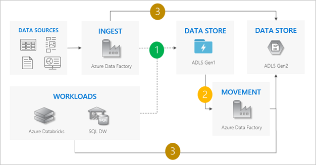
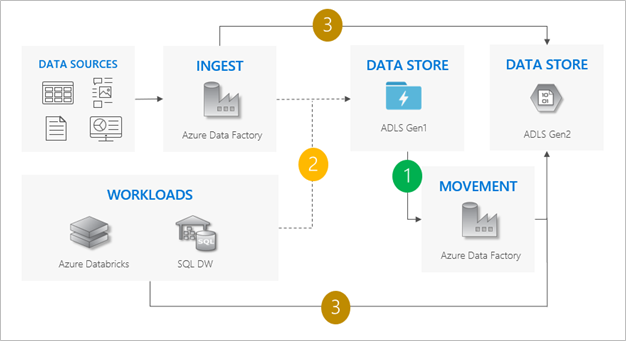
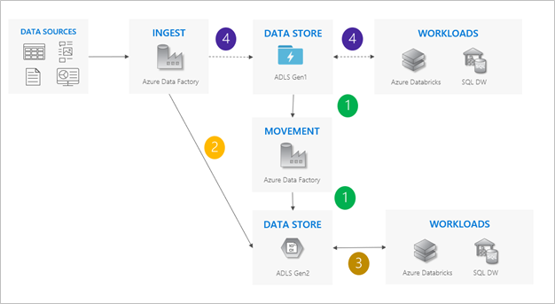
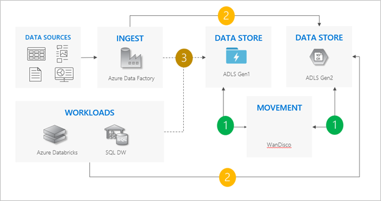

# Azure Data Lake Storage migration guidelines and patterns

You can migrate your data, workloads, and applications from Azure Data Lake Storage Gen1 to Azure Data Lake Storage Gen2. This article explains the recommended migration approach and covers the different migration patterns and when to use each. For easier reading, this article uses the term *Gen1* to refer to Azure Data Lake Storage Gen1, and the term *Gen2* to refer to Azure Data Lake Storage Gen2.

On **Feb 29, 2024** Azure Data Lake Storage Gen1 will be retired. For more information, see the [official announcement](https://azure.microsoft.com/updates/action-required-switch-to-azure-data-lake-storage-gen2-by-29-february-2024/). If you use Azure Data Lake Storage Gen1, make sure to migrate to Azure Data Lake Storage Gen2 prior to that date. This article shows you how to do that.

Azure Data Lake Storage Gen2 is built on [Azure Blob storage](storage-blobs-introduction.md) and provides a set of capabilities dedicated to big data analytics. [Data Lake Storage Gen2](https://azure.microsoft.com/services/storage/data-lake-storage/) combines features from [Azure Data Lake Storage Gen1](../../data-lake-store/index.yml), such as file system semantics, directory, and file level security and scale with low-cost, tiered storage, high availability/disaster recovery capabilities from [Azure Blob storage](storage-blobs-introduction.md).

> [!NOTE]
> Because Gen1 and Gen2 are different services, there is no in-place upgrade experience. To simplify the migration to Gen2 by using the Azure portal, see [Migrate Azure Data Lake Storage from Gen1 to Gen2 by using the Azure portal](data-lake-storage-migrate-gen1-to-gen2-azure-portal.md).

## Recommended approach

To migrate from Gen1 to Gen2, we recommend the following approach.

Step 1: Assess readiness

Step 2: Prepare to migrate

Step 3: Migrate data and application workloads

Step 4: Cutover from Gen1 to Gen2

### Step 1: Assess readiness

1. Learn about the [Data Lake Storage Gen2 offering](https://azure.microsoft.com/services/storage/data-lake-storage/); its benefits, costs, and general architecture.

2. [Compare the capabilities](#gen1-gen2-feature-comparison) of Gen1 with those of Gen2.

3. Review a list of [known issues](data-lake-storage-known-issues.md) to assess any gaps in functionality.

4. Gen2 supports Blob storage features such as [diagnostic logging](../common/storage-analytics-logging.md), [access tiers](access-tiers-overview.md), and [Blob storage lifecycle management policies](./lifecycle-management-overview.md). If you're interesting in using any of these features, review [current level of support](./storage-feature-support-in-storage-accounts.md).

5. Review the current state of [Azure ecosystem support](./data-lake-storage-multi-protocol-access.md) to ensure that Gen2 supports any services that your solutions depend upon.

### Step 2: Prepare to migrate

1. Identify the data sets that you'll migrate.

   Take this opportunity to clean up data sets that you no longer use. Unless you plan to migrate all of your data at one time, Take this time to identify logical groups of data that you can migrate in phases.

   Perform an [Ageing Analysis](https://github.com/Azure/adlsgen1togen2migration/tree/main/3-Migrate/Utilities/Ageing%20Analysis) (or similar) on your Gen1 account to identify which files or folders stay in inventory for a long time or are perhaps becoming obsolete.

2. Determine the impact that a migration will have on your business.

   For example, consider whether you can afford any downtime while the migration takes place. These considerations can help you to identify a suitable migration pattern, and to choose the most appropriate tools.

3. Create a migration plan.

   We recommend these [migration patterns](#migration-patterns). You can choose one of these patterns, combine them together, or design a custom pattern of your own.

### Step 3: Migrate data, workloads, and applications

Migrate data, workloads, and applications by using the pattern that you prefer. We recommend that you validate scenarios incrementally.

1. [Create a storage account](create-data-lake-storage-account.md) and enable the hierarchical namespace feature.

2. Migrate your data.

3. Configure [services in your workloads](./data-lake-storage-supported-azure-services.md) to point to your Gen2 endpoint.

   For HDInsight clusters, you can add storage account configuration settings to the %HADOOP_HOME%/conf/core-site.xml file. If you plan to migrate external Hive tables from Gen1 to Gen2, then make sure to add storage account settings to the %HIVE_CONF_DIR%/hive-site.xml file as well.

   You can modify the settings each file by using [Apache Ambari](../../hdinsight/hdinsight-hadoop-manage-ambari.md). To find storage account settings, see [Hadoop Azure Support: ABFS — Azure Data Lake Storage Gen2](https://hadoop.apache.org/docs/stable/hadoop-azure/abfs.html). This example uses the `fs.azure.account.key` setting to enable Shared Key authorization:

   ```xml
   <property>
     <name>fs.azure.account.key.abfswales1.dfs.core.windows.net</name>
     <value>your-key-goes-here</value>
   </property>
   ```
 
   For links to articles that help you configure HDInsight, Azure Databricks, and other Azure services to use Gen2, see [Azure services that support Azure Data Lake Storage Gen2](data-lake-storage-supported-azure-services.md).

4. Update applications to use Gen2 APIs. See these guides:

| Environment | Article |
|--------|-----------|
|Azure Storage Explorer |[Use Azure Storage Explorer to manage directories and files in Azure Data Lake Storage Gen2](data-lake-storage-explorer.md)|
|.NET |[Use .NET to manage directories and files in Azure Data Lake Storage Gen2](data-lake-storage-directory-file-acl-dotnet.md)|
|Java|[Use Java to manage directories and files in Azure Data Lake Storage Gen2](data-lake-storage-directory-file-acl-java.md)|
|Python|[Use Python to manage directories and files in Azure Data Lake Storage Gen2](data-lake-storage-directory-file-acl-python.md)|
|JavaScript (Node.js)|[Use JavaScript SDK in Node.js to manage directories and files in Azure Data Lake Storage Gen2](data-lake-storage-directory-file-acl-javascript.md)|
|REST API |[Azure Data Lake Store REST API](/rest/api/storageservices/data-lake-storage-gen2)|

5. Update scripts to use Data Lake Storage Gen2 [PowerShell cmdlets](data-lake-storage-directory-file-acl-powershell.md), and [Azure CLI commands](data-lake-storage-directory-file-acl-cli.md).

6. Search for URI references that contain the string `adl://` in code files, or in Databricks notebooks, Apache Hive HQL files or any other file used as part of your workloads. Replace these references with the [Gen2 formatted URI](data-lake-storage-introduction-abfs-uri.md) of your new storage account. For example: the Gen1 URI: `adl://mydatalakestore.azuredatalakestore.net/mydirectory/myfile` might become `abfss://myfilesystem@mydatalakestore.dfs.core.windows.net/mydirectory/myfile`.

7. Configure the security on your account to include [Azure roles](assign-azure-role-data-access.md), [file and folder level security](data-lake-storage-access-control.md), and [Azure Storage firewalls and virtual networks](../common/storage-network-security.md).

### Step 4: Cutover from Gen1 to Gen2

After you're confident that your applications and workloads are stable on Gen2, you can begin using Gen2 to satisfy your business scenarios. Turn off any remaining pipelines that are running on Gen1 and decommission your Gen1 account.

<a id="gen1-gen2-feature-comparison"></a>

## Gen1 vs Gen2 capabilities

This table compares the capabilities of Gen1 to that of Gen2.

|Area |Gen1   |Gen2 |
|---|---|---|
|Data organization|[Hierarchical namespace](data-lake-storage-namespace.md)<br>File and folder support|[Hierarchical namespace](data-lake-storage-namespace.md)<br>Container, file and folder support |
|Geo-redundancy| [LRS](../common/storage-redundancy.md#locally-redundant-storage)| [LRS](../common/storage-redundancy.md#locally-redundant-storage), [ZRS](../common/storage-redundancy.md#zone-redundant-storage), [GRS](../common/storage-redundancy.md#geo-redundant-storage), [RA-GRS](../common/storage-redundancy.md#read-access-to-data-in-the-secondary-region) |
|Authentication|[Microsoft Entra managed identity](../../active-directory/managed-identities-azure-resources/overview.md)<br>[Service principals](../../active-directory/develop/app-objects-and-service-principals.md)|[Microsoft Entra managed identity](../../active-directory/managed-identities-azure-resources/overview.md)<br>[Service principals](../../active-directory/develop/app-objects-and-service-principals.md)<br>[Shared Access Key](/rest/api/storageservices/authorize-with-shared-key)|
|Authorization|Management - [Azure RBAC](../../role-based-access-control/overview.md)<br>Data - [ACLs](data-lake-storage-access-control.md)|Management - [Azure RBAC](../../role-based-access-control/overview.md)<br>Data -  [ACLs](data-lake-storage-access-control.md), [Azure RBAC](../../role-based-access-control/overview.md) |
|Encryption - Data at rest|Server side - with [Microsoft-managed](../common/storage-service-encryption.md?toc=/azure/storage/blobs/toc.json) or [customer-managed](../common/customer-managed-keys-overview.md?toc=/azure/storage/blobs/toc.json) keys|Server side - with [Microsoft-managed](../common/storage-service-encryption.md?toc=/azure/storage/blobs/toc.json) or [customer-managed](../common/customer-managed-keys-overview.md?toc=/azure/storage/blobs/toc.json) keys|
|VNET Support|[VNET Integration](../../data-lake-store/data-lake-store-network-security.md)|[Service Endpoints](../common/storage-network-security.md?toc=/azure/storage/blobs/toc.json), [Private Endpoints](../common/storage-private-endpoints.md)|
|Developer experience|[REST](../../data-lake-store/data-lake-store-data-operations-rest-api.md), [.NET](../../data-lake-store/data-lake-store-data-operations-net-sdk.md), [Java](../../data-lake-store/data-lake-store-get-started-java-sdk.md), [Python](../../data-lake-store/data-lake-store-data-operations-python.md), [PowerShell](../../data-lake-store/data-lake-store-get-started-powershell.md), [Azure CLI](../../data-lake-store/data-lake-store-get-started-cli-2.0.md)|Generally available - [REST](/rest/api/storageservices/data-lake-storage-gen2), [.NET](data-lake-storage-directory-file-acl-dotnet.md), [Java](data-lake-storage-directory-file-acl-java.md), [Python](data-lake-storage-directory-file-acl-python.md)<br>Public preview - [JavaScript](data-lake-storage-directory-file-acl-javascript.md), [PowerShell](data-lake-storage-directory-file-acl-powershell.md), [Azure CLI](data-lake-storage-directory-file-acl-cli.md)|
|Resource logs|Classic logs<br>[Azure Monitor integrated](../../data-lake-store/data-lake-store-diagnostic-logs.md)|[Classic logs](../common/storage-analytics-logging.md) - Generally available<br>[Azure Monitor integrated](monitor-blob-storage.md) - Preview|
|Ecosystem|[HDInsight (3.6)](../../data-lake-store/data-lake-store-hdinsight-hadoop-use-portal.md), [Azure Databricks (3.1 and above)](https://docs.databricks.com/data/data-sources/azure/azure-datalake.html), [Azure Synapse Analytics](../../synapse-analytics/sql-data-warehouse/sql-data-warehouse-load-from-azure-data-lake-store.md), [ADF](../../data-factory/load-azure-data-lake-store.md)|[HDInsight (3.6, 4.0)](../../hdinsight/hdinsight-hadoop-use-data-lake-storage-gen2.md), [Azure Databricks (5.1 and above)](/azure/databricks/data/data-sources/azure/azure-datalake-gen2), [Azure Synapse Analytics](/azure/azure-sql/database/vnet-service-endpoint-rule-overview), [ADF](../../data-factory/load-azure-data-lake-storage-gen2.md)|

<a id="migration-patterns"></a>

## Gen1 to Gen2 patterns

Choose a migration pattern, and then modify that pattern as needed.

|Migration pattern | Details |
|---|---|
|**Lift and Shift**|The simplest pattern. Ideal if your data pipelines can afford downtime.|
|**Incremental copy**|Similar to *lift and shift*, but with less downtime. Ideal for large amounts of data that take longer to copy.|
|**Dual pipeline**|Ideal for pipelines that can't afford any downtime.|
|**Bidirectional sync**|Similar to *dual pipeline*, but with a more phased approach that is suited for more complicated pipelines.|

Let's take a closer look at each pattern.

### Lift and shift pattern

This is the simplest pattern.

1. Stop all writes to Gen1.

2. Move data from Gen1 to Gen2. We recommend [Azure Data Factory](../../data-factory/connector-azure-data-lake-storage.md) or by using the [Azure portal](data-lake-storage-migrate-gen1-to-gen2-azure-portal.md). ACLs copy with the data.

3. Point ingest operations and workloads to Gen2.

4. Decommission Gen1.

Check out our sample code for the lift and shift pattern in our [Lift and Shift migration sample](https://github.com/Azure/adlsgen1togen2migration/tree/main/3-Migrate/Lift%20and%20Shift).

> [!div class="mx-imgBorder"]
> 

#### Considerations for using the lift and shift pattern

- Cutover from Gen1 to Gen2 for all workloads at the same time.

- Expect downtime during the migration and the cutover period.

- Ideal for pipelines that can afford downtime and all apps can be upgraded at one time.

> [!TIP]
> Consider using the [Azure portal](data-lake-storage-migrate-gen1-to-gen2-azure-portal.md) to shorten downtime and reduce the number of steps required by you to complete the migration.

### Incremental copy pattern

1. Start moving data from Gen1 to Gen2. We recommend [Azure Data Factory](../../data-factory/connector-azure-data-lake-storage.md). ACLs copy with the data.

2. Incrementally copy new data from Gen1.

3. After all data is copied, stop all writes to Gen1, and point workloads to Gen2.

4. Decommission Gen1.

Check out our sample code for the incremental copy pattern in our [Incremental copy migration sample](https://github.com/Azure/adlsgen1togen2migration/tree/main/3-Migrate/Incremental).

> [!div class="mx-imgBorder"]
> 

#### Considerations for using the incremental copy pattern:

- Cutover from Gen1 to Gen2 for all workloads at the same time.

- Expect downtime during cutover period only.

- Ideal for pipelines where all apps upgraded at one time, but the data copy requires more time.

### Dual pipeline pattern

1. Move data from Gen1 to Gen2. We recommend [Azure Data Factory](../../data-factory/connector-azure-data-lake-storage.md). ACLs copy with the data.

2. Ingest new data to both Gen1 and Gen2.

3. Point workloads to Gen2.

4. Stop all writes to Gen1 and then decommission Gen1.

Check out our sample code for the dual pipeline pattern in our [Dual Pipeline migration sample](https://github.com/Azure/adlsgen1togen2migration/tree/main/3-Migrate/Dual%20pipeline).

> [!div class="mx-imgBorder"]
> 

#### Considerations for using the dual pipeline pattern:

- Gen1 and Gen2 pipelines run side-by-side.

- Supports zero downtime.

- Ideal in situations where your workloads and applications can't afford any downtime, and you can ingest into both storage accounts.

### Bi-directional sync pattern

1. Set up bidirectional replication between Gen1 and Gen2. We recommend [WanDisco](https://docs.wandisco.com/bigdata/wdfusion/adls/). It offers a repair feature for existing data.

3. When all moves are complete, stop all writes to Gen1 and turn off bidirectional replication.

4. Decommission Gen1.

Check out our sample code for the bidirectional sync pattern in our [Bidirectional Sync migration sample](https://github.com/Azure/adlsgen1togen2migration/tree/main/3-Migrate/Bi-directional).

> [!div class="mx-imgBorder"]
> 

#### Considerations for using the bi-directional sync pattern:

- Ideal for complex scenarios that involve a large number of pipelines and dependencies where a phased approach might make more sense.

- Migration effort is high, but it provides side-by-side support for Gen1 and Gen2.

## Next steps

- Learn about the various parts of setting up security for a storage account. For more information, see [Azure Storage security guide](./security-recommendations.md).
- Optimize the performance for your Data Lake Store. See [Optimize Azure Data Lake Storage Gen2 for performance](./data-lake-storage-best-practices.md)
- Review the best practices for managing your Data Lake Store. See [Best practices for using Azure Data Lake Storage Gen2](data-lake-storage-best-practices.md)

## See also

- [Introduction to Azure Data Lake Storage Gen2 (Training module)](/training/modules/introduction-to-azure-data-lake-storage/)
- [Best practices for using Azure Data Lake Storage Gen2](data-lake-storage-best-practices.md)
- [Access control model in Azure Data Lake Storage Gen2](data-lake-storage-access-control-model.md)
