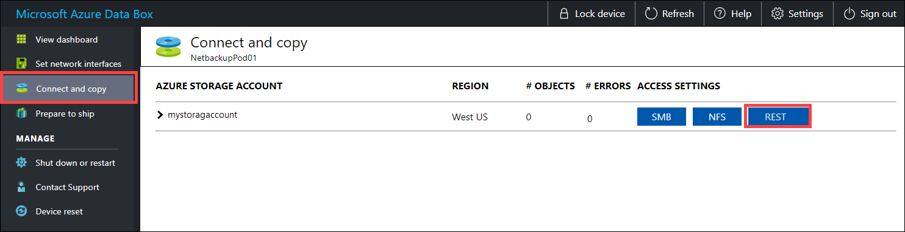

# Migrate from on-premises HDFS store to Azure Storage with Azure Data Box

You can migrate data from an on-premises HDFS store of your Hadoop cluster into Azure Storage (blob storage or Data Lake Storage Gen2) by using a Data Box device. You can choose from Data Box Disk, an 80-TB Data Box or a 770-TB Data Box Heavy.

This article helps you complete these tasks:

> [!div class="checklist"]
> - Prepare to migrate your data
> - Copy your data to a Data Box Disk, Data Box or a Data Box Heavy device
> - Ship the device back to Microsoft
> - Apply access permissions to files and directories (Data Lake Storage Gen2 only)

## Prerequisites

You need these things to complete the migration.

- An Azure Storage account.

- An on-premises Hadoop cluster that contains your source data.

- An [Azure Data Box device](https://azure.microsoft.com/services/storage/databox/).

  - [Order your Data Box](../../databox/data-box-deploy-ordered.md) or [Data Box Heavy](../../databox/data-box-heavy-deploy-ordered.md).

  - Cable and connect your [Data Box](../../databox/data-box-deploy-set-up.md) or [Data Box Heavy](../../databox/data-box-heavy-deploy-set-up.md) to an on-premises network.

If you're ready, let's start.

## Copy your data to a Data Box device

If your data fits into a single Data Box device, then you copy the data to the Data Box device.

If your data size exceeds the capacity of the Data Box device, then use the [optional procedure to split the data across multiple Data Box devices](#appendix-split-data-across-multiple-data-box-devices) and then perform this step.

To copy the data from your on-premises HDFS store to a Data Box device, you set a few things up, and then use the [DistCp](https://hadoop.apache.org/docs/stable/hadoop-distcp/DistCp.html) tool.

Follow these steps to copy data via the REST APIs of Blob/Object storage to your Data Box device. The REST API interface makes the device appear as an HDFS store to your cluster.

1. Before you copy the data via REST, identify the security and connection primitives to connect to the REST interface on the Data Box or Data Box Heavy. Sign in to the local web UI of Data Box and go to **Connect and copy** page. Against the Azure storage accounts for your device, under Access settings, locate, and select **REST**.

    

2. In the Access storage account and upload data dialog, copy the **Blob service endpoint** and the **Storage account key**. From the blob service endpoint, omit the `https://` and the trailing slash.

    In this case, the endpoint is: `https://mystorageaccount.blob.mydataboxno.microsoftdatabox.com/`. The host portion of the URI that you use is: `mystorageaccount.blob.mydataboxno.microsoftdatabox.com`. For an example, see how to [Connect to REST over http](../../databox/data-box-deploy-copy-data-via-rest.md).

     

3. Add the endpoint and the Data Box or Data Box Heavy node IP address to `/etc/hosts` on each node.

    ```
    10.128.5.42  mystorageaccount.blob.mydataboxno.microsoftdatabox.com
    ```

    If you're using some other mechanism for DNS, you should ensure that the Data Box endpoint can be resolved.

4. Set the shell variable `azjars` to the location of the `hadoop-azure` and `azure-storage` jar files. You can find these files under the Hadoop installation directory.

    To determine if these files exist, use the following command: `ls -l $<hadoop_install_dir>/share/hadoop/tools/lib/ | grep azure`. Replace the `<hadoop_install_dir>` placeholder with the path to the directory where you've installed Hadoop. Be sure to use fully qualified paths.

    Examples:

    `azjars=$hadoop_install_dir/share/hadoop/tools/lib/hadoop-azure-2.6.0-cdh5.14.0.jar`
    `azjars=$azjars,$hadoop_install_dir/share/hadoop/tools/lib/microsoft-windowsazure-storage-sdk-0.6.0.jar`

5. Create the storage container that you want to use for data copy. You should also specify a destination directory as part of this command. This could be a dummy destination directory at this point.

    ```
    hadoop fs -libjars $azjars \
    -D fs.AbstractFileSystem.wasb.Impl=org.apache.hadoop.fs.azure.Wasb \
    -D fs.azure.account.key.<blob_service_endpoint>=<account_key> \
    -mkdir -p  wasb://<container_name>@<blob_service_endpoint>/<destination_directory>
    ```

    - Replace the `<blob_service_endpoint>` placeholder with the name of your blob service endpoint.

    - Replace the `<account_key>` placeholder with the access key of your account.

    - Replace the `<container-name>` placeholder with the name of your container.

    - Replace the `<destination_directory>` placeholder with the name of the directory that you want to copy your data to.

6. Run a list command to ensure that your container and directory were created.

    ```
    hadoop fs -libjars $azjars \
    -D fs.AbstractFileSystem.wasb.Impl=org.apache.hadoop.fs.azure.Wasb \
    -D fs.azure.account.key.<blob_service_endpoint>=<account_key> \
    -ls -R  wasb://<container_name>@<blob_service_endpoint>/
    ```

   - Replace the `<blob_service_endpoint>` placeholder with the name of your blob service endpoint.

   - Replace the `<account_key>` placeholder with the access key of your account.

   - Replace the `<container-name>` placeholder with the name of your container.

7. Copy data from the Hadoop HDFS to Data Box Blob storage, into the container that you created earlier. If the directory that you're copying into isn't found, the command automatically creates it.

    ```
    hadoop distcp \
    -libjars $azjars \
    -D fs.AbstractFileSystem.wasb.Impl=org.apache.hadoop.fs.azure.Wasb \
    -D fs.azure.account.key.<blob_service_endpoint<>=<account_key> \
    -filters <exclusion_filelist_file> \
    [-f filelist_file | /<source_directory> \
           wasb://<container_name>@<blob_service_endpoint>/<destination_directory>
    ```

    - Replace the `<blob_service_endpoint>` placeholder with the name of your blob service endpoint.

    - Replace the `<account_key>` placeholder with the access key of your account.

    - Replace the `<container-name>` placeholder with the name of your container.

    - Replace the `<exlusion_filelist_file>` placeholder with the name of the file that contains your list of file exclusions.

    - Replace the `<source_directory>` placeholder with the name of the directory that contains the data that you want to copy.

    - Replace the `<destination_directory>` placeholder with the name of the directory that you want to copy your data to.

    The `-libjars` option is used to make the `hadoop-azure*.jar` and the dependent `azure-storage*.jar` files available to `distcp`. This may already occur for some clusters.

    The following example shows how the `distcp` command is used to copy data.

    ```
     hadoop distcp \
    -libjars $azjars \
    -D fs.AbstractFileSystem.wasb.Impl=org.apache.hadoop.fs.azure.Wasb \
    -D fs.azure.account.key.mystorageaccount.blob.mydataboxno.microsoftdatabox.com=myaccountkey \
    -filter ./exclusions.lst -f /tmp/copylist1 -m 4 \
    /data/testfiles \
    wasb://hdfscontainer@mystorageaccount.blob.mydataboxno.microsoftdatabox.com/data
    ```

    To improve the copy speed:

    - Try changing the number of mappers. (The default number of mappers is 20. The above example uses `m` = 4 mappers.) 
    
    - Try `-D fs.azure.concurrentRequestCount.out=<thread_number>` \. Replace `<thread_number>` with the number of threads per mapper. The product of the number of mappers and the number of threads per mapper, `m*<thread_number>`, shouldn't exceed 32.  

    - Try running multiple `distcp` in parallel.

    - Remember that large files perform better than small files.
    
    - If you have files larger than 200 GB, we recommend changing the block size to 100 MB with the following parameters: 
    
     ```
     hadoop distcp \ 
    -libjars $azjars \ 
    -Dfs.azure.write.request.size= 104857600 \ 
    -Dfs.AbstractFileSystem.wasb.Impl=org.apache.hadoop.fs.azure.Wasb \ 
    -Dfs.azure.account.key.<blob_service_endpoint<>=<account_key> \ 
    -strategy dynamic \ 
    -Dmapreduce.map.memory.mb=16384 \ 
    -Dfs.azure.concurrentRequestCount.out=8 \ 
    -Dmapreduce.map.java.opts=-Xmx8196m \ 
    -m 4 \ 
    -update \ 
    /data/bigfile wasb://hadoop@mystorageaccount.blob.core.windows.net/bigfile
    ```

## Ship the Data Box to Microsoft

Follow these steps to prepare and ship the Data Box device to Microsoft.

1. First,  [Prepare to ship on your Data Box or Data Box Heavy](../../databox/data-box-deploy-copy-data-via-rest.md).

2. After the device preparation is complete, download the BOM files. You use these BOM or manifest files later to verify the data uploaded to Azure.

3. Shut down the device and remove the cables.

4. Schedule a pickup with UPS.

    - For Data Box devices, see [Ship your Data Box](../../databox/data-box-deploy-picked-up.md).

    - For Data Box Heavy devices, see [Ship your Data Box Heavy](../../databox/data-box-heavy-deploy-picked-up.md).

5. After Microsoft receives your device, it's connected to the data center network, and the data is uploaded to the storage account you specified when you placed the device order. Verify against the BOM files that all your data is uploaded to Azure.

## Apply access permissions to files and directories (Data Lake Storage Gen2 only)

You already have the data into your Azure Storage account. Now you apply access permissions to files and directories.

> [!NOTE]
> This step is needed only if you are using Azure Data Lake Storage Gen2 as your data store. If you are using just a blob storage account without hierarchical namespace as your data store, you can skip this section.

### Create a service principal for your Azure Data Lake Storage Gen2 enabled account

To create a service principal, see [How to: Use the portal to create an Azure AD application and service principal that can access resources](../../active-directory/develop/howto-create-service-principal-portal.md).

- When performing the steps in the [Assign the application to a role](../../active-directory/develop/howto-create-service-principal-portal.md#assign-a-role-to-the-application) section of the article, make sure to assign the **Storage Blob Data Contributor** role to the service principal.

- When performing the steps in the [Get values for signing in](../../active-directory/develop/howto-create-service-principal-portal.md#sign-in-to-the-application) section of the article, save application ID, and client secret values into a text file. You need those soon.

### Generate a list of copied files with their permissions

From the on-premises Hadoop cluster, run this command:

```bash

sudo -u hdfs ./copy-acls.sh -s /{hdfs_path} > ./filelist.json
```

This command generates a list of copied files with their permissions.

> [!NOTE]
> Depending on the number of files in the HDFS, this command can take a long time to run.

### Generate a list of identities and map them to Azure Active Directory identities

1. Download the `copy-acls.py` script. See the [Download helper scripts and set up your edge node to run them](#download-helper-scripts) section of this article.

2. Run this command to generate a list of unique identities.

   ```bash

   ./copy-acls.py -s ./filelist.json -i ./id_map.json -g
   ```

   This script generates a file named `id_map.json` that contains the identities that you need to map to ADD-based identities.

3. Open the `id_map.json` file in a text editor.

4. For each JSON object that appears in the file, update the `target` attribute of either an Azure AD User Principal Name (UPN) or ObjectId (OID), with the appropriate mapped identity. After you're done, save the file. You'll need this file in the next step.

### Apply permissions to copied files and apply identity mappings

Run this command to apply permissions to the data that you copied into the Data Lake Storage Gen2 enabled account:

```bash
./copy-acls.py -s ./filelist.json -i ./id_map.json  -A <storage-account-name> -C <container-name> --dest-spn-id <application-id>  --dest-spn-secret <client-secret>
```

- Replace the `<storage-account-name>` placeholder with the name of your storage account.

- Replace the `<container-name>` placeholder with the name of your container.

- Replace the `<application-id>` and `<client-secret>` placeholders with the application ID and client secret that you collected when you created the service principal.

## Appendix: Split data across multiple Data Box devices

Before you move your data onto a Data Box device, you need to download some helper scripts, ensure that your data is organized to fit onto a Data Box device, and exclude any unnecessary files.

<a id="download-helper-scripts"></a>

### Download helper scripts and set up your edge node to run them

1. From your edge or head node of your on-premises Hadoop cluster, run this command:

   ```bash

   git clone https://github.com/jamesbak/databox-adls-loader.git
   cd databox-adls-loader
   ```

   This command clones the GitHub repository that contains the helper scripts.

2. Make sure that 's the [jq](https://stedolan.github.io/jq/) package installed on your local computer.

   ```bash

   sudo apt-get install jq
   ```

3. Install the [Requests](https://pypi.org/project/requests/) python package.

   ```bash

   pip install requests
   ```

4. Set execute permissions on the required scripts.

   ```bash

   chmod +x *.py *.sh

   ```

### Ensure that your data is organized to fit onto a Data Box device

If the size of your data exceeds the size of a single Data Box device, you can split up files into groups that you can store onto multiple Data Box devices.

If your data doesn't exceed the size of a singe Data Box device, you can proceed to the next section.

1. With elevated permissions, run the `generate-file-list` script that you downloaded by following the guidance in the previous section.

   Here's a description of the command parameters:

   ```
   sudo -u hdfs ./generate-file-list.py [-h] [-s DATABOX_SIZE] [-b FILELIST_BASENAME]
                    [-f LOG_CONFIG] [-l LOG_FILE]
                    [-v {DEBUG,INFO,WARNING,ERROR}]
                    path

   where:
   positional arguments:
   path                  The base HDFS path to process.

   optional arguments:
   -h, --help            show this help message and exit
   -s DATABOX_SIZE, --databox-size DATABOX_SIZE
                        The size of each Data Box in bytes.
   -b FILELIST_BASENAME, --filelist-basename FILELIST_BASENAME
                        The base name for the output filelists. Lists will be
                        named basename1, basename2, ... .
   -f LOG_CONFIG, --log-config LOG_CONFIG
                        The name of a configuration file for logging.
   -l LOG_FILE, --log-file LOG_FILE
                        Name of file to have log output written to (default is
                        stdout/stderr)
   -v {DEBUG,INFO,WARNING,ERROR}, --log-level {DEBUG,INFO,WARNING,ERROR}
                        Level of log information to output. Default is 'INFO'.
   ```

2. Copy the generated file lists to HDFS so that they're accessible to the [DistCp](https://hadoop.apache.org/docs/stable/hadoop-distcp/DistCp.html) job.

   ```
   hadoop fs -copyFromLocal {filelist_pattern} /[hdfs directory]
   ```

### Exclude unnecessary files

You need to exclude some directories from the DisCp job. For example, exclude directories that contain state information that keep the cluster running.

On the on-premises Hadoop cluster where you plan to initiate the DistCp job, create a file that specifies the list of directories that you want to exclude.

Here's an example:

```
.*ranger/audit.*
.*/hbase/data/WALs.*
```

## Next steps

Learn how Data Lake Storage Gen2 works with HDInsight clusters. For more information, see [Use Azure Data Lake Storage Gen2 with Azure HDInsight clusters](../../hdinsight/hdinsight-hadoop-use-data-lake-storage-gen2.md).
