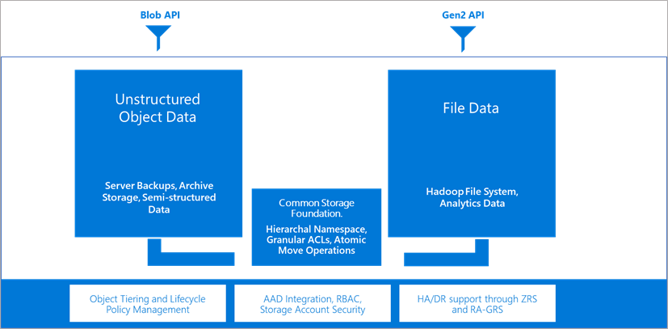

# Multi-protocol access on Azure Data Lake Storage

Blob APIs work with accounts that have a hierarchical namespace. This unlocks the ecosystem of tools, applications, and services, as well as several Blob storage features to accounts that have a hierarchical namespace. 

Until recently, you might have had to maintain separate storage solutions for object storage and analytics storage. That's because Azure Data Lake Storage had limited ecosystem support. It also had limited access to Blob service features such as diagnostic logging. A fragmented storage solution is hard to maintain because you have to move data between accounts to accomplish various scenarios. You no longer have to do that.

With multi-protocol access on Data Lake Storage, you can work with your data by using the ecosystem of tools, applications, and services. This also includes third-party tools and applications. You can point them to accounts that have a hierarchical namespace without having to modify them. These applications work *as is* even if they call Blob APIs, because Blob APIs can now operate on data in accounts that have a hierarchical namespace.

Blob storage features such as [diagnostic logging](../common/storage-analytics-logging.md), [access tiers](access-tiers-overview.md), and [Blob storage lifecycle management policies](./lifecycle-management-overview.md) now work with accounts that have a hierarchical namespace. Therefore, you can enable hierarchical namespaces on your blob Storage accounts without losing access to these important features.

> [!NOTE]
> Some Azure services or Blob storage features enabled by multi-protocol access remain in preview. These articles summarize the current support for Blob storage features and Azure service integrations.
>
> [Blob Storage feature support in Azure Storage accounts](storage-feature-support-in-storage-accounts.md)
>
> [Azure services that support Azure Data Lake Storage](data-lake-storage-supported-azure-services.md)

## How multi-protocol access on data lake storage works

Blob APIs and Data Lake Storage APIs can operate on the same data in storage accounts that have a hierarchical namespace. Data Lake Storage routes Blob APIs through the hierarchical namespace so that you can get the benefits of first class directory operations and POSIX-compliant access control lists (ACLs).

Existing tools and applications that use the Blob API gain these benefits automatically. Developers won't have to modify them. Data Lake Storage consistently applies directory and file-level ACLs regardless of the protocol that tools and applications use to access the data.

## See also

- [Blob Storage feature support in Azure Storage accounts](storage-feature-support-in-storage-accounts.md)
- [Azure services that support Azure Data Lake Storage](data-lake-storage-supported-azure-services.md)
- [Open source platforms that support Azure Data Lake Storage](data-lake-storage-supported-open-source-platforms.md)
- [Known issues with Azure Data Lake Storage](data-lake-storage-known-issues.md)
