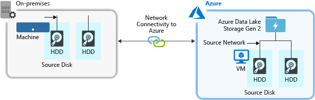
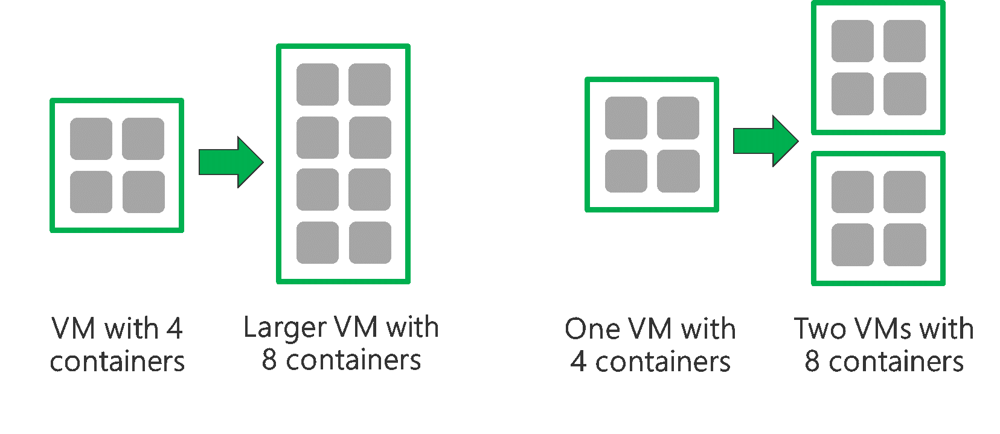

# Optimize Azure Data Lake Storage Gen2 for performance

Azure Data Lake Storage Gen2 supports high-throughput for I/O intensive analytics and data movement.  In Data Lake Storage Gen2, using all available throughput – the amount of data that can be read or written per second – is important to get the best performance.  This is achieved by performing as many reads and writes in parallel as possible.

Data Lake Storage Gen2 can scale to provide the necessary throughput for all analytics scenario. By default, a Data Lake Storage Gen2 account provides automatically enough throughput to meet the needs of a broad category of use cases. For the cases where customers run into the default limit, the Data Lake Storage Gen2 account can be configured to provide more throughput by contacting [Azure Support](https://azure.microsoft.com/support/faq/).

## Data ingestion

When ingesting data from a source system to Data Lake Storage Gen2, it is important to consider that the source hardware, source network hardware, and network connectivity to Data Lake Storage Gen2 can be the bottleneck.  

It is important to ensure that the data movement is not affected by these factors.

### Source hardware

Whether you are using on-premises machines or VMs in Azure, you should carefully select the appropriate hardware. For Source Disk Hardware, prefer SSDs to HDDs and pick disk hardware with faster spindles. For Source Network Hardware, use the fastest NICs possible.  On Azure, we recommend Azure D14 VMs which have the appropriately powerful disk and networking hardware.

### Network connectivity to Data Lake Storage Gen2

The network connectivity between your source data and Data Lake Storage Gen2 can sometimes be the bottleneck. When your source data is On-Premises, consider using a dedicated link with [Azure ExpressRoute](https://azure.microsoft.com/services/expressroute/) . If your source data is in Azure, the performance will be best when the data is in the same Azure region as the Data Lake Storage Gen2 account.

### Configure data ingestion tools for maximum parallelization

Once you have addressed the source hardware and network connectivity bottlenecks above, you are ready to configure your ingestion tools. The following table summarizes the key settings for several popular ingestion tools and provides in-depth performance tuning articles for them.  To learn more about which tool to use for your scenario, visit this [article](data-lake-storage-data-scenarios.md).

| Tool               | Settings		| More Details                                                                 |
|--------------------|------------------------------------------------------|------------------------------|
| DistCp            | -m (mapper)	| [Link](data-lake-storage-use-distcp.md#performance-considerations-while-using-distcp)                             |
| Azure Data Factory| parallelCopies	| [Link](../../data-factory/copy-activity-performance.md)                          |
| Sqoop           | fs.azure.block.size, -m (mapper)	|	[Link](https://blogs.msdn.microsoft.com/bigdatasupport/2015/02/17/sqoop-job-performance-tuning-in-hdinsight-hadoop/)        |

## Structure your data set

When data is stored in Data Lake Storage Gen2, the file size, number of files, and folder structure have an impact on performance.  The following section describes best practices in these areas.  

### File size

Typically, analytics engines such as HDInsight and Azure Data Lake Analytics have a per-file overhead. If you store your data as many small files, this can negatively affect performance. In general, organize your data into larger sized files for better performance (256MB to 100GB in size). Some engines and applications might have trouble efficiently processing files that are greater than 100GB in size.

Sometimes, data pipelines have limited control over the raw data which has lots of small files. It is recommended to have a "cooking" process that generates larger files to use for downstream applications.

### Organizing time series data in folders

For Hive workloads, partition pruning of time-series data can help some queries read only a subset of the data which improves performance.    

Those pipelines that ingest time-series data, often place their files with a very structured naming for files and folders. Below is a very common example we see for data that is structured by date:

	\DataSet\YYYY\MM\DD\datafile_YYYY_MM_DD.tsv

Notice that the datetime information appears both as folders and in the filename.

For date and time, the following is a common pattern

	\DataSet\YYYY\MM\DD\HH\mm\datafile_YYYY_MM_DD_HH_mm.tsv

Again, the choice you make with the folder and file organization should optimize for the larger file sizes and a reasonable number of files in each folder.

## Optimizing I/O intensive jobs on Hadoop and Spark workloads on HDInsight

Jobs fall into one of the following three categories:

* **CPU intensive.**  These jobs have long computation times with minimal I/O times.  Examples include machine learning and natural language processing jobs.  
* **Memory intensive.**  These jobs use lots of memory.  Examples include PageRank and real-time analytics jobs.  
* **I/O intensive.**  These jobs spend most of their time doing I/O.  A common example is a copy job which does only read and write operations.  Other examples include data preparation jobs that read a lot of data, performs some data transformation, and then writes the data back to the store.  

The following guidance is only applicable to I/O intensive jobs.

## General considerations

You can have a job that reads or writes as much as 100MB in a single operation, but a buffer of that size might compromise performance.
To optimize performance, try to keep the size of an I/O operation between 4MB and 16MB.

### General considerations for an HDInsight cluster

* **HDInsight versions.** For best performance, use the latest release of HDInsight.
* **Regions.** Place the Data Lake Storage Gen2 account in the same region as the HDInsight cluster.  

An HDInsight cluster is composed of two head nodes and some worker nodes. Each worker node provides a specific number of cores and memory, which is determined by the VM-type.  When running a job, YARN is the resource negotiator that allocates the available memory and cores to create containers.  Each container runs the tasks needed to complete the job.  Containers run in parallel to process tasks quickly. Therefore, performance is improved by running as many parallel containers as possible.

There are three layers within an HDInsight cluster that can be tuned to increase the number of containers and use all available throughput.  

* **Physical layer**
* **YARN layer**
* **Workload layer**

### Physical Layer

**Run cluster with more nodes and/or larger sized VMs.**  A larger cluster will enable you to run more YARN containers as shown in the picture below.

**Use VMs with more network bandwidth.**  The amount of network bandwidth can be a bottleneck if there is less network bandwidth than Data Lake Storage Gen2 throughput.  Different VMs will have varying network bandwidth sizes.  Choose a VM-type that has the largest possible network bandwidth.

### YARN Layer

**Use smaller YARN containers.**  Reduce the size of each YARN container to create more containers with the same amount of resources.

Depending on your workload, there will always be a minimum YARN container size that is needed. If you pick too small a container, your jobs will run into out-of-memory issues. Typically YARN containers should be no smaller than 1GB. It's common to see 3GB YARN containers. For some workloads, you may need larger YARN containers.  

**Increase cores per YARN container.**  Increase the number of cores allocated to each container to increase the number of parallel tasks that run in each container.  This works for applications like Spark which run multiple tasks per container.  For applications like Hive which run a single thread in each container, it is better to have more containers rather than more cores per container.

### Workload Layer

**Use all available containers.**  Set the number of tasks to be equal or larger than the number of available containers so that all resources are utilized.

**Failed tasks are costly.** If each task has a large amount of data to process, then failure of a task results in an expensive retry.  Therefore, it is better to create more tasks, each of which processes a small amount of data.

In addition to the general guidelines above, each application has different parameters available to tune for that specific application. The table below lists some of the parameters and links to get started with performance tuning for each application.

| Workload | Parameter to set tasks |
|----------|------------------------|
| [Spark on HDInsight](data-lake-storage-performance-tuning-spark.md) | <ul><li>Num-executors</li><li>Executor-memory</li><li>Executor-cores</li></ul> |
| [Hive on HDInsight](data-lake-storage-performance-tuning-hive.md) | <ul><li>hive.tez.container.size</li></ul> |
| [MapReduce on HDInsight](data-lake-storage-performance-tuning-mapreduce.md) | <ul><li>Mapreduce.map.memory</li><li>Mapreduce.job.maps</li><li>Mapreduce.reduce.memory</li><li>Mapreduce.job.reduces</li></ul> |
| [Storm on HDInsight](data-lake-storage-performance-tuning-storm.md)| <ul><li>Number of worker processes</li><li>Number of spout executor instances</li><li>Number of bolt executor instances </li><li>Number of spout tasks</li><li>Number of bolt tasks</li></ul>|

## See also
* [Overview of Azure Data Lake Storage Gen2](data-lake-storage-introduction.md)
