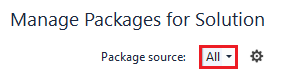
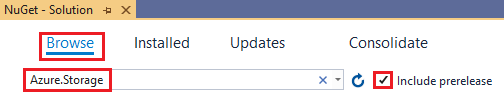

# Filter data by using Azure Data Lake Storage query acceleration

This article shows you how to use .NET and query acceleration (Preview) to retrieve a subset of data from your storage account. 

Query acceleration (Preview) is a new capability for Azure Data Lake Storage that enables application and analytics frameworks to dramatically optimize data processing by retrieving only the data that they require to perform a given operation. To learn more, see [Azure Data Lake Storage Query Acceleration (Preview)](data-lake-storage-query-acceleration.md).

> [!NOTE]
> The query acceleration feature is in public preview, and is available in the West Central US and West US 2 regions. To review limitations, see the [Known issues](data-lake-storage-known-issues.md) article. To enroll in the preview, see [this form](https://aka.ms/adls/queryaccelerationpreview). 

## Prerequisites

### [.NET](#tab/dotnet)

- To access Azure Storage, you'll need an Azure subscription. If you don't already have a subscription, create a [free account](https://azure.microsoft.com/free/?WT.mc_id=A261C142F) before you begin.

- A **general-purpose v2** storage account. see [Create a storage account](../common/storage-quickstart-create-account.md).

### [Java](#tab/java)

- To access Azure Storage, you'll need an Azure subscription. If you don't already have a subscription, create a [free account](https://azure.microsoft.com/free/?WT.mc_id=A261C142F) before you begin.

- A **general-purpose v2** storage account. see [Create a storage account](../common/storage-quickstart-create-account.md).

- [Java Development Kit (JDK)](/java/azure/jdk/?view=azure-java-stable) version 8 or above.

- [Apache Maven](https://maven.apache.org/download.cgi). 

  > [!NOTE] 
  > This article assumes that you've created a Java project by using Apache Maven. For an example of how to create a project by using Apache Maven, see [Setting up](storage-quickstart-blobs-java.md#setting-up).
  
---

## Install packages 

### [.NET](#tab/dotnet)

1. Download the query acceleration packages. You can obtain a compressed .zip file that contains these packages by using this link: [https://aka.ms/adls/qqsdk/.net](https://aka.ms/adls/qqsdk/.net). 

2. Extract the files in this .zip file to any directory on your local drive. 

3. In **Solution Explorer**, right-click either **References** or your project and select **Manage NuGet Packages**.

   The NuGet Package Manager opens.

4. In the NuGet Package Manager, add the directory on your local drive as a package source. 

   For more guidance, see [Package sources](https://docs.microsoft.com/nuget/consume-packages/install-use-packages-visual-studio#package-sources).

5. Make sure that the **Package source** drop-down list is set to **all**. This ensures that you install any packages from [https://www.nuget.org/]() that the query accelerator packages depends on.

   > [!div class="mx-imgBorder"]
   > 

6. Choose the **Browse** tab, select the **Include pre-release** checkbox, and in the search text box, type **Azure.Storage**. 

      > [!div class="mx-imgBorder"]
   > 

7. Install the **Azure.Storage.Blobs**, **Azure.Storage.Common**, and **Azure.Storage.QuickQuery** packages.

   For more information about how to install NuGet packages, see [Install and manage packages in Visual Studio using the NuGet Package Manager](https://docs.microsoft.com/nuget/consume-packages/install-use-packages-visual-studio).

### [Java](#tab/java)

1. Create directory in the root of your project. The examples in this article assume that the name of the directory is **lib**.

2. Download the query acceleration packages. You can obtain a compressed .zip file that contains these packages by using this link: [https://aka.ms/adls/qqsdk/java](https://aka.ms/adls/qqsdk/java). 

3. Extract the files in this .zip file to the directory that you created. In our example, that directory is named **lib**. 

4. Open the *pom.xml* file in your text editor. Add the following dependency elements to the group of dependencies. 

   ```xml
   <!-- Request static dependencies from Maven -->
   <dependency>
       <groupId>com.azure</groupId>
       <artifactId>azure-core</artifactId>
       <version>1.3.0</version>
   </dependency>
   <dependency>
      <groupId>com.azure</groupId>
      <artifactId>azure-core-http-netty</artifactId>
      <version>1.3.0</version>
   </dependency>
   <dependency>
      <groupId>org.apache.avro</groupId>
      <artifactId>avro</artifactId>
      <version>1.9.2</version>
   </dependency>
   <!-- Local dependencies -->
   <dependency>
       <groupId>com.azure</groupId>
       <artifactId>azure-storage-blob</artifactId>
       <version>12.5.0-beta.1</version>
       <scope>system</scope>
       <systemPath>${basedir}/lib/azure-storage-blob-12.5.0-beta.1.jar</systemPath>
   </dependency>
   <dependency>
       <groupId>com.azure</groupId>
       <artifactId>azure-storage-common</artifactId>
       <version>12.5.0-beta.1</version>
       <scope>system</scope>
       <systemPath>${basedir}/lib/azure-storage-common-12.5.0-beta.1.jar</systemPath>
   </dependency>
   <dependency>
       <groupId>com.azure</groupId>
       <artifactId>azure-storage-quickquery</artifactId>
       <version>12.0.0-beta.1</version>
       <scope>system</scope>
       <systemPath>${basedir}/lib/azure-storage-quickquery-12.0.0-beta.1.jar</systemPath>
   </dependency>
   ```
---

## Add statements


### [.NET](#tab/dotnet)

Add these `using` statements to the top of your code file.

```csharp
using Azure.Storage.Blobs;
using Azure.Storage.Blobs.Models;
using Azure.Storage.Blobs.Specialized;
using Azure.Storage.QuickQuery;
using Azure.Storage.QuickQuery.Models;
```

Query acceleration retrieves CSV and Json formatted data. Therefore, make sure to add using statements for any CSV or Json parsing libraries that you choose to use. The examples that appear in this article parse a CSV file by using the [CsvHelper](https://www.nuget.org/packages/CsvHelper/) library that is available on NuGet. Therefore, we'd add these using statements to the top of the code file.

```csharp
using CsvHelper;
using CsvHelper.Configuration;
```

### [Java](#tab/java)

Add these `import` statements to the top of your code file.

```java
import com.azure.storage.blob.*;
import com.azure.storage.blob.models.*;
import com.azure.storage.common.*;
import com.azure.storage.quickquery.*;
import com.azure.storage.quickquery.models.*;
import java.io.*;
```

---

## Retrieve data by using a filter

You can use SQL to specify the row filter predicates and column projections in a query acceleration request. The following code queries a CSV file in storage and returns all rows of data where the third column matches the value `Hemingway, Ernest`. 

- In the SQL query, the keyword `BlobStorage` is used to denote the file that is being queried.

- Column references are specified as `_N` where the first column is `_1`. If the source file contains a header row, then you can specify `CvsTextConfiguration.HasHeaders = true` which will allow you to refer to columns by their name.

### [.NET](#tab/dotnet)

The async method `BlobQuickQueryClient.QueryAsync` sends the query to the query acceleration API, and then streams the results back to the application as a [Stream](https://docs.microsoft.com/dotnet/api/system.io.stream?view=netframework-4.8) object.

```csharp
static async Task QueryHemingway(BlockBlobClient blob)
{
    string query = @"SELECT * FROM BlobStorage WHERE _3 = 'Hemingway, Ernest'";
    await DumpQueryCsv(blob, query, false);
}

private static async Task DumpQueryCsv(BlockBlobClient blob, string query, bool headers)
{
    try
    {
        using (var reader = new StreamReader((await blob.GetQuickQueryClient().QueryAsync(query,
                new CvsTextConfiguration() { HasHeaders = headers }, 
                new CvsTextConfiguration() { HasHeaders = true }, 
                new ErrorHandler(),
                new BlobRequestConditions(), 
                new ProgressHandler(),
                CancellationToken.None)).Value.Content))
        {
            using (var parser = new CsvReader(reader, new CsvConfiguration(CultureInfo.CurrentCulture) 
            { HasHeaderRecord = true }))
            {
                while (await parser.ReadAsync())
                {
                    parser.Context.Record.All(cell =>
                    {
                        Console.Out.Write(cell + "  ");
                        return true;
                    });
                    Console.Out.WriteLine();
                }
            }
        }
    }
    catch (Exception ex)
    {
        Console.Error.WriteLine("Exception: " + ex.ToString());
    }
}

class ErrorHandler : IBlobQueryErrorReceiver
{
    public void ReportError(BlobQueryError err)
    {
        Console.Error.WriteLine(String.Format("Error: {1}:{2}", err.Name, err.Description));
    }
}

class ProgressHandler : IProgress<long>
{
    public void Report(long value)
    {
        Console.Error.WriteLine("Bytes scanned: " + value.ToString());
    }
}

```

### [Java](#tab/java)

The method `BlobQuickQueryClient.openInputStream()` sends the query to the query acceleration API, and then streams the results back to the application as a `InputStream` object which can be read like any other InputStream object.

```java
static void QueryHemingway(BlobClient blobClient) {
    String expression = "SELECT * FROM BlobStorage WHERE _3 = 'Hemingway, Ernest'";
    DumpQueryCsv(blobClient, expression, false);
}

static void DumpQueryCsv(BlobClient blobClient, String query, Boolean headers) {
    try {

        BlobQuickQueryDelimitedSerialization input = new BlobQuickQueryDelimitedSerialization()
            .setRecordSeparator('\n')
            .setColumnSeparator(',')
            .setHeadersPresent(headers)
            .setFieldQuote('\0')
            .setEscapeChar('\\');
        BlobQuickQueryDelimitedSerialization output = new BlobQuickQueryDelimitedSerialization()
            .setRecordSeparator('\n')
            .setColumnSeparator(',')
            .setHeadersPresent(false)
            .setFieldQuote('\0')
            .setEscapeChar('\n');
        BlobRequestConditions requestConditions = null;
        /* ErrorReceiver determines what to do on errors. */
        ErrorReceiver<BlobQuickQueryError> errorReceiver = System.out::println;
        /* ProgressReceiver details how to log progress*/
        ProgressReceiver progressReceiver = System.out::println;

        /* Create a query acceleration client to the blob. */
        BlobQuickQueryClient qqClient = new BlobQuickQueryClientBuilder(blobClient)
            .buildClient();
        /* Open the query input stream. */
        InputStream stream = qqClient.openInputStream(expression, input, output, requestConditions, errorReceiver, progressReceiver);
        BufferedReader reader = new BufferedReader(new InputStreamReader(stream);

        /* Read from stream like you normally would. */
        String line = null;
        while ((line = reader.readLine()) != null) {
            System.out.println(line);
        }
    } catch (Exception e) {
        System.err.println("Exception: " + e.toString();
    }
}
```

---

## Retrieve specific columns

You can scope your results to a subset of columns. That way you retrieve only the columns needed to perform a given calculation. This improves application performance and reduces cost because less data is transferred over the network. 

This code retrieves only the `PublicationYear` column for all books in the data set. It also uses the information from the header row in the source file to reference columns in the query.


### [.NET](#tab/dotnet)

```csharp
static async Task QueryPublishDates(BlockBlobClient blob)
{
    string query = @"SELECT PublicationYear FROM BlobStorage";
    await DumpQueryCsv(blob, query, true);
}
```

### [Java](#tab/java)

```java
static void QueryPublishDates(BlobClient blobClient)
{
    String expression = "SELECT PublicationYear FROM BlobStorage";
    await DumpQueryCsv(blob, query, true);
}
```

---

The following code combines row filtering and column projections into the same query. 

### [.NET](#tab/dotnet)

```csharp
static async Task QueryMysteryBooks(BlockBlobClient blob)
{
    string query = @"SELECT BibNum, Title, Author, ISBN, Publisher FROM BlobStorage WHERE Subjects LIKE '%Mystery%'";
    await DumpQueryCsv(blob, query, true);
}
```

### [Java](#tab/java)

```java
static void QueryMysteryBooks(BlobClient blobClient)
{
    String expression = "SELECT BibNum, Title, Author, ISBN, Publisher FROM BlobStorage WHERE Subjects LIKE '%Mystery%'";
    DumpQueryCsv(blobClient, expression, true);
}
```

---

## Next steps

- [Query acceleration enrollment form](https://aka.ms/adls/queryaccelerationpreview)    
- [Azure Data Lake Storage query acceleration (Preview)](data-lake-storage-query-acceleration.md)
- Query acceleration SQL language reference
- Query acceleration REST API reference
