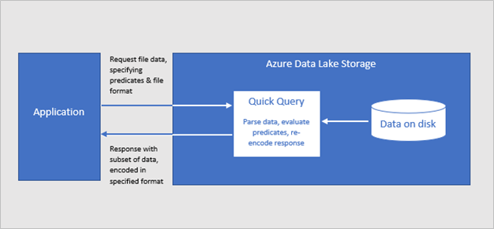

# Azure Data Lake Storage query acceleration (preview)

Query acceleration (preview) is a new capability for Azure Data Lake Storage that enables applications and analytics frameworks to dramatically optimize data processing by retrieving only the data that they require to perform a given operation. This reduces the time and processing power that is required to gain critical insights into stored data.

> [!NOTE]
> The query acceleration feature is in public preview, and is available in the Canada Central and France Central regions. To review limitations, see the [Known issues](data-lake-storage-known-issues.md) article. To enroll in the preview, see [this form](https://aka.ms/adls/qa-preview-signup).  

## Overview

Query acceleration accepts filtering *predicates* and *column projections* which enable applications to filter rows and columns at the time that data is read from disk. Only the data that meets the conditions of a predicate are transferred over the network to the application. This reduces network latency and compute cost.  

You can use SQL to specify the row filter predicates and column projections in a query acceleration request. A request processes only one file. Therefore, advanced relational features of SQL, such as joins and group by aggregates, aren't supported. Query acceleration supports CSV and JSON formatted data as input to each request.

The query acceleration feature isn't limited to Data Lake Storage (storage accounts that have the hierarchical namespace enabled on them). Query acceleration is completely compatible with the blobs in storage accounts that **don't** have a hierarchical namespace enabled on them. This means that you can achieve the same reduction in network latency and compute costs when you process data that you already have stored as blobs in storage accounts.

For an example of how to use query acceleration in a client application, see [Filter data by using Azure Data Lake Storage query acceleration](data-lake-storage-query-acceleration-how-to.md).

## Data flow

The following diagram illustrates how a typical application uses query acceleration to process data.

> [!div class="mx-imgBorder"]
> 

1. The client application requests file data by specifying predicates and column projections.

2. Query acceleration parses the specified SQL query and distributes work to parse and filter data.

3. Processors read the data from the disk, parses the data by using the appropriate format, and then filters data by applying the specified predicates and column projections.

4. Query acceleration combines the response shards to stream back to client application.

5. The client application receives and parses the streamed response. The application doesn't need to filter any additional data and can apply the desired calculation or transformation directly.

## Better performance at a lower cost

Query acceleration optimizes performance by reducing the amount of data that gets transferred and processed by your application.

To calculate an aggregated value, applications commonly retrieve **all** of the data from a file, and then process and filter the data locally. An analysis of the input/output patterns for analytics workloads reveal that applications typically require only 20% of the data that they read to perform any given calculation. This statistic is true even after applying techniques such as [partition pruning](https://docs.microsoft.com/azure/hdinsight/hdinsight-hadoop-optimize-hive-query#hive-partitioning). This means that 80% of that data is needlessly transferred across the network, parsed, and filtered by applications. This pattern, essentially designed to remove unneeded data, incurs a significant compute cost.  

Even though Azure features an industry-leading network, in terms of both throughput and latency, needlessly transferring data across that network is still costly for application performance. By filtering out the unwanted data during the storage request, query acceleration eliminates this cost.

Additionally, the CPU load that is required to parse and filter unneeded data requires your application to provision a greater number and larger VMs in order to do it's work. By transferring this compute load to query acceleration, applications can realize significant cost savings.

## Applications that can benefit from query acceleration

Query acceleration is designed for distributed analytics frameworks and data processing applications. 

Distributed analytics frameworks such as Apache Spark and Apache Hive, include a storage abstraction layer within the framework. These engines also include query optimizers that can incorporate knowledge of the underlying I/O service's capabilities when determining an optimal query plan for user queries. These frameworks are beginning to integrate query acceleration. As a result, users of these frameworks will see improved query latency and a lower total cost of ownership without having to make any changes to the queries. 

Query acceleration is also designed for data processing applications. These types of applications typically perform large scale data transformations that might not directly lead to analytics insights so they don't always use established distributed analytics frameworks. These applications often have a more direct relationship with the underlying storage service so they can benefit directly from features such as query acceleration. 

For an example of how an application can integrate query acceleration, see [Filter data by using Azure Data Lake Storage query acceleration](data-lake-storage-query-acceleration-how-to.md).

## Pricing

Due to the increased compute load within the Azure Data Lake Storage service, the pricing model for using query acceleration differs from the normal Azure Data Lake Storage transaction model. Query acceleration charges a cost for the amount of data scanned as well as a cost for the amount of data returned to the caller. For more information, see [Azure Data Lake Storage Gen2 pricing](https://azure.microsoft.com/pricing/details/storage/data-lake/).

Despite the change to the billing model, Query acceleration's pricing model is designed to lower the total cost of ownership for a workload, given the reduction in the much more expensive VM costs.

## Next steps

- [Query acceleration enrollment form](https://aka.ms/adls/qa-preview-signup)    
- [Filter data by using Azure Data Lake Storage query acceleration (preview)](data-lake-storage-query-acceleration-how-to.md)
- [Query acceleration SQL language reference (preview)](query-acceleration-sql-reference.md)

