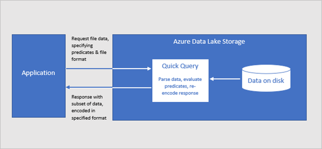

# Azure Data Lake Storage query acceleration

By using query acceleration, applications and analytics frameworks can optimize data processing. They retrieve only the data they need to perform a given operation. This approach reduces the time and processing power required to gain insights into stored data.

## Overview

Query acceleration accepts filtering _predicates_ and _column projections_. By using these predicates and projections, applications can filter rows and columns when reading data from disk. Only the data that meets the conditions of a predicate is transferred over the network to the application. This approach reduces network latency and compute cost.

Use SQL to specify the row filter predicates and column projections in a query acceleration request. Keep the following constraints in mind:

- A request processes only one file.
- Query acceleration doesn't support advanced relational features of SQL, such as joins and group by aggregates.
- Query acceleration supports CSV and JSON formatted data as input to each request.

The query acceleration feature isn't limited to Data Lake Storage (storage accounts that have the hierarchical namespace enabled on them). Query acceleration is compatible with the blobs in storage accounts that **don't** have a hierarchical namespace enabled on them. This compatibility means that you can achieve the same reduction in network latency and compute costs when you process data that you already have stored as blobs in storage accounts.

For an example of how to use query acceleration in a client application, see [Filter data by using Azure Data Lake Storage query acceleration](data-lake-storage-query-acceleration-how-to.md).

## Data flow

The following diagram illustrates how a typical application uses query acceleration to process data.

> [!div class="mx-imgBorder"]
> 

1. The client application requests file data by specifying predicates and column projections.

2. Query acceleration parses the specified SQL query and distributes work to parse and filter data.

3. Processors read the data from the disk, parse the data by using the appropriate format, and then filter data by applying the specified predicates and column projections.

4. Query acceleration combines the response shards to stream back to the client application.

5. The client application receives and parses the streamed response. The application doesn't need to filter any other data and can apply the desired calculation or transformation directly.

## Better performance at a lower cost

Query acceleration optimizes performance by reducing the amount of data that your application transfers and processes.

To calculate an aggregated value, applications commonly retrieve **all** of the data from a file, and then process and filter the data locally. An analysis of the input and output (I/O) patterns for analytics workloads reveals that applications typically require only 20% of the data that they read to perform any given calculation. This statistic is true even after applying techniques such as [partition pruning](../../hdinsight/hdinsight-hadoop-optimize-hive-query.md#hive-partitioning). This result means that applications needlessly transfer, parse, and filter 80% of the data. This pattern, designed to remove unneeded data, incurs a significant compute cost.

Even though Azure features a high-performance network, in terms of both throughput and latency, needlessly transferring data across that network is still costly for application performance. By filtering out the unwanted data during the storage request, query acceleration eliminates this cost.

Additionally, the CPU load required to parse and filter unneeded data requires your application to provision more and larger VMs to do its work. By transferring this compute load to query acceleration, applications can realize significant cost savings.

## Applications that can benefit from query acceleration

Query acceleration is designed for distributed analytics frameworks and data processing applications:

- **Distributed analytics frameworks** such as Apache Spark and Apache Hive include a storage abstraction layer within the framework. These engines also include query optimizers that can incorporate knowledge of the underlying I/O service's capabilities when determining an optimal query plan for user queries. These frameworks integrate query acceleration. As a result, users of these frameworks see improved query latency and a lower total cost of ownership without having to make any changes to the queries.

- **Data processing applications** typically perform large-scale data transformations that might not directly lead to analytics insights, so they don't always use established distributed analytics frameworks. These applications often have a more direct relationship with the underlying storage service, so they can benefit directly from features such as query acceleration.

For an example of how an application can integrate query acceleration, see [Filter data by using Azure Data Lake Storage query acceleration](data-lake-storage-query-acceleration-how-to.md).

## Pricing

Because of the increased compute load within the Azure Data Lake Storage service, the pricing model for query acceleration differs from the normal Azure Data Lake Storage transaction model. Query acceleration charges a cost for the amount of data scanned as well as a cost for the amount of data returned to the caller. For more information, see [Azure Data Lake Storage pricing](https://azure.microsoft.com/pricing/details/storage/data-lake/).

Despite the change to the billing model, query acceleration's pricing model is designed to lower the total cost of ownership for a workload, given the reduction in the much more expensive VM costs.

## Next steps

- [Filter data by using Azure Data Lake Storage query acceleration](data-lake-storage-query-acceleration-how-to.md)
- [Query acceleration SQL language reference](query-acceleration-sql-reference.md)
