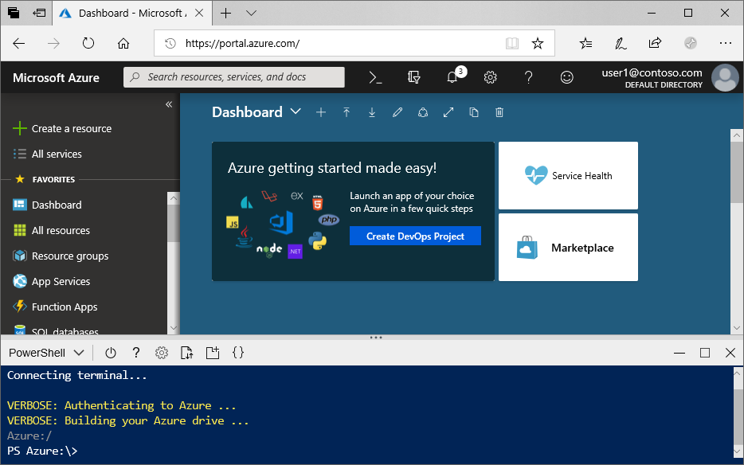

# Create an Azure Data Lake Storage Gen2 storage account

Azure Data Lake Storage Gen2 [supports a hierarchical namespace](data-lake-storage-introduction.md) which provides a native directory-based container tailored to work with the Hadoop Distributed File System (HDFS). Access to Data Lake Storage Gen2 data from the HDFS is available through the [ABFS driver](data-lake-storage-abfs-driver.md).

This article demonstrates how to create an account using the Azure portal, Azure PowerShell, or via the Azure CLI.

## Prerequisites

If you don't have an Azure subscription, create a [free account](https://azure.microsoft.com/free/) before you begin. 

|           | Prerequisite |
|-----------|--------------|
|Portal     | None         |
|PowerShell | This article requires the PowerShell module Az.Storage version **0.7** or later. To find your current version, run the `Get-Module -ListAvailable Az.Storage` command. If after you run this command, no results appear, or if a version lower than **0.7** appears, then you'll have to upgrade your powershell module. See the [Upgrade your powershell module](#upgrade-your-powershell-module) section of this guide.
|CLI        | You can sign in to Azure and run Azure CLI commands in one of two ways: <ul><li>You can run CLI commands from within the Azure portal, in Azure Cloud Shell </li><li>You can install the CLI and run CLI commands locally</li></ul>|

When working on the command line you have the option of running the Azure Cloud shell or installing the CLI locally.

### Use Azure Cloud Shell

Azure Cloud Shell is a free Bash shell that you can run directly within the Azure portal. It has the Azure CLI preinstalled and configured to use with your account. Click the **Cloud Shell** button on the menu in the upper-right of the Azure portal:

[](https://portal.azure.com)

The button launches an interactive shell that you can use to run the steps in this article:

[](https://portal.azure.com)

### Install the CLI locally

You can also install and use the Azure CLI locally. This article requires that you are running the Azure CLI version 2.0.38 or later. Run `az --version` to find the version. If you need to install or upgrade, see [Install the Azure CLI](/cli/azure/install-azure-cli).

## Create a storage account with Azure Data Lake Storage Gen2 enabled

An Azure storage account contains all of your Azure Storage data objects: blobs, files, queues, tables, and disks. The storage account provides a unique namespace for your Azure Storage data that is accessible from anywhere in the world over HTTP or HTTPS. Data in your Azure storage account is durable and highly available, secure, and massively scalable.

> [!NOTE]
> You must create new storage accounts as type **StorageV2 (general-purpose V2)** to take advantage of Data Lake Storage Gen2 features.  

For more information about storage accounts, see [Azure Storage account overview](../common/storage-account-overview.md).

## Create an account using the Azure portal

Sign in to the [Azure portal](https://portal.azure.com).

### Create a storage account

Every storage account must belong to an Azure resource group. A resource group is a logical container for grouping your Azure services. When you create a storage account, you have the option to either create a new resource group, or use an existing resource group. This article shows how to create a new resource group.

To create a general-purpose v2 storage account in the Azure portal, follow these steps:

> [!NOTE]
> The hierarchical namespace is currently available in all public regions.

1. Choose the subscription in which you want to create the storage account.
2. In the Azure portal, choose the **Create a resource** button, then choose **Storage account**.
3. Under the **Resource group** field, select **Create new**. Enter a name for your new resource group.
   
   A resource group is a logical container for grouping your Azure services. When you create a storage account, you have the option to either create a new resource group, or use an existing resource group.

4. Next, enter a name for your storage account. The name you choose must be unique across Azure. The name also must be between 3 and 24 characters in length, and can include numbers and lowercase letters only.
5. Choose a location.
6. Make sure that **StorageV2 (general purpose v2)** appears as selected in the **Account kind** drop-down list.
7. Optionally change the values in each of these fields: **Performance**, **Replication**, **Access tier**. To learn more about these options, see [Introduction to Azure Storage](https://docs.microsoft.com/azure/storage/common/storage-introduction#azure-storage-services).
8. Choose the **Advanced** tab.
10. In the **Data Lake Storage Gen2** section set **Hierarchical namespace** to **Enabled**.
11. Click **Review + Create** to create the storage account.

Your storage account is now created through the portal.

### Clean up resources

To remove a resource group using the Azure portal:

1. In the Azure portal, expand the menu on the left side to open the menu of services, and choose **Resource Groups** to display the list of your resource groups.
2. Locate the resource group to delete, and right-click the **More** button (**...**) on the right side of the listing.
3. Select **Delete resource group**, and confirm.

## Create an account using PowerShell

First, install the latest version of the [PowerShellGet](https://docs.microsoft.com/powershell/gallery/installing-psget) module.

Then, upgrade your powershell module, sign in to your Azure subscription, create a resource group, and then create a storage account.

### Upgrade your powershell module

[!INCLUDE [updated-for-az](../../../includes/updated-for-az.md)]

To interact with Data Lake Storage Gen2 by using PowerShell, you'll need to install module Az.Storage version **0.7** or later.

Start by opening a PowerShell session with elevated permissions.

Install the Az.Storage module

```powershell
Install-Module Az.Storage -Repository PSGallery -AllowClobber -Force
```

### Sign in to your Azure Subscription

Use the `Login-AzAccount` command and follow the on-screen directions to authenticate.

```powershell
Login-AzAccount
```

### Create a resource group

To create a new resource group with PowerShell, use the [New-AzResourceGroup](/powershell/module/az.resources/new-azresourcegroup) command: 

> [!NOTE]
> The hierarchical namespace is currently available in all public regions.

```powershell
# put resource group in a variable so you can use the same group name going forward,
# without hardcoding it repeatedly
$resourceGroup = "storage-quickstart-resource-group"
$location = "westus2"
New-AzResourceGroup -Name $resourceGroup -Location $location
```

### Create a general-purpose v2 storage account

To create a general-purpose v2 storage account from PowerShell with locally-redundant storage (LRS), use the [New-AzStorageAccount](/powershell/module/az.storage/New-azStorageAccount) command:

```powershell
$location = "westus2"

New-AzStorageAccount -ResourceGroupName $resourceGroup `
  -Name "storagequickstart" `
  -Location $location `
  -SkuName Standard_LRS `
  -Kind StorageV2 `
  -EnableHierarchicalNamespace $True
```

### Clean up resources

To remove the resource group and its associated resources, including the new storage account, use the [Remove-AzResourceGroup](/powershell/module/az.resources/remove-azresourcegroup) command: 

```powershell
Remove-AzResourceGroup -Name $resourceGroup
```

## Create an account using Azure CLI

To start Azure Cloud Shell, sign in to the [Azure portal](https://portal.azure.com).

If you want to sign in to your local installation of the CLI, run the login command:

```cli
az login
```

### Add the CLI extension for Azure Data Lake Gen 2

To interact with Data Lake Storage Gen2 by using the CLI, you'll have to add an extension to your shell.

To do that, enter the following command by using either the Cloud Shell or a local shell: `az extension add --name storage-preview`

### Create a resource group

To create a new resource group with Azure CLI, use the [az group create](/cli/azure/group) command.

```azurecli-interactive
az group create `
    --name storage-quickstart-resource-group `
    --location westus2
```

> [!NOTE]
> > The hierarchical namespace is currently available in all public regions.

### Create a general-purpose v2 storage account

To create a general-purpose v2 storage account from the Azure CLI with locally-redundant storage, use the [az storage account create](/cli/azure/storage/account) command.

```azurecli-interactive
az storage account create `
    --name storagequickstart `
    --resource-group storage-quickstart-resource-group `
    --location westus2 `
    --sku Standard_LRS `
    --kind StorageV2 `
    --hierarchical-namespace true
```

### Clean up resources

To remove the resource group and its associated resources, including the new storage account, use the [az group delete](/cli/azure/group) command.

```azurecli-interactive
az group delete --name myResourceGroup
```

## Next steps

In this article, you've created a storage account with Data Lake Storage Gen2 capabilities. To learn how to upload and download blobs to and from your storage account, see the following topic.

* [AzCopy V10](https://docs.microsoft.com/azure/storage/common/storage-use-azcopy-v10?toc=%2fazure%2fstorage%2fblobs%2ftoc.json)
