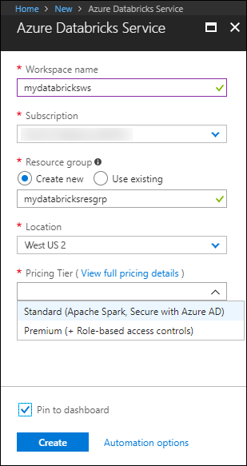
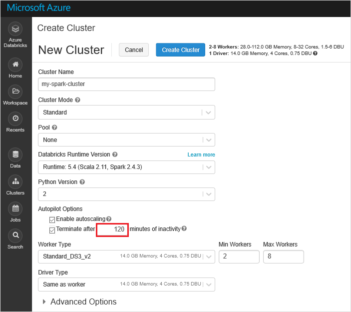
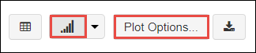
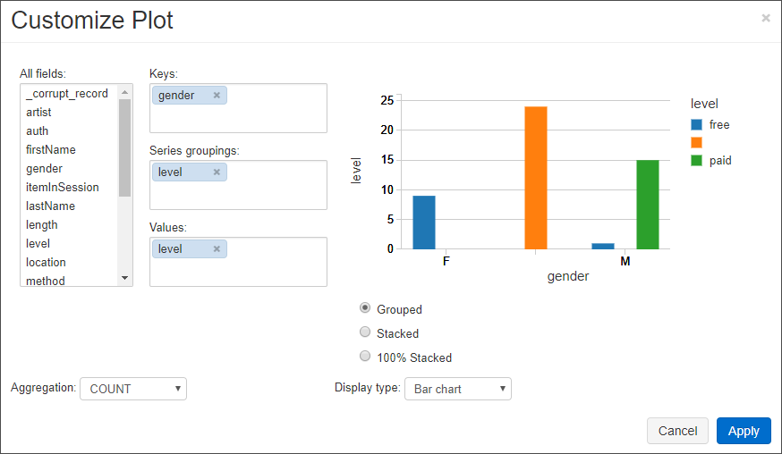
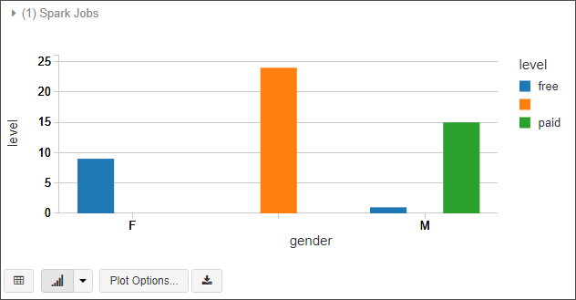

# Quickstart: Analyze data in Azure Data Lake Storage Gen2 by using Azure Databricks

This quickstart shows you how to run an Apache Spark job using Azure Databricks to perform analytics on data stored in a storage account that has Azure Data Lake Storage Gen2 enabled.

As part of the Spark job, you'll analyze a radio channel subscription data to gain insights into free/paid usage based on demographics.

If you don't have an Azure subscription, [create a free account](https://azure.microsoft.com/free/) before you begin.

## Prerequisites

* Create a Data Lake Gen2 storage account. See [Quickstart: Create an Azure Data Lake Storage Gen2 storage account](data-lake-storage-quickstart-create-account.md)

  Paste the name of the storage account into a text file. You'll need it soon.

* Create a service principal. See [How to: Use the portal to create an Azure AD application and service principal that can access resources](https://docs.microsoft.com/azure/active-directory/develop/howto-create-service-principal-portal).

  There's a couple of specific things that you'll have to do as you perform the steps in that article.

  :heavy_check_mark: When performing the steps in the [Assign the application to a role](https://docs.microsoft.com/azure/active-directory/develop/howto-create-service-principal-portal#assign-the-application-to-a-role) section of the article, make sure to assign the **Storage Blob Data Contributor** role to the service principal.

  > [!IMPORTANT]
  > Make sure to assign the role in the scope of the Data Lake Storage Gen2 storage account. You can assign a role to the parent resource group or subscription, but you'll receive permissions-related errors until those role assignments propagate to the storage account.

  :heavy_check_mark: When performing the steps in the [Get values for signing in](https://docs.microsoft.com/azure/active-directory/develop/howto-create-service-principal-portal#get-values-for-signing-in) section of the article, paste the tenant ID, app ID, and password values into a text file. You'll need those soon.

## Create an Azure Databricks workspace

In this section, you create an Azure Databricks workspace using the Azure portal.

1. In the Azure portal, select **Create a resource** > **Analytics** > **Azure Databricks**.

    

2. Under **Azure Databricks Service**, provide the values to create a Databricks workspace.

    

    Provide the following values:

    |Property  |Description  |
    |---------|---------|
    |**Workspace name**     | Provide a name for your Databricks workspace        |
    |**Subscription**     | From the drop-down, select your Azure subscription.        |
    |**Resource group**     | Specify whether you want to create a new resource group or use an existing one. A resource group is a container that holds related resources for an Azure solution. For more information, see [Azure Resource Group overview](../../azure-resource-manager/resource-group-overview.md). |
    |**Location**     | Select **West US 2**. Feel free to select another public region if you prefer.        |
    |**Pricing Tier**     |  Choose between **Standard** or **Premium**. For more information on these tiers, see [Databricks pricing page](https://azure.microsoft.com/pricing/details/databricks/).       |

3. The account creation takes a few minutes. To monitor the operation status, view the progress bar at the top.

4. Select **Pin to dashboard** and then select **Create**.

## Create a Spark cluster in Databricks

1. In the Azure portal, go to the Databricks workspace that you created, and then select **Launch Workspace**.

2. You are redirected to the Azure Databricks portal. From the portal, select **New** > **Cluster**.

    

3. In the **New cluster** page, provide the values to create a cluster.

    

    Accept all other default values other than the following:

    * Enter a name for the cluster.
    * Create a cluster with **5.1** runtime.
    * Make sure you select the **Terminate after 120 minutes of inactivity** checkbox. Provide a duration (in minutes) to terminate the cluster, if the cluster is not being used.

4. Select **Create cluster**. Once the cluster is running, you can attach notebooks to the cluster and run Spark jobs.

For more information on creating clusters, see [Create a Spark cluster in Azure Databricks](https://docs.azuredatabricks.net/user-guide/clusters/create.html).

## Create storage account file system

In this section, you create a notebook in Azure Databricks workspace and then run code snippets to configure the storage account.

1. In the [Azure portal](https://portal.azure.com), go to the Azure Databricks workspace you created, and then select **Launch Workspace**.

2. In the left pane, select **Workspace**. From the **Workspace** drop-down, select **Create** > **Notebook**.

    

3. In the **Create Notebook** dialog box, enter a name for the notebook. Select **Scala** as the language, and then select the Spark cluster that you created earlier.

    

    Select **Create**.

4. Copy and paste the following code block into the first cell, but don't run this code yet.

   ```scala
   spark.conf.set("fs.azure.account.auth.type.<storage-account-name>.dfs.core.windows.net", "OAuth")
   spark.conf.set("fs.azure.account.oauth.provider.type.<storage-account-name>.dfs.core.windows.net", "org.apache.hadoop.fs.azurebfs.oauth2.ClientCredsTokenProvider")
   spark.conf.set("fs.azure.account.oauth2.client.id.<storage-account-name>.dfs.core.windows.net", "<appID>")
   spark.conf.set("fs.azure.account.oauth2.client.secret.<storage-account-name>.dfs.core.windows.net", "<password>")
   spark.conf.set("fs.azure.account.oauth2.client.endpoint.<storage-account-name>.dfs.core.windows.net", "https://login.microsoftonline.com/<tenant-id>/oauth2/token")
   spark.conf.set("fs.azure.createRemoteFileSystemDuringInitialization", "true")
   dbutils.fs.ls("abfss://<file-system-name>@<storage-account-name>.dfs.core.windows.net/")
   spark.conf.set("fs.azure.createRemoteFileSystemDuringInitialization", "false")

   ```

    > [!NOTE]
    > This code block directly accesses the Data Lake Gen2 endpoint by using OAuth, but there are other ways to connect the Databricks workspace to your Data Lake Storage Gen2 account. For example, you could mount the file system by using OAuth or use a direct access with Shared Key. <br>To see examples of these approaches, see the [Azure Data Lake Storage Gen2](https://docs.azuredatabricks.net/spark/latest/data-sources/azure/azure-datalake-gen2.html) article on the Azure Databricks Website.

5. In this code block, replace the `storage-account-name`, `appID`, `password`, and `tenant-id` placeholder values in this code block with the values that you collected when you created the service principal. Set the `file-system-name` placeholder value to whatever name you want to give the file system.

    > [!NOTE]
    > In a production setting, consider storing your authentication key in Azure Databricks. Then, add a look up key to your code block instead of the authentication key. After you've completed this quickstart, see the [Azure Data Lake Storage Gen2](https://docs.azuredatabricks.net/spark/latest/data-sources/azure/azure-datalake-gen2.html) article on the Azure Databricks Website to see examples of this approach.

6. Press the **SHIFT + ENTER** keys to run the code in this block.

## Ingest sample data

Before you begin with this section, you must complete the following prerequisites:

Enter the following code into a notebook cell:

    %sh wget -P /tmp https://raw.githubusercontent.com/Azure/usql/master/Examples/Samples/Data/json/radiowebsite/small_radio_json.json

In the cell, press **SHIFT + ENTER** to run the code.

Now in a new cell below this one, enter the following code, and replace the values that appear in brackets with the same values you used earlier:

    dbutils.fs.cp("file:///tmp/small_radio_json.json", "abfss://<file-system>@<account-name>.dfs.core.windows.net/")

In the cell, press **SHIFT + ENTER** to run the code.

## Run a Spark SQL Job

Perform the following tasks to run a Spark SQL job on the data.

1. Run a SQL statement to create a temporary table using data from the sample JSON data file, **small_radio_json.json**. In the following snippet, replace the placeholder values with your file system name and storage account name. Using the notebook you created earlier, paste the snippet in a new code cell in the notebook, and then press SHIFT + ENTER.

    ```sql
    %sql
    DROP TABLE IF EXISTS radio_sample_data;
    CREATE TABLE radio_sample_data
    USING json
    OPTIONS (
     path  "abfss://<file-system-name>@<storage-account-name>.dfs.core.windows.net/small_radio_json.json"
    )
    ```

    Once the command successfully completes, you have all the data from the JSON file as a table in Databricks cluster.

    The `%sql` language magic command enables you to run a SQL code from the notebook, even if the notebook is of another type. For more information, see [Mixing languages in a notebook](https://docs.azuredatabricks.net/user-guide/notebooks/index.html#mixing-languages-in-a-notebook).

2. Let's look at a snapshot of the sample JSON data to better understand the query that you run. Paste the following snippet in the code cell and press **SHIFT + ENTER**.

    ```sql
    %sql
    SELECT * from radio_sample_data
    ```

3. You see a tabular output like shown in the following screenshot (only some columns are shown):

    

    Among other details, the sample data captures the gender of the audience of a radio channel (column name, **gender**) and whether their subscription is free or paid (column name, **level**).

4. You now create a visual representation of this data to show for each gender, how many users have free accounts and how many are paid subscribers. From the bottom of the tabular output, click the **Bar chart** icon, and then click **Plot Options**.

    

5. In **Customize Plot**, drag-and-drop values as shown in the screenshot.

    

    - Set **Keys** to **gender**.
    - Set **Series groupings** to **level**.
    - Set **Values** to **level**.
    - Set **Aggregation** to **COUNT**.

6. Click **Apply**.

7. The output shows the visual representation as depicted in the following screenshot:

     

## Clean up resources

Once you're finished with this article, you can terminate the cluster. From the Azure Databricks workspace, select **Clusters** and locate the cluster you want to terminate. Hover your mouse cursor over the ellipsis under **Actions** column, and select the **Terminate** icon.


If you do not manually terminate the cluster it automatically stops, provided you selected the **Terminate after \_\_ minutes of inactivity** checkbox while creating the cluster. If you set this option the cluster stops after it has been inactive for the designated amount of time.

## Next steps

In this article, you created a Spark cluster in Azure Databricks and ran a Spark job using data in a storage account with Data Lake Storage Gen2 enabled. You can also look at [Spark data sources](https://docs.azuredatabricks.net/spark/latest/data-sources/index.html) to learn how to import data from other data sources into Azure Databricks. Advance to the next article to learn how to perform an ETL operation (extract, transform, and load data) using Azure Databricks.

> [!div class="nextstepaction"]
>[Extract, transform, and load data using Azure Databricks](../../azure-databricks/databricks-extract-load-sql-data-warehouse.md)
