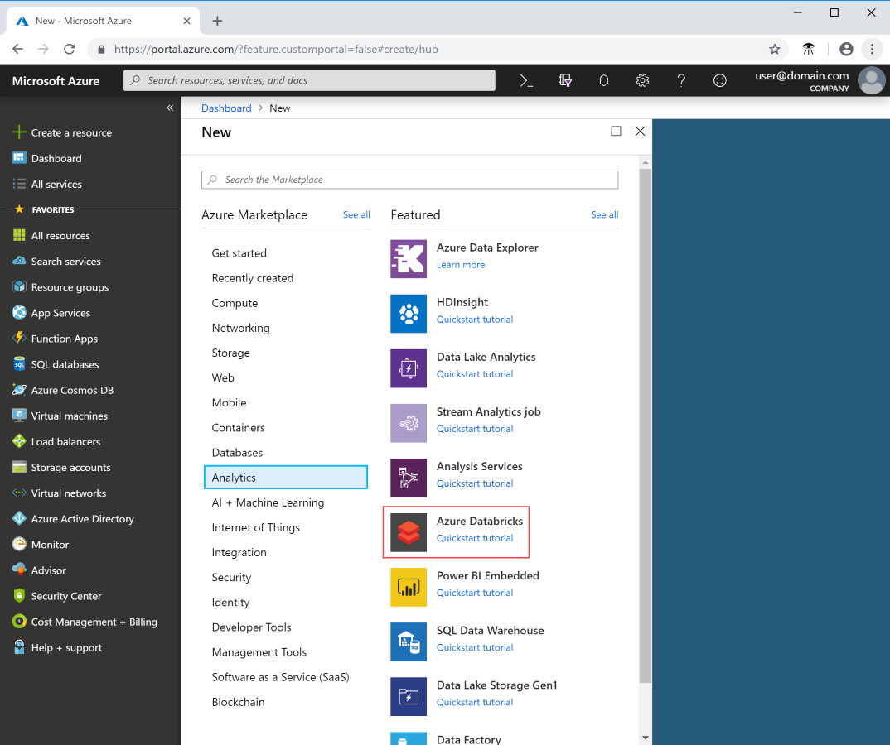
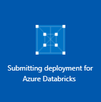
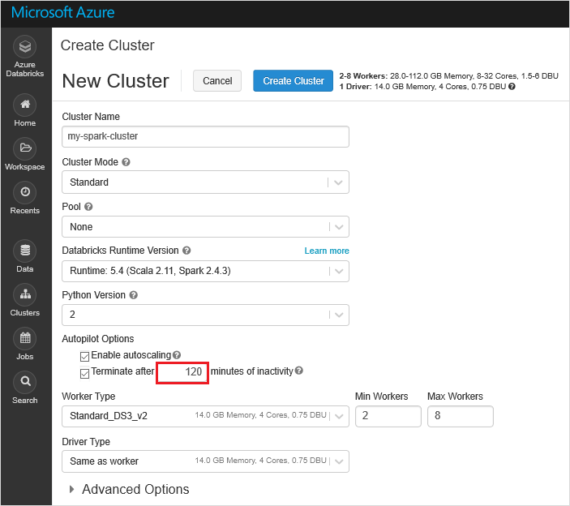
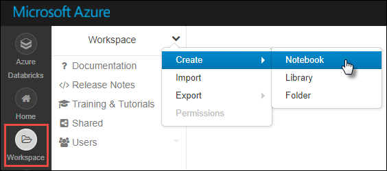

# Tutorial: Access Data Lake Storage Gen2 Preview data with Azure Databricks using Spark

This tutorial shows you how to connect your Azure Databricks cluster to data stored in an Azure storage account that has Azure Data Lake Storage Gen2 (Preview) enabled. This connection enables you to natively run queries and analytics from your cluster on your data.

In this tutorial, you will:

> [!div class="checklist"]
> * Create a Databricks cluster
> * Ingest unstructured data into a storage account
> * Running analytics on your data in Blob storage

If you don’t have an Azure subscription, create a [free account](https://azure.microsoft.com/free/?WT.mc_id=A261C142F) before you begin.

## Prerequisites

Before you begin this tutorial, create an Azure Data Lake Storage Gen2 account.

See [Create a Azure Data Lake Storage Gen2 account](data-lake-storage-quickstart-create-account.md).

### Download the flight data

This tutorial uses flight data from the Bureau of Transportation Statistics to demonstrate how to perform an ETL operation. You must download this data to complete the tutorial.

1. Go to [Research and Innovative Technology Administration, Bureau of Transportation Statistics](https://www.transtats.bts.gov/DL_SelectFields.asp?Table_ID=236&DB_Short_Name=On-Time).

2. Select the **Prezipped File** check box to select all data fields.

3. Select the **Download** button and save the results to your computer.

   Make a note of the file name and the path of the download. You need this information in a later step.

## Set aside storage account configuration

You'll need the name of your storage account, and a file system endpoint URI.

To get the name of your storage account in the Azure portal, choose **All Services** and filter on the term *storage*. Then, select **Storage accounts** and locate your storage account.

To get the file system endpoint URI, choose **Properties**, and in the properties pane find the value of the **Primary ADLS FILE SYSTEM ENDPOINT** field.

Paste both of these values into a text file. You'll need them soon.

<a id="service-principal"/>

## Create a service principal

Create a service principal by following the guidance in this topic: [How to: Use the portal to create an Azure AD application and service principal that can access resources](https://docs.microsoft.com/azure/active-directory/develop/howto-create-service-principal-portal).

There's a few specific things that you'll have to do as you perform the steps in that article.

:heavy_check_mark: When performing the steps in the [Create an Azure Active Directory application](https://docs.microsoft.com/azure/active-directory/develop/howto-create-service-principal-portal#create-an-azure-active-directory-application) section of the article,  make sure to set the **Sign-on URL** field of the **Create** dialog box to the endpoint URI that you just collected.

:heavy_check_mark: When performing the steps in the [Assign the application to a role](https://docs.microsoft.com/azure/active-directory/develop/howto-create-service-principal-portal#assign-the-application-to-a-role) section of the article, make sure to assign your application to the **Blob Storage Contributor Role**.

:heavy_check_mark: When performing the steps in the [Get values for signing in](https://docs.microsoft.com/azure/active-directory/develop/howto-create-service-principal-portal#get-values-for-signing-in) section of the article, paste the tenant ID, application ID, and authentication key values into a text file. You'll need those soon.

## Create an Azure Databricks service

In this section, you create an Azure Databricks service by using the Azure portal.

1. In the Azure portal, select **Create a resource** > **Analytics** > **Azure Databricks**.

    

2. Under **Azure Databricks Service**, provide the following values to create a Databricks service:

    |Property  |Description  |
    |---------|---------|
    |**Workspace name**     | Provide a name for your Databricks workspace.  |
    |**Subscription**     | From the drop-down, select your Azure subscription.        |
    |**Resource group**     | Specify whether you want to create a new resource group or use an existing one. A resource group is a container that holds related resources for an Azure solution. For more information, see [Azure Resource Group overview](../../azure-resource-manager/resource-group-overview.md). |
    |**Location**     | Select **West US 2**. For other available regions, see [Azure services available by region](https://azure.microsoft.com/regions/services/).       |
    |**Pricing Tier**     |  Select **Standard**.     |

    

3. Select **Pin to dashboard** and then select **Create**.

4. The account creation takes a few minutes. During account creation, the portal displays the **Submitting deployment for Azure Databricks** tile on the right. To monitor the operation status, view the progress bar at the top.

    

## Create a Spark cluster in Azure Databricks

1. In the Azure portal, go to the Databricks service that you created, and select **Launch Workspace**.

2. You're redirected to the Azure Databricks portal. From the portal, select **Cluster**.

    

3. In the **New cluster** page, provide the values to create a cluster.

    

4. Fill in values for the following fields, and accept the default values for the other fields:

    * Enter a name for the cluster.

    * For this article, create a cluster with the **5.1** runtime.

    * Make sure you select the **Terminate after \_\_ minutes of inactivity** check box. If the cluster isn't being used, provide a duration (in minutes) to terminate the cluster.

    * Select **Create cluster**. After the cluster is running, you can attach notebooks to the cluster and run Spark jobs.

## New section with new name

1. In the [Azure portal](https://portal.azure.com), go to the Azure Databricks service that you created, and select **Launch Workspace**.

2. On the left, select **Workspace**. From the **Workspace** drop-down, select **Create** > **Notebook**.

    

3. In the **Create Notebook** dialog box, enter a name for the notebook. Select **Python** as the language, and then select the Spark cluster that you created earlier.

4. Select **Create**.

5. Copy and paste the following code block into the first cell, but don't run this code yet.

    ```Python
    configs = {"fs.azure.account.auth.type": "OAuth",
           "fs.azure.account.oauth.provider.type": "org.apache.hadoop.fs.azurebfs.oauth2.ClientCredsTokenProvider",
           "fs.azure.account.oauth2.client.id": "<application-id>",
           "fs.azure.account.oauth2.client.secret": "<authentication-id>",
           "fs.azure.account.oauth2.client.endpoint": "https://login.microsoftonline.com/<tenant-id>/oauth2/token",
           "fs.azure.createRemoteFileSystemDuringInitialization": "true"}

    dbutils.fs.mount(
    source = "abfss://<file-system-name>@<storage-account-name>.dfs.core.windows.net/folder1",
    mount_point = "/mnt/flightdata",
    extra_configs = configs)
    ```
18. In this code block, replace the `storage-account-name`, `application-id`, `authentication-id`, and `tenant-id` placeholder values in this code block with the values that you collected when you completed the steps in the [Set aside storage account configuration](#config) and [Create a service principal](#service-principal) sections of this article. Replace the `file-system-name` placeholder with any name that you want to give your file system.

19. Press the **SHIFT + ENTER** keys to run the code in this block.

## Ingest data

### Copy source data into the storage account

The next task is to use AzCopy to copy data from the *.csv* file into Azure storage. Open a command prompt window and enter the following commands. Make sure you replace the placeholders `<DOWNLOAD_FILE_PATH>`,  `<ACCOUNT_NAME>`, and `<ACCOUNT_KEY>` with the corresponding values you set aside in a previous step.

```bash
set ACCOUNT_NAME=<ACCOUNT_NAME>
set ACCOUNT_KEY=<ACCOUNT_KEY>
azcopy cp "<DOWNLOAD_FILE_PATH>" https://<ACCOUNT_NAME>.dfs.core.windows.net/dbricks/folder1/On_Time --recursive 
```

### Use Databricks Notebook to convert CSV to Parquet

Reopen Databricks in your browser and execute the following steps:

1. Select **Azure Databricks** on the top left of the navigation bar.
2. Select **Notebook** under the **New** section on the bottom half of the page.
3. Enter **CSV2Parquet** in the **Name** field.
4. All other fields can be left as default values.
5. Select **Create**.
6. Paste the following code into the **Cmd 1** cell. (This code auto-saves in the editor.)

    ```python
    # Use the previously established DBFS mount point to read the data.
    # create a dataframe to read data.
    flightDF = spark.read.format('csv').options(header='true', inferschema='true').load("/mnt/flightdata/On_Time_On_Time*.csv")
    # read the airline csv file and write the output to parquet format for easy query.
    flightDF.write.mode("append").parquet("/mnt/flightdata/parquet/flights")
    print("Done")
    ```

## Explore data

Return to the Databricks workspace and select the **Recent** icon in the left navigation bar.

1. Select the **Flight Data Analytics** notebook.
2. Press **Ctrl + Alt + N** to create a new cell.

Enter each of the following code blocks into **Cmd 1** and press **Cmd + Enter** to run the Python script.

To get a list of CSV files uploaded via AzCopy, run the following script:

```python
import os.path
import IPython
from pyspark.sql import SQLContext
display(dbutils.fs.ls("/mnt/flightdata/folder1/"))
```

To create a new file and list files in the *parquet/flights* folder, run this script:

```python
dbutils.fs.put("/mnt/flightdata/folder1/1.txt", "Hello, World!", True)
dbutils.fs.ls("/mnt/flightdata/folder1/parquet/flights")
```

With these code samples, you have explored the hierarchical nature of HDFS using data stored in a storage account with Data Lake Storage Gen2 enabled.

## Query the data

Next, you can begin to query the data you uploaded into your storage account. Enter each of the following code blocks into **Cmd 1** and press **Cmd + Enter** to run the Python script.

### Run simple queries

To create dataframes for your data sources, run the following script:

> [!IMPORTANT]
> Make sure to replace the **<YOUR_CSV_FILE_NAME>** placeholder with the file name you downloaded at the beginning of this tutorial.

```python
#Copy this into a Cmd cell in your notebook.
acDF = spark.read.format('csv').options(header='true', inferschema='true').load("/mnt/flightdata/<YOUR_CSV_FILE_NAME>.csv")
acDF.write.parquet('/mnt/flightdata/parquet/airlinecodes')

#read the existing parquet file for the flights database that was created earlier
flightDF = spark.read.format('parquet').options(header='true', inferschema='true').load("/mnt/flightdata/parquet/flights")

#print the schema of the dataframes
acDF.printSchema()
flightDF.printSchema()

#print the flight database size
print("Number of flights in the database: ", flightDF.count())

#show the first 20 rows (20 is the default)
#to show the first n rows, run: df.show(n)
acDF.show(100, False)
flightDF.show(20, False)

#Display to run visualizations
#preferably run this in a separate cmd cell
display(flightDF)
```

To run analysis queries against the data, run the following script:

```python
#Run each of these queries, preferably in a separate cmd cell for separate analysis
#create a temporary sql view for querying flight information
FlightTable = spark.read.parquet('/mnt/flightdata/parquet/flights')
FlightTable.createOrReplaceTempView('FlightTable')

#create a temporary sql view for querying airline code information
AirlineCodes = spark.read.parquet('/mnt/flightdata/parquet/airlinecodes')
AirlineCodes.createOrReplaceTempView('AirlineCodes')

#using spark sql, query the parquet file to return total flights in January and February 2016
out1 = spark.sql("SELECT * FROM FlightTable WHERE Month=1 and Year= 2016")
NumJan2016Flights = out1.count()
out2 = spark.sql("SELECT * FROM FlightTable WHERE Month=2 and Year= 2016")
NumFeb2016Flights=out2.count()
print("Jan 2016: ", NumJan2016Flights," Feb 2016: ",NumFeb2016Flights)
Total= NumJan2016Flights+NumFeb2016Flights
print("Total flights combined: ", Total)

# List out all the airports in Texas
out = spark.sql("SELECT distinct(OriginCityName) FROM FlightTable where OriginStateName = 'Texas'") 
print('Airports in Texas: ', out.show(100))

#find all airlines that fly from Texas
out1 = spark.sql("SELECT distinct(Carrier) FROM FlightTable WHERE OriginStateName='Texas'")
print('Airlines that fly to/from Texas: ', out1.show(100, False))
```

### Run complex queries

To execute the following more complex queries, run each segment at a time in the notebook and inspect the results.

```python
#find the airline with the most flights

#create a temporary view to hold the flight delay information aggregated by airline, then select the airline name from the Airlinecodes dataframe
spark.sql("DROP VIEW IF EXISTS v")
spark.sql("CREATE TEMPORARY VIEW v AS SELECT Carrier, count(*) as NumFlights from FlightTable group by Carrier, UniqueCarrier order by NumFlights desc LIMIT 10")
output = spark.sql("SELECT AirlineName FROM AirlineCodes WHERE AirlineCode in (select Carrier from v)")

#show the top row without truncation
output.show(1, False)

#show the top 10 airlines
output.show(10, False)

#Determine which is the least on time airline

#create a temporary view to hold the flight delay information aggregated by airline, then select the airline name from the Airlinecodes dataframe
spark.sql("DROP VIEW IF EXISTS v")
spark.sql("CREATE TEMPORARY VIEW v AS SELECT Carrier, count(*) as NumFlights from FlightTable WHERE DepDelay>60 or ArrDelay>60 group by Carrier, UniqueCarrier order by NumFlights desc LIMIT 10")
output = spark.sql("select * from v")
#output = spark.sql("SELECT AirlineName FROM AirlineCodes WHERE AirlineCode in (select Carrier from v)")
#show the top row without truncation
output.show(1, False)

#which airline improved its performance
#find the airline with the most improvement in delays
#create a temporary view to hold the flight delay information aggregated by airline, then select the airline name from the Airlinecodes dataframe
spark.sql("DROP VIEW IF EXISTS v1")
spark.sql("DROP VIEW IF EXISTS v2")
spark.sql("CREATE TEMPORARY VIEW v1 AS SELECT Carrier, count(*) as NumFlights from FlightTable WHERE (DepDelay>0 or ArrDelay>0) and Year=2016 group by Carrier order by NumFlights desc LIMIT 10")
spark.sql("CREATE TEMPORARY VIEW v2 AS SELECT Carrier, count(*) as NumFlights from FlightTable WHERE (DepDelay>0 or ArrDelay>0) and Year=2017 group by Carrier order by NumFlights desc LIMIT 10")
output = spark.sql("SELECT distinct ac.AirlineName, v1.Carrier, v1.NumFlights, v2.NumFlights from v1 INNER JOIN v2 ON v1.Carrier = v2.Carrier INNER JOIN AirlineCodes ac ON v2.Carrier = ac.AirlineCode WHERE v1.NumFlights > v2.NumFlights")
#show the top row without truncation
output.show(10, False)

#display for visual analysis
display(output)
```

## Clean up resources

When they're no longer needed, delete the resource group and all related resources. To do so, select the resource group for the storage account and select **Delete**.

## Next steps

[!div class="nextstepaction"] 
> [Extract, transform, and load data using Apache Hive on Azure HDInsight](data-lake-storage-tutorial-extract-transform-load-hive.md)

