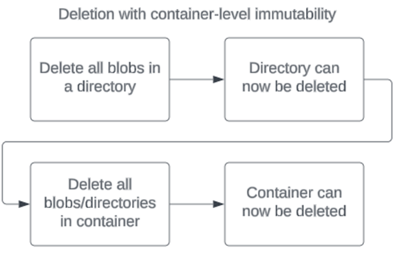

# Container-level write once, read many (WORM) policies for immutable blob data

A container-level write once, read many (WORM) policy is a type of immutability policy that can be set at the container-level. To learn more about immutable storage for Azure Blob Storage, see [Store business-critical blob data with immutable storage in a write once, read many (WORM) state](immutable-storage-overview.md)

## Availability

Container-level WORM (CLW) policies are available for all new and existing containers. These policies are supported for general-purpose v2, premium block blob, general-purpose v1 (legacy), and blob storage (legacy) accounts.

> [!TIP]
> Microsoft recommends upgrading general-purpose v1 accounts to general-purpose v2 so that you can take advantage of more features. For information on upgrading an existing general-purpose v1 storage account, see [Upgrade a storage account](../common/storage-account-upgrade.md).

This feature is supported for hierarchical namespace accounts. If hierarchical namespace is enabled, you can't rename or move a blob when the blob is in the immutable state. Both the blob name and the directory structure provide essential container-level data that can't be modified once the immutable policy is in place.

There's no enablement process for this feature; it's automatically available for all containers. To learn more about how to set a policy on a new or existing container, see [Configure container-level WORM immutability policies](immutable-policy-configure-container-scope.md).

## Deletion

A container with a container-level WORM policy set must be empty before the container can be deleted. If there's a policy set on a container with hierarchical namespace enabled, a directory must be empty before it can be deleted.

> [!div class="mx-imgBorder"]
> 

## Scenarios

| Scenario | Prohibited operations | Blob protection | Container protection | Account protection |
|----|----|----|-----|-----|
| A container is protected by an active time-based retention policy with container scope and/or a legal hold is in effect | [Delete Blob](/rest/api/storageservices/delete-blob), [Put Blob](/rest/api/storageservices/put-blob)1, [Set Blob Metadata](/rest/api/storageservices/set-blob-metadata), [Put Page](/rest/api/storageservices/put-page), [Set Blob Properties](/rest/api/storageservices/set-blob-properties), [Snapshot Blob](/rest/api/storageservices/snapshot-blob), [Incremental Copy Blob](/rest/api/storageservices/incremental-copy-blob), [Append Block](/rest/api/storageservices/append-block)2| All blobs in the container are immutable for content and user metadata. | Container deletion fails if a container-level WORM policy is in effect.| Storage account deletion fails if there's a container with at least one blob present.|
| A container is protected by an expired time-based retention policy with container scope and no legal hold is in effect | [Put Blob](/rest/api/storageservices/put-blob)1, [Set Blob Metadata](/rest/api/storageservices/set-blob-metadata), [Put Page](/rest/api/storageservices/put-page), [Set Blob Properties](/rest/api/storageservices/set-blob-properties), [Snapshot Blob](/rest/api/storageservices/snapshot-blob), [Incremental Copy Blob](/rest/api/storageservices/incremental-copy-blob), [Append Block](/rest/api/storageservices/append-block)2 | Delete operations are allowed. Overwrite operations aren't allowed. | Container deletion fails if at least one blob exists in the container, regardless of whether policy is locked or unlocked. | Storage account deletion fails if there is at least one container with a locked time-based retention policy. Unlocked policies don't provide delete protection.|

1    Azure Storage permits the [Put Blob](/rest/api/storageservices/put-blob) operation to create a new blob. Subsequent overwrite operations on an existing blob path in an immutable container aren't allowed.

2    The [Append Block](/rest/api/storageservices/append-block) operation is permitted only for policies with the **allowProtectedAppendWrites** or **allowProtectedAppendWrites**All property enabled.

## Allow protected append blobs writes

Append blobs are composed of blocks of data and optimized for data append operations required by auditing and logging scenarios. By design, append blobs only allow the addition of new blocks to the end of the blob. Regardless of immutability, modification or deletion of existing blocks in an append blob is fundamentally not allowed. To learn more about append blobs, see [About Append Blobs](/rest/api/storageservices/understanding-block-blobs--append-blobs--and-page-blobs#about-append-blobs).

The **allowProtectedAppendWrites** property setting allows for writing new blocks to an append blob while maintaining immutability protection and compliance. If this setting is enabled, you can create an append blob directly in the policy-protected container and then continue to add new blocks of data to the end of the append blob  with the Append Block operation. Only new blocks can be added; any existing blocks can't be modified or deleted. Enabling this setting doesn't affect the immutability behavior of block blobs or page blobs.

The **AllowProtectedAppendWritesAll** property setting provides the same permissions as the **allowProtectedAppendWrites** property and adds the ability to write new blocks to a block blob. The Blob Storage API doesn't provide a way for applications to do this directly. However, applications can accomplish this by using append and flush methods that are available in the Data Lake Storage Gen2 API. Also, this property enables Microsoft applications such as Azure Data Factory to append blocks of data by using internal APIs. If your workloads depend on any of these tools, then you can use this property to avoid errors that can appear when those tools attempt to append data to blobs.

Append blobs remain in the immutable state during the effective retention period. Since new data can be appended beyond the initial creation of the append blob, there's a slight difference in how the retention period is determined. The effective retention is the difference between append blob's last modification time and the user-specified retention interval. Similarly, when the retention interval is extended, immutable storage uses the most recent value of the user-specified retention interval to calculate the effective retention period.

For example, suppose that a user creates a time-based retention policy with the **allowProtectedAppendWrites** property enabled and a retention interval of 90 days. An append blob, logblob1, is created in the container today, new logs continue to be added to the append blob for the next 10 days, so that the effective retention period for logblob1 is 100 days from today (the time of its last append + 90 days).

Unlocked time-based retention policies allow the **allowProtectedAppendWrites** and the **AllowProtectedAppendWritesAll** property settings to be enabled and disabled at any time. Once the time-based retention policy is locked, the **allowProtectedAppendWrites** and the **AllowProtectedAppendWritesAll** property settings can't be changed.

## Limits

- For a storage account, the maximum number of containers with an immutable policy (time-based retention or legal hold) is 10,000.

- For a container, the maximum number of legal hold tags at any one time is 10. 

- The minimum length of a legal hold tag is three alphanumeric characters. The maximum length is 23 alphanumeric characters.

- For a container, a maximum of 10 legal hold policy audit logs are retained for the policy's duration.

## Next steps

- [Data protection overview](data-protection-overview.md)
- [Store business-critical blob data with immutable storage](immutable-storage-overview.md)
- [Version-level WORM policies](immutable-version-level-worm-policies.md)
- [Configure immutability policies for blob versions](immutable-policy-configure-version-scope.md)
- [Configure immutability policies for containers](immutable-policy-configure-container-scope.md)
