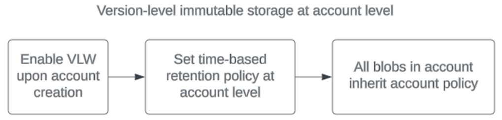
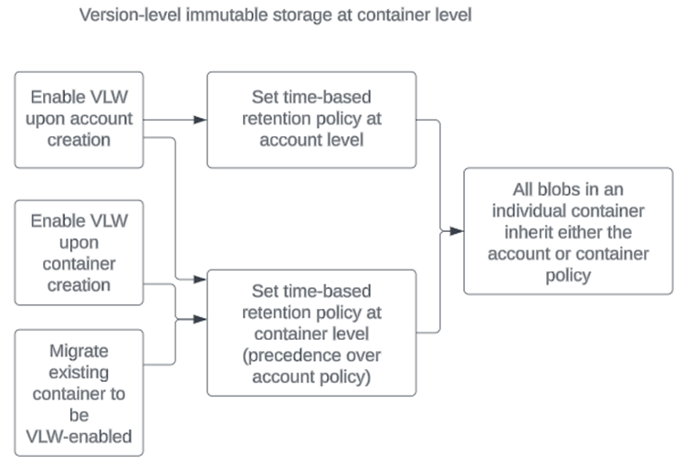
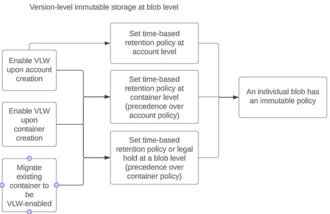
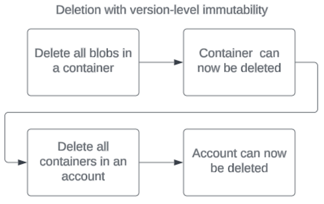

# Version-level write once, read many (WORM) policies for immutable blob data

A version-level write once, read many (WORM) policy is a type of immutability policy that can be set at the account, container, or version level. To learn more about immutable storage for Azure Blob Storage, see [Store business-critical blob data with immutable storage in a write once, read many (WORM) state](immutable-storage-overview.md).

## Availability

Version-level immutability (VLW) policies are supported on the account level for new accounts, and at the container and blob level for new and existing accounts/containers. These policies are supported for both general-purpose v2 and premium block blob accounts. This feature isn't supported on hierarchical namespace accounts.

## Version dependency

Version-level policies require that [blob versioning](versioning-overview.md) is enabled for the storage account. To learn how to enable blob versioning, see [Enable and manage blob versioning](versioning-enable.md). Keep in mind that enabling versioning may have a billing impact. For more information, see the [Pricing and billing section for Blob Versioning](versioning-overview.md#pricing-and-billing).

After versioning is enabled, when a blob is first uploaded, that version of the blob is the current version. Each time the blob is overwritten, a new version is created that stores the previous state of the blob. When you delete the current version of a blob, the current version becomes a previous version and is retained until explicitly deleted. A previous blob version possesses the time-based retention policy that was in effect when the current version became a previous version.

If a default policy is in effect for the storage account or container, then when an overwrite operation creates a previous version, the new current version inherits the default policy for the account or container.

Each version may have only one time-based retention policy configured. A version may also have one legal hold configured.

To learn how to configure version-level time-based retention policies, see [Configure immutability policies for blob versions](immutable-policy-configure-version-scope.md).

## Enablement and policy setting

Using immutable policies with version-level WORM is a two-step process. First, enable version-level immutability. Then, you can set version-level immutability policies.

To set a policy at the storage account level, you must first enable version-level WORM on the storage account. You can do this only at account creation time. There's no option to enable version-level WORM for pre-existing accounts.

> [!div class="mx-imgBorder"]
> 

To set a policy at the container level, you must first enable version-level WORM either on the account OR on the container.

If you plan to enable version-level WORM on a container, Microsoft recommends that you enable it at container creation time. However, you can migrate a non-version-level WORM enabled container to a version-level WORM enabled container. If you choose not to migrate a container, you can still set a container-level WORM policy on that container, but the option to set blob-level policies won't be available on that container.

> [!div class="mx-imgBorder"]
> 

To set a policy at the blob level, you must enable version-level WORM on either the account or container. There's no option to enable version-level WORM at the blob level; it must be inherited.

> [!div class="mx-imgBorder"]
> 

### Migration

Existing containers can support version-level immutability but must undergo a migration process first. This process might take some time. Once enabled, version-level WORM support for that container can't be removed. You can migrate 10 containers at a time per storage account. For more information about migrating a container to support version-level immutability, see [Migrate an existing container to support version-level immutability](immutable-policy-configure-version-scope.md#migrate-an-existing-container-to-support-version-level-immutability).

### Configure a policy on the current version

After you enable support for version-level immutability for a storage account or container, then you have the option to configure a default time-based retention policy for the account or container. When you configure a default time-based retention policy for the account or container and then upload a blob, the blob inherits that default policy. You can also choose to override the default policy for any blob on upload by configuring a custom policy for that blob.

If the default time-based retention policy for the account or container is unlocked, then the current version of a blob that inherits the default policy will also have an unlocked policy. After an individual blob is uploaded, you can shorten or extend the retention period for the policy on the current version of the blob or delete the current version. You can also lock the policy for the current version, even if the default policy on the account or container remains unlocked.

If the default time-based retention policy for the account or container is locked, then the current version of a blob that inherits the default policy will also have a locked policy. However, if you override the default policy when you upload a blob by setting a policy only for that blob, then that blob's policy remains unlocked until you explicitly lock it. When the policy on the current version is locked, you can extend the retention interval, but you can't delete the policy or shorten the retention interval.

If there's no default policy configured for either the storage account or the container, then you can upload a blob either with a custom policy or with no policy.

If the default policy on a storage account or container is modified, policies on objects within that container remain unchanged, even if those policies were inherited from the default policy.

The following table shows the various options available for setting a time-based retention policy on a blob on upload:

| Default policy status on account or container     | Upload a blob with the default policy         | Upload a blob with a custom policy           | Upload a blob with no policy    |
|---------------------------------------------------|-----------------------------------------------|----------------------------------------------|---------------------------------|
| Default policy on account or container (unlocked) | Blob is uploaded with default unlocked policy | Blob is uploaded with custom unlocked policy | Blob is uploaded with no policy |
| Default policy on account or container (locked)   | Blob is uploaded with default locked policy   | Blob is uploaded with custom unlocked policy | Blob is uploaded with no policy |
| No default policy on either account or container  | N/A                                           | Blob is uploaded with custom unlocked policy | Blob is uploaded with no policy |

### Configure a policy on a previous version

When versioning is enabled, a write or delete operation to a blob creates a new previous version of that blob that saves the blob's state before the operation. By default, a previous version possesses the time-based retention policy that was in effect for the current version, if any, when the current version became a previous version. The new current version inherits the policy on the container, if there's one.

If the policy inherited by a previous version is unlocked, then the retention interval can be shortened or lengthened, or the policy can be deleted. The policy on a previous version can also be locked for that version, even if the policy on the current version is unlocked.

If the policy inherited by a previous version is locked, then the retention interval can be lengthened. The policy can't be deleted, nor can the retention interval be shortened.
If there's no policy configured on the current version, then the previous version doesn't inherit any policy.

You can configure a custom policy for the version.
If the policy on a current version is modified, the policies on existing previous versions remain unchanged, even if the policy was inherited from a current version.

## Deletion

Once an account or container is enabled for an immutable policy, it can't be deleted until it's empty. The main thing to note is that it doesn't matter if an immutable policy has been set on a version-level WORM account or container, it matters if it's enabled for a policy. Once it is, the account or container must be empty to be deleted.

> [!div class="mx-imgBorder"]
> 

## Scenarios

| Scenario | Prohibited operations | Blob protection | Container protection | Account protection |
|----|----|---|---|----|
| A blob version is protected by an active retention policy and/or a legal hold is in effect | [Delete Blob](/rest/api/storageservices/delete-blob), [Set Blob Metadata](/rest/api/storageservices/set-blob-metadata), and [Put Page](/rest/api/storageservices/put-page) | The blob version can't be deleted. User metadata can't be written. Overwriting a blob with [Put Blob](/rest/api/storageservices/put-blob), [Put Block List](/rest/api/storageservices/put-block-list), or [Copy Blob](/rest/api/storageservices/copy-blob) creates a new version1.| Container deletion fails if at least one blob exists in the container, regardless of whether policy is locked or unlocked. | Storage account deletion fails if there is at least one container with version-level immutable storage enabled, or if it's enabled for the account.|
| A blob version is protected by an expired retention policy and no legal hold is in effect| Set Blob Metadata and Put Page | A blob version is protected by an expired retention policy and no legal hold is in effect|The blob version can be deleted. Overwriting a blob with [Put Blob](/rest/api/storageservices/put-blob), [Put Block List](/rest/api/storageservices/put-block-list), or [Copy Blob](/rest/api/storageservices/copy-blob) creates a new version1.| Storage account deletion fails if there is at least one container that contains a blob version with a locked time-based retention policy. Unlocked policies don't provide delete protection.|

1    Blob versions are always immutable for content. If versioning is enabled for the storage account, then a write operation to a block blob creates a new version, with the exception of the Put Block operation.

## Limits

There can only be 10,000 containers set with unique time-based retention policies in one account; however, you can set an account-level policy that will be inherited by more than 10,000 containers.

## Next steps

- [Data protection overview](data-protection-overview.md)
- [Store business-critical blob data with immutable storage](immutable-storage-overview.md)
- [Container-level WORM policies](immutable-container-level-worm-policies.md)
- [Configure immutability policies for blob versions](immutable-policy-configure-version-scope.md)
- [Configure immutability policies for containers](immutable-policy-configure-container-scope.md)
